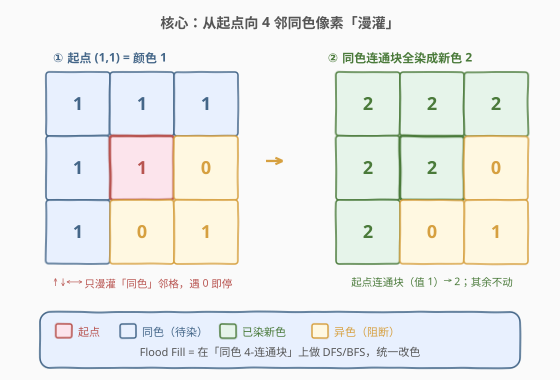
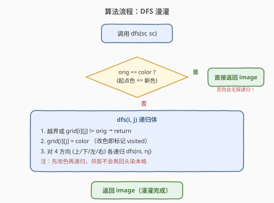
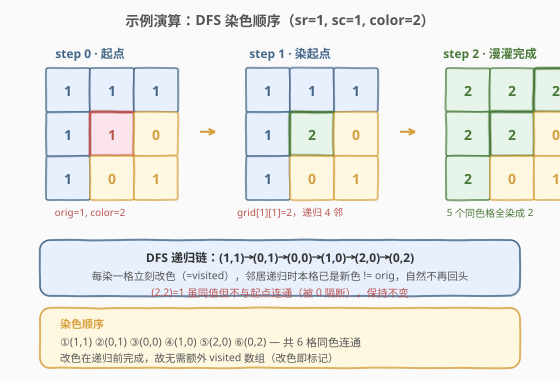

# 图像渲染

- **题目名称**：图像渲染
- **链接**：[733. 图像渲染](https://leetcode.cn/problems/flood-fill/)
- **难度**：简单
- **标签**：图、DFS、BFS、连通分量

## 1. 题目概述

给你一个由整数组成的二维网格 `image`，其中 `image[i][j]` 表示像素的颜色值。再给定起点 `(sr, sc)` 和新颜色 `color`。请从起点开始进行**泛洪填充（Flood Fill）**：把起点以及所有与起点**4 方向连通且颜色相同**的像素，统一改成 `color`，返回修改后的图像。

**示例 1**：

```text
输入：image = [[1,1,1],[1,1,0],[1,0,1]], sr = 1, sc = 1, color = 2
输出：[[2,2,2],[2,2,0],[2,0,1]]
解释：起点 (1,1) 颜色为 1。与之 4-连通且同为 1 的像素共 6 个
     （(0,0)(0,1)(0,2)(1,0)(1,1)(2,0)），全部染成 2。
     (2,2) 虽也是 1，但被 0 隔断、不连通，保持不变。
```

**示例 2**：

```text
输入：image = [[0,0,0],[0,0,0]], sr = 0, sc = 0, color = 0
输出：[[0,0,0],[0,0,0]]
解释：起点颜色已是 0，与目标 color 相同，无需任何修改。
```

**约束条件**：

- `m == image.length`
- `n == image[i].length`
- `1 <= m, n <= 50`
- `0 <= image[i][j], color < 2^16`
- `0 <= sr < m`，`0 <= sc < n`

> 💡 本题就是经典画图工具「油漆桶」功能的算法原型：点击一个像素，把与之同色的连通区域一次性换成新色。

---

## 2. 解题思路

### 2.1 暴力思路

枚举所有格子的组合判断是否同色连通 → 指数级，完全不可行。本质是要在网格上找一个**同色连通块**，天然对应 DFS/BFS。

### 2.2 核心观察：DFS 漫灌法



关键洞察：**从起点出发做 DFS，只要邻居颜色等于起点颜色 `orig`，就递归下去并改成新色 `color`**。改色这一步**同时充当了 visited 标记**——染过色的格子颜色已变成 `color != orig`，递归到它时自然不会再展开，从而避免重复访问和无限递归。

> 💡 与 [200. 岛屿数量](../0101-0200/200_岛屿数量.md) 的「沉岛法」同构：那里把访问过的 `'1'` 改成 `'0'` 防止重复计数，这里把 `orig` 改成 `color` 防止重复染色。两者都是「原地改值 = visited 标记」的经典套路。

### 2.3 算法流程图



整体只有一重 DFS，每个格子最多被访问一次，总复杂度为 `O(M × N)`。

### 2.4 示例演算



以示例 1 为例，`orig = image[1][1] = 1`、`color = 2`：

| 步骤 | 当前格 | 操作 | 说明 |
|------|--------|------|------|
| ① | (1,1) | 染成 2，递归 4 邻 | 起点，orig=1 |
| ② | (0,1) | 染成 2，递归 4 邻 | 上邻同色 |
| ③ | (0,0) | 染成 2，递归 4 邻 | (0,1) 的左邻同色 |
| ④ | (1,0) | 染成 2，递归 4 邻 | (0,0) 的下邻同色 |
| ⑤ | (2,0) | 染成 2，递归 4 邻 | (1,0) 的下邻同色 |
| ⑥ | (0,2) | 染成 2，递归 4 邻 | (0,1) 的右邻同色 |
| — | (2,2) | 保持 1 | 虽同为 1，但被 0 隔断，DFS 到不了 |

最终输出 `[[2,2,2],[2,2,0],[2,0,1]]`。

---

## 3. 参考代码

### C++

```cpp
class Solution {
    int m, n;
    int dx[4] = {0, 0, 1, -1};
    int dy[4] = {1, -1, 0, 0};

    void dfs(vector<vector<int>>& image, int i, int j, int orig, int color) {
        if (i < 0 || i >= m || j < 0 || j >= n || image[i][j] != orig)
            return;
        image[i][j] = color;          // 改色即 visited
        for (int d = 0; d < 4; d++)
            dfs(image, i + dx[d], j + dy[d], orig, color);
    }

  public:
    vector<vector<int>> floodFill(vector<vector<int>>& image,
                                  int sr, int sc, int color) {
        m = image.size();
        n = image[0].size();
        int orig = image[sr][sc];
        if (orig != color)            // 起点 == 新色则直接返回，避免无限递归
            dfs(image, sr, sc, orig, color);
        return image;
    }
};
```

### Python

```python
class Solution:
    def floodFill(self, image: List[List[int]], sr: int, sc: int,
                  color: int) -> List[List[int]]:
        m, n = len(image), len(image[0])
        orig = image[sr][sc]
        if orig == color:
            return image

        def dfs(i, j):
            if i < 0 or i >= m or j < 0 or j >= n or image[i][j] != orig:
                return
            image[i][j] = color       # 改色即 visited
            for di, dj in [(0, 1), (0, -1), (1, 0), (-1, 0)]:
                dfs(i + di, j + dj)

        dfs(sr, sc)
        return image
```

> ⚠️ **两个易错点**：
> 1. **必须特判 `orig == color`**。若起点颜色已等于新色，DFS 第一行就把 `image[sr][sc]` 改成 `color`（值不变），随后递归 4 邻时本格仍是 `orig`（因为 `orig == color`），会被**反复访问导致无限递归 / 栈溢出**。特判直接返回即可。
> 2. **先改色再递归**。若先递归再改色，本格在邻居的递归中仍为 `orig`，会回头再次染本格，同样无限递归。改色必须在展开邻居之前完成。

---

## 4. 复杂度分析

| 维度 | 复杂度 | 说明 |
|------|--------|------|
| 时间复杂度 | `O(M × N)` | 每个格子最多被 DFS 访问一次（改色后不再进入） |
| 空间复杂度 | `O(M × N)` | DFS 递归栈最坏深度（整图同色时为 `M×N`）；BFS 为队列长度 |

---

## 5. 扩展：BFS 写法

DFS 递归在大网格（如 `50×50` 全同色）上递归深度可达 `2500`，Python 默认递归上限 `1000` 可能触发 `RecursionError`。此时改用 **BFS + 队列** 更稳妥：

```python
from collections import deque

class Solution:
    def floodFill(self, image, sr, sc, color):
        m, n = len(image), len(image[0])
        orig = image[sr][sc]
        if orig == color:
            return image
        q = deque([(sr, sc)])
        image[sr][sc] = color
        while q:
            i, j = q.popleft()
            for di, dj in [(0, 1), (0, -1), (1, 0), (-1, 0)]:
                ni, nj = i + di, j + dj
                if 0 <= ni < m and 0 <= nj < n and image[ni][nj] == orig:
                    image[ni][nj] = color
                    q.append((ni, nj))
        return image
```

> 💡 注意 BFS 入队时**立即改色**（而非出队时），否则同一格可能被多个邻居重复入队。这与 DFS「先改色再递归」是同一个道理。

---

## 6. 面试要点

1. **为什么改色可以省掉 visited 数组？**

   - 染色把 `orig` 变成 `color`，而递归进入条件是 `image[i][j] == orig`。染过的格子值已是 `color != orig`，递归判定时自然 `return`，相当于自带 visited 标记。
   - 前提：允许修改输入 `image`。若题目要求保持原图不变，需额外 visited 矩阵或先深拷贝。

2. **`orig == color` 为什么必须特判？**

   - 若不特判，起点染成 `color` 后值不变（仍等于 `orig`），递归 4 邻时本格依旧满足 `== orig`，会被无限重复访问直到栈溢出。特判直接返回原图，既是正确答案（无需任何修改）又规避了死循环。

3. **DFS 和 BFS 在这题有什么区别？**

   - 时间复杂度都是 `O(M×N)`，每个格子都只访问一次。
   - 空间：DFS 递归栈最坏 `O(M×N)`（整图同色），BFS 队列最坏 `O(min(M,N)×max(M,N))` 量级但通常更省。
   - 工程实践：大网格下 Python DFS 易栈溢出，BFS 更安全；C++ 二者皆可。

4. **8 方向连通怎么改？**

   - 题目规定只 **4 方向**（上下左右）连通。若改为 8 方向（含对角线），只需把方向数组从 4 个扩展到 8 个：再加上 `(-1,-1),(-1,1),(1,-1),(1,1)` 即可，其余逻辑不变。

5. **如果要求不能修改输入图像怎么办？**

   - 先 `copy = [row[:] for row in image]` 深拷贝，在副本上做 Flood Fill；
   - 或开一个独立的 `visited` 二维布尔数组，DFS 时不改 `image` 只改 `visited`，最后再据 `visited` 给目标格子赋新色。

---

## 7. 同类练习题

- [200. 岛屿数量](https://leetcode.cn/problems/number-of-islands/)（[题解](../0101-0200/200_岛屿数量.md)）：同为网格 DFS「原地改值即 visited」，计数连通分量
- [695. 岛屿的最大面积](https://leetcode.cn/problems/max-area-of-island/)：DFS 求 4-连通块大小，Flood Fill 计面积
- [1254. 统计封闭岛屿的数目](https://leetcode.cn/problems/number-of-closed-islands/)：Flood Fill + 边界判定，区分封闭与开放连通块
- [463. 岛屿的周长](https://leetcode.cn/problems/island-perimeter/)（[题解](../0401-0500/463_岛屿的周长.md)）：网格连通块的边数统计，与本题同属网格 DFS 家族
- [1036. 逃离大迷宫](https://leetcode.cn/problems/escape-a-large-maze/)：受限网格上的 Flood Fill / BFS 可达性
