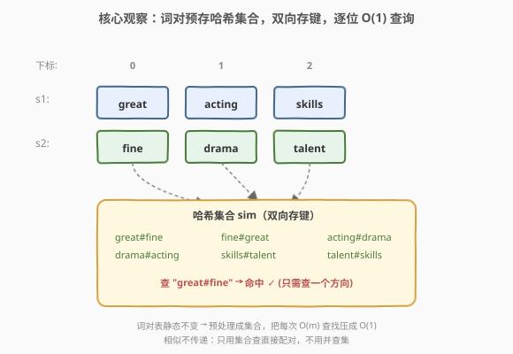
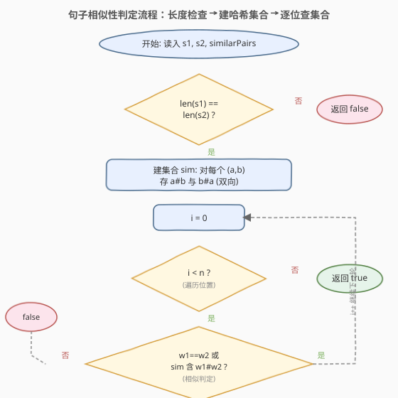
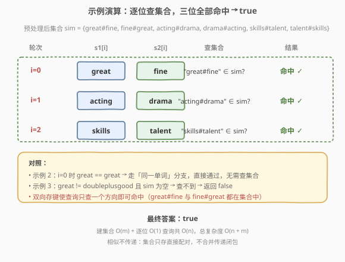

# 句子相似性

- **题目名称**：句子相似性
- **链接**：[734. 句子相似性](https://leetcode.cn/problems/sentence-similarity/)
- **难度**：简单
- **标签**：哈希表

## 1. 题目概述

给定两个句子 `sentence1` 和 `sentence2`（均以字符串数组形式给出），以及一个**相似词对**列表 `similarPairs`。判断这两个句子是否**相似**。

两个句子相似当且仅当：

1. **长度相同**（两数组元素个数相等）；
2. 对每个位置 `i`，`sentence1[i]` 与 `sentence2[i]` 是**相似**的。

两个单词相似当且仅当：

- 二者**相同**（同一个单词）；或
- 二者以**任一顺序**出现在 `similarPairs` 的某个二元组中（即 `(a,b)` 或 `(b,a)` 命中即相似）。

> ⚠️ 注意：相似关系**不具有传递性**。即若 `a` 与 `b` 相似、`b` 与 `c` 相似，**并不**推出 `a` 与 `c` 相似。这是本题（734）与 [737. 句子相似性 II](https://leetcode.cn/problems/sentence-similarity-ii/)（传递闭包版，需并查集）的核心区别。

**示例 1**：

```text
输入：sentence1 = ["great","acting","skills"],
     sentence2 = ["fine","drama","talent"],
     similarPairs = [["great","fine"],["acting","drama"],["skills","talent"]]
输出：true
解释：长度均为 3，且每个位置都命中一个相似对：
     great↔fine, acting↔drama, skills↔talent。
```

**示例 2**：

```text
输入：sentence1 = ["great"], sentence2 = ["great"], similarPairs = []
输出：true
解释：长度均为 1，且 great == great（同一单词直接相似）。
```

**示例 3**：

```text
输入：sentence1 = ["great"], sentence2 = ["doubleplusgood"], similarPairs = []
输出：false
解释：两个单词不同，且不在任何相似对中。
```

**约束条件**：

- `1 <= sentence1.length, sentence2.length <= 1000`
- `0 <= similarPairs.length <= 2000`
- `similarPairs[i].length == 2`
- 每个单词长度 `1 <= word.length <= 20`

> 💡 句子最长 1000、词对最多 2000，若对每个位置都线性扫描 `similarPairs`，最坏 `O(n × m) = 2 × 10^6` 虽能过，但哈希表可一步到位优化到 `O(n + m)`。

---

## 2. 解题思路

### 2.1 暴力思路：逐位置扫描词对表

对每个位置 `i`：

- 若 `sentence1[i] == sentence2[i]`，直接相似；
- 否则遍历 `similarPairs`，查找是否存在 `(sentence1[i], sentence2[i])` 或 `(sentence2[i], sentence1[i])`。

时间复杂度 `O(n × m)`，其中 `n` 为句子长度、`m` 为词对数。问题在于：判断「某两个单词是否构成一对」用了 `O(m)` 线性扫描——这正是哈希集合能优化到 `O(1)` 的地方。

### 2.2 核心观察：把词对预存成哈希集合，逐位 O(1) 查询



关键直觉是：相似对的**查询是高频重复操作**（每个位置都要查一次），而词对表在查询过程中**不变**。因此应把词对**预处理**成哈希集合，把每次 `O(m)` 的查找压成 `O(1)`。

具体做法：

1. **预处理**：遍历 `similarPairs`，把每个 `(a, b)` 以**两个方向**存入哈希集合——既存 `"a#b"` 也存 `"b#a"`（`#` 为分隔符，因单词只含小写字母，不会与单词本身冲突）。这样查询时无需关心顺序。

2. **逐位判定**：对每个 `i`，相似当且仅当下列之一成立：
   - `sentence1[i] == sentence2[i]`（同一单词）；或
   - 集合中存在键 `"sentence1[i]#sentence2[i]"`（双向已存，查一个方向即可）。

3. **长度不等直接判否**：作为快速短路，若两句子长度不同，立即返回 `false`。

> 💡 **为什么存两个方向？** 因为相似关系是**对称**的（`a∼b ⟺ b∼a`），但单词在两句中的出现顺序不固定——`sentence1[i]` 可能是 `a` 也可能是 `b`。存双向键后，查询时只需拼一个方向即可命中，避免查询时再判两种顺序。也可以只存「排序后」的键（把两单词按字典序拼成统一键），但存双向更直观。

> ⚠️ **为何不能用并查集？** 并查集会**自动合并传递闭包**，把 `a∼b, b∼c` 算成 `a∼c`，这在本题是**错误**的（题目明确不传递）。734 用哈希集合、737 才用并查集——是否传递是两题的唯一分水岭。

### 2.3 算法流程图



整体分为「建表」与「查表」两阶段：建表 `O(m)` 一次、查表每位 `O(1)` 共 `O(n)`，总复杂度 `O(n + m)`。

### 2.4 示例演算



以示例 1 为例逐步演算：

- **预处理**：`similarPairs` 存入集合后包含
  `{great#fine, fine#great, acting#drama, drama#acting, skills#talent, talent#skills}`。
- `i=0`：`great != fine`，查集合含 `great#fine`？✅ **命中**。
- `i=1`：`acting != drama`，查集合含 `acting#drama`？✅ **命中**。
- `i=2`：`skills != talent`，查集合含 `skills#talent`？✅ **命中**。
- 三位全通过，返回 `true`。

对比示例 2：`i=0` 时 `great == great`，走「同一单词」分支直接通过，无需查集合。对比示例 3：`great != doubleplusgood` 且集合为空，查不到，返回 `false`。

---

## 3. 参考代码

### C++

```cpp
class Solution {
public:
    bool areSentencesSimilar(vector<string>& sentence1,
                             vector<string>& sentence2,
                             vector<vector<string>>& similarPairs) {
        if (sentence1.size() != sentence2.size()) return false;   // 长度不等直接否
        unordered_set<string> sim;
        for (const auto& p : similarPairs) {                       // 双向存键
            sim.insert(p[0] + "#" + p[1]);
            sim.insert(p[1] + "#" + p[0]);
        }
        for (int i = 0; i < (int)sentence1.size(); i++) {
            const string& w1 = sentence1[i];
            const string& w2 = sentence2[i];
            if (w1 == w2) continue;                                // 同一单词直接通过
            if (sim.find(w1 + "#" + w2) == sim.end()) return false;// 查不到即不相似
        }
        return true;
    }
};
```

### Python

```python
class Solution:
    def areSentencesSimilar(self, sentence1: List[str], sentence2: List[str],
                            similarPairs: List[List[str]]) -> bool:
        if len(sentence1) != len(sentence2):
            return False
        sim = set()
        for a, b in similarPairs:               # 双向存键
            sim.add(a + "#" + b)
            sim.add(b + "#" + a)
        for w1, w2 in zip(sentence1, sentence2):
            if w1 == w2:                        # 同一单词直接通过
                continue
            if w1 + "#" + w2 not in sim:        # 查不到即不相似
                return False
        return True
```

> ⚠️ **两个易错点**：
> 1. **必须先判长度**。若忽略长度检查直接逐位比较，当两句长度不等时可能因短句提前结束而误判 `true`。
> 2. **分隔符不能省**。若直接拼接 `a+b` 不加分隔符，`("a","bc")` 与 `("ab","c")` 会产生相同键 `"abc"` 造成误命中。用 `#`（或任意不出现在单词中的字符）分隔即可消除歧义。

---

## 4. 复杂度分析

| 维度 | 复杂度 | 说明 |
|------|--------|------|
| 时间复杂度 | $O(n + m)$ | 预处理建集合扫 `m` 个词对 `O(m)`；逐位判定 `n` 次，每次 `O(1)` 哈希查询共 `O(n)`；拼接键的总字符数为 $O(nL + mL)$，$L$ 为单词长度上界 20，常数级 |
| 空间复杂度 | $O(m)$ | 哈希集合存 `2m` 个键，每个键长度 $O(L)$，即 $O(mL)$ |

---

## 5. 扩展：传递版与并查集（737）

本题的进阶版 [737. 句子相似性 II](https://leetcode.cn/problems/sentence-similarity-ii/) 将相似关系改为**可传递**——`a∼b, b∼c` 则 `a∼c`。此时哈希集合不再适用（它只能查直接配对，查不到经由中间词传递的间接相似），需用**并查集**把互相相似的词并入同一连通块，查询时判定两词是否同根。

两题对照：

| 维度 | 734 句子相似性 | 737 句子相似性 II |
|------|----------------|-------------------|
| 相似关系 | 对称、**不传递** | 对称、**可传递** |
| 数据结构 | 哈希集合（存直接配对） | 并查集（维护连通块） |
| 预处理 | `O(m)` 存双向键 | `O(m α(n))` 合并 |
| 单次查询 | `O(1)` 集合查找 | `O(α(n))` find 同根 |

> 💡 判断该用哪种结构的唯一判据：**关系是否传递**。传递→并查集，不传递→哈希集合。

---

## 6. 面试要点

1. **为什么相似关系不传递？题目哪里说明了？**

   - 题目定义「两个单词相似」仅当它们**直接出现在某个词对中**或本身相同，并未定义传递规则。若 `a∼b` 且 `b∼c`，词对表里没有 `(a,c)`，按定义 `a` 与 `c` 不相似。737 才显式声明相似关系可传递。面试时若题目没说传递，默认**不传递**。

2. **为什么存双向键而不是只存一个方向？**

   - 查询时 `sentence1[i]` 与 `sentence2[i]` 谁在前不确定。若只存 `(a,b)`，查 `(b,a)` 时会漏。存双向键后查一个方向即可命中，查询逻辑最简。等价做法是存「按字典序排序后的拼接键」，查询时也先排序再查，但存双向更直观、省去查询时的排序。

3. **分隔符 `#` 的作用是什么？能换成别的吗？**

   - 防止拼接歧义：`("a","bc")` 与 `("ab","c")` 不加分隔符都拼成 `"abc"` 会误命中。换成任意**不出现在单词中**的字符即可，本题单词只含小写字母，所以 `#`、`$`、空格等都行。

4. **如果 `similarPairs` 很大但句子很短，建集合还划算吗？**

   - 仍划算。建集合 `O(m)` 一次，但把后续 `n` 次查询从 `O(m)` 压到 `O(1)`。当 `n=1` 时虽然建表开销 `O(m)` 与暴力 `O(m)` 相当，但哈希常数小且代码更清晰；当 `n` 较大时优势明显。若 `m` 极大而 `n` 极小，可退化为暴力扫描，但本题数据规模下无需此优化。

5. **能否不预处理，边查边建集合？**

   - 可以但不推荐。边查边建会使首次出现的词对无法被更早的位置命中（除非先完整建表）。预处理一遍建表逻辑清晰、无副作用，是更稳妥的写法。

---

## 7. 同类练习题

- [737. 句子相似性 II](https://leetcode.cn/problems/sentence-similarity-ii/)：本题的传递闭包版，哈希集合升级为并查集，对照「是否传递」决定数据结构
- [1. 两数之和](https://leetcode.cn/problems/two-sum/)（[题解](../0001-0100/1_两数之和.md)）：同样是「高频查询 + 静态数据」用哈希表把 `O(n)` 查找优化到 `O(1)` 的经典套路
- [205. 同构字符串](https://leetcode.cn/problems/isomorphic-strings/)（[题解](../0201-0300/205_同构字符串.md)）：逐位双向映射判定，与本题逐位双向查集合同构，对照「双射 vs 对称配对」
- [547. 省份数量](https://leetcode.cn/problems/number-of-provinces/)（[题解](../0501-0600/547_省份数量.md)）：并查集模板，理解 734 为何「不用」并查集的参照系
- [290. 单词规律](https://leetcode.cn/problems/word-pattern/)（[题解](../0001-0100/290_单词规律.md)）：逐位匹配 + 双向哈希双射，与本题逐位相似判定结构相近
