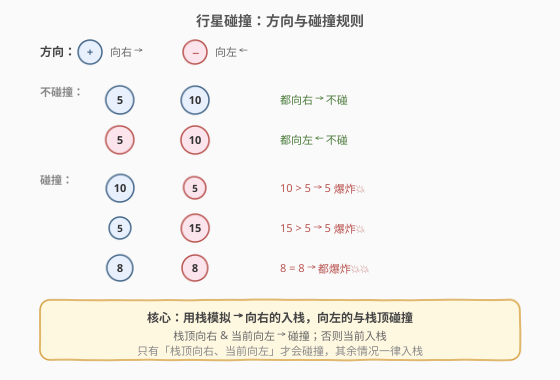
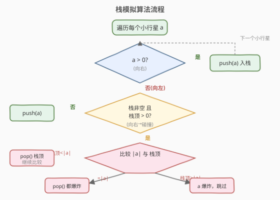

# 行星碰撞

- **题目名称**：行星碰撞
- **链接**：[735. 行星碰撞](https://leetcode.cn/problems/asteroid-collision/)
- **难度**：中等
- **标签**：栈、数组、模拟

## 1. 题目概述

给定一个整数数组 `asteroids`，表示同一行中的行星。对于每个元素：

- **绝对值**表示行星的大小。
- **正号**表示行星向右移动。
- **负号**表示行星向左移动。

所有行星以**相同速度**移动。每当两颗行星**相向而行**（一颗向右、一颗向左，且向右的在左边）时就会发生碰撞：较小的行星爆炸，若大小相等则**同时爆炸**。同方向或背向而行的行星**永不相撞**。

返回所有碰撞结束后剩下的行星。

**示例 1**：

```text
输入：asteroids = [5,10,-5]
输出：[5,10]
解释：10 和 -5 碰撞，10 更大，-5 爆炸。5 和 10 都向右，不碰撞。
```

**示例 2**：

```text
输入：asteroids = [8,-8]
输出：[]
解释：8 和 -8 大小相等，同时爆炸。
```

**示例 3**：

```text
输入：asteroids = [10,2,-5]
输出：[10]
解释：2 和 -5 碰撞，2 爆炸。然后 10 和 -5 碰撞，-5 爆炸。只剩 10。
```

**约束条件**：

- `2 <= asteroids.length <= 10^4`
- `-1000 <= asteroids[i] <= 1000`
- `asteroids[i] != 0`

---

## 2. 解题思路

### 2.1 暴力思路

每一轮扫描数组，找到所有相邻的「左正右负」对进行碰撞处理，重复直到某轮无碰撞为止。最坏情况（如 `[1,2,3,...,n,-n-1]`）每轮只消除一个元素，需 `O(n)` 轮，每轮扫描 `O(n)`，总复杂度 `O(n^2)`。

优化方向：用一个**栈**逐个处理行星，只在「栈顶向右、当前向左」时发生碰撞，弹出栈顶并比较大小——每颗行星最多入栈一次、出栈一次，总复杂度降到 `O(n)`。

### 2.2 核心观察：用栈模拟碰撞



关键直觉：

- 从左到右遍历行星，**栈中保存目前存活且尚未被碰撞处理的行星**。
- **向右（正数）的行星**直接入栈——它可能与后续向左的行星碰撞，暂时无法确定命运。
- **向左（负数）的行星**只可能与栈顶（如果栈顶向右）碰撞，不会与栈中更深的行星碰撞，因为中间的向右行星会先挡住。
- 碰撞时比较绝对值大小：
  - 栈顶更小 → 栈顶爆炸（弹出），当前行星继续与新的栈顶比较。
  - 相等 → 都爆炸（弹出栈顶，当前行星也丢弃）。
  - 栈顶更大 → 当前行星爆炸，跳到下一颗。

> 💡 **为什么不会与栈中更深的行星碰撞？** 假设栈为 `[..., X, Y]`，其中 `Y > 0`（向右），当前 `a < 0`（向左）。`a` 只与 `Y` 碰撞。若 `Y` 爆炸了，`a` 才可能与 `X` 碰撞——但前提是 `X` 也向右。这就是为什么碰撞后要**循环比较**新的栈顶。

### 2.3 算法流程图



整体只有一重遍历循环，每颗行星最多入栈一次、出栈一次，因此总时间 `O(n)`。

### 2.4 示例演算

![示例演算：[5,10,-5] 与 [8,-8]](../images/asteroid_collision_walkthrough.svg)

以 `asteroids = [5, 10, -5]` 为例：

| 步骤 | 当前行星 | 动作 | 栈（底→顶） | 说明 |
|------|----------|------|-------------|------|
| 1 | 5 | push | `[5]` | 向右，入栈 |
| 2 | 10 | push | `[5, 10]` | 向右，入栈 |
| 3 | −5 | 碰撞 | `[5, 10]` | 栈顶 10 > |−5|，−5 爆炸，栈不变 |

结果：`[5, 10]`。

再以 `asteroids = [8, -8]` 为例：

| 步骤 | 当前行星 | 动作 | 栈 | 说明 |
|------|----------|------|----|------|
| 1 | 8 | push | `[8]` | 向右，入栈 |
| 2 | −8 | 碰撞 | `[]` | 8 == |−8|，都爆炸 |

结果：`[]`。

---

## 3. 参考代码

### C++

```cpp
class Solution {
  public:
    vector<int> asteroidCollision(vector<int>& asteroids) {
        vector<int> stk;
        for (int a : asteroids) {
            bool alive = true;
            while (alive && !stk.empty() && stk.back() > 0 && a < 0) {
                if (stk.back() < -a) {
                    stk.pop_back();
                } else if (stk.back() == -a) {
                    stk.pop_back();
                    alive = false;
                } else {
                    alive = false;
                }
            }
            if (alive) stk.push_back(a);
        }
        return stk;
    }
};
```

### Python

```python
class Solution:
    def asteroidCollision(self, asteroids: List[int]) -> List[int]:
        stk = []
        for a in asteroids:
            alive = True
            while alive and stk and stk[-1] > 0 and a < 0:
                if stk[-1] < -a:
                    stk.pop()
                elif stk[-1] == -a:
                    stk.pop()
                    alive = False
                else:
                    alive = False
            if alive:
                stk.append(a)
        return stk
```

> 💡 `alive` 标志位统一处理了三种碰撞结果：栈顶更小时继续循环、相等时双方都销毁、栈顶更大时仅当前行星销毁。只有 `alive` 为 `True` 时才入栈，避免已爆炸的行星混入结果。

---

## 4. 复杂度分析

| 维度 | 复杂度 | 说明 |
|------|--------|------|
| 时间复杂度 | $O(n)$ | 每颗行星最多入栈一次、出栈一次，内层 while 总执行次数不超过 n |
| 空间复杂度 | $O(n)$ | 最坏情况无碰撞，所有行星入栈 |

> ⚠️ 内层 `while` 看似嵌套在 `for` 中，但每次 `pop_back` 永久移除一个元素，总共最多 `n` 次 `pop`，因此均摊到每个元素是 `O(1)`，总复杂度仍为 $O(n)$。

---

## 5. 扩展：为什么不能用单调栈？

本题容易与「单调栈」混淆，但两者本质不同：

- **单调栈**（如 [739. 每日温度](https://leetcode.cn/problems/daily-temperatures/)、[84. 柱状图中最大的矩形](https://leetcode.cn/largest-rectangle-in-histogram/)）：维护一个单调序列，弹出不符合单调性的元素，**弹出的元素被丢弃**。
- **本题**：栈中不维护单调性，碰撞是**双向的**——栈顶可能被弹出（当 `|a|` 更大时），但 `a` 也可能被销毁（当栈顶更大或相等时）。`a` 被销毁后不入栈，栈顶被弹出后 `a` 继续比较。

因此本题是**栈模拟**而非单调栈，核心区别在于「当前元素也参与了销毁逻辑」。

---

## 6. 面试要点

1. **什么时候两颗行星会碰撞？**
   - 只有「左侧向右（正）、右侧向左（负）」时才碰撞。同方向或背向（左负右正）不会碰撞。

2. **为什么用栈而不是队列或数组？**
   - 每颗向左的行星只与**最近的**向右行星碰撞，符合栈的 LIFO 特性。用数组模拟也能做，但每次碰撞后要频繁删除中间元素，效率低。

3. **相等时为什么两边都爆炸？**
   - 题目规定：大小相等的行星碰撞后**同时爆炸**，因此要 `pop` 栈顶并标记 `alive = false`。

4. **`alive` 标志位的作用是什么？**
   - 统一控制三种碰撞结果的出口：栈顶更小 → `alive` 保持 `true`，继续循环；相等或栈顶更大 → `alive` 设为 `false`，跳出循环且不入栈。

5. **为什么时间复杂度是 $O(n)$ 而不是 $O(n^2)$？**
   - 虽然有嵌套循环，但每个元素最多入栈一次、出栈一次。内层 `while` 的总执行次数（所有 `pop` 操作之和）不超过 `n`，均摊后每步 $O(1)$。

---

## 7. 同类练习题

- [394. 字符串解码](https://leetcode.cn/problems/decode-string/)（[站内题解](../0301-0400/394_字符串解码.md)）：栈处理嵌套结构，弹出时机不同
- [402. 移掉 K 位数字](https://leetcode.cn/problems/remove-k-digits/)（[站内题解](../0401-0500/402_移掉K位数字.md)）：单调栈 + 贪心，弹出元素有数量约束
- [316. 去除重复字母](https://leetcode.cn/problems/remove-duplicate-letters/)（[站内题解](../0301-0400/316_去除重复字母.md)）：单调栈 + 贪心 + 字符去重
- [844. 比较含退格的字符串](https://leetcode.cn/problems/backspace-string-compare/)：栈模拟退格删除，更简单的栈模拟入门题
