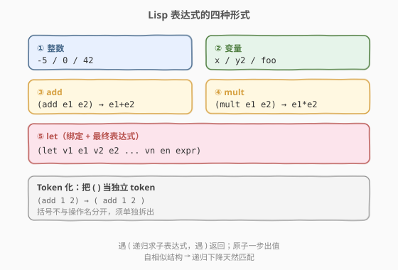
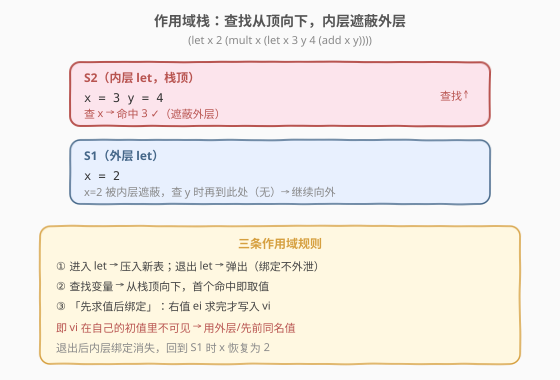
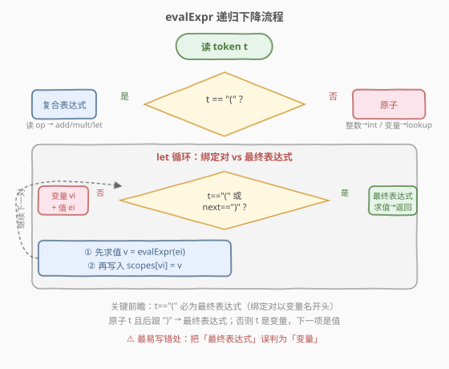
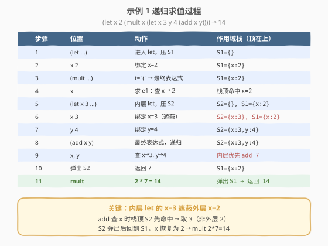

# Lisp 语法解析

- **题目名称**：Lisp 语法解析
- **链接**：[736. Lisp 语法解析](https://leetcode.cn/problems/parse-lisp-expression/)
- **难度**：困难
- **标签**：栈、递归、字符串、哈希表

## 1. 题目概述

给定一个类似 Lisp 语句的字符串表达式 `expression`，求其整数计算结果。表达式只有以下几种形式：

- **整数**：可为正整数、负整数或 `0`。
- **let 表达式**：`(let v1 e1 v2 e2 ... vn en expr)`。按顺序把每对 `vi` 绑定为 `ei` 的值，最后返回 `expr` 的值。
- **add 表达式**：`(add e1 e2)`，返回 `e1 + e2`。
- **mult 表达式**：`(mult e1 e2)`，返回 `e1 * e2`。
- **变量**：以小写字母开头，后跟 0 个或多个小写字母或数字。`add`/`let`/`mult` 为关键字，不会用作变量名。

**作用域**：求值变量时，从最内层作用域依次向外查找，内层同名变量**遮蔽**外层。`let` 的赋值按顺序处理。

**示例 1**：

```text
输入：expression = "(let x 2 (mult x (let x 3 y 4 (add x y))))"
输出：14
解释：计算 (add x y) 时，最内层 let 中 x = 3 先命中，故此处 x 为 3，
      y = 4，add 得 7；外层 x = 2，mult 2 * 7 = 14。
```

**示例 2**：

```text
输入：expression = "(let x 3 x 2 x)"
输出：2
解释：let 中的赋值按顺序处理：x=3，再 x=2，最终表达式的 x 值为 2。
```

**示例 3**：

```text
输入：expression = "(let x 1 y 2 x (add x y) (add x y))"
输出：5
解释：x=1，y=2；随后 x 被赋为 (add x y)=3（此处 x 仍用旧值 1）；
      最终表达式 (add x y) 用新值 x=3、y=2，得 5。
```

**约束条件**：

- `1 <= expression.length <= 2000`
- 表达式不含前导/尾随空格，不同 token 之间以单个空格分隔
- 答案与所有中间结果均在 32 位整数范围内
- 测试用例中的表达式均合法

> 💡 本题是**递归下降解析**的招牌题：括号天然界定子表达式边界，自相似结构适合递归；真正的难点有两处——① 如何在 `let` 中区分「变量绑定对」与「最终表达式」；② 词法作用域的「先求值后绑定」规则。掌握这两点即可一通百通。

---

## 2. 解题思路

### 2.1 暴力思路：正则/字符串切割逐层处理

最朴素的尝试是反复用正则匹配最内层括号 `(...)`、计算后替换回原串，直到没有括号。但这在 `let` 上会崩——`let` 的赋值对会改变后续同名变量的值，且内层 `let` 的绑定不能泄漏到外层。简单「算完即替换」无法维护作用域，正确性难以保证。

优化方向：括号的嵌套正是**自相似**结构，天然适合**递归下降**——遇到 `(` 就递归求一个子表达式，遇到 `)` 就返回。配合一个**作用域栈**（每层 `let` 压入一个哈希表），即可正确处理遮蔽与「先求值后绑定」。

### 2.2 核心观察：递归下降 + 作用域栈



关键直觉：

- **Token 化**：把 `'('`、`')'` 当作独立 token，其余按空格切分。这样 `(add 1 2)` 被切成 `(` `add` `1` `2` `)`，递归处理时只需移动下标。
- **表达式判定**：从某个下标起，若 token 是 `(`，则它是复合表达式 `(op ...)`；否则是原子（整数或变量），一步返回。
- **作用域栈**：维护一个哈希表栈 `scopes`。每进入一个 `let` 压入新表 `cur`，查找变量时从栈顶向下找；`let` 结束时弹出，保证内层绑定不外泄。
- **「先求值后绑定」**：处理 `let` 的赋值对 `(vi, ei)` 时，**先用当前作用域求 `ei`，再把 `vi` 写入 `cur`**。这样 `vi` 在自己的初值表达式里不可见（用外层/先前同名值），与示例 3 行为一致。



> 💡 **为什么 `let` 内层绑定要单独建表，不能合并到外层？** 因为 `let` 结束后，它引入的变量在**外层不可见**。若合并到外层表，内层 `let` 退出后这些绑定仍残留，会污染后续求值。栈式「进入压入、退出弹出」是词法作用域的标准实现，与编程语言编译器中「作用域链」同构。

### 2.3 算法流程图



整体只有一遍递归扫描，每个 token 至多被消费一次，因此时间复杂度为 $O(n \cdot D)$，其中 $D$ 为最大嵌套深度（最坏 $O(n)$，实际很小）。

### 2.4 示例演算

以示例 1 `(let x 2 (mult x (let x 3 y 4 (add x y))))` 为例：

| 步骤 | 位置 | 动作 | 作用域栈（顶在上） | 说明 |
|------|------|------|---------------------|------|
| 1 | `(let ...)` | 进入 let，压入 S1 | `S1={}` | 新作用域 |
| 2 | `x 2` | 绑定 x=2 | `S1={x:2}` | 先求值 2 再写入 |
| 3 | `(mult ...)` | 这是最终表达式，递归 | `S1={x:2}` | token 是 `(` → 最终表达式 |
| 4 | `x` | 求 e1：查 x | `S1={x:2}` | 栈顶命中 x=2 → e1=2 |
| 5 | `(let x 3 y 4 ...)` | 求 e2：进入内层 let，压入 S2 | `S2={}, S1={x:2}` | 新作用域 |
| 6 | `x 3` | 绑定 x=3 | `S2={x:3}` | 遮蔽外层 x=2 |
| 7 | `y 4` | 绑定 y=4 | `S2={x:3,y:4}` | |
| 8 | `(add x y)` | 最终表达式，递归 | `S2={x:3,y:4}` | |
| 9 | `x` | 查 x → 栈顶 S2 命中 3 | | 内层优先 |
| 10 | `y` | 查 y → 4 | | add = 3+4 = 7 |
| 11 | 弹出 S2 | 返回 7 | `S1={x:2}` | 内层作用域结束 |
| 12 | mult | 2 * 7 = 14 | | 弹出 S1，返回 14 |



---

## 3. 参考代码

### C++

```cpp
class Solution {
  public:
    int evaluate(string expression) {
        auto tokens = tokenize(expression);
        vector<unordered_map<string, int>> scopes;
        int idx = 0;
        return evalExpr(tokens, idx, scopes);
    }

  private:
    vector<string> tokenize(const string& s) {
        vector<string> tokens;
        int i = 0, n = s.size();
        while (i < n) {
            char c = s[i];
            if (c == '(' || c == ')') {
                tokens.push_back(string(1, c));
                i++;
            } else if (c == ' ') {
                i++;
            } else {
                int j = i;
                while (j < n && s[j] != '(' && s[j] != ')' && s[j] != ' ') j++;
                tokens.push_back(s.substr(i, j - i));
                i = j;
            }
        }
        return tokens;
    }

    bool isInt(const string& t) {
        int start = (t.size() > 0 && t[0] == '-') ? 1 : 0;
        if (start == (int)t.size()) return false;
        for (int k = start; k < (int)t.size(); k++)
            if (!isdigit((unsigned char)t[k])) return false;
        return true;
    }

    int lookup(const string& var, vector<unordered_map<string, int>>& scopes) {
        for (int k = (int)scopes.size() - 1; k >= 0; k--) {
            auto it = scopes[k].find(var);
            if (it != scopes[k].end()) return it->second;
        }
        return 0;
    }

    int evalExpr(vector<string>& tokens, int& idx,
                 vector<unordered_map<string, int>>& scopes) {
        const string& t = tokens[idx];
        if (t != "(") {
            if (isInt(t)) {
                int v = stoi(t);
                idx++;
                return v;
            }
            int v = lookup(t, scopes);
            idx++;
            return v;
        }
        idx++;                 // 跳过 '('
        const string& op = tokens[idx];
        idx++;
        if (op == "add") {
            int v1 = evalExpr(tokens, idx, scopes);
            int v2 = evalExpr(tokens, idx, scopes);
            idx++;             // 跳过 ')'
            return v1 + v2;
        }
        if (op == "mult") {
            int v1 = evalExpr(tokens, idx, scopes);
            int v2 = evalExpr(tokens, idx, scopes);
            idx++;
            return v1 * v2;
        }
        // op == "let"
        scopes.emplace_back(); // 压入新作用域
        int val = 0;
        while (true) {
            const string& cur = tokens[idx];
            if (cur == "(") {                  // 最终表达式是复合表达式
                val = evalExpr(tokens, idx, scopes);
                idx++;                         // 跳过 ')'
                break;
            }
            if (tokens[idx + 1] == ")") {      // 最终表达式是原子（其后紧跟 ')'）
                val = evalExpr(tokens, idx, scopes);
                idx++;
                break;
            }
            string var = cur;                  // 否则 cur 是变量，下一项是它的值
            idx++;
            int v = evalExpr(tokens, idx, scopes);
            scopes.back()[var] = v;            // 先求值后绑定
        }
        scopes.pop_back();
        return val;
    }
};
```

### Python

```python
class Solution:
    def evaluate(self, expression: str) -> int:
        tokens = self._tokenize(expression)
        scopes: list[dict[str, int]] = []

        def is_int(tok: str) -> bool:
            if tok[0] == '-':
                return len(tok) > 1 and tok[1:].isdigit()
            return tok.isdigit()

        def lookup(var: str) -> int:
            for sc in reversed(scopes):
                if var in sc:
                    return sc[var]
            return 0  # 题目保证合法，不会到达

        def eval_expr(i: int) -> tuple[int, int]:
            tok = tokens[i]
            if tok != '(':
                if is_int(tok):
                    return int(tok), i + 1
                return lookup(tok), i + 1

            i += 1  # 跳过 '('
            op = tokens[i]
            i += 1
            if op == 'add':
                v1, i = eval_expr(i)
                v2, i = eval_expr(i)
                return v1 + v2, i + 1        # i+1 跳过 ')'
            if op == 'mult':
                v1, i = eval_expr(i)
                v2, i = eval_expr(i)
                return v1 * v2, i + 1

            # op == 'let'
            scopes.append({})
            while True:
                cur = tokens[i]
                if cur == '(':              # 最终表达式是复合表达式
                    val, i = eval_expr(i)
                    scopes.pop()
                    return val, i + 1
                if tokens[i + 1] == ')':    # 最终表达式是原子
                    val, i = eval_expr(i)
                    scopes.pop()
                    return val, i + 1
                var = cur                    # 变量，下一项是其值表达式
                i += 1
                v, i = eval_expr(i)
                scopes[-1][var] = v          # 先求值后绑定

        val, _ = eval_expr(0)
        return val

    def _tokenize(self, s: str) -> list[str]:
        tokens = []
        i, n = 0, len(s)
        while i < n:
            c = s[i]
            if c in '()':
                tokens.append(c)
                i += 1
            elif c == ' ':
                i += 1
            else:
                j = i
                while j < n and s[j] not in '() ':
                    j += 1
                tokens.append(s[i:j])
                i = j
        return tokens
```

> 💡 `let` 循环里有两条「最终表达式」出口：① 当前 token 是 `(`（复合表达式，因为变量绑定对必以变量名开头，绝不会以 `(` 开头）；② 当前 token 是原子且其后紧跟 `)`。两者之外，当前 token 必是变量，下一项即其值表达式。这一前瞻判断是本题最易写错之处。

---

## 4. 复杂度分析

| 维度 | 复杂度 | 说明 |
|------|--------|------|
| 时间复杂度 | $O(n \cdot D)$ | 每个 token 至多消费一次；变量查找需遍历作用域栈，最坏深度 $D=O(n)$，故为 $O(n^2)$，实际 $D$ 很小接近 $O(n)$ |
| 空间复杂度 | $O(n)$ | token 数组 $O(n)$ + 递归栈深度 $O(D)$ + 作用域栈与所有绑定合计 $O(n)$ |

> ⚠️ 若变量查找成为瓶颈，可用「栈帧内哈希 + 外层不变」的链式结构把单次查找降到均摊 $O(1)$，但本题 $n \le 2000$，朴素查找已足够。

---

## 5. 扩展：「先求值后绑定」的作用域规则

本题最容易踩的坑是 `let` 中变量的可见时机。规则可总结为：

- **同一 `let` 内**：处理到第 $i$ 对 `(vi, ei)` 时，`ei` 能看到 $v_1 \dots v_{i-1}$，但**看不到 $v_i$ 自身**——因为绑定在求值之后才写入。
- **跨层**：内层 `let` 的绑定在退出后对外层不可见；查找时从内向外。

对应示例 3：`(let x 1 y 2 x (add x y) (add x y))`。第二对 `x (add x y)` 中，`(add x y)` 求值时 `x` 仍是上一对的 `1`，故得 `3` 写回 `x`；最终表达式 `(add x y)` 再用新 `x=3` 得 `5`。这与多数编程语言中 `let x = 1; let x = x + ...` 的顺序语义一致——右值用旧值，赋值后才更新。

> 💡 若把「先求值后绑定」误写成「先绑定占位再求值」，`(let x 1 x (add x 1) x)` 这类用例就会把右值里的 `x` 错算成新值，导致结果偏大。

---

## 6. 面试要点

1. **为什么用递归下降而不是正则替换最内层括号？**
   - `let` 的赋值会改变后续同名变量值，且作用域不能跨层泄漏；正则「算完即替换」无法维护状态与作用域。递归下降天然匹配括号的自相似结构，配合作用域栈即可正确处理。

2. **如何在 `let` 中区分变量绑定对与最终表达式？**
   - 在决策点：若当前 token 是 `(`，必是最终表达式（绑定对以变量名开头，不以 `(` 开头）；若是原子且下一个 token 是 `)`，则是最终表达式（原子紧跟结尾）；否则当前 token 是变量，下一项是它的值表达式。

3. **作用域为什么要用栈而不是单个哈希表？**
   - 内层 `let` 退出后绑定应消失，单表会残留污染外层。栈式「进入压入、退出弹出」实现词法作用域，查找时从顶向下即得遮蔽语义。

4. **「先求值后绑定」如何体现在代码里？**
   - 处理赋值对时，先 `v = evalExpr(...)` 求右值，再 `scopes[-1][var] = v` 写入。这样右值看不到当前变量，符合顺序求值语义。

5. **token 化为什么要单独拆出 `(`、`)`？**
   - 输入中括号不与操作名分开（如 `(add`、`2)`），按空格切分会把括号粘在 token 上。把括号当作独立 token 后，递归只需移动下标，逻辑清晰且不易错。

---

## 7. 同类练习题

- [224. 基本计算器](https://leetcode.cn/problems/basic-calculator/)（[站内题解](../0201-0300/224_基本计算器.md)）：栈处理括号与一元符号，表达式求值入门
- [726. 原子的数量](https://leetcode.cn/problems/number-of-atoms/)（[站内题解](726_原子的数量.md)）：栈处理嵌套括号 + 倍数累加，同属「自相似结构解析」
- [394. 字符串解码](https://leetcode.cn/problems/decode-string/)：嵌套 `k[...]` 的递归/栈解码，括号递归同构
- [1096. 花括号展开 II](https://leetcode.cn/problems/brace-expansion-ii/)：更复杂的嵌套表达式语法解析，递归下降进阶
