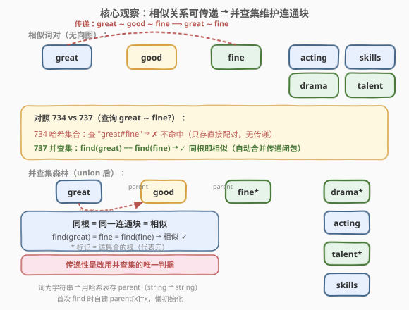
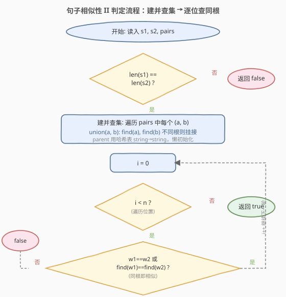
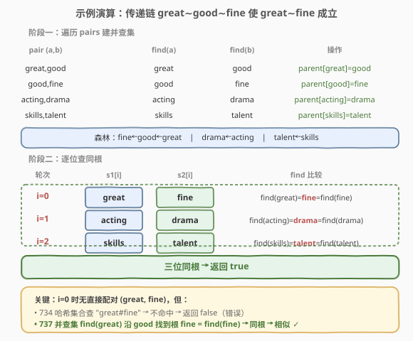

# 句子相似性 II

- **题目名称**：句子相似性 II
- **链接**：[737. 句子相似性 II](https://leetcode.cn/problems/sentence-similarity-ii/)
- **难度**：中等
- **标签**：并查集、哈希表

## 1. 题目概述

给定两个句子 `sentence1` 和 `sentence2`（均以字符串数组形式给出），以及一个**相似词对**列表 `similarPairs`。判断这两个句子是否**相似**。

两个句子相似当且仅当：

1. **长度相同**（两数组元素个数相等）；
2. 对每个位置 `i`，`sentence1[i]` 与 `sentence2[i]` 是**相似**的。

两个单词相似当且仅当：

- 二者**相同**（同一个单词）；或
- 二者**直接或间接**经由 `similarPairs` 中的词对相连——即相似关系**具有传递性**。

> 💡 **传递性**是本题（737）与 [734. 句子相似性](../0701-0800/734_句子相似性.md)（不传递版）的**唯一区别**：若 `a ∼ b` 且 `b ∼ c`，则 `a ∼ c`。这一字之差让数据结构从哈希集合升级为并查集。

**示例 1**：

```text
输入：sentence1 = ["great","acting","skills"],
     sentence2 = ["fine","drama","talent"],
     similarPairs = [["great","good"],["good","fine"],["acting","drama"],["skills","talent"]]
输出：true
解释：长度均为 3。注意 i=0 处 great 与 fine 之间没有直接配对，
     但 great∼good、good∼fine，由传递性得 great∼fine。
     其余两位 acting↔drama、skills↔talent 均直接配对。
```

**示例 2**：

```text
输入：sentence1 = ["great","acting","skills"],
     sentence2 = ["fine","drama","talent"],
     similarPairs = [["great","fine"],["acting","drama"],["skills","talent"]]
输出：true
解释：与示例 1 同义，但词对直接给出 (great,fine)，无需传递。
```

**示例 3**：

```text
输入：sentence1 = ["great"], sentence2 = ["great"], similarPairs = []
输出：true
解释：长度均为 1，且 great == great（同一单词直接相似）。
```

**示例 4**：

```text
输入：sentence1 = ["great"], sentence2 = ["doubleplusgood"], similarPairs = []
输出：false
解释：两个单词不同，且不在任何相似对中，也无传递路径。
```

**约束条件**：

- `1 <= sentence1.length, sentence2.length <= 1000`
- `0 <= similarPairs.length <= 2000`
- `similarPairs[i].length == 2`
- 每个单词长度 `1 <= word.length <= 20`
- `sentence1`、`sentence2` 和 `similarPairs[i]` 中的单词只含小写英文字母

> 💡 句子最长 1000、词对最多 2000，总单词数上限约 6000。并查集每次操作均摊 $O(\alpha)$ 近似常数，整体轻松通过。

---

## 2. 解题思路

### 2.1 暴力思路：逐位置 BFS 找连通路径

对每个位置 `i`，若 `sentence1[i] != sentence2[i]`，就以 `sentence1[i]` 为起点在相似词对构成的无向图上做 BFS/DFS，看能否到达 `sentence2[i]`。

- 时间复杂度：建图 $O(m)$；每次查询最坏遍历全图 $O(V + E) = O(m)$，共 $n$ 次查询 → $O(n \cdot m) \approx 2 \times 10^6$，勉强能过但常数大。
- 问题：每次查询都**重复遍历**整张图，且没有利用「相似关系在查询期间不变」这一特性。

> ⚠️ 此法把「静态关系 + 高频查询」当成了「每问一次重算一次」，这正是并查集的用武之地——**预处理一次，查询近似 $O(1)$**。

### 2.2 核心观察：传递关系 → 并查集



关键直觉是：相似关系**可传递**意味着它本质上是一个**等价关系**（自反、对称、传递）。等价关系把所有单词划分成若干**等价类（连通块）**——「两词相似」等价于「在同一等价类」，即「在并查集中同根」。

与 734 的对照：

| 维度 | 734 句子相似性 | 737 句子相似性 II |
|------|----------------|-------------------|
| 相似关系 | 对称、**不传递** | 对称、**可传递** |
| 数据结构 | 哈希集合（存直接配对） | 并查集（维护连通块） |
| 预处理 | $O(m)$ 存双向键 | $O(m \alpha)$ 合并 |
| 单次查询 | $O(1)$ 集合查找 | $O(\alpha)$ find 同根 |

> 💡 **判断该用哪种结构的唯一判据：关系是否传递**。传递→并查集，不传递→哈希集合。面试时若题目没说传递，默认不传递（按 734 处理）。

**实现细节：词为字符串，如何建并查集？**

传统并查集用 `int parent[]` 数组，下标是整数。本题的元素是字符串，有两种处理方式：

1. **哈希表存 parent（推荐）**：`parent` 是 `unordered_map<string, string>`（Python 用 `dict`），`parent[x]` 表示 `x` 的父节点。首次 `find(x)` 时若 `x` 不在表中，**懒初始化** `parent[x] = x`（自成一棵树）。代码最简洁，无需预先收集所有单词。

2. **字符串映射成整数 ID**：先用哈希表给每个出现过的单词编号 `0, 1, 2, ...`，再用标准 `int parent[]`。适合需要 `rank`/`size` 数组或题目后续有大量操作的场景。

本题用方式 1 最简洁——`find` 的路径压缩天然兼容哈希表（递归时顺便写回 `parent[x]`）。

### 2.3 算法流程图



整体分为「建并查集」与「逐位查同根」两阶段：建表 $O(m \alpha)$ 一次、查表每位 $O(\alpha)$ 共 $O(n \alpha)$，总复杂度 $O((n + m) \alpha)$。

### 2.4 示例演算



以示例 1 为例逐步演算：

- **建并查集**：遍历 4 个词对
  - `(great, good)`：`find(great)=great`、`find(good)=good`，不同根 → `parent[great]=good`。
  - `(good, fine)`：`find(good)=good`、`find(fine)=fine`，不同根 → `parent[good]=fine`。此时 `great` 经 `good` 间接指向 `fine`。
  - `(acting, drama)`：`parent[acting]=drama`。
  - `(skills, talent)`：`parent[skills]=talent`。
  - 最终森林：`fine←good←great`、`drama←acting`、`talent←skills`。

- **逐位查同根**：
  - `i=0`：`great != fine`，`find(great)` 沿 `great→good→fine` 找到根 `fine`，`find(fine)=fine`，**同根** → 相似 ✓。
  - `i=1`：`find(acting)=drama = find(drama)`，同根 → 相似 ✓。
  - `i=2`：`find(skills)=talent = find(talent)`，同根 → 相似 ✓。
  - 三位全通过，返回 `true`。

> ⚠️ `i=0` 是本题的精髓：`great` 与 `fine` 之间**没有直接配对**，734 的哈希集合会查 `"great#fine"` 不命中而误判 `false`；737 的并查集通过传递链 `great→good→fine` 正确判出同根 `true`。

---

## 3. 参考代码

### C++（哈希表版并查集 + 路径压缩）

```cpp
class Solution {
public:
    bool areSentencesSimilarTwo(vector<string>& sentence1,
                                vector<string>& sentence2,
                                vector<vector<string>>& pairs) {
        if (sentence1.size() != sentence2.size()) return false;
        unordered_map<string, string> parent;

        function<string(const string&)> find = [&](const string& x) -> string {
            if (parent.find(x) == parent.end()) parent[x] = x;   // 懒初始化
            if (parent[x] != x) parent[x] = find(parent[x]);     // 路径压缩
            return parent[x];
        };

        for (const auto& p : pairs) {                            // 建并查集
            string ra = find(p[0]), rb = find(p[1]);
            if (ra != rb) parent[ra] = rb;
        }

        for (int i = 0; i < (int)sentence1.size(); i++) {
            if (sentence1[i] == sentence2[i]) continue;          // 同一单词直接通过
            if (find(sentence1[i]) != find(sentence2[i])) return false;
        }
        return true;
    }
};
```

### Python

```python
class Solution:
    def areSentencesSimilarTwo(
        self,
        sentence1: List[str],
        sentence2: List[str],
        pairs: List[List[str]],
    ) -> bool:
        if len(sentence1) != len(sentence2):
            return False
        parent = {}

        def find(x):
            if x not in parent:          # 懒初始化
                parent[x] = x
            if parent[x] != x:
                parent[x] = find(parent[x])   # 路径压缩
            return parent[x]

        for a, b in pairs:               # 建并查集
            ra, rb = find(a), find(b)
            if ra != rb:
                parent[ra] = rb

        for w1, w2 in zip(sentence1, sentence2):
            if w1 == w2:                 # 同一单词直接通过
                continue
            if find(w1) != find(w2):
                return False
        return True
```

### 扩展写法：字符串映射成整数 ID + 按秩合并

当需要按秩合并或统计集合大小时，先把字符串映射成整数更方便：

```cpp
class Solution {
public:
    bool areSentencesSimilarTwo(vector<string>& sentence1,
                                vector<string>& sentence2,
                                vector<vector<string>>& pairs) {
        if (sentence1.size() != sentence2.size()) return false;
        unordered_map<string, int> id;
        int cnt = 0;
        auto getId = [&](const string& w) { return id.count(w) ? id[w] : (id[w] = cnt++); };
        for (const auto& p : pairs) { getId(p[0]); getId(p[1]); }
        for (const auto& w : sentence1) getId(w);
        for (const auto& w : sentence2) getId(w);

        vector<int> parent(cnt), rank_(cnt, 0);
        iota(parent.begin(), parent.end(), 0);
        function<int(int)> find = [&](int x) {
            return parent[x] == x ? x : parent[x] = find(parent[x]);
        };
        auto unite = [&](int x, int y) {
            int rx = find(x), ry = find(y);
            if (rx == ry) return;
            if (rank_[rx] < rank_[ry]) parent[rx] = ry;
            else if (rank_[rx] > rank_[ry]) parent[ry] = rx;
            else { parent[ry] = rx; rank_[rx]++; }
        };
        for (const auto& p : pairs) unite(id[p[0]], id[p[1]]);
        for (int i = 0; i < (int)sentence1.size(); i++) {
            if (sentence1[i] == sentence2[i]) continue;
            if (find(id[sentence1[i]]) != find(id[sentence2[i]])) return false;
        }
        return true;
    }
};
```

---

## 4. 复杂度分析

| 维度 | 复杂度 | 说明 |
|------|--------|------|
| 时间复杂度 | $O((n + m) \alpha)$ | 建并查集遍历 $m$ 个词对、查询遍历 $n$ 个位置，每次 `find`/`union` 均摊 $O(\alpha)$；$\alpha$ 为阿克曼反函数，$n \le 6000$ 范围内 $\alpha < 5$，实际等同常数 |
| 空间复杂度 | $O(m)$ | 哈希表 `parent` 最多存 $2m$ 个词对涉及的单词（每个单词存一个父指针），单词长度上界 20，即 $O(mL)$ |

> 💡 相比暴力 BFS 的 $O(n \cdot m)$，并查集把「每次查询 $O(m)$」压成「每次查询 $O(\alpha)$」，代价只是预处理 $O(m \alpha)$ 一次——典型「空间换时间 + 预处理换查询」。

---

## 5. 扩展：传递闭包的三种解法对比

「判断两元素是否经由传递关系相连」是一类经典问题，有三种常见解法：

| 解法 | 预处理 | 单次查询 | 适用场景 |
|------|--------|----------|----------|
| **Floyd 传递闭包** | $O(V^3)$ | $O(1)$ | $V$ 很小（$\le 300$）且查询极多 |
| **BFS/DFS 每问一次** | $O(V + E)$ 建图 | $O(V + E)$ | 查询次数少、图动态变化 |
| **并查集** | $O(E \alpha)$ | $O(\alpha)$ | 只加边不删边、查询频繁（本题） |

本题 $V \le 6000$，Floyd 的 $O(V^3)$ 不可行；查询多达 $n = 1000$ 次，每次 BFS 太慢。并查集是唯一兼顾预处理与查询效率的选择——前提是**关系只增不减**（无删边），这正是并查集的固有约束。

> ⚠️ 若题目改为「支持删除相似关系」，并查集不再适用，需退回 BFS 或用更复杂的动态连通性结构（如断连离线处理）。

---

## 6. 面试要点

1. **737 与 734 的核心区别是什么？如何决定用哪种数据结构？**

   - 唯一区别是**相似关系是否传递**：734 不传递（只认直接配对），737 可传递（经中间词也算相似）。判据很简单——**传递用并查集，不传递用哈希集合**。面试时若题目没明说传递，应主动确认。

2. **为什么用哈希表存 parent 而不是数组？**

   - 本题元素是字符串而非整数下标。`unordered_map<string, string>` 直接以单词为键存父指针，配合 `find` 时的懒初始化（首次访问才设 `parent[x]=x`），无需预先收集所有单词，代码最简洁。整数数组版需先建 ID 映射，适合需要 `rank`/`size` 的场景。

3. **懒初始化的 `find` 为什么能正确工作？**

   - `find(x)` 时若 `x` 不在 `parent` 中，说明它从未被任何 `union` 涉及——此时 `x` 自成一棵单节点树，根就是自己，所以 `parent[x] = x` 后直接返回 `x`。查询 `sentence1[i]` 与 `sentence2[i]` 时，若两词都不在表中，它们各自是自己，`find` 返回不同值（除非两词相同），判定不相似，符合预期。

4. **路径压缩在哈希表版中还有效吗？**

   - 完全有效。递归 `find` 时把 `parent[x]` 直接指向根，与数组版逻辑一致。唯一区别是「读」和「写」都经过哈希表，常数略大，但均摊复杂度仍为 $O(\alpha)$。本题数据规模下无性能问题。

5. **如果 `similarPairs` 里有重复对或自环（a, a），需要去重吗？**

   - 不需要。重复对：第二次 `union` 时 `find(a) == find(b)` 已同根，直接跳过。自环 `(a, a)`：`find(a) == find(a)` 恒成立，也跳过。并查集天然处理这两类冗余输入，无需额外清洗。

---

## 7. 同类练习题

- [734. 句子相似性](https://leetcode.cn/problems/sentence-similarity/)（[题解](../0701-0800/734_句子相似性.md)）：本题的不传递版，哈希集合解法，对照「是否传递」决定数据结构
- [547. 省份数量](https://leetcode.cn/problems/number-of-provinces/)（[题解](../0501-0600/547_省份数量.md)）：并查集模板题，理解 `find`/`union`/路径压缩的参照系
- [990. 等式方程的可满足性](https://leetcode.cn/problems/satisfiability-of-equality-equations/)：先 union 等式、再查不等式是否冲突，并查集判定矛盾的经典应用
- [721. 账户合并](https://leetcode.cn/problems/accounts-merge/)：并查集合并同名账户下的邮箱，字符串元素 + 并查集的同款组合
- [684. 冗余连接](https://leetcode.cn/problems/redundant-connection/)：并查集判环，加边时两端已同根即为冗余边
