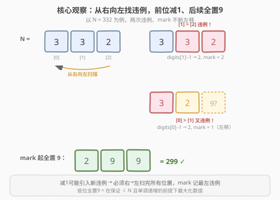
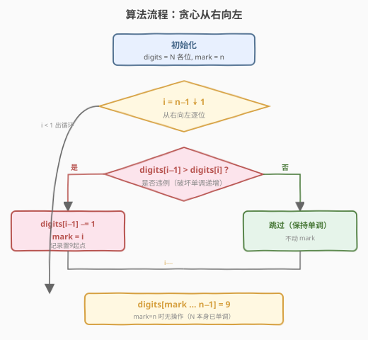
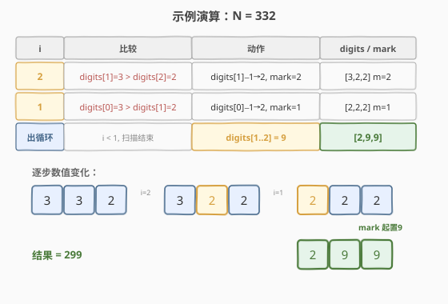

# LeetCode 单调递增的数字 题解

## 1. 题目概述

- **标题 / 题号**：单调递增的数字（#738，medium）
- **链接**：https://leetcode.cn/problems/monotone-increasing-digits/
- **难度**：中等
- **标签**：贪心、数学

**题意**：给定一个非负整数 `n`，找出**小于或等于** `n` 的最大的整数，且该整数满足：其各位数字**单调递增**（即从左到右，每一位数字都不大于下一位数字，$\text{digits}[i] \le \text{digits}[i+1]$）。

**示例 1**：

```text
输入：n = 10
输出：9
解释：10 不满足（1 > 0），9 各位单调递增且 ≤ 10 的最大。
```

**示例 2**：

```text
输入：n = 1234
输出：1234
解释：1234 本身已单调递增。
```

**示例 3**：

```text
输入：n = 332
输出：299
解释：332 不满足（3 > 2），299 各位单调递增且 ≤ 332 的最大。
```

**约束**：

- $0 \le n \le 10^9$

> 💡 这是一道**贪心**题。核心在于：一旦某处出现「前位 > 后位」的违例，就必须**降低高位**来修复；而为了在「≤ N 且单调递增」的约束下让结果尽量大，应当把违例处前位减 1、其后所有低位全部置 9。

## 2. 解题思路

### 2.1 暴力思路：逐个递减试探

从 `n` 开始递减，对每个数检查是否单调递增，第一个满足的即为答案。

```text
for x in range(n, -1, -1):
    if 单调递增(x): return x
```

最坏情况（如 `n = 10^9` 答案为 `999999999`）需检查约 $10^9$ 个数，每个检查 $O(\log n)$ 位，**总复杂度 $O(n \log n)$，超时**。

> ⚠️ 暴力法的问题：它把每个数当作独立个体逐一试探，没有利用「违例只在少数几位发生」这一结构。事实上，只要定位到第一个违例的高位、对其降一位并把后续置 9，就能一步到位构造出最大可行解——这正是贪心的切入点。

### 2.2 核心观察：从右向左找违例，前位减1、后续全置9



**单调递增**意味着任意相邻两位都满足 $\text{digits}[i-1] \le \text{digits}[i]$。若存在 $i$ 使 $\text{digits}[i-1] > \text{digits}[i]$（违例），则该数不合法。

**贪心策略**：为了让结果尽量大且 $\le N$，应当

1. **高位尽量不动**：高位权重大，动了数值掉得多。所以从**低位（右侧）**开始检查违例。
2. **遇违例则降前位**：把 $\text{digits}[i-1]$ 减 1，使此处变成 $\text{digits}[i-1]-1 \le \text{digits}[i]$ 的合法状态（因为减 1 后必然 $< \text{digits}[i]$）。
3. **后续全置 9**：既然高位已经被降了，$\text{digits}[i-1]-1$ 必然 $< \text{digits}[i]$，那么 $\text{digits}[i]$ 及之后可以放心取到最大值 9，且整体仍 $\le N$（高位已变小）。

> 💡 **关键推论**：减 1 可能引入**新的违例**。例如 `332`：在 $i=2$ 处 $3>2$，把 $\text{digits}[1]$ 减 1 得到 `322`，但此时 $\text{digits}[0]=3 > \text{digits}[1]=2$ 又违例了。因此必须**从右向左完整扫描所有位置**，每次发现违例就降前位并记录 `mark`，让 `mark` 最终指向**最左**的一次降位——`mark` 及之后的低位统一置 9。

### 2.3 算法流程图



**完整步骤**：

1. **转数字数组**：把 `n` 的各位数字存入 `digits`（高位在前），长度 $m$。
2. **初始化** `mark = m`（指向末尾，表示「无需置 9」）。
3. **从右向左扫描** `i = m-1` **降至** `1`：
   - 若 $\text{digits}[i-1] > \text{digits}[i]$：
     - $\text{digits}[i-1] \mathrel{-}= 1$
     - $\text{mark} = i$（记录置 9 的起点）
4. **置 9**：把 $\text{digits}[\text{mark} \,..\, m-1]$ 全部赋为 9。
5. **重组数字**返回。

> ⚠️ `mark` 取「最后一次」更新的位置。由于从右向左扫，**最后一次更新恰对应最左的违例**——这样左侧所有违例导致的降位都会被它的 `mark` 覆盖到，一次性把需要置 9 的低位全部置 9。若 `n` 本身已单调递增，`mark` 保持 $m$，第 4 步无操作，直接返回 `n`。

### 2.4 示例演算

以 `n = 332` 为例：



| 步骤 | i | 比较 | 动作 | digits | mark |
|------|---|------|------|--------|------|
| 1 | 2 | $\text{digits}[1]=3 > \text{digits}[2]=2$ | $\text{digits}[1]\mathrel{-}=1 \to 2$，`mark=2` | `[3,2,2]` | 2 |
| 2 | 1 | $\text{digits}[0]=3 > \text{digits}[1]=2$ | $\text{digits}[0]\mathrel{-}=1 \to 2$，`mark=1` | `[2,2,2]` | 1 |
| 3 | — | $i < 1$，扫描结束 | `digits[1..2] = 9` | `[2,9,9]` | 1 |

数值变化：`332` →（$i=2$，降 $\text{digits}[1]$）→ `322` →（$i=1$，降 $\text{digits}[0]$）→ `222` →（置 9）→ `299`。

注意步骤 2：降 $\text{digits}[0]$ 后 `mark` 从 2 左移到 1，最终 `digits[1..2]` 全置 9，得到 `299`。如果只处理一次违例（不继续左扫），会得到 `329`——但 $3 > 2$ 仍违例，非法。**右→左完整扫描**保证了所有违例都被消除。

## 3. 参考代码

### C++

```cpp
class Solution {
  public:
    int monotoneIncreasingDigits(int n) {
        string digits = to_string(n);
        int m = digits.size();
        int mark = m; // 置9的起点，m 表示无需置9
        for (int i = m - 1; i >= 1; --i) {
            if (digits[i - 1] > digits[i]) {
                digits[i - 1] -= 1;
                mark = i; // 记录最左违例的置9起点
            }
        }
        for (int i = mark; i < m; ++i) {
            digits[i] = '9';
        }
        return stoi(digits);
    }
};
```

### Python

```python
class Solution:
    def monotoneIncreasingDigits(self, n: int) -> int:
        digits = list(str(n))
        m = len(digits)
        mark = m  # 置9的起点，m 表示无需置9
        for i in range(m - 1, 0, -1):
            if digits[i - 1] > digits[i]:
                digits[i - 1] = str(int(digits[i - 1]) - 1)
                mark = i  # 记录最左违例的置9起点
        for i in range(mark, m):
            digits[i] = '9'
        return int(''.join(digits))
```

> 💡 **两个实现细节**：
> 1. **用字符串当数字数组**：`to_string(n)` / `str(n)` 直接拿到各位字符，省去手动取模拆数。C++ 中字符 `'9' - 1` 仍是字符 `'8'`（ASCII 连续），可以直接 `digits[i-1] -= 1`；Python 中需 `str(int(...)-1)` 转换。
> 2. **`mark` 初始化为 `m`**：这样当 `n` 本身已单调递增时（无违例），第二个循环 `range(mark, m)` 为空，直接返回 `n`，无需特判。

## 4. 复杂度分析

| 维度 | 复杂度 | 说明 |
|------|--------|------|
| 时间复杂度 | $O(\log n)$ | 位数 $m = \lfloor \log_{10} n \rfloor + 1$，扫描一遍 $O(m)$，置 9 一遍 $O(m)$ |
| 空间复杂度 | $O(\log n)$ | 存放数字数组的长度 $m$ |

> ⚠️ $n \le 10^9$，故 $m \le 10$，常数级复杂度。即便 $n$ 扩到任意大整数，复杂度仍是对数级。

## 5. 扩展：为什么不能从左向右扫？

从右向左扫是本题的关键，原因有二：

1. **降位会向左传播**：降 $\text{digits}[i-1]$ 可能导致 $\text{digits}[i-1] < \text{digits}[i-2]$（若 $\text{digits}[i-2]$ 原本等于降后的 $\text{digits}[i-1]$），即产生新的违例。从右向左扫，每一步处理完后保证「当前位置及右侧已合法」，左侧的违例会在后续扫描中继续被发现并修复。

2. **`mark` 记最左违例**：从右向左扫，`mark` 每次被更新为更小的 $i$，最终指向最左违例处。该处之后的低位统一置 9——因为左侧所有降位都已发生，这些低位取 9 不会违反单调性（前位已降到 $\le 9$），且能最大化数值。

> 💡 若从左向右扫，遇到违例降前位后，右侧低位如何处理不明确（无法确定降多少位才合法），且会漏掉降位引入的新违例。**右→左 + mark 记录最左置 9 点**是本题最简洁正确的贪心范式。

## 6. 面试要点

1. **为什么是贪心而不是 DP 或回溯？**

   本题要构造「≤ N 且单调递增」的最大数。其最优结构是确定的：在保证合法的前提下，**高位尽量保持、违例处前位减 1、低位全取 9**。这种「每一步取局部最优即得全局最优」的结构正是贪心的特征。DP/回溯适用于需要枚举多种选择、状态有后效性的场景，本题不存在这种分支，贪心一步到位。

2. **为什么必须从右向左扫描？**

   降位会向**左**传播违例（降 $\text{digits}[i-1]$ 可能让它与 $\text{digits}[i-2]$ 失序）。从右向左扫能保证：处理完位置 $i$ 后，$i$ 及右侧已合法；左侧的违例在继续左扫时被发现。若从左向右扫，降位后右侧的合法性无法一次性确定，且会漏掉新违例。

3. **`mark` 的作用是什么？为什么初始化为 `m`？**

   `mark` 记录「需要置 9 的起始下标」。从右向左扫，每次遇违例就把 `mark` 更新为当前 $i$，最终 `mark` 指向最左违例处。初始化为 `m` 表示「无违例时不置 9」，省去对「N 本身合法」的特判——第二个循环直接跳过。

4. **降位后为什么低位可以放心全置 9？**

   设在 $i$ 处发现 $\text{digits}[i-1] > \text{digits}[i]$，降 $\text{digits}[i-1]$ 一位。降后 $\text{digits}[i-1]-1 < \text{digits}[i] \le 9$，故 $\text{digits}[i-1]-1 \le 8 < 9$。把 $\text{digits}[i..]$ 全置 9 仍满足 $\text{digits}[i-1] < 9 = \text{digits}[i]$，单调性成立；且高位已变小，整体 $< N$，满足 $\le N$。低位取 9 使数值最大化。

5. **时间复杂度为什么是 $O(\log n)$ 而不是 $O(n)$？**

   本题处理的是数字的**位数** $m = O(\log n)$，而非数值本身。扫描和置 9 各遍历一遍位数，共 $O(m) = O(\log n)$。暴力法才是 $O(n \log n)$（枚举 $n$ 个数各检查位数）。贪心把「枚举数值」降为「分析位数」，是数量级的优化。

> 💡 **一句话总结**：单调递增的数字是贪心的招牌题——从右向左扫描找违例，遇违例则前位减 1 并用 `mark` 记录置 9 起点，最终把 `mark` 及之后的低位全置 9。核心技巧是**右→左扫描**（消除降位向左传播的新违例）和 **`mark` 记最左违例**（一次性统一置 9）。这个「降前位、后位置 9」的范式可迁移到一切「在单调约束下找最大/最小数」的构造题。

## 同类练习题

| # | 题目 | 与本题的关联 |
|---|------|-------------|
| 9 | [回文数](https://leetcode.cn/problems/palindrome-number/)（[题解](../0001-0100/9_回文数.md)） | 按位操作数字，反转一半比较——同属「位数级分析」贪心/模拟 |
| 31 | [下一个排列](https://leetcode.cn/problems/next-permutation/)（[题解](../0001-0100/31_下一个排列.md)） | 从右向左找第一个下降点、交换反转——与本题「右→左找违例」同源 |
| 402 | [移掉 K 位数字](https://leetcode.cn/problems/remove-k-digits/)（[题解](../0401-0500/402_移掉K位数字.md)） | 单调栈从左向右删高位违例字符，使剩余数最小——本题的「最小化」镜像题 |
| 321 | [拼接最大数](https://leetcode.cn/problems/create-maximum-number/)（[题解](../0301-0400/321_拼接最大数.md)） | 在单调约束下构造最大数，贪心 + 单调栈综合应用 |
