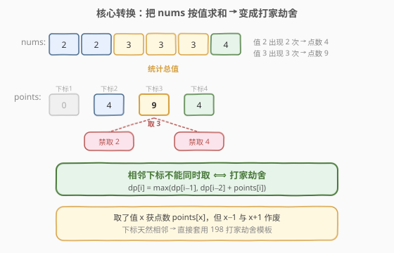
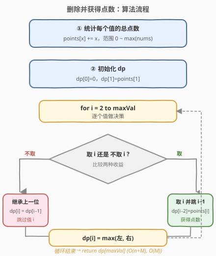
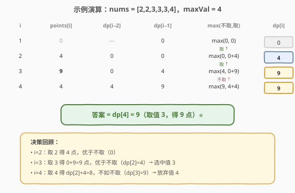

# LeetCode 删除并获得点数 题解

## 1. 题目概述

- **标题 / 题号**：删除并获得点数（#740，medium）
- **链接**：https://leetcode.cn/problems/delete-and-earn/
- **难度**：中等
- **标签**：数组、哈希表、动态规划

**题意**：给你一个整数数组 `nums`，你可以对它进行一系列操作：每次操作**任意**选择一个 `nums[i]`，删除它并获得 `nums[i]` 个点数。但是，删除 `nums[i]` 之后，**所有等于 `nums[i] - 1` 和 `nums[i] + 1` 的元素也会被一并删除**。返回你能通过这些操作获得的最大点数。

**示例 1**：

```text
输入：nums = [3,4,2]
输出：6
解释：
删除 4 获得 4 个点数，3 也被删除（4-1=3）。
之后删除 2 获得 2 个点数。
总共获得 6 个点数。
```

**示例 2**：

```text
输入：nums = [2,2,3,3,3,4]
输出：9
解释：
删除 3 获得 3×3=9 个点数，所有 2 和 4 也被删除。
总共获得 9 个点数。
```

**约束**：

- `1 <= nums.length <= 2 * 10^4`
- `1 <= nums[i] <= 10^4`

## 2. 解题思路

### 2.1 暴力思路

每次从剩下的元素里挑一个删除，分支搜索所有可能。最坏情况下每个元素都可能被选，时间复杂度高达指数级，必然超时。

### 2.2 核心观察：转换为打家劫舍

直接在原数组上做决策很难，因为删除一个值会影响"值相差 1"的所有元素，状态难以刻画。关键在于**换一个视角**：不再盯着"数组里的每个位置"，而是盯着"每个数值"。

**第一步：按值求和。** 把所有等于 `x` 的元素累加到一个桶 `points[x]` 里。这样"取值 `x`"的收益就是 `points[x]`，而不管数组里有几个 `x`。

**第二步：识别相邻约束。** 取了值 `x` 之后，`x-1` 和 `x+1` 会作废——这等价于"**相邻的值不能同时取**"。把 `points` 看作一个按下标（即数值）排列的数组，这不正是 [打家劫舍](../0101-0200/198_打家劫舍.md) 的约束吗？



上图展示了关键直觉：

- `nums = [2,2,3,3,3,4]` → `points = [0, 4, 9, 4]`（下标 1~4，其中下标 1 的值不在数组里故为 0）。
- 取了下标 `3`（值 3），就不能取相邻下标 `2` 和 `4`。
- 状态转移直接套用打家劫舍模板：`dp[i] = max(dp[i-1], dp[i-2] + points[i])`。

> 💡 **这是「问题转换」型 DP 的典范**：题目表面的"删除元素"操作很唬人，但只要把视角从"位置"切到"数值"，相邻互斥的约束立刻浮现，问题就归约到了一个已知的模板。识别这种"隐藏的打家劫舍"是面试高频考点。

### 2.3 算法流程图



整体三步走：

1. **建桶**：遍历 `nums`，`points[nums[i]] += nums[i]`，并记录最大值 `maxVal`。
2. **初始化**：`dp[0] = 0`（数值 0 不存在），`dp[1] = points[1]`。
3. **递推**：`for i = 2 to maxVal`，`dp[i] = max(dp[i-1], dp[i-2] + points[i])`，最后返回 `dp[maxVal]`。

> ⚠️ 注意 `maxVal` 是数值的最大值（≤ $10^4$），不是数组长度。`points` 数组的大小由 `maxVal` 决定，与 `nums` 长度无关。

### 2.4 示例演算

以示例 2 `nums = [2,2,3,3,3,4]` 为例，`maxVal = 4`：



| i | points[i] | dp[i−2] | dp[i−1] | 不取 / 取 | dp[i] |
|---|-----------|---------|---------|-----------|-------|
| 1 | 0 | — | 0 | max(0, 0) | 0 |
| 2 | 4 | 0 | 0 | max(0, 0+4) | 4（取）|
| 3 | 9 | 0 | 4 | max(4, 0+9) | 9（取）|
| 4 | 4 | 4 | 9 | max(9, 4+4) | 9（不取）|

最终 `dp[4] = 9`，即取值 3 获得 9 点，放弃值 2 和值 4，与示例一致。

## 3. 参考代码

### C++

```cpp
class Solution {
  public:
    int deleteAndEarn(vector<int>& nums) {
        int maxVal = 0;
        for (int x : nums) maxVal = max(maxVal, x);

        vector<int> points(maxVal + 1, 0);
        for (int x : nums) points[x] += x;

        int prev2 = 0;                // dp[i-2]
        int prev1 = points[1];        // dp[i-1]
        for (int i = 2; i <= maxVal; i++) {
            int cur = max(prev1, prev2 + points[i]);
            prev2 = prev1;
            prev1 = cur;
        }
        return prev1;
    }
};
```

### Python

```python
class Solution:
    def deleteAndEarn(self, nums: List[int]) -> int:
        max_val = max(nums)
        points = [0] * (max_val + 1)
        for x in nums:
            points[x] += x

        prev2 = 0                 # dp[i-2]
        prev1 = points[1]         # dp[i-1]
        for i in range(2, max_val + 1):
            cur = max(prev1, prev2 + points[i])
            prev2, prev1 = prev1, cur
        return prev1
```

> 💡 这里用两个滚动变量 `prev2` / `prev1` 代替整个 `dp` 数组，空间降到 $O(1)$（不计 `points` 桶）。若需要回溯具体选了哪些值，则保留完整 `dp` 数组并从 `dp[maxVal]` 倒推：`dp[i] == dp[i-1]` 说明没取 `i`，否则取了 `i` 再跳到 `i-2`。

## 4. 复杂度分析

| 维度 | 复杂度 | 说明 |
|------|--------|------|
| 时间复杂度 | $O(n + M)$ | 遍历 `nums` 建桶 $O(n)$，再遍历 `points[0..M]` 递推 $O(M)$，$M = \max(\text{nums})$ |
| 空间复杂度 | $O(M)$ | `points` 桶大小 $M+1$；DP 用滚动变量仅需 $O(1)$ 额外空间 |

> ⚠️ 由于 $M \le 10^4$，$O(M)$ 完全可接受。若数值范围极大而 `nums` 很稀疏（如值到 $10^9$），应先排序去重再在"出现的值"之间做 DP，相邻判断改为"值差是否为 1"。

## 5. 扩展：稀疏值域的优化

当数值范围很大但实际出现的值很少时，建大小为 $M$ 的桶会浪费空间。优化做法：

1. 用哈希表统计每个值的总点数，再按值升序排序得到唯一值列表 `vals`。
2. 在 `vals` 上做 DP，相邻判定改为"`vals[i] - vals[i-1] == 1`"：若相邻则互斥（打家劫舍转移），否则互不影响（直接累加）。

```python
def deleteAndEarn(self, nums: List[int]) -> int:
    from collections import Counter
    cnt = Counter()
    for x in nums:
        cnt[x] += x
    vals = sorted(cnt.keys())
    prev2 = prev1 = 0
    last = None
    for v in vals:
        if last is not None and v - last == 1:
            cur = max(prev1, prev2 + cnt[v])
        else:
            cur = prev1 + cnt[v]   # 不相邻，直接累加
        prev2, prev1, last = prev1, cur, v
    return prev1
```

## 6. 面试要点

1. **这道题的本质是什么？**
   - 是一道**伪装过的打家劫舍**。把"按位置"视角换成"按数值"视角后，相邻值互斥的约束就暴露出来，直接套用 `dp[i] = max(dp[i-1], dp[i-2] + points[i])`。

2. **为什么要按值求和而不是按位置 DP？**
   - 删除一个值会清掉所有"值差 1"的元素，与位置无关。按位置 DP 状态无法表达这种跨位置的约束；按值建桶后，"相邻值互斥"变成了"相邻下标互斥"，恰好是打家劫舍结构。

3. **`points` 数组的大小由什么决定？**
   - 由 `max(nums)` 决定，不是 `nums.length`。中间没出现的值 `points[x] = 0`，DP 自动处理（取它收益为 0）。

4. **和打家劫舍的区别在哪？**
   - 转移方程完全相同。区别只在"预处理"：打家劫舍直接在原数组上 DP，本题需要先做一次值域聚合（建桶）。识别出"建桶"这一步是解题关键。

5. **如果数值范围到 $10^9$ 怎么办？**
   - 不能建 $M$ 大小的桶。改用哈希表 + 排序去重，只在出现的值上 DP，相邻判定改为值差是否为 1（见第 5 节扩展）。

## 同类练习题

| # | 题目 | 与本题的关联 |
|---|------|-------------|
| 198 | [打家劫舍](https://leetcode.cn/problems/house-robber/)（[题解](../0101-0200/198_打家劫舍.md)） | 本题的母模板，相邻不能同时取的一维 DP |
| 213 | [打家劫舍 II](https://leetcode.cn/problems/house-robber-ii/)（[题解](../0201-0300/213_打家劫舍II.md)） | 环形约束，拆成两条线性链分别 DP |
| 337 | [打家劫舍 III](https://leetcode.cn/problems/house-robber-iii/)（[题解](../0301-0400/337_打家劫舍III.md)） | 把相邻约束搬到树上，树形 DP 每个节点取/不取两状态 |
| 2320 | [统计放置房子的方式数](https://leetcode.cn/problems/count-number-of-ways-to-place-houses/) | 打家劫舍计数变体，求方案数而非最值 |
| 448 | [找到所有数组中消失的数字](https://leetcode.cn/problems/find-all-numbers-disappeared-in-an-array/)（[题解](../0401-0500/448_找到所有数组中消失的数字.md)） | 同样利用"值域即下标"的思想做原地标记 |
