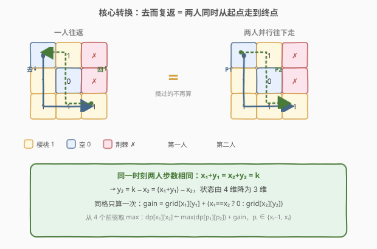
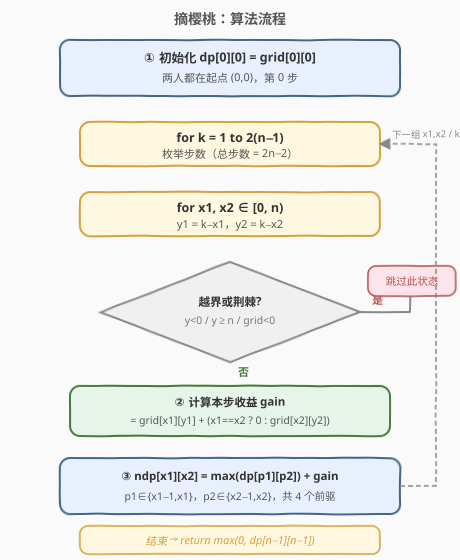
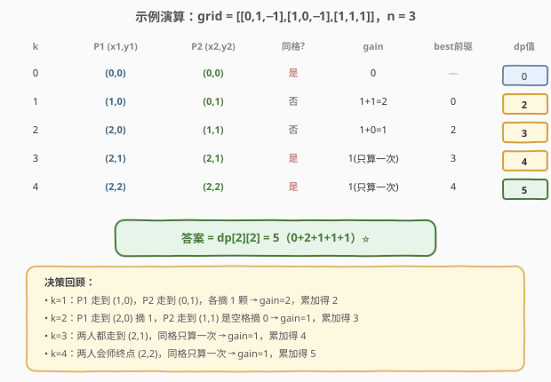

# 摘樱桃

- **题目名称**：摘樱桃
- **链接**：[741. 摘樱桃](https://leetcode.cn/problems/cherry-pickup/)
- **难度**：困难
- **标签**：数组、动态规划、矩阵

## 1. 题目概述

给你一个 $n \times n$ 的网格 `grid`，每个格子是以下三种之一：

- `0` 表示空格，可通行；
- `1` 表示有一颗樱桃，路过可以摘走（摘走后该格变 `0`）；
- `-1` 表示荆棘，**不能通行**。

你从左上角 `(0, 0)` 出发，走到右下角 `(n-1, n-1)`，**只能向右或向下**；到达后**再从右下角原路返回左上角**，返回时**只能向左或向上**。返回途中可以摘走剩余的樱桃。若起点或终点不可达（为荆棘），返回 `0`。求你最多能摘多少颗樱桃。

**示例 1**：

```text
输入：grid =
 [[0, 1, -1],
  [1, 0, -1],
  [1, 1,  1]]
输出：5
解释：
去程：(0,0)→(1,0)→(2,0)→(2,1)→(2,2)，摘 4 颗。
回程：(2,2)→(2,1)→(1,1)→(0,1)→(0,0)，再摘 (0,1) 这 1 颗。
总共 5 颗。
```

**示例 2**：

```text
输入：grid = [[1,1,-1],[1,-1,1],[-1,1,1]]
输出：0
```

**约束条件**：

- $n == \text{grid.length} == \text{grid[i].length}$
- $1 \le n \le 50$
- `grid[i][j]` ∈ $\{-1, 0, 1\}$

---

## 2. 解题思路

### 2.1 暴力思路

枚举所有"去程路径"与"回程路径"的组合，对每种组合模拟摘樱桃并取最大值。从 $(0,0)$ 到 $(n-1,n-1)$ 的路径数在最坏情况下是组合数 $C_{2n-2}^{n-1}$，再乘以回程路径数，复杂度高达指数级，$n=50$ 时完全不可行。

更直接的难点在于：**去程摘过的樱桃回程不能再摘**，所以两条路径不能独立优化——回程的最优选择依赖于去程走了哪里。这种"先后依赖"让朴素分治失效。

### 2.2 核心观察：去而复返 = 两人同时从起点走到终点

> 💡 关键转换：与其分两趟先后走，不如想象**两个人同时从 $(0,0)$ 出发，都走到 $(n-1,n-1)$**，每一步各走一格（向下或向右）。若两人同时踏入同一格，该格的樱桃只算一次。

为什么等价？去程摘过的格子回程时已为空，等价于"回程的那个人走了一条**不重复摘取**的前向路径"。把回程的"向左/向上"反向看，就是另一条"向右/向下"的前向路径。于是"一去一回"等价于"两条前向路径并行"，且**两人步数始终相同**。



上图展示了关键直觉：

- 左侧一人往返：蓝线去程、绿线回程，回程摘剩余的樱桃。
- 右侧两人并行：蓝线（P1）= 去程路径，绿线（P2）= 回程路径反向后的前向路径。
- 两条路径并行推进，步数相同，**同格只算一次**。

**状态降维。** 两人步数相同意味着 $x_1 + y_1 = x_2 + y_2 = k$（第 $k$ 步），于是 $y_2 = k - x_2 = (x_1 + y_1) - x_2$。状态只需记录 $(x_1, x_2, k)$ 三个量，$y_1, y_2$ 都能推出来，从 4 维降到 3 维。

> ⚠️ 之所以不能简单地"分别求去程最优 + 回程最优"，正是因为两条路径会争抢同一颗樱桃。双人并行的模型把这种耦合显式地刻画进状态，用"同格只算一次"来避免重复计数。

### 2.3 算法流程图



整体三步走：

1. **初始化**：`dp[0][0] = grid[0][0]`（两人都在起点，第 0 步）。
2. **逐层递推**：`for k = 1 to 2(n-1)`，对每个 $(x_1, x_2)$ 组合：
   - 由 $k$ 推出 $y_1 = k - x_1$、$y_2 = k - x_2$，越界或踩到荆棘则跳过；
   - 计算本步收益 `gain = grid[x1][y1] + (x1==x2 ? 0 : grid[x2][y2])`；
   - 从 4 个前驱 $(p_1, p_2)$（$p_i \in \{x_i-1, x_i\}$，分别代表"上一步是向下/向右来的"）取 `max(dp[p1][p2])`；
   - `ndp[x1][x2] = best + gain`。
3. **答案**：`max(0, dp[n-1][n-1])`（两人最终都在终点）。

> 💡 用滚动数组：只保留当前层 `ndp` 与上一层 `dp`，空间从 $O(n^3)$ 降到 $O(n^2)$。

### 2.4 示例演算

以示例 1 `grid = [[0,1,-1],[1,0,-1],[1,1,1]]`，$n=3$，总步数 $2(n-1)=4$。下表追踪**最优轨迹**对应的状态（每步取使 dp 最大的那组 $(x_1,x_2)$）：



| k | P1 位置 | P2 位置 | 同格 | gain | best 前驱 | dp 值 |
|---|---------|---------|------|------|-----------|-------|
| 0 | (0,0) | (0,0) | 是 | 0 | — | 0 |
| 1 | (1,0) | (0,1) | 否 | 1+1=2 | 0 | 2 |
| 2 | (2,0) | (1,1) | 否 | 1+0=1 | 2 | 3 |
| 3 | (2,1) | (2,1) | 是 | 1 | 3 | 4 |
| 4 | (2,2) | (2,2) | 是 | 1 | 4 | 5 |

最终 `dp[2][2] = 5`，与示例一致。注意 $k=3,4$ 两步两人会师同格，樱桃只算一次——这正是"双人并行"模型精确处理重复摘取的地方。

---

## 3. 参考代码

### C++

```cpp
class Solution {
  public:
    int cherryPickup(vector<vector<int>>& grid) {
        int n = grid.size();
        // dp[x1][x2]：两人同时走 k 步，第 1 人在 (x1, k-x1)，第 2 人在 (x2, k-x2) 时的最大摘樱桃数
        vector<vector<int>> dp(n, vector<int>(n, INT_MIN));
        dp[0][0] = grid[0][0];                  // k=0，两人都在起点
        for (int k = 1; k <= 2 * (n - 1); k++) {
            vector<vector<int>> ndp(n, vector<int>(n, INT_MIN));
            for (int x1 = 0; x1 < n; x1++) {
                int y1 = k - x1;
                if (y1 < 0 || y1 >= n) continue;        // 第 1 人越界
                if (grid[x1][y1] < 0) continue;          // 第 1 人踩到荆棘
                for (int x2 = 0; x2 < n; x2++) {
                    int y2 = k - x2;
                    if (y2 < 0 || y2 >= n) continue;    // 第 2 人越界
                    if (grid[x2][y2] < 0) continue;      // 第 2 人踩到荆棘
                    int gain = grid[x1][y1] + (x1 == x2 ? 0 : grid[x2][y2]);
                    int best = INT_MIN;
                    for (int p1 = x1 - 1; p1 <= x1; p1++) {      // 上一步 p1 ∈ {x1-1(向下), x1(向右)}
                        if (p1 < 0) continue;
                        for (int p2 = x2 - 1; p2 <= x2; p2++) {
                            if (p2 < 0) continue;
                            best = max(best, dp[p1][p2]);
                        }
                    }
                    if (best != INT_MIN) ndp[x1][x2] = best + gain;
                }
            }
            dp = move(ndp);
        }
        return max(0, dp[n - 1][n - 1]);
    }
};
```

### Python

```python
class Solution:
    def cherryPickup(self, grid: List[List[int]]) -> int:
        n = len(grid)
        dp = [[float('-inf')] * n for _ in range(n)]
        dp[0][0] = grid[0][0]
        for k in range(1, 2 * (n - 1) + 1):
            ndp = [[float('-inf')] * n for _ in range(n)]
            for x1 in range(n):
                y1 = k - x1
                if not (0 <= y1 < n) or grid[x1][y1] < 0:
                    continue
                for x2 in range(n):
                    y2 = k - x2
                    if not (0 <= y2 < n) or grid[x2][y2] < 0:
                        continue
                    gain = grid[x1][y1] + (0 if x1 == x2 else grid[x2][y2])
                    best = float('-inf')
                    for p1 in (x1 - 1, x1):
                        if p1 < 0:
                            continue
                        for p2 in (x2 - 1, x2):
                            if p2 < 0:
                                continue
                            best = max(best, dp[p1][p2])
                    if best != float('-inf'):
                        ndp[x1][x2] = best + gain
            dp = ndp
        return max(0, dp[n - 1][n - 1])
```

> 💡 `INT_MIN` / `float('-inf')` 表示"该状态不可达"。若某个 $(x_1, x_2)$ 的 4 个前驱都不可达，则 `best` 仍为负无穷，`ndp` 对应位置保持不可达，自然传播"无路可走"的信息。终点不可达时 `dp[n-1][n-1]` 为负无穷，`max(0, ...)` 兜底返回 0。

---

## 4. 复杂度分析

| 维度 | 复杂度 | 说明 |
|------|--------|------|
| 时间复杂度 | $O(n^3)$ | 步数 $k$ 共 $2n-2$ 层，每层枚举 $O(n^2)$ 个 $(x_1, x_2)$ 状态，每个状态查 4 个前驱 $O(1)$ |
| 空间复杂度 | $O(n^2)$ | 滚动数组只保留当前层与上一层两个 $n \times n$ 矩阵 |

> ⚠️ 看似"两趟路径"的指数组合，被"步数相同"的约束压缩成了 $O(n^3)$。$n \le 50$ 时约 $1.25 \times 10^5$ 次状态转移，完全可接受。

---

## 5. 扩展：对称性剪枝与变体

**对称性剪枝。** 由于两人等价（交换 P1、P2 不影响结果），状态 $(x_1, x_2)$ 与 $(x_2, x_1)$ 对称，可限制 $x_2 \ge x_1$，把状态数再砍掉一半。实现时内层循环改为 `for (int x2 = x1; x2 < n; x2++)`，前驱查询时注意补回对称项即可。

**[740. 删除并获得点数](../0701-0800/740_删除并获得点数.md) 的对照。** 740 也是"看似两次选择有依赖、实则可以归约"的 DP，但它把依赖转成"相邻互斥"的打家劫舍；本题则是把"去程回程"转成"双人并行"的同步 DP。两者都属于**问题重构型** DP：识别出隐藏的等价结构，把难处理的耦合消除掉。

**[1463. 摘樱桃 II](https://leetcode.cn/problems/cherry-pickup-ii/)。** 本题的"姊妹题"：两个机器人在不同行从顶往下走，状态天然是双人并行 DP，无需"步数相同"的降维技巧——直接用 $(r, c_1, c_2)$ 即可。本题的难点恰在于把"一去一回"先转换为"双人并行"，再利用步数约束降维。

---

## 6. 面试要点

1. **为什么不能分别求去程最优和回程最优？**
   - 去程摘走的樱桃回程已没有，回程的最优路径依赖去程走了哪里。两条路径在"抢同一颗樱桃"上耦合，必须联合决策。

2. **"双人并行"为什么等价于"一去一回"？**
   - 回程的"向左/向上"反转方向后就是一条"向右/向下"的前向路径；去程摘过的格子回程为空，等价于这条前向路径不重复摘取。于是两趟等价于两条前向路径并行，且步数始终相同。

3. **状态是怎么从 4 维降到 3 维的？**
   - 两人步数相同：$x_1+y_1 = x_2+y_2 = k$，所以 $y_2 = k - x_2$。状态只需 $(k, x_1, x_2)$，再滚动掉 $k$，实际只存二维 $dp[x_1][x_2]$。

4. **两人踏入同一格时怎么处理？**
   - `gain = grid[x1][y1] + (x1==x2 ? 0 : grid[x2][y2])`。同格只加一次，避免重复计数——这正是双人模型精确刻画"摘过不再摘"的地方。

5. **`INT_MIN` 的作用是什么？**
   - 标记"不可达状态"。荆棘阻断或前驱全不可达时，状态保持负无穷并向下传播；终点不可达时 `dp[n-1][n-1]` 为负无穷，最终 `max(0, ...)` 返回 0。

---

## 7. 同类练习题

- [64. 最小路径和](https://leetcode.cn/problems/minimum-path-sum/)（[题解](../0001-0100/64_最小路径和.md)）：网格只向右/向下的基础 DP，本题的"单趟版"母题
- [174. 地下城游戏](https://leetcode.cn/problems/dungeon-game/)（[题解](../0101-0200/174_地下城游戏.md)）：反向网格 DP + 哨兵消边界，状态定义决定子结构的典范
- [740. 删除并获得点数](https://leetcode.cn/problems/delete-and-earn/)（[题解](../0701-0800/740_删除并获得点数.md)）：同为"问题重构型"DP，把删除依赖转成打家劫舍相邻互斥
- [1463. 摘樱桃 II](https://leetcode.cn/problems/cherry-pickup-ii/)：本题的姊妹题，天然双人并行 DP（无需步数降维），练完 741 再做此题形成对照
- [526. 优美的排列](https://leetcode.cn/problems/beautiful-arrangement/)（[题解](../0501-0600/526_优美的排列.md)）：高维状态压缩 DP，体会"状态空间设计"的多维刻画思路
