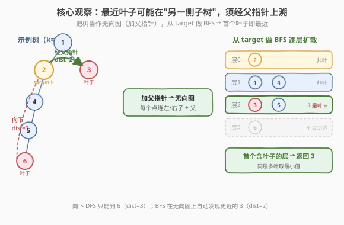
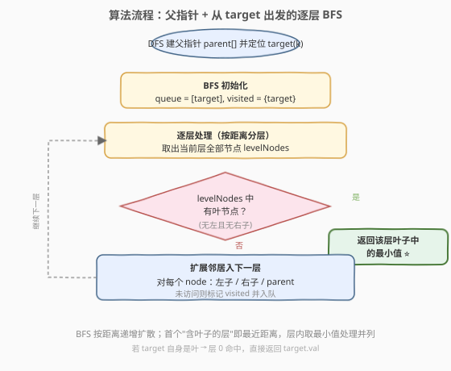
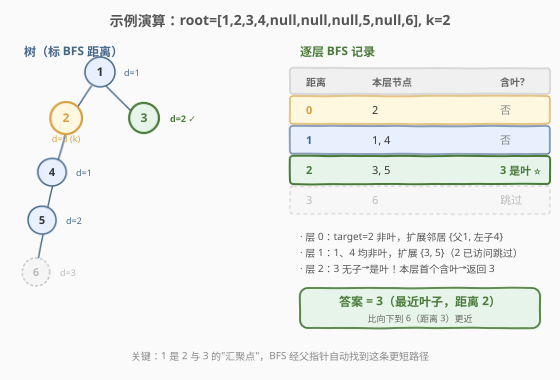

# LeetCode 二叉树最近的叶节点 题解

> ⚠️ 本题为 LeetCode **Plus 会员专享题**。题意与解法完整给出，可作思路训练。

## 1. 题目概述

- **标题 / 题号**：二叉树最近的叶节点（#742，medium）
- **链接**：https://leetcode.cn/problems/closest-leaf-in-a-binary-tree/
- **难度**：中等
- **标签**：树、二叉树、深度优先搜索、广度优先搜索、图

**题意**：给定一棵**每个节点值都互不相同**的二叉树 `root`，以及一个整数 `k`（`k` 一定在树中）。返回树中**距离值为 `k` 的节点最近的叶节点**的值。

- **叶节点**：没有子节点的节点。
- **距离**：两节点路径上的**边数**。
- 若有多个叶节点距离相同，返回**值最小**的那一个。

**示例 1**：

```text
输入：root = [1,3,2], k = 1
输出：2
解释：树为
        1
       / \
      3   2
节点 1 的两个子节点 3、2 都是叶子，且距离都为 1。返回值较小的 2。
```

**示例 2**：

```text
输入：root = [1], k = 1
输出：1
解释：根节点本身没有子节点，是叶子，距离为 0，返回 1。
```

**示例 3**：

```text
输入：root = [1,2,3,4,null,null,null,5,null,6], k = 2
输出：3
解释：树为
          1
         / \
        2   3
       /
      4
     /
    5
   /
  6
叶节点为 3 和 6。target=2 到 3 的距离为 2（2→1→3，经父节点上溯），
到 6 的距离为 3（2→4→5→6，向下）。最近叶子是 3。
```

> 💡 示例 3 是本题的招牌用例：最近叶子 **3 在 target 的"另一侧子树"**，必须**经父指针向上**才能到达。这正是朴素"向下 DFS"会漏解的根本原因。

**约束**：

- 树中节点数目范围 `[1, 500]`
- `0 <= Node.val <= 500`
- 每个 `Node.val` **互不相同**
- `0 <= k <= 500`，且 `k` 一定在树中

## 2. 解题思路

### 2.1 暴力思路：枚举叶子求两两距离

一种直观但低效的做法：

1. 遍历树，收集**所有叶节点**。
2. 对每个叶节点 `leaf`，求它到 `target` 的距离——两节点距离 = `dist(root, target) + dist(root, leaf) - 2 * dist(root, LCA)`，需借助 [最近公共祖先 LCA](../0201-0300/236_二叉树的最近公共祖先.md)。
3. 取距离最小的叶子；并列时取值最小。

这能算出正确答案，但需要 `O(叶子数 × n)` 次距离计算，最坏 `O(n²)`，还要写 LCA。更关键的是它**没有抓住问题的图论本质**：树上"一点到最近叶节点"等价于"无向图上一点到最近度数为 1 的点"，是一次单源最短路的特例——所有边权为 1，直接 **BFS** 即可。

### 2.2 核心观察：树转无向图 + 从 target 做 BFS



关键转换：**给每个节点加一条指向父节点的边**，二叉树就变成一棵**无向树**（每个节点最多 3 个邻居：左子、右子、父）。在这张无向图上，从 `target` 出发做 **BFS**，按距离递增逐层扩散：

- 所有边权为 1，BFS 的"层数 = 距离"天然成立（与 [743. 网络延迟时间](743_网络延迟时间.md) 中"边权不等才需 Dijkstra"对照——本题边权全 1，BFS 足矣）。
- **第一个"含有叶节点"的层**给出的就是最近距离。
- 叶节点判定仍用**原树结构**（`left` 和 `right` 都为空），与是否加了父边无关。

> 💡 **为什么 BFS 不会把"加了父边的非叶节点"误判成叶子？** 叶子的定义是"原树中无子节点"，我们始终用 `!node->left && !node->right` 判定，父边只作为可走的"边"参与扩散，不改变节点是否为叶的属性。

**并列处理**：同一层若出现多个叶子，题目要求返回**值最小**者。因此在处理一层时，先收集该层全部节点并统计其中的叶子最小值，确认本层有叶后再返回——而不是"弹出即返回"，避免同层内入队顺序影响结果。

> ⚠️ **只从 target 向下 DFS 为什么错？** 向下走只能到达 `target` 子树内的叶子（如示例 3 的 6），永远到不了需要"上溯再下拐"的另一侧叶子（如 3）。把树变无向图后，BFS 能同时向上、向下、向兄弟子树扩散，自然覆盖所有方向。

### 2.3 算法流程图



两阶段：先 DFS 建 `parent` 表并定位 `target`；再以 `target` 为源做逐层 BFS，首个含叶子的层即答案。

### 2.4 示例演算



以示例 3 为例，从 `target=2` 出发的 BFS 逐层记录：

| 距离 | 本层节点 | 含叶? | 说明 |
|------|----------|-------|------|
| 0 | {2} | 否 | target 非叶；扩展邻居 {父1, 左子4} |
| 1 | {1, 4} | 否 | 均非叶；扩展 {3, 5}（2 已访问跳过） |
| 2 | {3, 5} | 3 是叶 ⭐ | 本层首个含叶 → 返回 3 |
| 3 | {6} | — | 不会到达 |

`2 → 1 → 3` 距离 2，比向下 `2 → 4 → 5 → 6` 距离 3 更短。节点 `1` 是 `2` 与 `3` 的汇聚点（LCA），BFS 经父指针自动发现这条更短路径，无需显式求 LCA。

> 💡 **若 target 自身就是叶**（如示例 2）：层 0 即命中，直接返回 `target.val`，BFS 不会再扩展。

## 3. 参考代码

### C++

```cpp
/**
 * Definition for a binary tree node.
 * struct TreeNode {
 *     int val;
 *     TreeNode *left;
 *     TreeNode *right;
 *     TreeNode(int x) : val(x), left(nullptr), right(nullptr) {}
 * };
 */
class Solution {
  public:
    int findClosestLeaf(TreeNode* root, int k) {
        // 1. DFS 建 parent 表 + 定位 target(k)
        unordered_map<TreeNode*, TreeNode*> parent;
        TreeNode* target = nullptr;
        function<void(TreeNode*, TreeNode*)> dfs = [&](TreeNode* node, TreeNode* par) {
            if (!node) return;
            parent[node] = par;
            if (node->val == k) target = node;
            dfs(node->left, node);
            dfs(node->right, node);
        };
        dfs(root, nullptr);

        // 2. 从 target 出发逐层 BFS（无向图：左子/右子/父）
        queue<TreeNode*> q;
        q.push(target);
        unordered_set<TreeNode*> visited{target};

        while (!q.empty()) {
            int sz = q.size();
            vector<TreeNode*> level;
            int leafMin = INT_MAX;
            bool hasLeaf = false;
            for (int i = 0; i < sz; ++i) {
                TreeNode* node = q.front(); q.pop();
                level.push_back(node);
                if (!node->left && !node->right) {   // 原树意义下的叶
                    hasLeaf = true;
                    leafMin = min(leafMin, node->val);
                }
            }
            if (hasLeaf) return leafMin;             // 本层含叶 → 返回最小叶值
            for (TreeNode* node : level) {
                TreeNode* nbrs[3] = {node->left, node->right, parent[node]};
                for (TreeNode* nb : nbrs) {
                    if (nb && !visited.count(nb)) {
                        visited.insert(nb);
                        q.push(nb);
                    }
                }
            }
        }
        return -1; // 题目保证树非空且 k 存在，不会走到
    }
};
```

### Python

```python
class Solution:
    def findClosestLeaf(self, root: Optional[TreeNode], k: int) -> int:
        # 1. DFS 建 parent 表 + 定位 target(k)
        parent = {}
        target = None
        def dfs(node, par):
            nonlocal target
            if not node:
                return
            parent[node] = par
            if node.val == k:
                target = node
            dfs(node.left, node)
            dfs(node.right, node)
        dfs(root, None)

        # 2. 从 target 出发逐层 BFS（无向图：左子/右子/父）
        q = deque([target])
        visited = {target}
        while q:
            level = []
            leaf_min = None
            for _ in range(len(q)):
                node = q.popleft()
                level.append(node)
                if not node.left and not node.right:    # 原树意义下的叶
                    leaf_min = node.val if leaf_min is None else min(leaf_min, node.val)
            if leaf_min is not None:
                return leaf_min                         # 本层含叶 → 返回最小叶值
            for node in level:
                for nb in (node.left, node.right, parent.get(node)):
                    if nb is not None and nb not in visited:
                        visited.add(nb)
                        q.append(nb)
        return -1
```

> 💡 **两层循环写法**：外层 `while (!q.empty())` 每轮处理"一个距离层"；内层 `for (int i = 0; i < sz; ++i)` 把当前层全部取出。先判定叶子、再扩展邻居，保证"同层多叶取最小"且不浪费扩展。

## 4. 复杂度分析

| 维度 | 复杂度 | 说明 |
|------|--------|------|
| 时间复杂度 | O(n) | DFS 建父表 O(n)；BFS 每个节点入队一次、每条无向边（共 `2(n-1)` 条）至多考察两次，整体 O(n) |
| 空间复杂度 | O(n) | `parent` 表 O(n)、`visited`/队列 O(n)、DFS 递归栈 O(h)（h 为树高，最坏 O(n)） |

> ⚠️ 本题 `n ≤ 500` 极小，O(n²) 暴力也能过；但 BFS 写法更简洁、可迁移到 `n` 更大的场景，且避免了显式求 LCA。

## 5. 扩展：为什么不用 Dijkstra / 显式 LCA？

- **边权全 1 → BFS 即最短路**。本题每条边代价相同，BFS 的层数就是最短距离，无需 [743](743_网络延迟时间.md) 那样的堆优化 Dijkstra；若把"边权"换成"节点权重"（如经过某节点需额外代价），才需升级为 Dijkstra。
- **隐式 LCA**。暴力法用 `dist(a,b) = depth(a) + depth(b) - 2*depth(LCA)` 求两节点距离；BFS 在无向图上扩散天然等价于"对所有方向同时求最短路"，无需逐对算 LCA，把 `O(叶子数 × n)` 压到 `O(n)`。
- **图论视角**：本质是"树上单源最短路 + 找最近的度数 1 节点"。把树转无向图是处理"树上任两点路径"问题的通用技巧——凡是最短路需"上溯祖先再下拐"的，加父指针 + BFS 几乎都是最优解。

## 6. 面试要点

1. **为什么不能只从 target 向下 DFS？**

   - 向下只能到 target 子树内的叶子；最近叶子可能在祖先的另一侧子树（如示例 3 的 3）。必须允许"向上"走，所以要把树转成无向图（加父指针）再做 BFS。

2. **BFS 的"层数 = 距离"为什么成立？**

   - 所有边权为 1，BFS 按入队顺序处理，先入队的距离更小；同一层的节点到源点距离相等。边权不等时该假设失效，需改用 Dijkstra。

3. **如何处理"并列取最小值"？**

   - 逐层处理：先把当前层全部节点取出，统计其中的叶子最小值；本层有叶就直接返回该最小值，不依赖入队顺序。若用"弹出即返回"，同层内入队顺序会干扰结果。

4. **加了父边后，会不会把非叶节点误判成叶子？**

   - 不会。叶子的判定始终用原树结构 `!node->left && !node->right`；父边只是 BFS 中一条可走的"边"，不改变节点的叶属性。

5. **为什么先收集整层、再扩展邻居？**

   - 若边判定叶子边扩展，会在发现本层有叶后仍把多余节点入队（浪费但不错误）；先判定再扩展，发现叶子时直接返回，避免无谓的入队操作，逻辑也更清晰。

6. **target 是根 / target 自身是叶 时算法是否正确？**

   - 都正确。target 是根时父指针为 `null`，BFS 只向子树扩散，等价于普通树 BFS；target 自身是叶时层 0 命中，直接返回其值。

## 同类练习题

| # | 题目 | 与本题的关联 |
|---|------|-------------|
| 236 | [二叉树的最近公共祖先](https://leetcode.cn/problems/lowest-common-ancestor-of-a-binary-tree/) | LCA 是求"树上两点距离"的基石，本题 BFS 隐式绕过了显式求 LCA |
| 743 | [网络延迟时间](https://leetcode.cn/problems/network-delay-time/) | 单源最短路；边权不等时需 Dijkstra，本题边权全 1 退化成 BFS |
| 994 | [腐烂的橘子](https://leetcode.cn/problems/rotting-oranges/) | 多源 BFS 逐层扩散，与本题"从单源逐层找最近目标"同模板 |
| 310 | [最小高度树](https://leetcode.cn/problems/minimum-height-trees/) | 树上 BFS / 拓扑剥离叶层，反向运用"逐层剥叶子"的思想 |
