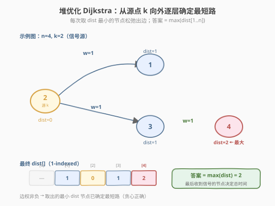
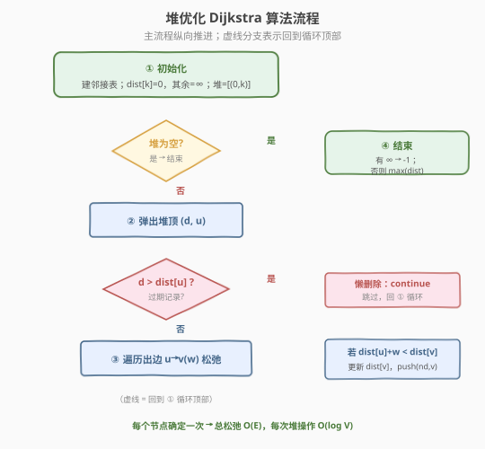
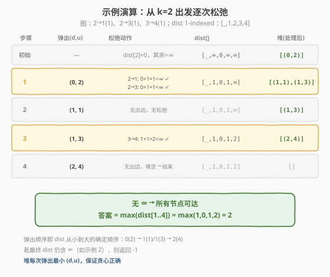

# LeetCode 网络延迟时间 题解

## 1. 题目概述

- **标题 / 题号**：网络延迟时间（#743，medium）
- **链接**：https://leetcode.cn/problems/network-delay-time/
- **难度**：中等
- **标签**：图、最短路径、Dijkstra、堆/优先队列

**题意**：有 `n` 个网络节点，标记为 `1` 到 `n`。给定边列表 `times`，其中 `times[i] = (u, v, w)` 表示一条从 `u` 到 `v` 的**有向**边，信号沿该边传递耗时 `w`。现从节点 `k` 发出一个信号，求**所有节点都收到信号**所需的最少时间；若无法让所有节点收到，返回 `-1`。

> 💡 换句话说：从 `k` 出发到每个节点的最短距离中的**最大值**就是答案——因为信号并发沿所有路径扩散，最后一个收到信号的节点决定了总时间。

**示例 1**：

```text
输入：times = [[2,1,1],[2,3,1],[3,4,1]], n = 4, k = 2
输出：2
解释：从节点 2 出发，dist[1]=1, dist[3]=1, dist[4]=2，最大值 2 即为答案。
```

**示例 2**：

```text
输入：times = [[1,2,1]], n = 2, k = 2
输出：-1
解释：从节点 2 出发无法到达节点 1（边是 1→2，方向反了）。
```

**约束**：

- `1 <= k <= n <= 100`
- `1 <= times.length <= 6000`
- `times[i].length == 3`
- `1 <= u, v <= n`，`u != v`
- `1 <= w <= 100`
- 不含重复边，所有边权为正

## 2. 解题思路

### 2.1 暴力思路：为什么 BFS 不行？

若所有边权相等（都是 1），直接从 `k` 做 BFS，层数即最短距离——这正是 [腐烂的橘子](../0901-1000/994_腐烂的橘子.md) 多源 BFS 的思路。但本题边权 `w` 各不相同（如 `1` 与 `100`），BFS 的"层数 = 距离"不再成立：一条**两段各 1** 的路径距离 `2`，可能比一条**一段 100** 的路径更短，却排在更深的层。

> ⚠️ 边权不等时，BFS 按入队顺序处理会得到错误的最短路。需要让"当前已知距离最小的节点"优先被处理——这正是 **Dijkstra** 的核心。

一个朴素基线是 **O(V²) Dijkstra**：每轮线性扫描所有未确定节点选出 `dist` 最小者，共 `V` 轮，适合 `V` 很小（本题 `V <= 100`）的场景。但当边数 `E` 很大（本题 `E <= 6000`）时，用**最小堆**选最小值可把选最小这一步从 `O(V)` 降到 `O(log V)`，得到 O(E log V) 的堆优化版本。

### 2.2 核心观察：堆优化 Dijkstra（贪心 + 优先队列）



核心思路：

- 维护 `dist[]` 表示「从 `k` 到各节点的当前最短估计」，初始 `dist[k] = 0`，其余为 `∞`。
- 用**最小堆**存放 `(距离, 节点)`，每次取出距离最小的节点 `u`。
- **贪心正确性**：因为边权非负，被取出的 `u` 的 `dist[u]` 已不可能再被更小的值更新——任何"绕远"的路径都只会更长。所以 `u` 的最短路就此确定。
- 取出 `u` 后**松弛**它的每条出边 `u→v`：若 `dist[u] + w < dist[v]`，更新 `dist[v]` 并把 `(dist[v], v)` 入堆。
- 最终答案 = `max(dist[1..n])`；若仍有 `∞` 则返回 `-1`。

> 💡 **为什么需要非负边权？** 若存在负权，"绕远"的路径可能因为一个负权边反而更短，"先取出的最小值已确定"这一贪心假设被打破，需改用 Bellman-Ford / SPFA。

### 2.3 算法流程图



### 2.4 示例演算

以示例 1 `times = [[2,1,1],[2,3,1],[3,4,1]], n=4, k=2` 为例，邻接关系：`2→1(1)`、`2→3(1)`、`3→4(1)`。下方图解展示堆的逐次弹出与松弛过程。



| 步骤 | 弹出 (d,u) | 松弛出边 | dist 变化 | 堆（处理后） |
|------|-----------|---------|----------|--------------|
| 初始 | — | dist[2]=0 | [_,∞,0,∞,∞] | [(0,2)] |
| 1 | (0,2) | 2→1: 0+1=1<∞；2→3: 0+1=1<∞ | [_,1,0,1,∞] | [(1,1),(1,3)] |
| 2 | (1,1) | 无出边 | 不变 | [(1,3)] |
| 3 | (1,3) | 3→4: 1+1=2<∞ | [_,1,0,1,2] | [(2,4)] |
| 4 | (2,4) | 无出边 | 不变 | [] |

堆空，`dist = [_, 1, 0, 1, 2]`，无 `∞`，`max = 2`，返回 `2`。

> 💡 第 2、4 步弹出后无出边可松弛；即便有，若新距离不更优也会被"懒删除"跳过（见下文代码中的 `if (d > dist[u]) continue;`）。

## 3. 参考代码

### C++

```cpp
class Solution {
  public:
    int networkDelayTime(vector<vector<int>>& times, int n, int k) {
        // 邻接表：graph[u] = {(v, w), ...}
        vector<vector<pair<int,int>>> graph(n + 1);
        for (auto& t : times)
            graph[t[0]].push_back({t[1], t[2]});

        const int INF = INT_MAX / 2;
        vector<int> dist(n + 1, INF);
        dist[k] = 0;

        // 最小堆：(距离, 节点)
        priority_queue<pair<int,int>, vector<pair<int,int>>, greater<>> pq;
        pq.push({0, k});

        while (!pq.empty()) {
            auto [d, u] = pq.top(); pq.pop();
            if (d > dist[u]) continue;          // 懒删除：旧记录已失效
            for (auto& [v, w] : graph[u]) {
                int nd = d + w;
                if (nd < dist[v]) {
                    dist[v] = nd;
                    pq.push({nd, v});
                }
            }
        }

        int ans = 0;
        for (int i = 1; i <= n; ++i) {
            if (dist[i] == INF) return -1;      // 有节点不可达
            ans = max(ans, dist[i]);
        }
        return ans;
    }
};
```

### Python

```python
class Solution:
    def networkDelayTime(self, times: List[List[int]], n: int, k: int) -> int:
        graph = [[] for _ in range(n + 1)]
        for u, v, w in times:
            graph[u].append((v, w))

        INF = float('inf')
        dist = [INF] * (n + 1)
        dist[k] = 0

        pq = [(0, k)]  # 最小堆：(距离, 节点)
        while pq:
            d, u = heapq.heappop(pq)
            if d > dist[u]:          # 懒删除：旧记录已失效
                continue
            for v, w in graph[u]:
                nd = d + w
                if nd < dist[v]:
                    dist[v] = nd
                    heapq.heappush(pq, (nd, v))

        ans = 0
        for i in range(1, n + 1):
            if dist[i] == INF:
                return -1
            ans = max(ans, dist[i])
        return ans
```

> 💡 **懒删除（lazy deletion）**：堆里可能存在同一节点的多条旧记录（距离已被更新得更小）。弹出时若 `d > dist[u]` 说明这是一条过期记录，直接 `continue` 跳过，无需真正从堆中删除。这比"修改堆中元素"的实现更简洁，是面试最推荐的写法。

## 4. 复杂度分析

| 维度 | 复杂度 | 说明 |
|------|--------|------|
| 时间复杂度 | `O(E log V)` | 每条边最多触发一次松弛入堆，共 `E` 次入堆，每次堆操作 `O(log V)` |
| 空间复杂度 | `O(V + E)` | 邻接表 `O(E)`、`dist` 数组 `O(V)`、堆最坏 `O(E)` |

> ⚠️ 朴素 Dijkstra 为 `O(V²)`；本题 `V ≤ 100` 两者都可过，但堆版本在 `E` 大、`V` 小时更优，且模板可迁移到 `V` 更大的题目。注意堆中元素可达 `O(E)` 个（懒删除不实时清理），故时间复杂度是 `O(E log E) = O(E log V)`（因 `E < V²` 时 `log E = O(log V)`）。

## 5. 扩展：其他最短路算法与选型

- **Bellman-Ford** `O(V·E)`：能处理**负权**边，并检测负环。本题全正权，杀鸡用牛刀。
- **SPFA**（Bellman-Ford 的队列优化）：平均快、最坏 `O(V·E)`，常被卡，竞赛中谨慎使用。
- **Floyd-Warshall** `O(V³)`：求**全源**最短路（任意两点间）。本题只需单源，用 Floyd 浪费；当 `V ≤ 100` 且需回答多组「两点间最短路」查询时合适。
- **DAG 上的最短路**：若图是 DAG，可按拓扑序松弛，`O(V+E)`，无需堆。

| 场景 | 推荐 |
|------|------|
| 单源、非负权 | **堆优化 Dijkstra**（本题） |
| 单源、有负权 | Bellman-Ford / SPFA |
| 全源、`V` 很小 | Floyd-Warshall |
| 单源、DAG | 拓扑排序 + 松弛 |

## 6. 面试要点

1. **为什么 Dijkstra 要求边权非负？**

   - 算法假设「当前 `dist` 最小的节点已确定最短路」。负权边可能让一条"绕远"的路径因负权而更短，破坏该假设，导致已确定节点被错误地认为最优。此时应改用 Bellman-Ford。

2. **堆里为什么可能有同一节点的多条记录？如何处理？**

   - 每次松弛成功就 `push` 一条新记录，旧的更大距离记录不会被主动删除。
   - 处理：弹出时若 `d > dist[u]` 说明过期，`continue` 跳过（懒删除）。这种写法简单且仍是 `O(E log V)`。

3. **朴素 Dijkstra 和堆优化版本怎么选？**

   - 朴素 `O(V²)` 在 `V` 小、`E` 大（稠密图）时可能更快（常数小）。
   - 堆优化 `O(E log V)` 在 `V` 大、`E` 小（稀疏图）时更优。本题 `V=100, E=6000`，两者都过；面试默认写堆版本以体现通用性。

4. **答案为什么是 `max(dist)` 而不是 `sum`？**

   - 信号并发沿所有路径扩散，各节点独立收到；总耗时由"最后一个收到"的节点决定，即所有最短距离的最大值，而非累加。

5. **如何判断返回 `-1`？**

   - Dijkstra 结束后扫描 `dist[1..n]`，若仍有 `INF`（未被松弛过），说明该节点从 `k` 不可达，返回 `-1`。

6. **邻接表为什么比邻接矩阵好？**

   - 本题 `E ≤ 6000` 而 `V ≤ 100`，邻接矩阵 `V² = 10000` 也还行；但邻接表遍历出边时只看真实存在的边，稀疏图下更省时间空间，是图算法通用首选。

## 同类练习题

| # | 题目 | 与本题的关联 |
|---|------|-------------|
| 743 | [网络延迟时间](https://leetcode.cn/problems/network-delay-time/) | 堆优化 Dijkstra 单源最短路（本题） |
| 1514 | [概率最大的路径](https://leetcode.cn/problems/path-with-maximum-probability/) | 把"最大概率"转成"最长路"，用 Dijkstra 变体（取大 + 堆） |
| 1631 | [最小体力消耗路径](https://leetcode.cn/problems/path-with-minimum-effort/) | Dijkstra 变体，路径代价定义为边上最大权差 |
| 1976 | [到达目的地的方案数](https://leetcode.cn/problems/number-of-ways-to-arrive-at-destination/) | Dijkstra 求最短路 + 统计最短路条数 |
| 787 | [K 站中转内最便宜的航班](https://leetcode.cn/problems/cheapest-flights-within-k-stops/) | Bellman-Ford / 分层 BFS，限制最多 `k` 次中转 |
