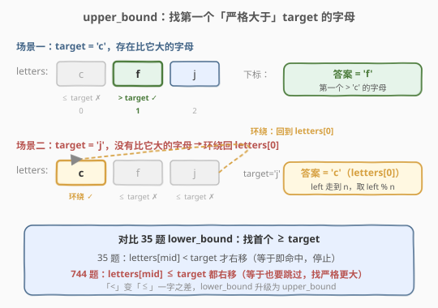
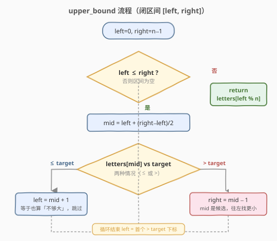
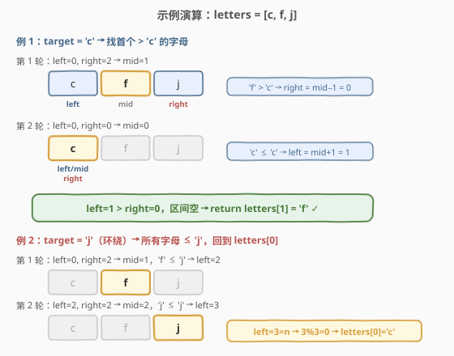

# 寻找比目标字母大的最小字母

- **题目名称**：寻找比目标字母大的最小字母
- **链接**：[744. 寻找比目标字母大的最小字母](https://leetcode.cn/problems/find-smallest-letter-greater-than-target/)
- **难度**：简单
- **标签**：数组、二分查找

## 1. 题目概述

给定一个**非递减顺序**排列的字符数组 `letters` 和一个字符 `target`，返回数组中**比 `target` 大的最小字母**。如果数组中不存在比 `target` 更大的字母，则**环绕**回到 `letters[0]` 返回。

注意：`letters` 中至少存在两个不同的字符，且比较的是字母序（字典序）。

**示例 1**：

```text
输入：letters = ["c","f","j"], target = "a"
输出："c"
解释：c、f、j 都比 a 大，最小的是 c。
```

**示例 2**：

```text
输入：letters = ["c","f","j"], target = "c"
输出："f"
解释：数组中比 c 大的最小字母是 f。
```

**示例 3**：

```text
输入：letters = ["c","f","j"], target = "d"
输出："f"
解释：比 d 大的最小字母是 f。
```

**示例 4**：

```text
输入：letters = ["c","f","j"], target = "j"
输出："c"
解释：没有比 j 更大的字母，环绕回到 letters[0] = "c"。
```

**约束条件**：

- `2 <= letters.length <= 10^4`
- `letters[i]` 是一个小写英文字母
- `letters` 按**非递减顺序**排列
- `letters` 中至少包含**两个不同的字符**
- `target` 是一个小写英文字母

> 💡 两条关键约束——**有序、要严格更大**——决定了这是最纯粹的「找上界」二分场景。它正是 [35. 搜索插入位置](../0001-0100/35_搜索插入位置.md)（`lower_bound`，首个 $\geq$ `target`）的镜像版：把判定条件从 `<` 改成 `≤`，`lower_bound` 就升级为 `upper_bound`（首个 $>$ `target`），再补一个 `left % n` 的环绕即可。

---

## 2. 解题思路

### 2.1 暴力思路：线性扫描

从头到尾遍历 `letters`，找到第一个 `letters[i] > target` 的字符即返回；若遍历完都没找到，返回 `letters[0]`。时间 `O(n)`、空间 `O(1)`。能过提交，但**完全浪费了「数组已有序」这一性质**，且题目数据规模 `n ≤ 10^4` 下二分能更快。

> ⚠️ 面试中给出 `O(n)` 方案几乎一定会被追问「能不能利用有序性做到 log 级」。此外题目虽未明文要求 `O(log n)`，但有序数组上的查找题默认期望二分。

### 2.2 核心观察：首个严格大于 target = upper_bound + 环绕



关键直觉：把「找比 `target` 大的最小字母」换个等价说法——**寻找第一个满足 `letters[i] > target` 的下标 `i`**。这正是 C++ STL `upper_bound` 的定义，几种情形被统一收编：

- `target` 小于所有字母 → 第一个字母即答案（示例 1，下标 0）。
- `target` 落在某两个字母之间 → 第一个比它大的字母即答案（示例 2/3）。
- `target` 大于或等于所有字母 → **没有比它大的，环绕回 `letters[0]`**（示例 4）。

而有序数组上「找第一个满足某条件的位置」正是二分查找的拿手好戏——每轮比较一次中点，就能丢掉不可能的一半。

> 💡 **与 35 题的唯一区别**：35 找「首个 $\geq$ `target`」（`lower_bound`），所以 `letters[mid] == target` 时直接命中返回；本题找「首个 $>$ `target`」（`upper_bound`），`letters[mid] == target` 时**仍不够大，必须继续往右找**。反映到代码上，判定条件从 `letters[mid] < target` 变成 `letters[mid] <= target`——一字之差，下界变上界。

**环绕的处理**：二分结束后 `left` 停在「第一个 $>$ `target` 的下标」。若所有字母都 $\leq$ `target`，`left` 会一路被推到 `n`（数组越界一格），此时 `letters[left % n] = letters[0]` 自然完成环绕，无需任何 `if` 特判。

### 2.3 算法流程图



沿用 [704](../0701-0800/704_二分查找.md) / [35](../0001-0100/35_搜索插入位置.md) 的闭区间 `[left, right]` 模板，循环不变量是：**若答案存在，它一定落在 `[left, right]` 内**。两处收缩严格维护不变量：

- `letters[mid] <= target`：`mid` 及其左侧都「不够大」（含等于），丢弃左半，`left = mid + 1`。
- `letters[mid] > target`：`mid` 是一个候选答案，但左侧可能还有更小的满足者，丢弃右半，`right = mid - 1`。

当 `left > right` 时区间为空，`left` 恰好停在「第一个 $>$ `target` 的下标」，`left % n` 即可取到答案（含环绕）。

> ⚠️ **为什么是 `<=` 而非 `<`？** 因为题目要**严格更大**。当 `letters[mid] == target` 时，`mid` 这个字母本身并不符合「比 `target` 大」，必须排除并继续往右——所以「等于」与「小于」合并到同一分支 `left = mid + 1`。这是本题相对 35 题最容易写错的一处。

### 2.4 示例演算

以 `letters = ["c","f","j"], target = "c"` 为例，`n = 3`。



| 轮次 | left | right | mid | letters[mid] | 判断 | 动作 |
|------|------|-------|-----|--------------|------|------|
| 1 | 0 | 2 | 1 | 'f' | 'f' > 'c' | right = 0 |
| 2 | 0 | 0 | 0 | 'c' | 'c' ≤ 'c' | left = 1 |
| 收敛 | 1 | 0 | — | — | left > right，结束 | **return letters[1] = 'f'** ⭐ |

两轮后 `left = 1 > right = 0`，返回 `letters[1] = 'f'`，对照示例 2 正确。注意第 2 轮 `'c' == 'c'` 走的是 `≤` 分支（继续右移），这正是 `upper_bound` 与 `lower_bound` 的分水岭。

对照环绕情形 `target = "j"`：`mid=1`('f' ≤ 'j' → left=2) → `mid=2`('j' ≤ 'j' → left=3) → `left=3 > right=2`，此时 `left = n = 3`，`3 % 3 = 0`，返回 `letters[0] = 'c'`，对照示例 4 正确。无特判、无分支，一套代码覆盖全部情形。

---

## 3. 参考代码

### C++（闭区间模板）

```cpp
class Solution {
  public:
    char nextGreatestLetter(vector<char>& letters, char target) {
        int left = 0, right = letters.size() - 1;
        while (left <= right) {
            int mid = left + (right - left) / 2; // 防溢出写法
            if (letters[mid] <= target) {
                left = mid + 1;   // 不够大（含等于），答案在右半
            } else {
                right = mid - 1;  // mid 是候选，继续往左找更小的
            }
        }
        return letters[left % letters.size()]; // left 即首个 > target 的下标，% n 处理环绕
    }
};
```

### Python

```python
class Solution:
    def nextGreatestLetter(self, letters: List[str], target: str) -> str:
        left, right = 0, len(letters) - 1
        while left <= right:
            mid = left + (right - left) // 2  # 防溢出，等价于 (left+right)//2
            if letters[mid] <= target:
                left = mid + 1   # 不够大（含等于），答案在右半
            else:
                right = mid - 1  # mid 是候选，继续往左找更小的
        return letters[left % len(letters)]  # % n 处理环绕
```

> ⚠️ **三个易错点**：
> 1. **判定条件用 `<=` 而非 `<`**：本题要「严格更大」，`letters[mid] == target` 时该字母并不符合，必须归入「不够大」分支继续右移。写成 `<` 会把等于 `target` 的位置误当作候选，导致返回的字母可能等于 `target` 而非大于。
> 2. **收缩要越过 `mid`**：`left = mid + 1`、`right = mid - 1`，不能写成 `left = mid` / `right = mid`，否则区间只剩两个元素时 `mid` 恒等于 `left` 会死循环。
> 3. **环绕用 `left % n` 而非 `if` 特判**：循环结束时 `left` 恰指向首个 $>$ `target` 的下标；若所有字母都 $\leq$ `target`，`left` 会等于 `n`，`n % n = 0` 自然回到 `letters[0]`。用取模一行收编环绕，避免额外分支。

---

## 4. 复杂度分析

| 维度 | 复杂度 | 说明 |
|------|--------|------|
| 时间复杂度 | $O(\log n)$ | 每轮区间折半，最多 $\lceil \log_2 n \rceil$ 轮；$n=10^4$ 时约 14 轮 |
| 空间复杂度 | $O(1)$ | 仅用 `left`、`right`、`mid` 三个指针变量 |

> 💡 **为什么是 $O(\log n)$ 而非 $O(n)$？** 关键在于「每轮丢弃一半」。区间规模按 $n \to n/2 \to n/4 \to \dots \to 1$ 衰减，缩到 1 最多 $\log_2 n$ 步。即便 `target` 大于等于所有字母，循环也只多跑一轮就因 `left > right` 退出，仍是 $O(\log n)$，随后 `left % n` 的取模是 $O(1)$。

---

## 5. 扩展：STL 一行解法与 lower/upper_bound 对照

### 5.1 STL / bisect 一行解法

C++ 可直接调用 `std::upper_bound`，它返回「第一个 $>$ `target`」的迭代器，正合题意；环绕用 `letters.begin()` 做差值后取模：

```cpp
#include <algorithm>
class Solution {
  public:
    char nextGreatestLetter(vector<char>& letters, char target) {
        auto it = upper_bound(letters.begin(), letters.end(), target);
        if (it == letters.end()) return letters[0]; // 环绕
        return *it;
    }
};
```

Python 对应 `bisect` 模块的 `bisect_right`（`bisect.bisect_right` 返回首个 $>$ `target` 的插入点，与 `upper_bound` 同义）：

```python
import bisect
class Solution:
    def nextGreatestLetter(self, letters: List[str], target: str) -> str:
        idx = bisect.bisect_right(letters, target)
        return letters[idx % len(letters)]  # idx == n 时环绕回 0
```

面试中手写模板更受青睐，但知道 STL 等价写法有助于快速验证、并在「能调库」的场景下秒杀。

### 5.2 lower_bound vs upper_bound 对照

`lower_bound` 与 `upper_bound` 是二分找边界的两个孪生模板，本题与 35 题恰好构成一对镜像：

| 维度 | `lower_bound`（35 题） | `upper_bound`（本题） |
|------|------------------------|------------------------|
| 语义 | 首个 $\geq$ `target` 的位置 | 首个 $>$ `target` 的位置 |
| 判定条件 | `nums[mid] < target` → 右移 | `letters[mid] <= target` → 右移 |
| 命中等于时 | 停下（`≥` 已满足） | 继续右移（要严格更大） |
| 循环结束 `left` | 首个 $\geq$ `target` 下标 | 首个 $>$ `target` 下标 |
| 边界处理 | `left` 最大为 `n`（插入末尾） | `left % n` 环绕（本题特有） |

> 💡 **记忆口诀**：找「$\geq$」用 `<`（小于才右移）；找「$>$」用 `≤`（小于等于都右移）。条件越严格（要更大），右移的门槛越宽松（$\leq$ 都得跳过）。

---

## 6. 面试要点

1. **本题为什么是 `upper_bound` 而不是普通的二分查找或 `lower_bound`？**

   - 普通 [704](../0701-0800/704_二分查找.md) 只问「在不在」；[35](../0001-0100/35_搜索插入位置.md) 问「首个 $\geq$ `target`」（`lower_bound`）；本题问「首个 $>$ `target`」（`upper_bound`），要**严格更大**。当 `letters[mid] == target` 时，该字母并不符合，必须继续往右——所以判定条件是 `<=` 而非 `<`。

2. **环绕为什么要用 `left % n`？不能直接 `if (left == n)` 特判吗？**

   - 两种都能写对，但取模更简洁。循环结束时 `left` 恰指向首个 $>$ `target` 的下标；若所有字母都 $\leq$ `target`，`left` 会等于 `n`，`n % n = 0` 自然回到 `letters[0]`。取模把「正常命中」与「环绕」统一成一行，避免额外分支。注意 `letters.size()` 必须非零（本题约束 `n ≥ 2`，安全）。

3. **为什么判定条件是 `letters[mid] <= target` 而不是 `<`？**

   - 题目要严格更大。若用 `<`，则 `letters[mid] == target` 时会走 `else` 分支（`right = mid - 1`），把等于 `target` 的位置当作候选，最终可能返回一个等于 `target` 的字母，违反「比 `target` 大」的要求。`<=` 确保等于的也被排除并继续右移。

4. **`mid` 用 `left + (right - left) / 2` 而不是 `(left + right) / 2`？**

   - 后者在 `left + right` 超过 `INT_MAX` 时会整数溢出（C++/Java），得到负数下标越界。差值写法保证中间结果不超过 `right`，安全。Python 不溢出但保持同一写法便于跨语言记忆。

5. **如果数组中有重复字母，模板还成立吗？**

   - 仍然成立。`upper_bound` 返回的是「第一个 $>$ `target`」的位置，若有多个等于 `target` 的字母，会跳过它们全部、停在首个更大的字母上。这与 STL `upper_bound` 语义一致，是处理重复元素的稳健做法。

---

## 7. 同类练习题

- [35. 搜索插入位置](https://leetcode.cn/problems/search-insert-position/)（[站内题解](../0001-0100/35_搜索插入位置.md)）：本题的镜像题，`lower_bound`（首个 $\geq$ `target`），把本题的 `<=` 改回 `<`、去掉 `% n` 即迁移
- [704. 二分查找](https://leetcode.cn/problems/binary-search/)（[站内题解](../0701-0800/704_二分查找.md)）：二分母题，闭区间模板的纯净版，一切二分找边界题的起点
- [34. 在排序数组中查找元素的第一个和最后一个位置](https://leetcode.cn/problems/find-first-and-last-position-of-element-in-sorted-array/)：`lower_bound` + `upper_bound` 的组合应用，命中后继续收缩找左右边界
- [278. 第一个错误的版本](https://leetcode.cn/problems/first-bad-version/)：二分找「第一个」满足条件的位置，与找下界/上界同构
- [367. 有效的完全平方数](https://leetcode.cn/problems/valid-perfect-square/)：在值域上二分判定，体会「搜索下标」到「搜索答案」的推广
