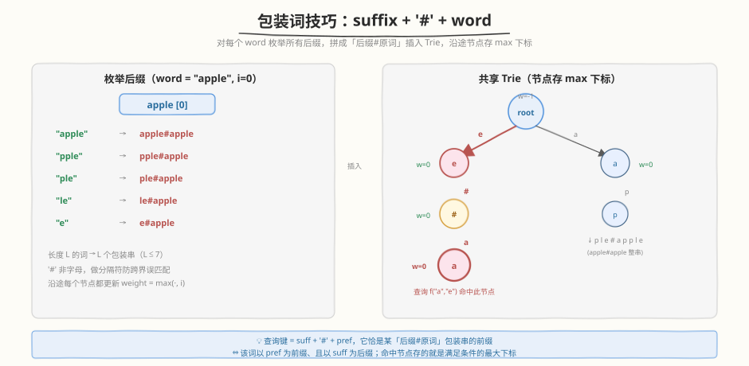
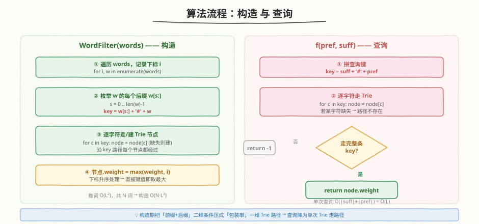
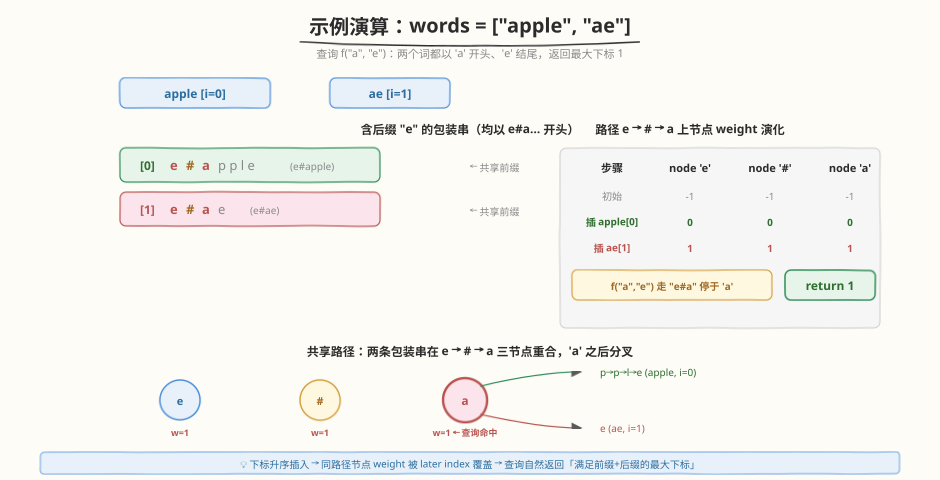

# LeetCode 前缀和后缀搜索 题解

## 1. 题目概述

- **标题 / 题号**：前缀和后缀搜索（#745，hard）
- **链接**：https://leetcode.cn/problems/prefix-and-suffix-search/
- **难度**：困难
- **标签**：字典树、设计、哈希表、字符串

**题意**：设计一个包含一些单词的特殊词典，并能够通过前缀和后缀来检索单词。实现 `WordFilter` 类：

- `WordFilter(string[] words)`：使用词典中的单词 `words` 初始化对象。
- `f(string pref, string suff)`：返回词典中**同时**以 `pref` 为前缀、以 `suff` 为后缀的单词的**最大下标**；若不存在返回 `-1`。

**示例**：

```text
WordFilter wordFilter = new WordFilter(["apple"]);
wordFilter.f("a", "e");   // 返回 0
// 下标为 0 的单词 "apple"：前缀 prefix = "a" 且 后缀 suffix = "e"
```

**约束**：

- `1 <= words.length <= 10^4`
- `1 <= words[i].length <= 7`
- `1 <= pref.length, suff.length <= 7`
- `words[i]`、`pref` 和 `suff` 仅由小写英文字母组成
- 最多对函数 `f` 执行 `10^4` 次调用

> 💡 关键约束是 `words[i].length <= 7`：词长极短，允许我们对每个词做「指数级但常数小」的展开（每词至多 7 个后缀）。

## 2. 解题思路

### 2.1 暴力思路

每次 `f(pref, suff)` 遍历所有 `words`，逐个判断「是否以 `pref` 开头 且 以 `suff` 结尾」，记录满足条件的最大下标。

- 单次查询 `O(N · L)`，N=10⁴、L=7，再乘 10⁴ 次查询 → `O(N · Q · L) ≈ 7×10⁸`，超时。
- 优点是无需预处理；缺点是查询太慢，无法接受。

### 2.2 核心观察：包装词（wrapped word）+ Trie



难点在于查询条件是**前缀 + 后缀**两个维度。Trie 天然只支持「前缀」匹配，怎么把后缀也变成前缀？

> 💡 **关键转换**：把「后缀」也拼到键的开头。对每个词 `w`，枚举它的所有后缀 `w[s:]`，构造包装串 `w[s:] + '#' + w` 插入 Trie。查询时走 `suff + '#' + pref` 这条路径即可。

为什么这样等价？查询键 `suff + '#' + pref` 要成为某个包装串 `w[s:] + '#' + w` 的**前缀**，当且仅当：

1. `suff` == `w[s:]`，即 `suff` 是 `w` 的一个后缀；
2. `pref` 是 `w` 的前缀（在 `#` 之后逐字符对齐）。

二者同时成立 ⇔ `w` 以 `pref` 为前缀且以 `suff` 为后缀，正是题目要求。

**分隔符 `#`**（或 `'{'`，ASCII 紧跟 `'z'` 之后）非小写字母，防止「后缀尾」与「原词头」跨边界误拼接匹配。

**存最大下标**：题目要求返回最大下标。我们在构造时按下标升序处理 `words`，沿包装串路径上**每个节点**都写入 `weight = i`（后写覆盖先写即取最大）。查询走到路径终点直接读 `node.weight`，无需回溯所有候选。

> ⚠️ 必须在**沿途每个节点**都更新 weight，而不是只写叶子。因为查询键 `suff + '#' + pref` 往往短于完整包装串 `suff + '#' + w`，会在 `pref` 走完时停在某个**内部节点**——这个节点必须已经记下了最大下标。

### 2.3 算法流程图



构造 `WordFilter(words)`：

1. 按下标 `i` 升序遍历 `words`；
2. 对每个词 `w`，枚举后缀起点 `s = 0 .. len(w)-1`，拼 `key = w[s:] + '#' + w`；
3. 逐字符走/建 Trie 节点；
4. 路径上每个节点 `weight = max(weight, i)`（升序处理直接赋值即可）。

查询 `f(pref, suff)`：

1. 拼查询键 `key = suff + '#' + pref`；
2. 逐字符走 Trie，中途走不通直接返回 `-1`；
3. 走完整条 key，返回终点节点的 `weight`。

### 2.4 示例演算



以 `words = ["apple", "ae"]` 为例：

- `apple[0]`：含后缀 `"e"` 的包装串为 `e#apple`，沿 `e → # → a → p → p → l → e` 建/走节点，前三个节点 `e, #, a` 写入 `weight = 0`。
- `ae[1]`：含后缀 `"e"` 的包装串为 `e#ae`，沿 `e → # → a → e` 走，前三个节点 `e, #, a` 已存在，`weight` 被覆盖为 `1`。
- 查询 `f("a", "e")`：key = `"e#a"`，走 `e → # → a` 停下，返回 `node.weight = 1`。
- 两条包装串在 `e → # → a` 三节点重合，`'a'` 之后分叉（apple 继续 `pple`，ae 继续 `e`）。下标升序插入保证了 `weight` 自然取到最大下标 `1`。

## 3. 参考代码

### C++

用数组 `children[27]` 实现：`'a'..'z'` 占 0–25，分隔符 `'{'`（`'z'+1`）占 26，避免哈希开销，速度最快。

```cpp
class WordFilter {
    struct TrieNode {
        TrieNode* children[27] = {};
        int weight = -1;
    };
    TrieNode* root;

    static int idx(char c) {
        return c - 'a';
    }

  public:
    WordFilter(vector<string>& words) : root(new TrieNode()) {
        for (int i = 0; i < (int)words.size(); ++i) {
            const string& w = words[i];
            int n = w.size();
            for (int s = 0; s < n; ++s) {
                string key = w.substr(s) + '{' + w;
                TrieNode* node = root;
                for (char c : key) {
                    int k = idx(c);
                    if (!node->children[k])
                        node->children[k] = new TrieNode();
                    node = node->children[k];
                    node->weight = i;
                }
            }
        }
    }

    int f(string pref, string suff) {
        string key = suff + '{' + pref;
        TrieNode* node = root;
        for (char c : key) {
            int k = idx(c);
            if (!node->children[k])
                return -1;
            node = node->children[k];
        }
        return node->weight;
    }
};
```

### Python

用嵌套 dict 实现（承接 [208. 实现 Trie](../0201-0300/208_实现Trie.md) 的 dict 风格），`'#'` 做分隔符、`'@'` 存 weight，均为非字母键不与词字符冲突。

```python
class WordFilter:
    def __init__(self, words: List[str]):
        self.root = {}
        for i, w in enumerate(words):
            n = len(w)
            for s in range(n):
                key = w[s:] + '#' + w
                node = self.root
                for c in key:
                    if c not in node:
                        node[c] = {}
                    node = node[c]
                    node['@'] = i

    def f(self, pref: str, suff: str) -> int:
        key = suff + '#' + pref
        node = self.root
        for c in key:
            if c not in node:
                return -1
            node = node[c]
        return node.get('@', -1)
```

## 4. 复杂度分析

设 `N = words.length`、`L = max(len(w))`（本题 `L ≤ 7`）、`Q` 为 `f` 调用次数。

| 维度 | 复杂度 | 说明 |
|------|--------|------|
| 构造时间 | `O(N · L²)` | 每词枚举 `L` 个后缀，每个包装串长 `O(L)`，共 `N·L` 条串 × `O(L)` |
| 单次查询时间 | `O(L)` | 走 `suff + '#' + pref`，长度 `O(L)` |
| 总查询时间 | `O(Q · L)` | `Q ≤ 10⁴`，`L ≤ 7` → 极快 |
| 空间 | `O(N · L²)` | Trie 节点数上限 `N·L·O(L)`；本题约 `10⁴ × 7 × 15 ≈ 10⁶` 量级 |

> 💡 本题能这么做，全靠 `L ≤ 7` 这个极小常数。若词长放大到 `10³`，`L²` 展开会爆炸，需改用「前缀 Trie + 后缀 Trie + 双指针/集合求交」等思路。

## 5. 扩展：哈希表直接存所有 (pref, suff) 对

由于 `L ≤ 7`，每个词的「前缀 × 后缀」组合至多 `7 × 7 = 49` 对。可直接用一个哈希表 `map[(pref, suff)] = max_index`，查询 `O(1)`（忽略哈希键构造）。

```python
class WordFilter:
    def __init__(self, words: List[str]):
        self.dic = {}
        for i, w in enumerate(words):
            n = len(w)
            for a in range(n + 1):          # 前缀长度 a
                for b in range(n + 1):      # 后缀长度 b
                    self.dic[w[:a] + '#' + w[b:]] = i

    def f(self, pref: str, suff: str) -> int:
        return self.dic.get(pref + '#' + suff, -1)
```

- 优点：实现更短，查询严格 `O(L)` 哈希；无 Trie 指针开销。
- 缺点：空间常数更大（每词 49 个键），且不利于「前缀通配」类扩展。
- 与 Trie 版本质同构：Trie 把这 49 个键按公共前缀压缩进了树。

> ⚠️ 注意此处前缀/后缀允许空串（`a=0` 或 `b=0`），因为查询 `pref`/`suff` 虽长度 ≥1，但枚举含空串不影响正确性且写法更简洁。

## 6. 面试要点

1. **为什么要把后缀拼到键前面？**

   - Trie 只支持「前缀匹配」。把后缀放到键开头，就把「后缀条件」也变成了「键前缀条件」，从而把二维（前缀+后缀）查询压成一维 Trie 路径。

2. **为什么要在沿途每个节点都存 weight，而不是只在叶子存？**

   - 查询键 `suff + '#' + pref` 通常比完整包装串 `suff + '#' + w` 短，会在 `pref` 走完时停在内部节点。该节点必须已记下最大下标，否则查询拿不到答案。

3. **分隔符 `#` / `'{'` 的作用是什么？能否省略？**

   - 防止「后缀尾字符 + 原词头字符」跨边界拼接出虚假匹配。例如词 `"ab"`，后缀 `"b"` 与原词 `"ab"` 拼成 `"bab"`，若查询 `pref="ba"`、`suff=""`…没有分隔符会误命中。加分隔符后键为 `b#ab`，`#` 非字母，强制后缀段与原词段对齐，杜绝跨界。
   - 选 `'{'`（`'z'+1`）在 C++ 数组实现里可直接当第 27 个槽位，避免负下标。

4. **下标升序处理为什么就能保证 weight 是最大下标？**

   - 按 `i` 从 `0` 到 `N-1` 依次插入，同一路径节点被 later `i` 覆盖，最终值即最大下标。等价于每次做 `weight = max(weight, i)`，升序下赋值与取 max 等价。

5. **如果 `words[i].length` 放大到 1000，本方案为何失效？**

   - 每词展开 `L` 个长 `O(L)` 的包装串，构造 `O(N·L²)`、空间 `O(N·L²)`。`L=1000` 时 `L²=10⁶`，乘 `N` 直接爆炸。需改用前缀 Trie 与后缀 Trie 分建，查询时在两棵树间做候选交集，或对每个前缀节点维护「按后缀排序的下标列表 + 二分」。

## 同类练习题

| # | 题目 | 与本题的关联 |
|---|------|-------------|
| 208 | [实现 Trie (前缀树)](https://leetcode.cn/problems/implement-trie-prefix-tree/) | Trie 基础模板，本题的底层结构 |
| 211 | [添加与搜索单词 - 数据结构设计](https://leetcode.cn/problems/design-add-and-search-words-data-structure/) | Trie + 通配符 `.` DFS 匹配 |
| 676 | [实现一个魔法字典](https://leetcode.cn/problems/implement-magic-dictionary/) | Trie + 允许恰好一处字符不同的查询 |
| 677 | [键值映射](https://leetcode.cn/problems/map-sum-pairs/) | Trie 节点存前缀和，沿路径累加（与本题「节点存聚合值」同构） |
| 1032 | [字符流](https://leetcode.cn/problems/stream-of-characters/) | 后缀匹配 → 反向后缀 Trie，思想与本题「后缀转前缀」一脉相承 |
