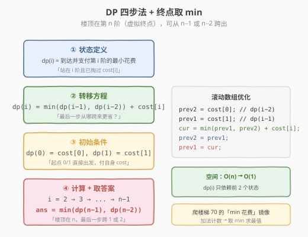

# 使用最小花费爬楼梯

- **题目名称**：使用最小花费爬楼梯
- **链接**：[746. 使用最小花费爬楼梯](https://leetcode.cn/problems/min-cost-climbing-stairs/)
- **难度**：简单
- **标签**：动态规划、数组

## 1. 题目概述

给你一个整数数组 `cost`，其中 `cost[i]` 是从楼梯第 `i` 个台阶向上爬的**花费**（下标从 `0` 开始）。一旦你支付了这个花费，就可以选择向上爬 **1 个或者 2 个**台阶。

你可以选择从下标为 `0` 或下标为 `1` 的台阶作为**初始阶梯**开始爬。请计算并返回**达到楼梯顶部**的最低花费。

> 楼梯顶部位于最后一个下标**之后**，即下标 `n`（虚拟终点）。也就是说，从下标 `n-1` 跨 1 步、或从下标 `n-2` 跨 2 步，都能登顶。

**示例 1**：

```text
输入：cost = [10,15,20]
输出：15
解释：
你将从下标为 1 的台阶开始。
- 支付 15 ，向上爬两个台阶，到达楼梯顶部。
总花费为 15 。
```

**示例 2**：

```text
输入：cost = [1,100,1,1,1,100,1,1,100,1]
输出：6
解释：
你将从下标为 0 的台阶开始。
- 支付 1 ，向上爬两个台阶，到达下标为 2 的台阶。
- 支付 1 ，向上爬两个台阶，到达下标为 4 的台阶。
- 支付 1 ，向上爬两个台阶，到达下标为 6 的台阶。
- 支付 1 ，向上爬一个台阶，到达下标为 7 的台阶。
- 支付 1 ，向上爬两个台阶，到达下标为 9 的台阶。
- 支付 1 ，向上爬一个台阶，到达楼梯顶部。
总花费为 6 。
```

**约束条件**：

- `2 <= cost.length <= 1000`
- `0 <= cost[i] <= 999`

> 💡 这是 [70. 爬楼梯](../0001-0100/70_爬楼梯.md) 的「**最小花费**」镜像题。爬楼梯是「计数」（加法原理），本题是「求最值」（取 `min`）。骨架完全相同：`f(i)` 依赖前 1–2 个状态，只是把 `+` 换成 `min`、把"方案数"换成"累计花费"。掌握爬楼梯的滚动数组写法，本题可秒杀。

---

## 2. 解题思路

### 2.1 暴力思路：枚举所有路径

把登顶看作一棵决策树：从下标 `0` 或 `1` 出发，每个节点选择"跨 1 阶"或"跨 2 阶"，累加沿途 `cost`，到达下标 `n`（楼顶）时记录总花费，最终取所有路径的最小值。

```text
cost = [10,15,20]   楼顶在下标 3
start=0 (付10) ──1──> 1 (付15) ──1──> 2 (付20) ──1──> 顶  总=45
                                  └─2──> 顶            总=30
                ──2──> 2 (付20) ──1──> 顶              总=30
start=1 (付15) ──1──> 2 (付20) ──1──> 顶              总=35
                ──2──> 顶                            总=15 ✓
```

时间复杂度 `O(2^n)`（每步二叉，树高 `n`），`n=1000` 时完全不可行。

> ⚠️ 与爬楼梯一样，暴力法的命门是**重复子问题**：例如「到达下标 `i` 的最小花费」会在多条路径里被反复求解。一旦把"最小花费"定义成状态并记忆化，指数树就坍缩成线性递推——这正是动态规划。

### 2.2 核心观察：状态转移方程

**关键定义**：设 `dp(i)` = **到达并支付**第 `i` 阶时的最小累计花费（即已经站在第 `i` 阶，且 `cost[i]` 已付清）。

**核心思考**：要站在第 `i` 阶并付清 `cost[i]`，最后一步只能从下面两个位置跨上来——

- 从第 `i-1` 阶跨 `1` 步上来：之前的花费是 `dp(i-1)`
- 从第 `i-2` 阶跨 `2` 步上来：之前的花费是 `dp(i-2)`

两条路跨上来后都**必须再付 `cost[i]`**，所以挑花费更小的一条：

$$dp(i) = \min\{\,dp(i-1),\ dp(i-2)\,\} + cost[i]$$

![状态转移：dp(i) = min(dp(i-1), dp(i-2)) + cost[i]](../images/mincost_stairs_state_transition.svg)

> 💡 **为什么是 `min` 而不是 `+`？** 爬楼梯 70 题求"方案数"，两类互斥方案数**相加**（加法原理）；本题求"最小花费"，两条路只能**择其一**，自然是取更小的 `min`。这是"计数型 DP"与"最值型 DP"的本质分野——状态定义相同，聚合运算不同。

**边界与终点**：

- **起点**：题目允许从下标 `0` 或 `1` 直接出发，无需先到达，只需付自身花费。故 `dp(0) = cost[0]`，`dp(1) = cost[1]`。
- **终点**：楼顶在下标 `n`（最后一个下标 `n-1` **之后**），它没有 `cost`。登顶可以从 `n-1` 跨 1 步、或从 `n-2` 跨 2 步，登顶动作本身不付费，所以答案是：

$$\text{ans} = \min\{\,dp(n-1),\ dp(n-2)\,\}$$

> ⚠️ 这一步最易错：很多人下意识返回 `dp(n-1)`，忘了楼顶在 `n` 而非 `n-1`。`dp(n-1)` 只是"站在倒数第一阶"的花费，还要再跨一步才登顶；而 `n-2` 可以直接跨两步登顶，可能更省。

### 2.3 算法流程图

有了转移方程和边界，剩下就是"初始化 → 顺序递推 → 终点取 min"：



**四步法**（与爬楼梯 70 完全同构）：

1. **状态定义**：`dp(i)` = 到达并支付第 `i` 阶的最小累计花费
2. **转移方程**：`dp(i) = min(dp(i-1), dp(i-2)) + cost[i]`（`i >= 2`）
3. **初始条件**：`dp(0) = cost[0]`，`dp(1) = cost[1]`（两起点直接出发）
4. **计算顺序**：`i = 2 → 3 → ... → n-1`，自底向上；最后 `ans = min(dp(n-1), dp(n-2))`

### 2.4 示例演算

以示例 1 `cost = [10, 15, 20]` 为例，`n = 3`：

![示例演算：cost=[10,15,20] 的 dp 填充与最优路径](../images/mincost_stairs_example_walkthrough.svg)

| i | cost[i] | dp(i−2) | dp(i−1) | min + cost[i] | dp(i) | 说明 |
|---|---------|---------|---------|---------------|-------|------|
| 0 | 10 | — | — | 起点 | **10** | 从 0 出发，付 10 |
| 1 | 15 | — | — | 起点 | **15** | 从 1 出发，付 15 |
| 2 | 20 | dp(0)=10 | dp(1)=15 | min(10,15)+20 | **30** | 从 0 跨 2 上来更省：10+20 |

终点取 `min(dp(n-1), dp(n-2)) = min(dp(2), dp(1)) = min(30, 15) = 15`。

**最优路径**：从下标 `1` 出发付 `15`，直接跨 `2` 步登顶，总花费 `15`（比走 `0→2→顶` 的 `30` 更省）。

> 💡 注意 `dp(2)=30` 反而比 `dp(1)=15` 大——因为站到第 2 阶要额外付 `cost[2]=20`，但登顶时第 2 阶的"已付"也派不上用场（跨 1 步登顶无需再付）。这正是终点要取 `min(dp(n-1), dp(n-2))` 而非 `dp(n-1)` 的根本原因。

再看示例 2 `cost = [1,100,1,1,1,100,1,1,100,1]`，`n = 10`，填表如下：

| i | 0 | 1 | 2 | 3 | 4 | 5 | 6 | 7 | 8 | 9 |
|---|---|---|---|---|---|---|---|---|---|---|
| cost[i] | 1 | 100 | 1 | 1 | 1 | 100 | 1 | 1 | 100 | 1 |
| dp(i) | 1 | 100 | 2 | 3 | 3 | 103 | 4 | 5 | 104 | **6** |

递推示例：`dp(9) = min(dp(8), dp(7)) + cost[9] = min(104, 5) + 1 = 6`。终点 `ans = min(dp(9), dp(8)) = min(6, 104) = 6`，与示例一致。

> 💡 可以看到 `dp` 数组里 `100` 的台阶被尽量绕开——这正是 `min` 自动做出"贪心式"取舍的效果。DP 不需要显式判断"哪个台阶该跳过"，转移方程里的 `min` 天然选择了更省的来路。

---

## 3. 参考代码

### C++

```cpp
// 使用最小花费爬楼梯.cpp —— 一维 DP + 滚动数组
// 编译: g++ -O2 -std=c++17 使用最小花费爬楼梯.cpp -o mincost
#include <vector>
#include <algorithm>
using namespace std;

// 版本 1：标准一维 DP（O(n) 空间）
class Solution {
  public:
    int minCostClimbingStairs(vector<int>& cost) {
        int n = cost.size();
        vector<int> dp(n);
        dp[0] = cost[0];
        dp[1] = cost[1];
        for (int i = 2; i < n; ++i)
            dp[i] = min(dp[i - 1], dp[i - 2]) + cost[i];
        return min(dp[n - 1], dp[n - 2]);   // 楼顶在 n，从 n-1 或 n-2 跨出
    }
};

// 版本 2：滚动数组优化（O(1) 空间，推荐）
class Solution2 {
  public:
    int minCostClimbingStairs(vector<int>& cost) {
        int n = cost.size();
        int prev2 = cost[0];   // dp(i-2)
        int prev1 = cost[1];   // dp(i-1)
        for (int i = 2; i < n; ++i) {
            int cur = min(prev1, prev2) + cost[i];
            prev2 = prev1;
            prev1 = cur;
        }
        return min(prev1, prev2);   // 终点：dp(n-1) 与 dp(n-2) 的较小者
    }
};
```

### Python

```python
class Solution:
    def minCostClimbingStairs(self, cost: List[int]) -> int:
        prev2, prev1 = cost[0], cost[1]   # dp(0), dp(1)
        for i in range(2, len(cost)):
            prev2, prev1 = prev1, min(prev1, prev2) + cost[i]
        return min(prev1, prev2)
```

> 💡 Python 的 `a, b = b, f(b, a)` 是**同时赋值**，先算右边的 `min(prev1, prev2) + cost[i]`，再一次性把 `prev2←prev1`、`prev1←新值`，无需临时变量。注意赋值顺序：右边表达式的 `prev1/prev2` 用的是更新前的旧值。

---

## 4. 复杂度分析

| 维度 | 复杂度 | 说明 |
|------|--------|------|
| **时间复杂度** | `O(n)` | 单层循环，`n-2` 次 `min` + 加法 |
| **空间复杂度（标准 DP）** | `O(n)` | `dp` 数组长度 `n` |
| **空间复杂度（滚动数组）** | `O(1)` | 只用 2 个变量 `prev1/prev2` |

> ⚠️ `n <= 1000`，`O(n)` 空间也绰绰有余；滚动数组更省，面试推荐写法。若需要回溯具体走了哪些台阶，保留完整 `dp` 数组后从 `min(dp[n-1], dp[n-2])` 倒推：若 `dp[i] == dp[i-1] + cost[i]` 说明从 `i-1` 跨来，否则从 `i-2` 跨来。

---

## 5. 扩展：另一种等价定义（虚拟终点）

上面的定义 `dp(i) = 站在 i 阶且已付 cost[i]`，终点要取 `min(dp(n-1), dp(n-2))`。还有一种更"齐整"的等价定义：**把楼顶视为下标 `n` 的虚拟台阶，cost 为 0**。

设 `f(i)` = **到达**第 `i` 阶（含虚拟楼顶 `n`）的**最小累计花费，且站上去之前要先付上一阶的 cost**：

$$f(i) = \min\{\,f(i-1) + cost[i-1],\ f(i-2) + cost[i-2]\,\}$$

- 初值：`f(0) = 0`、`f(1) = 0`（从 0 或 1 出发无需先付费）
- 答案直接是 `f(n)`（楼顶），无需再取 `min`

```python
def minCostClimbingStairs(self, cost: List[int]) -> int:
    n = len(cost)
    prev2, prev1 = 0, 0          # f(0), f(1)
    for i in range(2, n + 1):    # 注意到 n（含虚拟楼顶）
        prev2, prev1 = prev1, min(prev1 + cost[i - 1], prev2 + cost[i - 2])
    return prev1                 # f(n)
```

两种定义等价——区别只在"cost 在到达时付还是离开时付"。第一种（本题主解）与 [70. 爬楼梯](../0001-0100/70_爬楼梯.md) 的 `f(i)=f(i-1)+f(i-2)` 形式更对称，便于类比记忆；第二种把终点也纳入状态、答案更直接。面试时说清自己的定义即可，殊途同归。

---

## 6. 面试要点

1. **为什么这题是 DP 而不是贪心？**

   - DP 要求**最优子结构** + **重叠子问题**。本题每个 `dp(i)` 由 `dp(i-1)`、`dp(i-2)` 唯一确定（取 `min`），子问题重叠严重（暴力 `O(2^n)` 反复求解）。
   - 贪心要求"局部最优即全局最优"，但本题里"当前最省的台阶"未必通向全局最优——例如某个便宜台阶之后接两个昂贵台阶，跳过它反而更优。`min` 转移已经隐式枚举了两种来路，不需要额外贪心策略。

2. **终点为什么是 `min(dp(n-1), dp(n-2))` 而不是 `dp(n-1)`？**

   - 楼顶在下标 `n`（最后一个下标 `n-1` **之后**），登顶动作不付费。从 `n-1` 跨 1 步、或从 `n-2` 跨 2 步都能登顶，取两者已付费的较小者。
   - 若只返回 `dp(n-1)`，就漏掉了"从 `n-2` 直接跨两步登顶"的可能——如示例 1 中 `dp(1)=15` 比 `dp(2)=30` 更优。

3. **`dp(0)=cost[0]`、`dp(1)=cost[1]`，为什么 `dp(1)` 不写成 `min(cost[1], dp(0)+cost[1])`？**

   - 两者数值相同：`dp(0)+cost[1] = cost[0]+cost[1] >= cost[1]`，取 `min` 后仍为 `cost[1]`。题目允许从下标 `1` 直接出发，无需先经过下标 `0`，所以 `dp(1)=cost[1]` 是最简写法。

4. **和爬楼梯 70 的关系是什么？**

   - 完全同构。爬楼梯 `f(i)=f(i-1)+f(i-2)`（**计数**，加法原理），本题 `dp(i)=min(dp(i-1),dp(i-2))+cost[i]`（**求最值**，取 `min`）。骨架一致：状态依赖前 1–2 项、滚动数组 `O(1)` 空间。区别只是聚合运算 `+` → `min`，以及本题有"加权" `cost[i]`。

5. **如果每次可以跨 1、2 或 3 步，转移方程怎么改？**

   - `dp(i) = min(dp(i-1), dp(i-2), dp(i-3)) + cost[i]`（三阶递推）。
   - 滚动数组需 3 个变量；时间仍 `O(n)`，空间仍 `O(1)`。
   - 终点改为 `min(dp(n-1), dp(n-2), dp(n-3))`。

> 💡 **一句话总结**：本题是爬楼梯的"最小花费"变体——把 `+` 换成 `min`、把"方案数"换成"累计花费"。难点不在转移方程，而在**终点的处理**（楼顶在 `n` 而非 `n-1`，答案取 `min(dp(n-1), dp(n-2))`）。理解这一点，所有"线性 + 跨步 + 最值"的 DP 都能套用此模板。

---

## 7. 同类练习题

- [70. 爬楼梯](https://leetcode.cn/problems/climbing-stairs/)（[题解](../0001-0100/70_爬楼梯.md)）：本题的母模板，把 `min` 换回 `+` 就是计数版斐波那契递推
- [198. 打家劫舍](https://leetcode.cn/problems/house-robber/)（[题解](../0101-0200/198_打家劫舍.md)）：同为一维 `min/max` DP，`dp(i)=max(dp(i-1), dp(i-2)+nums[i])`，相邻不可取的约束
- [740. 删除并获得点数](https://leetcode.cn/problems/delete-and-earn/)（[题解](740_删除并获得点数.md)）：按值建桶后归约到打家劫舍，仍是 `dp(i)=max(dp(i-1), dp(i-2)+points[i])` 骨架
- [213. 打家劫舍 II](https://leetcode.cn/problems/house-robber-ii/)（[题解](../0201-0300/213_打家劫舍II.md)）：环形约束的一维 DP，拆成两条线性链分别递推
- [509. 斐波那契数](https://leetcode.cn/problems/fibonacci-number/)：最朴素的 `f(i)=f(i-1)+f(i-2)`，理解线性 DP 递推的起点
