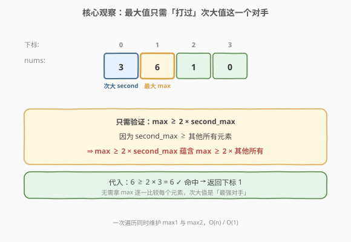
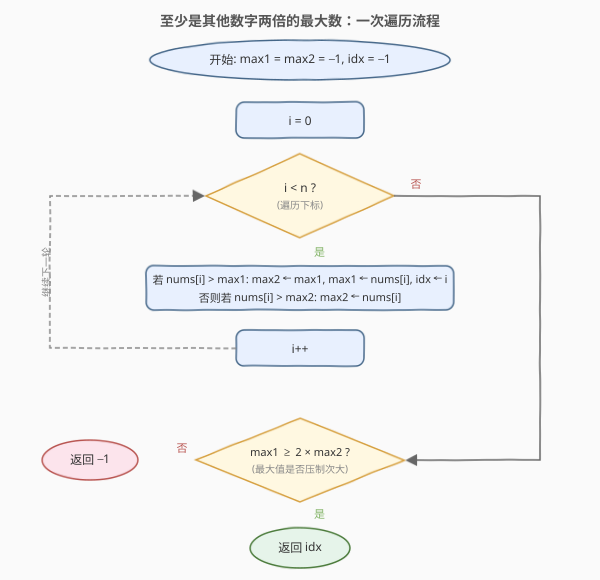
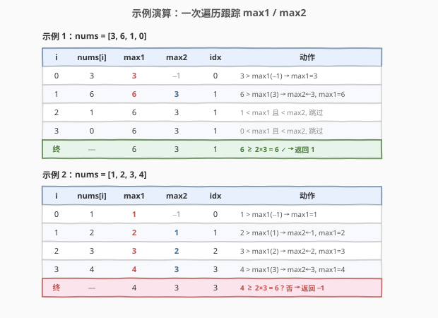

# 至少是其他数字两倍的最大数

- **题目名称**：至少是其他数字两倍的最大数
- **链接**：[747. 至少是其他数字两倍的最大数](https://leetcode.cn/problems/largest-number-at-least-twice-of-others/)
- **难度**：简单
- **标签**：数组、排序、一次遍历

## 1. 题目概述

给你一个整数数组 `nums`，其中总是存在**唯一**的一个最大整数。请你找出数组中的最大元素，并检查它是否**至少是数组中每个其他数字的两倍**。如果是，返回**最大元素的下标**，否则返回 `-1`。

> ⚠️ 注意：题目保证最大元素唯一，且只需比较「最大值」与「其他每个元素」的两倍关系，不涉及元素自身的下标偏移等额外条件。

**示例 1**：

```text
输入：nums = [3, 6, 1, 0]
输出：1
解释：6 是最大的整数，对于数组中的其他整数，6 至少是它们的两倍。
      6 的下标是 1，所以返回 1。
```

**示例 2**：

```text
输入：nums = [1, 2, 3, 4]
输出：-1
解释：4 没有超过 3 的两倍大（4 < 2×3 = 6），所以返回 -1。
```

**约束条件**：

- `2 <= nums.length <= 50`
- `0 <= nums[i] <= 100`
- `nums` 中的最大元素是唯一的

> 💡 数据规模很小（`n ≤ 50`），暴力 `O(n^2)` 也能通过。但「最大值只需压制次大值」的观察可把解法降到 `O(n)`，是本题的考点所在。

---

## 2. 解题思路

### 2.1 暴力思路

先一次遍历找到最大值 `max1` 及其下标 `idx`，再第二次遍历逐个检查「`max1 >= 2 * nums[i]`」对所有 `i != idx` 是否成立。若有任一元素不满足，返回 `-1`；否则返回 `idx`。时间复杂度 `O(n^2)`（外层找最大 `O(n)` + 内层逐个比较 `O(n)`），空间 `O(1)`。由于 `n ≤ 50`，可接受，但未利用题目结构。

### 2.2 核心观察：最大值只需「打过」次大值



关键直觉是：**与其让最大值逐一比较每个元素，不如只和「次大值」比较一次**。

设 `max1` 为最大值、`max2` 为**次大值**（即除 `max1` 外的最大元素）。因为 `max2` 是所有「其他元素」里最大的，所以：

$$
\text{max2} \ge \text{其他所有元素}
$$

于是判定条件可以缩并为单一不等式：

$$
\text{max1} \ge 2 \times \text{max2}
$$

- 若上式成立，则 `max1 ≥ 2 × max2 ≥ 2 × 其他所有元素`，最大值压制全部，返回 `max1` 的下标。
- 若上式不成立，则 `max1` 连次大值都打不过，必然存在（至少）一个元素不被压制，返回 `-1`。

> 💡 **为什么「次大值」是最强对手？** 因为 `max1 ≥ 2 × x` 这个条件随 `x` 增大而变难。在所有「其他元素」中，`max2` 最大，使 `2 × max2` 最大、条件最难满足。只要最难的这一关过了，其余元素自然全部通过。这是「**找最紧约束**」的通用思路。

这样只需**一次遍历**同时维护 `max1` 与 `max2`（以及 `max1` 的下标 `idx`），结束后做一次 `max1 ≥ 2 × max2` 的判定即可，总复杂度 `O(n)`、空间 `O(1)`。

### 2.3 算法流程图



遍历时对每个 `nums[i]` 分两种情况更新：

- 若 `nums[i] > max1`：新最大出现，**旧的 `max1` 降级为 `max2`**，再令 `max1 = nums[i]`、`idx = i`。
- 否则若 `nums[i] > max2`：仅更新次大 `max2 = nums[i]`（它没能超过最大，但超过了此前的次大）。
- 否则跳过。

遍历结束后，依据 `max1 ≥ 2 × max2` 决定返回 `idx` 或 `-1`。

### 2.4 示例演算



以 `nums = [3, 6, 1, 0]` 为例（初值 `max1 = max2 = -1, idx = -1`）：

- `i=0, nums[0]=3`：`3 > max1(-1)` → `max2 = -1, max1 = 3, idx = 0`。
- `i=1, nums[1]=6`：`6 > max1(3)` → `max2 = 3, max1 = 6, idx = 1`。
- `i=2, nums[2]=1`：`1 < max1` 且 `1 < max2`，跳过。
- `i=3, nums[3]=0`：`0 < max1` 且 `0 < max2`，跳过。
- 终态 `max1=6, max2=3`：`6 ≥ 2×3 = 6` ✓ → **返回 `1`**。

对照示例 2 `nums = [1, 2, 3, 4]`：遍历后 `max1=4, max2=3, idx=3`，`4 ≥ 2×3 = 6` 不成立 → **返回 `-1`**。

---

## 3. 参考代码

### C++

```cpp
class Solution {
  public:
    int dominantIndex(vector<int>& nums) {
        int max1 = -1, max2 = -1, idx = -1;
        for (int i = 0; i < (int)nums.size(); i++) {
            if (nums[i] > max1) {
                max2 = max1;          // 旧最大降级为次大
                max1 = nums[i];
                idx = i;
            } else if (nums[i] > max2) {
                max2 = nums[i];       // 仅更新次大
            }
        }
        return max1 >= 2 * max2 ? idx : -1;
    }
};
```

### Python

```python
class Solution:
    def dominantIndex(self, nums: List[int]) -> int:
        max1 = max2 = -1
        idx = -1
        for i, x in enumerate(nums):
            if x > max1:
                max2 = max1           # 旧最大降级为次大
                max1 = x
                idx = i
            elif x > max2:
                max2 = x              # 仅更新次大
        return idx if max1 >= 2 * max2 else -1
```

> ⚠️ **两个易错点**：
> 1. **更新顺序不能反**。遇到新的最大值时，必须**先把旧 `max1` 写入 `max2`，再覆盖 `max1`**；若先覆盖 `max1`，旧值丢失，`max2` 会错误地拿到新最大值。
> 2. **`elif` 而非 `if`**。第二个分支只在「未超过最大」时才考察次大，用 `if` 会导致新最大值被重复比较一次（虽然本题数值非负不会出错，但逻辑上多余且易引入 bug）。

---

## 4. 复杂度分析

| 维度 | 复杂度 | 说明 |
|------|--------|------|
| 时间复杂度 | O(n) | 单次遍历，每个元素做至多两次比较与赋值，结束后一次判定 |
| 空间复杂度 | O(1) | 仅用 `max1 / max2 / idx / i` 等常数个变量 |

---

## 5. 扩展：暴力与排序解法

**暴力解法**（`O(n^2)`）先找最大再逐一比较，代码直观，适合作为对照：

```cpp
int dominantIndex(vector<int>& nums) {
    int n = nums.size();
    int idx = max_element(nums.begin(), nums.end()) - nums.begin();
    for (int i = 0; i < n; i++)
        if (i != idx && nums[idx] < 2 * nums[i]) return -1;
    return idx;
}
```

**排序解法**（`O(n log n)`）将数组排序后比较最大值与次大值（即排序后最后两个元素）。逻辑与最优解同源——本质上仍是「最大值压制次大值」，但排序引入了不必要的 `O(n log n)` 与下标丢失（需额外记录原始下标）。可见「一次遍历维护双最值」是把排序解法中「找前两大」这一步线性化的结果。

> 💡 这类「**只需前 k 大**」的场景，与其整体排序，不如在遍历中滚动维护 k 个最值——这正是 [215. 数组中的第K个最大元素](https://leetcode.cn/problems/kth-largest-element-in-an-array/)（[题解](../0201-0300/215_数组中的第K个最大元素.md)）用快速选择而非排序的动机所在。

---

## 6. 面试要点

1. **为什么只需比较最大值与次大值，而非逐一比较？**

   - 因为 `max1 ≥ 2 × x` 的难度随 `x` 增大而上升。次大值 `max2` 是所有「其他元素」中最大的，构成最紧约束。只要 `max1 ≥ 2 × max2` 成立，对其他更小的元素自然成立，无需重复比较。

2. **遇到新的最大值时，为什么要先更新 `max2` 再更新 `max1`？**

   - 旧的最大值在「新最大值出现后」自动降级为次大值。必须先把旧 `max1` 存入 `max2`，再覆盖 `max1`；否则旧值丢失，`max2` 会错误地指向新最大值，最终判定失真。

3. **`nums[i]` 与 `max1` 相等时会怎样？**

   - 本题保证最大元素唯一，不会出现「与新最大相等」的情况。即便出现，代码走 `elif` 分支：相等不满足 `nums[i] > max1`，会进入 `nums[i] > max2` 判断，将该值记为次大，逻辑自洽。

4. **初值为何取 `-1`？**

   - 题目约束 `0 <= nums[i] <= 100`，所有元素非负。用 `-1` 作为 `max1 / max2` 初值保证第一个元素一定大于 `max1`，从而正确初始化，且最终判定 `max1 ≥ 2 × max2` 在仅一个元素时也不会误判（但本题 `n >= 2`，必有次大）。

5. **如果数组元素可能为负，初值该如何调整？**

   - 可用 `INT_MIN`（C++）或 `float('-inf')`（Python）作为初值，保证任意真实元素都能覆盖。判定逻辑不变。

---

## 7. 同类练习题

- [628. 三个数的最大乘积](https://leetcode.cn/problems/maximum-product-of-three-numbers/)（[题解](../0601-0700/628_三个数的最大乘积.md)）：一次遍历维护「最大三个」与「最小两个」，同源的滚动多最值技巧
- [215. 数组中的第K个最大元素](https://leetcode.cn/problems/kth-largest-element-in-an-array/)（[题解](../0201-0300/215_数组中的第K个最大元素.md)）：找第 k 大的线性化思路（快速选择），「只需前 k 大就不必整体排序」的进阶
- [414. 第三大的数](https://leetcode.cn/problems/third-maximum-number/)：一次遍历维护最大三个，本题「维护前两大」的直接推广
- [744. 寻找比目标字母大的最小字母](https://leetcode.cn/problems/find-smallest-letter-greater-than-target/)（[题解](../0701-0800/744_寻找比目标字母大的最小字母.md)）：同题号区间的二分查找练习，对照「线性 vs 二分」的取舍
