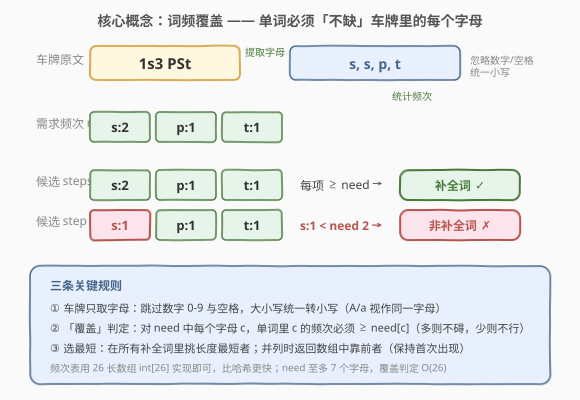
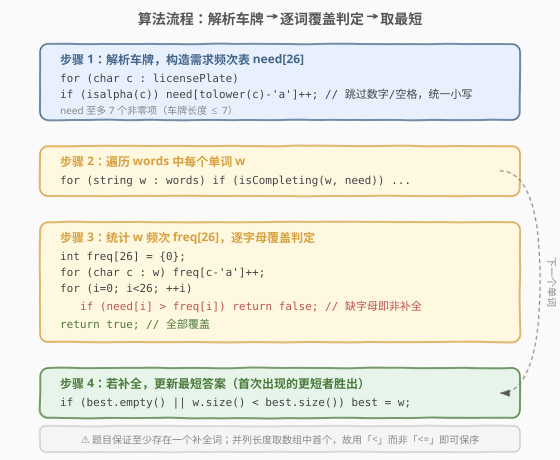
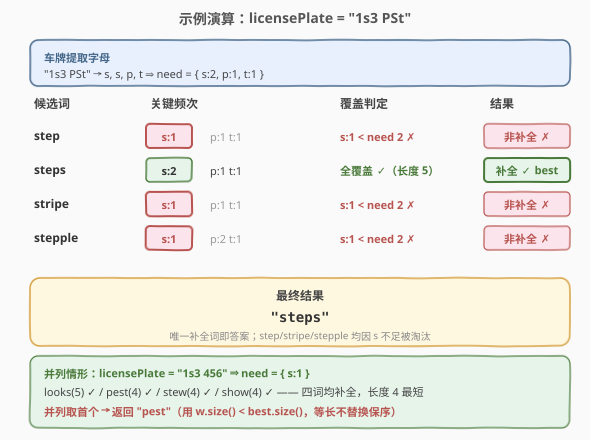

# 最短补全词

- **题目名称**：最短补全词
- **链接**：[748. 最短补全词](https://leetcode.cn/problems/shortest-completing-word/)
- **难度**：简单
- **标签**：数组、哈希表、字符串

## 1. 题目概述

给定一个字符串 `licensePlate`（车牌）和一个字符串数组 `words`，在 `words` 中找出**最短的补全词**。

**补全词**的定义：忽略 `licensePlate` 中的数字与空格、且不区分大小写后得到一组「所需字母」；一个单词若对其中**每个**字母的持有数量都**不少于**车牌所需数量，则为补全词。若存在多个长度相同的最短补全词，返回 `words` 中**最靠前**的那个。

**示例 1**：

```text
输入：licensePlate = "1s3 PSt", words = ["step","steps","stripe","stepple"]
输出："steps"
解释：车牌提取字母（忽略数字/空格、转小写）得 s, s, p, t ⇒ need = { s:2, p:1, t:1 }
      "step"    → s:1（不足 2） ✗
      "steps"   → s:2 p:1 t:1   ✓  长度 5
      "stripe"  → s:1（不足 2） ✗
      "stepple" → s:1（不足 2） ✗
      唯一补全词为 "steps"，返回之。
```

**示例 2**：

```text
输入：licensePlate = "1s3 456", words = ["looks","pest","stew","show"]
输出："pest"
解释：车牌提取字母得 s ⇒ need = { s:1 }。四词均含 s，均为补全词；
      长度最短为 4（pest / stew / show），并列取首个 → "pest"。
```

**约束条件**：

- $1 \le \text{licensePlate.length} \le 7$
- `licensePlate` 由数字、英文字母（大小写）和空格 `' '` 组成。
- $1 \le \text{words.length} \le 1000$
- $1 \le \text{words[i].length} \le 15$
- `words[i]` 仅由小写英文字母组成。

---

## 2. 解题思路

### 2.1 暴力思路

对每个单词，统计其中每个字母出现次数；再与车牌里每个字母（忽略数字、空格、大小写）的出现次数逐一比较：若单词对**所有**车牌字母的计数都 $\ge$ 需求，则它是补全词。在所有补全词里挑长度最短者（并列取首个）即为答案。

由于 $|\text{words}| \le 1000$、单词长度 $\le 15$，总字母数不超过 $1.5 \times 10^4$，暴力计数 + 线性扫描即为最优解，无需更复杂结构。

### 2.2 核心观察：词频覆盖 + 取最短



把问题拆成两步：

1. **解析车牌**：遍历 `licensePlate`，跳过数字与空格，字母统一转小写，累加到一个长度 26 的频次数组 `need[26]`。这样把「所需字母集合」固化为可比较的数值表。
2. **逐词覆盖判定**：对每个单词 `w`，同样统计其 `freq[26]`；若对每个 `i` 都有 $\text{freq}[i] \ge \text{need}[i]$，则 `w` 是补全词。

> 💡 **为什么用「需求频次表」而非「字母集合」？** 车牌里同一字母可能出现多次（示例 1 的 `s` 出现两次），单纯集合会丢失「次数」信息。频次表既能表示「需要哪些字母」，又能表示「各需几个」，覆盖判定退化为逐项 $\ge$ 比较，简洁且无歧义。

**选最短**：扫描时维护当前最优 `best`，遇补全词且更短则替换。注意题目要求并列时取**首个**，故更新条件用严格小于 `w.size() < best.size()`——等长不替换，自然保留先出现者。

**时间复杂度**：$O(L + n \cdot (\overline{w} + 26))$，其中 $L$ 为车牌长度（$\le 7$），$n$ 为单词数（$\le 1000$），$\overline{w}$ 为单词平均长度（$\le 15$）。**空间复杂度**：$O(1)$（两个长度 26 的整型数组，常数空间）。

### 2.3 算法流程图



流程分四步：

1. **解析车牌**：`for (char c : licensePlate) if (isalpha(c)) need[tolower(c)-'a']++;`——一行完成「跳过非字母 + 转小写 + 计数」。
2. **遍历单词**：对每个 `w` 调用覆盖判定。
3. **覆盖判定**：先统计 `w` 的 `freq[26]`，再循环 26 项，任一 `need[i] > freq[i]` 即返回 `false`（短路剪枝）。
4. **更新最短**：补全则比较长度，更短即替换。

> ⚠️ **覆盖判定只循环 26 次而非遍历整个车牌**：`need` 已固化为频次表，判定时只需对 26 个字母位做 $\ge$ 比较，与车牌长度无关。也可只遍历 `need` 的非零位进一步提速，但 26 是常数，差异可忽略。

### 2.4 示例演算



以 `licensePlate = "1s3 PSt"` 为例，解析得 `need = { s:2, p:1, t:1 }`，逐词判定：

| 候选词 | 关键频次 | 覆盖判定 | 结果 |
|--------|----------|----------|------|
| step | s:1, p:1, t:1 | $s:1 < 2$ ✗ | 非补全 ✗ |
| steps | s:2, p:1, t:1 | 全覆盖 ✓（长度 5） | 补全 ✓ → best |
| stripe | s:1, p:1, t:1 | $s:1 < 2$ ✗ | 非补全 ✗ |
| stepple | s:1, p:2, t:1 | $s:1 < 2$ ✗ | 非补全 ✗ |

最终 `best = "steps"`。注意 `stepple` 虽 `p` 多一个，但 `s` 仍不足，照样被淘汰——**覆盖只看「不少」，多则无碍**。

**并列情形**（示例 2）：`need = { s:1 }`，四词都补全且 `pest/stew/show` 长度同为 4。因更新条件是严格 `<`，后到的等长词不会替换先到者，故返回最早出现的 `"pest"`。

---

## 3. 参考代码

### C++

```cpp
class Solution {
  public:
    string shortestCompletingWord(string licensePlate, vector<string>& words) {
        int need[26] = {0};
        for (char c : licensePlate) {
            if (isalpha(c)) {
                need[tolower(c) - 'a']++;
            }
        }

        string best;
        for (const string& w : words) {
            if (isCompleting(w, need) && (best.empty() || w.size() < best.size())) {
                best = w;
            }
        }
        return best;
    }

  private:
    bool isCompleting(const string& w, const int need[]) {
        int freq[26] = {0};
        for (char c : w) {
            freq[c - 'a']++;
        }
        for (int i = 0; i < 26; ++i) {
            if (need[i] > freq[i]) {
                return false;
            }
        }
        return true;
    }
};
```

### Python

```python
class Solution:
    def shortestCompletingWord(self, licensePlate: str, words: list[str]) -> str:
        from collections import Counter

        need = Counter(c.lower() for c in licensePlate if c.isalpha())
        best = ""
        for w in words:
            wc = Counter(w)
            if all(wc[ch] >= need[ch] for ch in need):
                if not best or len(w) < len(best):
                    best = w
        return best
```

> 💡 Python 版用 `Counter` + `all(... for ch in need)`，只遍历 `need` 中出现的字母（至多 7 个），比遍历全 26 字母更省；`wc[ch]` 对不存在的键返回 0，天然处理「单词缺某字母」的情形。C++ 版用裸数组 `int[26]` 更贴近底层、零分配，两者逻辑等价。

---

## 4. 复杂度分析

| 维度 | 复杂度 | 说明 |
|------|--------|------|
| 时间复杂度 | $O(L + n \cdot (\overline{w} + 26))$ | 解析车牌 $O(L)$；每个单词统计频次 $O(\overline{w})$ + 覆盖判定 $O(26)$；$L \le 7,\ n \le 1000,\ \overline{w} \le 15$，上界约 $4 \times 10^4$ 次操作 |
| 空间复杂度 | $O(1)$ | 仅 `need[26]` 与 `freq[26]` 两个定长数组（Python 版 `Counter` 至多 7 项），与输入规模无关 |

---

## 5. 扩展：只统计「需求字母」的覆盖判定（常数优化）

覆盖判定不必循环全部 26 个字母——`need` 中非零位至多 7 个（车牌长度 $\le 7$）。可先把 `need` 的非零下标收集成列表 `keys`，判定时只比较这些位：

```cpp
// 预处理：收集 need 的非零下标
vector<int> keys;
for (int i = 0; i < 26; ++i) if (need[i]) keys.push_back(i);

bool isCompleting(const string& w, const int need[], const vector<int>& keys) {
    int freq[26] = {0};
    for (char c : w) freq[c - 'a']++;
    for (int i : keys) if (need[i] > freq[i]) return false;
    return true;
}
```

判定从 $O(26)$ 降到 $O(|\text{need}|) \le 7$。由于 26 本身是常数，实测差异极小，但思路可迁移到「字符表更大」的变体（如 Unicode 全字母表）——那时只比需求位就显著优于遍历全集。

> 💡 Python 版 `all(... for ch in need)` 天然只遍历 `need` 的键，已隐式实现该优化。

---

## 6. 面试要点

1. **为什么用频次数组而不是字母集合？**

   - 车牌里同一字母可重复（如示例 1 的 `s` 两次），集合会丢失次数信息。频次数组 `need[26]` 既记录「需要哪些字母」又记录「各需几个」，覆盖判定退化为逐项 $\ge$ 比较，准确无歧义。

2. **并列长度时如何保证返回首个？**

   - 更新条件用**严格小于** `w.size() < best.size()`：等长时不替换 `best`，自然保留先遍历到的单词。若误用 `<=`，会把并列的后到者替换上来，违反题意。`best` 初始为空，首次补全词一定满足 `best.empty()` 进入更新。

3. **车牌里的大写字母怎么处理？数字和空格呢？**

   - 用 `isalpha(c)` 过滤掉数字与空格，再用 `tolower(c)` 统一转小写后计数。C++ 的 `isalpha`/`tolower` 对 ASCII 字母安全；Python 用 `c.isalpha()` + `c.lower()`。注意车牌可能含空格，必须跳过，否则会被误判为「需要空格」。

4. **覆盖判定为什么只循环 26 次而非遍历车牌？**

   - 车牌解析阶段已把所需字母固化为 `need[26]` 频次表，判定时不再依赖原始车牌。对 26 个字母位做 $\ge$ 比较即可，与车牌长度无关；任一位不满足即短路返回 `false`。也可只遍历 `need` 的非零位进一步提速（见第 5 节）。

5. **能不能先按长度排序再找第一个补全词？**

   - 可以，但会破坏「并列取首个」的语义——排序后「首个」变成排序后的首个而非原数组首个。若要排序还需稳定排序并记录原下标，反而更复杂。线性扫描 + 严格小于更新，一次遍历 $O(n)$ 即可，且天然保序，是最简方案。

---

## 7. 同类练习题

- [1160. 拼写单词](https://leetcode.cn/problems/find-words-that-can-be-formed-by-characters/)：给定字符表 `chars`，统计能由其拼出的单词长度和——同样是「单词频次 $\le$ 供给频次」的覆盖判定，本题的「需求视角」对照练习
- [383. 赎金信](https://leetcode.cn/problems/ransom-note/)（[题解](../0301-0400/383_赎金信.md)）：判断 `ransomNote` 能否由 `magazine` 字符供给——双向频次覆盖，与本题同模板，互为正反方向
- [242. 有效的字母异位词](https://leetcode.cn/problems/valid-anagram/)：两字符串频次表完全相等——频次判定的「等价」版，对比本题的「覆盖（$\ge$）」版
- [1002. 查找共用字符](https://leetcode.cn/problems/find-common-characters/)：多字符串取每个字母的**最小**公共频次——频次取下确界，与本题「取上覆盖」互为对偶
- [819. 最常见的单词](https://leetcode.cn/problems/most-common-word/)：解析段落 + 频次统计取最值——同样是「过滤标点/大小写 + 频次表」的字符串处理基本功
