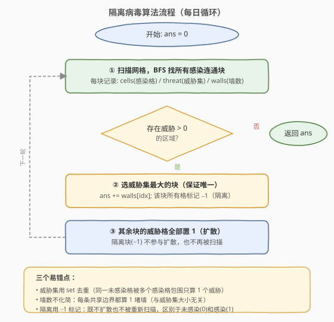

# 隔离病毒

- **题目名称**：隔离病毒
- **链接**：[749. 隔离病毒](https://leetcode.cn/problems/contain-virus/)
- **难度**：困难
- **标签**：深度优先搜索、广度优先搜索、矩阵、模拟

## 1. 题目概述

给定 `m×n` 网格 `isInfected`，`0` 表示未感染、`1` 表示已感染。每天晚上病毒从感染区域向相邻未感染区域扩散，除非被防火墙隔离。每天你只能**选择一个感染区域**安装防火墙将其完全隔离（该区域对未感染区域的威胁最大且保证唯一）。返回最终使用的防火墙总数。

**核心规则**：

- 防火墙建在感染格与未感染格的**每条共享边界**上（一条边界 = 一堵墙）。
- 被隔离的区域不再扩散、也不再被处理。
- 每天选「能感染最多**不同**未感染格」的区域隔离，其余区域照常扩散。

**示例 1**：

```text
输入：isInfected = [[0,1,0,0,0,0,0,1],[0,1,0,0,0,0,0,1],[0,0,0,0,0,0,0,1],[0,0,0,0,0,0,0,0]]
输出：10
解释：第 1 天隔离左侧区域（5 堵墙），右侧扩散；第 2 天隔离右侧区域（5 堵墙），病毒被完全控制。
```

**示例 2**：

```text
输入：isInfected = [[1,1,1],[1,0,1],[1,1,1]]
输出：4
解释：中心 (1,1) 被感染环包围，4 条共享边界 = 4 堵墙。
```

**示例 3**：

```text
输入：isInfected = [[1,1,1,0,0,0,0,0,0],[1,0,1,0,1,1,1,1,1],[1,1,1,0,0,0,0,0,0]]
输出：13
解释：先隔离右侧区域（11 堵墙），左侧扩散后再隔离（2 堵墙），共 13。
```

**约束条件**：

- `m == isInfected.length`
- `n == isInfected[i].length`
- `1 <= m, n <= 50`
- `isInfected[i][j]` 为 `0` 或 `1`
- 每轮总有一个区域的威胁**严格最大**（保证唯一）

---

## 2. 解题思路

### 2.1 暴力思路

尝试每天枚举所有可能的隔离区域组合，搜索所有决策序列取最优。但每天可选区域不定、天数不定，搜索空间是指数级的，且题目保证「威胁最大的区域唯一」——这实际上**消除了选择分支**，每天只有一种正确决策，根本不需要搜索。

### 2.2 核心观察：贪心模拟 + BFS 区域划分

题目保证每天「威胁最大的区域唯一」，意味着**每天的选择是确定的**——贪心隔离威胁最大的区域即可。问题转化为**模拟**每天的病毒扩散过程：


每天三步循环：

1. **找区域**：BFS/DFS 扫描网格，找出所有值为 `1` 的连通块。对每块记录三个量：
   - `region`：该块的所有感染格坐标
   - `threat`：该块能感染的**不同**未感染格集合（用 `set` 去重）
   - `walls`：隔离该块所需的防火墙数 = 感染格与未感染格的**每条共享边界**之和
2. **隔离**：选 `threat` 集合最大的块，`ans += walls[idx]`，将该块所有格标记为 `-1`（隔离，不再扩散、不再扫描）。
3. **扩散**：其余每块的 `threat` 集合中的格子全部置 `1`（被感染）。

> 💡 **两个关键量的区别**：`threat` 是**不同格子数**（用 `set` 去重），决定选哪块；`walls` 是**边界条数**（不去重，同一未感染格被多个感染格围绕则算多堵墙），决定答案累加。两者独立计算，切勿混淆。

> ⚠️ 题目说「防火墙只建立在两个**不同**区域的共享边界上」——这里「不同区域」指感染格（值 `1`）与未感染格（值 `0`）的分界。隔离后标记为 `-1` 的格既不是 `0` 也不是 `1`，不参与后续扩散和墙数计算。

### 2.3 算法流程图



流程要点：

- **终止条件**：没有区域存在威胁（所有 `threat` 集合为空）→ 剩余感染块无法扩散，模拟结束。
- **隔离标记 `-1`**：隔离块用 `-1` 标记，BFS 时只找值为 `1` 的格，`-1` 自动被跳过。
- **扩散顺序**：先隔离再扩散——隔离块不参与扩散，其余块的威胁格同时变为 `1`。

### 2.4 示例演算

以示例 1 为例，初始网格 `4×8`，两块感染区：


| 天 | 左块 | 右块 | 选择 | 墙数 | ans | 扩散后 |
|----|------|------|------|------|-----|--------|
| 1 | 威胁=5, 墙=5 | 威胁=4, 墙=4 | 左（5>4） | 5 | 5 | 右块扩散 4 格 |
| 2 | 已隔离 | 威胁=4, 墙=5 | 右（唯一） | 5 | 10 | 无其余块，结束 |

> 💡 第 2 天右块墙数=5 而非 4：因为 `(3,6)` 被两个感染格 `(2,6)` 和 `(3,7)` 同时包围，算 2 条边界。这正是「墙数 ≠ 威胁数」的典型场景。

---

## 3. 参考代码

### C++

```cpp
class Solution {
    int m, n;
    int dirs[4][2] = {{-1, 0}, {1, 0}, {0, -1}, {0, 1}};

  public:
    int containVirus(vector<vector<int>>& isInfected) {
        m = isInfected.size();
        n = isInfected[0].size();
        int ans = 0;

        while (true) {
            vector<vector<bool>> visited(m, vector<bool>(n, false));
            vector<vector<pair<int, int>>> regions;
            vector<unordered_set<int>> threats;
            vector<int> walls;

            for (int i = 0; i < m; i++) {
                for (int j = 0; j < n; j++) {
                    if (isInfected[i][j] == 1 && !visited[i][j]) {
                        vector<pair<int, int>> region;
                        unordered_set<int> threat;
                        int wall = 0;
                        queue<pair<int, int>> q;
                        q.push({i, j});
                        visited[i][j] = true;
                        while (!q.empty()) {
                            auto [r, c] = q.front();
                            q.pop();
                            region.push_back({r, c});
                            for (auto& d : dirs) {
                                int nr = r + d[0], nc = c + d[1];
                                if (nr < 0 || nr >= m || nc < 0 || nc >= n) continue;
                                if (isInfected[nr][nc] == 1) {
                                    if (!visited[nr][nc]) {
                                        visited[nr][nc] = true;
                                        q.push({nr, nc});
                                    }
                                } else if (isInfected[nr][nc] == 0) {
                                    threat.insert(nr * n + nc);
                                    wall++;
                                }
                            }
                        }
                        regions.push_back(region);
                        threats.push_back(threat);
                        walls.push_back(wall);
                    }
                }
            }

            if (regions.empty()) break;

            int idx = -1, maxThreat = 0;
            for (int k = 0; k < (int)regions.size(); k++) {
                if ((int)threats[k].size() > maxThreat) {
                    maxThreat = threats[k].size();
                    idx = k;
                }
            }
            if (idx == -1) break;

            ans += walls[idx];
            for (auto& [r, c] : regions[idx])
                isInfected[r][c] = -1;

            for (int k = 0; k < (int)regions.size(); k++) {
                if (k == idx) continue;
                for (int cell : threats[k]) {
                    int r = cell / n, c = cell % n;
                    isInfected[r][c] = 1;
                }
            }
        }
        return ans;
    }
};
```

### Python

```python
class Solution:
    def containVirus(self, isInfected: List[List[int]]) -> int:
        m, n = len(isInfected), len(isInfected[0])
        dirs = [(-1, 0), (1, 0), (0, -1), (0, 1)]
        ans = 0

        while True:
            visited = [[False] * n for _ in range(m)]
            regions = []
            threats = []
            walls = []

            for i in range(m):
                for j in range(n):
                    if isInfected[i][j] == 1 and not visited[i][j]:
                        region = []
                        threat = set()
                        wall = 0
                        q = collections.deque([(i, j)])
                        visited[i][j] = True
                        while q:
                            r, c = q.popleft()
                            region.append((r, c))
                            for dr, dc in dirs:
                                nr, nc = r + dr, c + dc
                                if 0 <= nr < m and 0 <= nc < n:
                                    if isInfected[nr][nc] == 1:
                                        if not visited[nr][nc]:
                                            visited[nr][nc] = True
                                            q.append((nr, nc))
                                    elif isInfected[nr][nc] == 0:
                                        threat.add((nr, nc))
                                        wall += 1
                        regions.append(region)
                        threats.append(threat)
                        walls.append(wall)

            if not regions:
                break

            idx = -1
            max_threat = 0
            for k, t in enumerate(threats):
                if len(t) > max_threat:
                    max_threat = len(t)
                    idx = k
            if idx == -1:
                break

            ans += walls[idx]
            for r, c in regions[idx]:
                isInfected[r][c] = -1

            for k, t in enumerate(threats):
                if k == idx:
                    continue
                for r, c in t:
                    isInfected[r][c] = 1

        return ans
```

> ⚠️ **三个易错点**：
> 1. **威胁集用 `set` 去重**：同一个未感染格被同一块的多个感染格包围时，`threat` 只算 1 个（决定选块），但 `walls` 算多条（决定答案）。
> 2. **隔离标记用 `-1`**：不能改为 `0`（会被当作未感染格再次感染）或 `2`（可能与其他题意冲突）。`-1` 明确表示「已隔离」，BFS 时只匹配 `==1` 自动跳过。
> 3. **先隔离再扩散**：必须先标记隔离块为 `-1`，再扩散其余块——否则隔离块的威胁格也会被错误感染。顺序不能反。

---

## 4. 复杂度分析

| 维度 | 复杂度 | 说明 |
|------|--------|------|
| 时间复杂度 | $O((mn)^2)$ | 每轮 BFS 扫描全网格 $O(mn)$，最坏 $\min(m,n)$ 轮（病毒每轮至少隔离一个块或扩散一格） |
| 空间复杂度 | $O(mn)$ | `visited` 矩阵 + 区域/威胁集/墙数列表 |

> 💡 $m, n \le 50$，$mn = 2500$，最坏约 $50$ 轮，总计 $\approx 1.25 \times 10^5$ 次操作，远在时限内。实际运行远快于最坏界——每轮隔离最大块后，其余块扩散有限，轮数通常很少。

---

## 5. 扩展：DFS 实现 与 并查集思路

**DFS 实现**：BFS 换成 DFS 递归同样可行，逻辑完全一致。网格最大 $50 \times 50$，递归深度最多 $2500$，需注意栈溢出风险（Python 默认递归上限 $1000$，需 `sys.setrecursionlimit` 调高）。

```python
def _dfs(self, grid, r, c, visited, region, threat, wall, m, n, dirs):
    visited[r][c] = True
    region.append((r, c))
    for dr, dc in dirs:
        nr, nc = r + dr, c + dc
        if 0 <= nr < m and 0 <= nc < n:
            if grid[nr][nc] == 1 and not visited[nr][nc]:
                self._dfs(grid, nr, nc, visited, region, threat, wall, m, n, dirs)
            elif grid[nr][nc] == 0:
                threat.add((nr, nc))
                wall[0] += 1    # 用 list[0] 模拟引用传递
```

> ⚠️ Python 中 `int` 不可变，`wall` 需用 `list[0]` 或作为返回值累计。C++ 直接传引用即可。

**并查集思路**：也可以用并查集维护感染连通块，每轮合并后计算每块的威胁集和墙数。但并查集不天然提供「块的成员列表」，仍需遍历所有格按根分组，不如 BFS 直接收集成员高效。并查集的优势在动态连通性判断，本题每轮重新 BFS 足够简单。

---

## 6. 面试要点

1. **这道题的本质是什么？**

   是一道**贪心模拟**题。题目保证每天「威胁最大的区域唯一」，消除了选择分支——每天只有一种正确决策。核心工作是准确模拟「找区域 → 隔离最大威胁 → 其余扩散」的循环。

2. **威胁集和墙数为什么是两个不同的量？**

   威胁集 `threat` 是该块能感染的**不同未感染格**数量（`set` 去重），用于**选择**隔离哪块；墙数 `walls` 是感染格与未感染格的**每条共享边界**之和（不去重），用于**累加答案**。一个未感染格被同一块的 2 个感染格围绕时，威胁算 1、墙算 2。

3. **为什么隔离标记用 `-1` 而不是 `0` 或 `2`？**

   用 `0` 会被当作未感染格，下一轮可能被其他块感染，导致隔离失效。用 `-1` 明确表示「已隔离」，BFS 只匹配 `==1` 自动跳过，且不会与 `0`（未感染）混淆。这是最清晰的标记。

4. **先隔离还是先扩散？**

   **先隔离再扩散**。先标记隔离块为 `-1`，这样它不会参与本轮扩散（其威胁格不会被感染）。如果先扩散再隔离，隔离块的威胁格也会被错误感染，违反题意。

5. **循环什么时候终止？**

   两种情况：① 没有值为 `1` 的格了（所有感染块都已隔离，`regions` 为空）；② 所有块的 `threat` 集合都为空（剩余感染块周围已无未感染格可扩散，`idx == -1`）。两种都意味着病毒无法继续传播。

---

## 7. 同类练习题

- [200. 岛屿数量](https://leetcode.cn/problems/number-of-islands/)（[题解](../0201-0300/200_岛屿数量.md)）：BFS/DFS 找连通块的基础模板，本题每轮都用到
- [994. 腐烂的橘子](https://leetcode.cn/problems/rotting-oranges/)（[题解](../0901-1000/994_腐烂的橘子.md)）：多源 BFS 逐层扩散，与本题病毒扩散机制类似
- [547. 省份数量](https://leetcode.cn/problems/number-of-provinces/)（[题解](../0501-0600/547_省份数量.md)）：并查集找连通块，可替代 BFS 做区域划分
- [130. 被围绕的区域](https://leetcode.cn/problems/surrounded-regions/)：BFS/DFS 从边界扩散标记，与本题的「区域隔离」思想互补
- [1036. 逃离大迷宫](https://leetcode.cn/problems/escape-a-large-maze/)：网格 BFS + 边界约束，考察受限网格中的搜索策略
