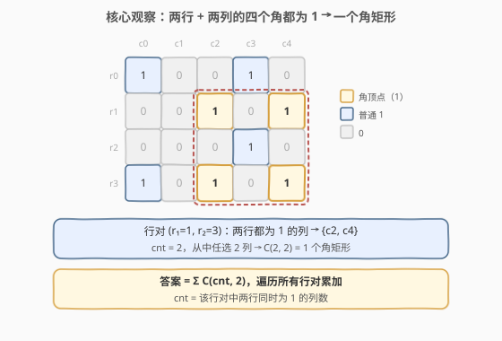
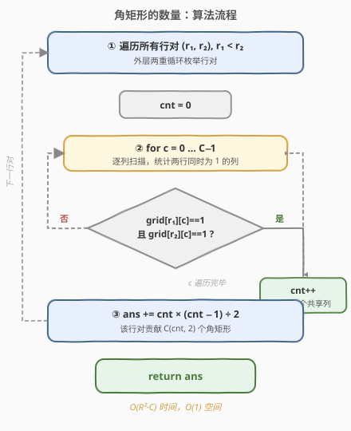
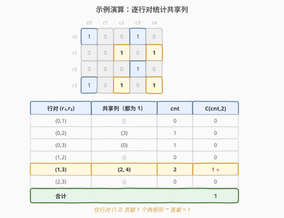

# 角矩形的数量

- **题目名称**：角矩形的数量
- **链接**：[750. 角矩形的数量](https://leetcode.cn/problems/number-of-corner-rectangles/)
- **难度**：中等
- **标签**：数组、数学、枚举

## 1. 题目概述

给定一个只包含 `0` 和 `1` 的 $m \times n$ 矩阵 `grid`，统计其中**角矩形**（corner rectangle）的个数。

一个角矩形是指矩阵上**四个不同位置**的 `1`，它们恰好构成一个**轴对齐矩形**的四个角。注意只需要四个角为 `1`，矩形内部的值是什么无所谓；且四个 `1` 必须互不相同（即分属四个不同的格子）。

**示例 1**：

```text
输入：grid =
[[1, 0, 0, 1, 0],
 [0, 0, 1, 0, 1],
 [0, 0, 0, 1, 0],
 [1, 0, 1, 0, 1]]
输出：1
解释：唯一一个角矩形由 (r1,c2)、(r1,c4)、(r3,c2)、(r3,c4) 四个 1 构成。
```

**示例 2**：

```text
输入：grid = [[1, 1, 1, 1]]
输出：0
解释：只有一行，无法构成矩形（需要两行两列）。
```

**约束条件**：

- $1 \le R, C \le 200$（$R$ 为行数，$C$ 为列数）
- `grid[i][j]` 为 `0` 或 `1`
- 矩阵中 `1` 的总数不超过 $6000$

> 💡 约束里「`1` 的总数 $\le 6000$」是一个关键提示——矩阵可达 $200 \times 200 = 40000$ 格，但实际 `1` 很稀疏，这为第 5 节的稀疏优化留了空间。

---

## 2. 解题思路

### 2.1 暴力思路

枚举所有「两行 + 两列」的组合，检查四个角 `(r1,c1)`、`(r1,c2)`、`(r2,c1)`、`(r2,c2)` 是否全为 `1`。组合数为 $O(R^2 \cdot C^2)$，当 $R = C = 200$ 时高达 $1.6 \times 10^9$，必然超时。

### 2.2 核心观察：行对 + 共享列计数



关键洞察是**固定行对、数列**：

- 一个角矩形由**两行**和**两列**唯一确定，只要这四个交角都是 `1`。
- 如果固定某一行对 $(r_1, r_2)$，那么能充当「角」的列，就是**两行在该列都为 `1`** 的列。
- 设这样的列共有 `cnt` 个，则从中**任选 2 列**就得到一个合法角矩形，贡献 $C(\text{cnt}, 2) = \dfrac{\text{cnt} \times (\text{cnt} - 1)}{2}$ 个。

> 💡 **为什么这样不重不漏？** 每个角矩形有唯一的一对行 $(r_1, r_2)$ 和唯一的一对列 $(c_1, c_2)$。按行对分组计数，不同行对的矩形互不相交（行对不同）；同一行对内按列对组合，列对也互不相同。所以每个矩形恰好被统计一次。

### 2.3 算法流程图



整体两重循环枚举行对，内层一重循环扫描列统计共享 `1` 的列数，最后累加组合数。三重循环但内层只是线性扫描，总复杂度 $O(R^2 \cdot C)$。

### 2.4 示例演算

以示例 1 为例，逐行对统计共享列：



各行对的共享列与贡献：

| 行对 | 共享列（两行都为 1） | cnt | $C(\text{cnt},2)$ |
|------|----------------------|-----|---------------------|
| (0,1) | {} | 0 | 0 |
| (0,2) | {3} | 1 | 0 |
| (0,3) | {0} | 1 | 0 |
| (1,2) | {} | 0 | 0 |
| (1,3) | {2, 4} | 2 | 1 |
| (2,3) | {} | 0 | 0 |
| **合计** | | | **1** |

只有行对 $(1,3)$ 在列 $c_2$、$c_4$ 上同时为 `1`，构成 $1$ 个角矩形，最终答案为 $1$。

---

## 3. 参考代码

### C++

```cpp
class Solution {
  public:
    int countCornerRectangles(vector<vector<int>>& grid) {
        int R = grid.size(), C = grid[0].size();
        int ans = 0;
        for (int r1 = 0; r1 < R; r1++) {
            for (int r2 = r1 + 1; r2 < R; r2++) {
                int cnt = 0;
                for (int c = 0; c < C; c++) {
                    if (grid[r1][c] == 1 && grid[r2][c] == 1) cnt++;
                }
                ans += cnt * (cnt - 1) / 2;
            }
        }
        return ans;
    }
};
```

### Python

```python
class Solution:
    def countCornerRectangles(self, grid: List[List[int]]) -> int:
        R, C = len(grid), len(grid[0])
        ans = 0
        for r1 in range(R):
            for r2 in range(r1 + 1, R):
                cnt = sum(1 for c in range(C) if grid[r1][c] and grid[r2][c])
                ans += cnt * (cnt - 1) // 2
        return ans
```

> ⚠️ **两个易错点**：
> 1. **`r2` 从 `r1 + 1` 开始**，避免重复枚举行对（$(r_1, r_2)$ 与 $(r_2, r_1)$ 是同一个行对）。
> 2. **`cnt < 2` 时组合数为 0**，`cnt * (cnt - 1) / 2` 自动处理（`cnt=0` 或 `1` 时结果为 0），无需特判。

---

## 4. 复杂度分析

| 维度 | 复杂度 | 说明 |
|------|--------|------|
| 时间复杂度 | $O(R^2 \cdot C)$ | 行对数 $O(R^2)$，每对线性扫描 $C$ 列 |
| 空间复杂度 | $O(1)$ | 仅用 `cnt / ans` 等常数个变量 |

> ⚠️ 当 $R > C$ 时，可以转置思路——改为枚举**列对**、扫描行，复杂度变为 $O(C^2 \cdot R)$，取两者较小值即 $O(\min(R, C)^2 \cdot \max(R, C))$。对于 $200 \times 200$ 的方阵，$R^2 \cdot C = 8 \times 10^6$，完全可接受。

---

## 5. 扩展：利用稀疏性的哈希优化

题目约束「`1` 的总数 $\le 6000$」意味着矩阵很稀疏。逐列扫描会浪费大量时间在 `0` 上。更优的做法是**按列对计数**：

- 遍历每一行，取出该行所有 `1` 所在的列号列表 `ones`。
- 对 `ones` 中的每一对列 $(c_1, c_2)$（$c_1 < c_2$），用哈希表记录该列对**之前**在多少行中同时为 `1`。
- 每遇到一次，该列对就与之前每一行各构成一个角矩形，累加 `count[(c1,c2)]`，然后计数 `+1`。

```python
from collections import defaultdict

class Solution:
    def countCornerRectangles(self, grid: List[List[int]]) -> int:
        ans = 0
        seen = defaultdict(int)          # (c1, c2) -> 之前同时为 1 的行数
        for row in grid:
            ones = [c for c, v in enumerate(row) if v]
            for i in range(len(ones)):
                for j in range(i + 1, len(ones)):
                    c1, c2 = ones[i], ones[j]
                    ans += seen[(c1, c2)]     # 与之前每一行各成 1 个矩形
                    seen[(c1, c2)] += 1
        return ans
```

该方案时间复杂度为 $O\!\left(R \cdot K^2\right)$，其中 $K$ 为单行最多 `1` 的个数。由于 `1` 总数 $\le 6000$，$K$ 实际很小，整体远优于 $O(R^2 \cdot C)$。

> 💡 两种方法本质都是「**固定一个维度、在另一个维度上做组合计数**」——主解法固定行对数列，哈希法固定列对数行。选择哪个取决于哪个维度更稀疏。

---

## 6. 面试要点

1. **为什么按行对枚举而不是逐个矩形枚举？**

   - 逐个矩形枚举是 $O(R^2 C^2)$，而按行对枚举把「选两列」这一步从暴力枚举变成了**组合计数** $C(\text{cnt}, 2)$，省掉了 $C$ 的一重枚举，降到 $O(R^2 C)$。核心是发现「同一行对的合法列可以批量统计」。

2. **$C(\text{cnt}, 2)$ 的组合数公式是怎么来的？**

   - 固定行对 $(r_1, r_2)$ 后，两行在该列都为 `1` 的列共有 `cnt` 个。从中任选 2 列 $(c_1, c_2)$，四个角 $(r_1,c_1)$、$(r_1,c_2)$、$(r_2,c_1)$、$(r_2,c_2)$ 全为 `1`，构成一个角矩形。选 2 列的方案数即 $C(\text{cnt}, 2)$。

3. **如何保证不重复不遗漏？**

   - 每个角矩形有唯一的行对和列对。按行对分组、组内按列对组合计数，不同行对的集合不相交，同一行对内列对也不重复，所以每个矩形恰好被计数一次。

4. **如果 $R \gg C$ 或 $C \gg R$ 怎么优化？**

   - 转置枚举方向：$R > C$ 时改为枚举列对、扫描行，复杂度 $O(C^2 R)$。一般取 $O(\min(R,C)^2 \cdot \max(R,C))$。进一步可利用 `1` 的稀疏性，用哈希表按列对计数（见第 5 节）。

5. **本题和「统计全为 1 的子矩阵」（1504）有什么区别？**

   - 本题只要求**四个角**为 `1`，内部随意；1504 要求整个子矩阵**全部**为 `1`。1504 同样用行对 + 列连续段计数的思路，但统计的是连续 `1` 段的贡献，组合公式不同（连续段长 $L$ 贡献 $L(L+1)/2$）。

---

## 7. 同类练习题

- [1504. 统计全为 1 的子矩形数目](https://leetcode.cn/problems/count-submatrices-with-all-ones/)：同为行对 + 列段计数，区别是要求子矩阵全为 1
- [1277. 统计全为 1 的正方形子矩阵](https://leetcode.cn/problems/count-square-submatrices-with-all-ones/)：网格计数 DP，统计全 1 正方形
- [221. 最大正方形](https://leetcode.cn/problems/maximal-square/)（[题解](../0201-0300/221_最大正方形.md)）：网格 DP 经典，与本题同为矩阵上的组合计数
- [1727. 重新排列后的最大子矩阵](https://leetcode.cn/problems/largest-submatrix-with-rearrangements/)：行重排后求最大全 1 子矩阵，同样基于列段统计
- [85. 最大矩形](https://leetcode.cn/problems/maximal-rectangle/)：柱状图最大矩形的二维推广，单调栈 + 网格
