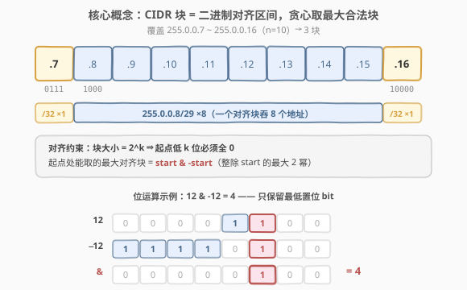
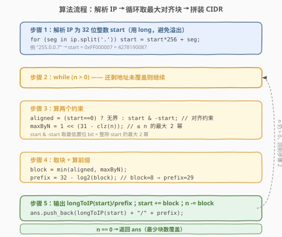
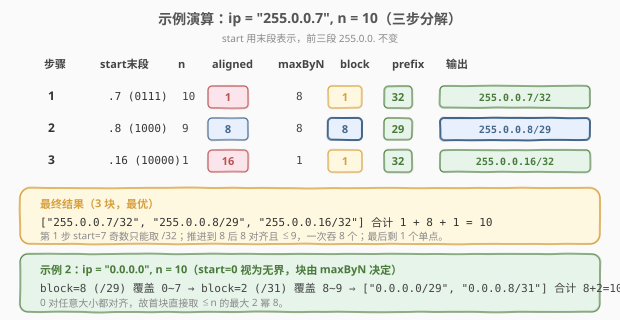

# LeetCode IP 到 CIDR 题解

## 1. 题目概述

- **标题 / 题号**：IP 到 CIDR（#751，medium）
- **链接**：https://leetcode.cn/problems/ip-to-cidr/
- **难度**：中等
- **标签**：位运算、字符串、贪心

**题意**：给定一个起始 IPv4 地址 `ip` 和一个整数 `n`，要求用**最少数量的 CIDR 块**覆盖从 `ip` 到 `ip + n - 1`（含）的连续地址区间。

**CIDR 块**记作 `a.b.c.d/x`：

- `a.b.c.d` 是块内的一个 IPv4 地址（作为代表地址）；
- `/x` 是**前缀长度**（$0 \le x \le 32$），表示前 $x$ 位固定、后 $32-x$ 位自由，因此该块覆盖 $2^{32-x}$ 个地址。

直观地：`/32` 覆盖单个地址，`/24` 覆盖 256 个地址，`/0` 覆盖整个 IPv4 空间（$2^{32}$）。一个合法的 CIDR 块还要求**代表地址在块大小上对齐**——即块大小为 $2^k$ 时，地址的低 $k$ 位必须为 0（块从 $2^k$ 的整数倍处开始）。

**示例 1**：

```text
输入：ip = "255.0.0.7", n = 10
输出：["255.0.0.7/32","255.0.0.8/29","255.0.0.16/32"]
解释：需覆盖 255.0.0.7 ~ 255.0.0.16 共 10 个地址：
      255.0.0.7/32  → 仅 255.0.0.7         （1 个）
      255.0.0.8/29  → 255.0.0.8 ~ .15      （8 个，2^3，8 对齐）
      255.0.0.16/32 → 仅 255.0.0.16         （1 个）
      合计 1 + 8 + 1 = 10，3 块即最小覆盖。
```

**示例 2**：

```text
输入：ip = "0.0.0.0", n = 10
输出：["0.0.0.0/29","0.0.0.8/31"]
解释：需覆盖 0.0.0.0 ~ 0.0.0.9 共 10 个地址：
      0.0.0.0/29  → 0.0.0.0 ~ 0.0.0.7      （8 个，0 对任意大小对齐）
      0.0.0.8/31  → 0.0.0.8 ~ 0.0.0.9       （2 个，2^1，8 对 2 对齐）
      合计 8 + 2 = 10，2 块即最小覆盖。
```

**约束**：

- `ip` 为合法 IPv4 地址（四段，每段 $0$–$255$）。
- $n$ 为正整数（以 32 位 `int` 给出），且保证 $\text{ip} + n - 1 \le 2^{32}-1$（不越过 IPv4 上界）。

## 2. 解题思路

### 2.1 暴力思路

最朴素的覆盖：对区间里每个地址各发一个 `/32` 块，共 $n$ 块。这一定合法（每个 `/32` 自成对齐的单点块），但块数等于地址数——当 $n$ 很大时（可达 $2^{31}$ 量级）完全不可接受。问题要求**最少**块数，故必须尽量用大块。

### 2.2 核心观察：贪心取「最大对齐块」



把每个 CIDR 块看成一个**二进制对齐区间**（dyadic interval）：大小为 $2^k$ 的块必须从「低 $k$ 位全 0」的地址起始，覆盖 $[s,\ s+2^k-1]$。于是问题等价于：**用最少的二进制对齐区间拼出 $[start,\ start+n-1]$**。

这是一道经典的「区间二进制分解」问题，贪心即可最优：

> 💡 **贪心策略**：在当前起点 `start`，取**能取的最大合法块**——既要在 `start` 处对齐，又不能超出剩余 $n$。取走后 `start` 前移、$n$ 减少，重复至 $n=0$。

两个约束决定块大小：

1. **对齐约束**（能取多大对齐块）：`start` 的**最低置位 bit** 决定。设 $\text{aligned} = \text{start} \ \& \ (-\text{start})$（即 `start & -start`），它等于整除 `start` 的最大 $2$ 的幂——这正是 `start` 处能取的最大对齐块大小。若 $\text{start}=0$，则任意大小都对齐（视为无界）。
2. **数量约束**（不能超过剩余 $n$）：取 $\le n$ 的最大 $2$ 的幂，记 $\text{maxByN} = 2^{\lfloor \log_2 n \rfloor}$。

最终块大小 $\text{block} = \min(\text{aligned},\ \text{maxByN})$，对应前缀长度 $x = 32 - \log_2(\text{block})$。

> ⚠️ **为何贪心最优？** 每一步取最大合法块，等价于在 `start` 处选择「能覆盖的最大二进制对齐区间」。由于对齐区间的二进制结构，任何覆盖该区间的方案在 `start` 处能用的最大块都不会超过这个值（更大的块要么不对齐、要么越界）；取最大者后剩余子问题是同样的结构，由归纳即得最优。这与「用最少的 2 的幂拼出一个数」的贪心同源。

**关键位运算技巧**：

| 运算 | 含义 | 例子 |
|------|------|------|
| `start & -start` | `start` 的最低置位 bit 的值（最大整除 $2$ 幂） | $12\ \&\ {-12} = 4$（$12=1100_2$） |
| $1 \ll (31 - \text{clz}(n))$ | $\le n$ 的最大 $2$ 的幂 | $n=10 \Rightarrow 8$ |
| $32 - \log_2(\text{block})$ | 前缀长度 $x$ | $\text{block}=8 \Rightarrow x=29$ |

### 2.3 算法流程图



四步：

1. **解析 IP**：按 `.` 切分四段，逐段 $x = x \times 256 + \text{seg}$ 合成 32 位整数 `start`。
2. **循环**：当 $n > 0$ 时重复 3–5。
3. **算两约束**：`aligned = (start==0) ? 无界 : start & -start`；`maxByN = ≤ n 的最大 2 幂`。
4. **取块**：`block = min(aligned, maxByN)`；`prefix = 32 - log2(block)`；输出 `longToIP(start)/prefix`。
5. **推进**：`start += block`；`n -= block`。

> 💡 **整数用 `long`/Python 任意精度**：`start` 可达 $2^{32}-1$，C++ 中 `int` 会溢出，必须用 `long`（64 位）。Python 天然大整数，无此虑。

### 2.4 示例演算



以示例 1 逐步推演（`start` 用末段表示，前三段 `255.0.0.` 不变）：

| 步骤 | start（末段） | n | aligned | maxByN | block | prefix | 输出 |
|------|---------------|----|---------|--------|-------|--------|------|
| 1 | .7（$0111_2$） | 10 | 1（最低 bit） | 8 | 1 | 32 | 255.0.0.7/32 |
| 2 | .8（$1000_2$） | 9 | 8 | 8 | 8 | 29 | 255.0.0.8/29 |
| 3 | .16（$10000_2$） | 1 | 16 | 1 | 1 | 32 | 255.0.0.16/32 |

第 1 步 `start=7` 为奇数，最低 bit 为 1，只能取单点块 `/32`；推进到 `8` 后正好 $8$ 对齐且 $\le 9$，一次吞掉 8 个地址；最后剩 1 个单点。三块覆盖 10 个地址，最优。

## 3. 参考代码

### C++

```cpp
class Solution {
  public:
    vector<string> ipToCIDR(string ip, int n) {
        long start = ipToLong(ip);
        vector<string> ans;
        while (n > 0) {
            long aligned = (start == 0) ? (1L << 32) : (start & -start);
            long maxByN  = 1L << (31 - __builtin_clz((unsigned)n));
            long block   = min(aligned, maxByN);
            int  prefix  = 32 - __builtin_ctzl(block);
            ans.push_back(longToIP(start) + "/" + to_string(prefix));
            start += block;
            n     -= (int)block;
        }
        return ans;
    }

  private:
    long ipToLong(const string& ip) {
        long x = 0;
        istringstream iss(ip);
        string tok;
        while (getline(iss, tok, '.')) x = x * 256 + stol(tok);
        return x;
    }
    string longToIP(long x) {
        return to_string((x >> 24) & 255) + "." + to_string((x >> 16) & 255) + "."
             + to_string((x >> 8) & 255) + "." + to_string(x & 255);
    }
};
```

### Python

```python
class Solution:
    def ipToCIDR(self, ip: str, n: int) -> list[str]:
        def ip_to_long(s: str) -> int:
            x = 0
            for part in s.split('.'):
                x = x * 256 + int(part)
            return x

        def long_to_ip(x: int) -> str:
            return '.'.join(str((x >> sh) & 255) for sh in (24, 16, 8, 0))

        start = ip_to_long(ip)
        ans = []
        while n > 0:
            aligned = (1 << 32) if start == 0 else (start & -start)
            max_by_n = 1 << (n.bit_length() - 1)      # ≤ n 的最大 2 幂
            block = min(aligned, max_by_n)
            prefix = 32 - (block.bit_length() - 1)    # 32 - log2(block)
            ans.append(f"{long_to_ip(start)}/{prefix}")
            start += block
            n -= block
        return ans
```

> 💡 **`start & -start` 的来由**：补码下 $-x = \sim x + 1$，与 $x$ 相与后恰好保留最低的那个 1、其余位全清零——即「整除 $x$ 的最大 $2$ 幂」。这是本题最关键的一行，把「最大对齐块」压缩成一次位与。Python 的 `int.bit_length()` 则把「$\le n$ 的最大 $2$ 幂」与「$\log_2$」一并消化，无需任何库函数。

## 4. 复杂度分析

| 维度 | 复杂度 | 说明 |
|------|--------|------|
| 时间复杂度 | $O(\log n)$ | 每轮取一个块且块大小为 $2$ 幂；块数上界 $\le 2\cdot 32$（区间二进制分解定理），每轮 $O(1)$ 位运算 + $O(1)$ 字符串拼装（IPv4 固定 4 段） |
| 空间复杂度 | $O(\log n)$ | 仅存输出块列表，块数同上界；不计输出则为 $O(1)$ |

> 💡 实测块数极少：即便覆盖近半个 IPv4 空间（$n \approx 2^{31}$），块数也不超过约 $33$。

## 5. 扩展：为何「最大对齐块」贪心等价于最优分解

把区间 $[start,\ start+n-1]$ 投影到二进制，等价于用**最少的 $2$ 幂对齐区间**拼接。这有一个经典结论：

> **定理**：任意整数区间 $[a, b]$ 可被至多 $2\lceil\log_2 U\rceil$ 个二进制对齐区间覆盖（$U$ 为值域上界），且贪心「每次在起点取最大合法对齐块」给出**最优**（块数最少）的分解。

直觉证明（归纳）：在起点 $a$，任何合法方案能用的最大块都不超过贪心所选的 $\min(\text{aligned},\ \text{maxByN})$——更大的块要么在 $a$ 处不对齐（违反对齐约束），要么越过 $a+n-1$（违反数量约束）。故贪心选取的是「起点处任何方案都无法超越的上界」，取它之后剩余子问题 $[a+\text{block},\ a+n-1]$ 规模严格缩小，归纳成立。这与「用最少硬币拼金额」中「最大面额优先」在 $2$ 幂面额下最优是同一回事。

更形式化地，该分解对应将 $a$ 与 $b=a+n-1$ 两端点的二进制表示沿「最近公共祖先」向上合并，块数等于两端点在二进制 Trie 上的路径并集大小，故 $O(\log U)$。

## 6. 面试要点

1. **为什么 `start & -start` 能给出最大对齐块？**

   - 补码下 $-x = \sim x + 1$。`x & -x` 只保留 $x$ 最低位的 $1$、其余位清零，得到整除 $x$ 的最大 $2$ 幂。对齐块大小正是「整除起点的最大 $2$ 幂」——再大就破坏低 $k$ 位全 $0$ 的对齐前提。

2. **为什么还要和「$\le n$ 的最大 $2$ 幂」取 min？**

   - 对齐只回答「块最大能多大才不破对齐」，不回答「块多大才不越过 $start+n-1$」。即便起点对齐到 $2^{10}$，若剩余只有 $5$ 个地址，块也得缩到 $\le 5$ 的最大 $2$ 幂即 $4$。两个约束取严格较小者。

3. **`start == 0` 为什么要特判？**

   - $0$ 没有置位 bit，`0 & -0 = 0` 会得出「块大小 0」导致死循环。但 $0$ 对任意大小都对齐（低 $k$ 位全 $0$ 恒成立），故视为「无界」，直接让块大小由数量约束 $\text{maxByN}$ 决定。

4. **C++ 为什么用 `long` 而非 `int`？**

   - IPv4 地址可达 $2^{32}-1 > 2^{31}-1$（`int` 上界），`start` 与 `start & -start` 都会溢出。用 `long`（64 位）安全；Python 大整数天然无忧。`n` 虽是 `int`，但 `n -= block` 时 `block` 为 `long`，C++ 中显式转回 `int` 即可（此时 `block ≤ n` 必在 `int` 范围）。

5. **块数为什么是 $O(\log n)$ 而非 $O(n)$？**

   - 每个块大小是 $2$ 幂；从起点出发，块大小序列在「对齐允许」下指数增长，至多经过 $\log_2 n$ 次翻倍即覆盖 $n$。最坏情形（两端都不对齐）也只需两端各一串 $2$ 幂，由区间二进制分解定理上界 $2\log_2 U \le 64$。

## 同类练习题

| # | 题目 | 与本题的关联 |
|---|------|-------------|
| 468 | [验证 IP 地址](https://leetcode.cn/problems/validate-ip-address/) | IPv4/IPv6 规则校验——本题「按段解析/格式化 IPv4」的前置基本功，互为 IP 字符串处理的两面 |
| 93 | [复原 IP 地址](https://leetcode.cn/problems/restore-ip-addresses/) | 从字符串回溯切分合法 IPv4——与本题「整数 → IPv4 字符串」方向相反的 IP 分段练习 |
| 191 | [位 1 的个数](https://leetcode.cn/problems/number-of-1-bits/) | `n & (n-1)` 消最低位 1——与本题 `start & -start` 取最低位 1 互为姊妹技巧，同属「低位 bit 操作」家族 |
| 393 | [UTF-8 编码验证](https://leetcode.cn/problems/utf-8-validation/) | 字节级位运算判前缀——bit manipulation 在编码/对齐场景的另一种应用 |
| 476 | [数字的补数](https://leetcode.cn/problems/number-complement/) | 按位取反与掩码——补码/位掩码基本功，强化对 `& -x` 类位技巧的直觉 |
