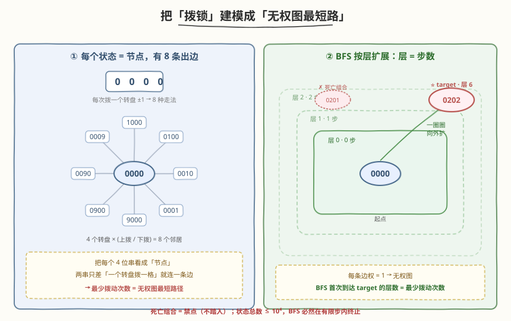
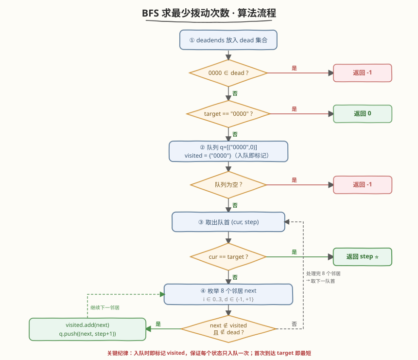
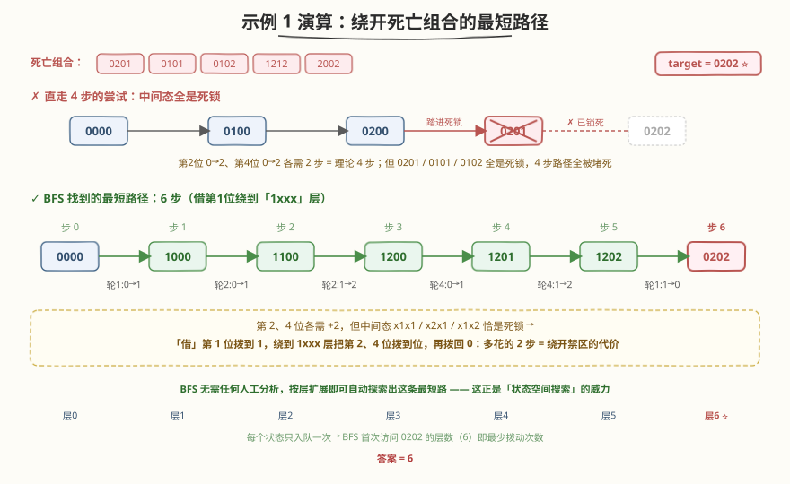

# LeetCode 打开转盘锁 题解

## 1. 题目概述

- **标题 / 题号**：打开转盘锁（#752，medium）
- **链接**：https://leetcode.cn/problems/open-the-lock/
- **难度**：中等
- **标签**：广度优先搜索、最短路径、状态空间搜索

**题意**：你有一个带 4 个圆形拨轮的转盘锁，每个拨轮有 `0`~`9` 共 10 个数字。每个拨轮可以自由旋转：每次把一个拨轮拨动一格（向上 `+1` 或向下 `-1`，`9` 和 `0` 相邻成环）。锁的初始状态是 `"0000"`，给定字符串列表 `deadends`（死亡组合）和目标 `target`，一旦拨到死亡组合锁就永久锁定、再也无法操作。

返回从 `"0000"` 拨到 `target` 的**最少拨动次数**；若无法到达则返回 `-1`。

**示例 1**：

```text
输入：deadends = ["0201","0101","0102","1212","2002"], target = "0202"
输出：6
解释：一条最短路径为
"0000" -> "1000" -> "1100" -> "1200" -> "1201" -> "1202" -> "0202"
注意 "0201" 是死亡组合，不能经过。
```

**示例 2**：

```text
输入：deadends = ["8888"], target = "0009"
输出：1
解释："0000" -> "0009"，只需把最后一位拨一次。
```

**示例 3**：

```text
输入：deadends = ["8887","8889","8878","8898","8788","8988","7888","9888"], target = "8888"
输出：-1
解释：无法拨到 "8888"，因为它周围所有可达状态都是死亡组合。
```

**约束**：

- `1 <= deadends.length <= 500`
- `deadends[i].length == 4`，`target.length == 4`
- `target` 不在 `deadends` 之中
- `target` 和 `deadends[i]` 仅由若干位数字组成

> ⚠️ 注意三点：① 每次只能拨**一个**拨轮**一格**，`9` 与 `0` 成环（`9→0`、`0→9` 各算一次）；② 死亡组合**不能作为起点也不能经过**，初始 `"0000"` 若本身就是死亡组合直接返回 `-1`；③ 求的是**最少**拨动次数，对应无权图上的**最短路径**。

## 2. 解题思路

### 2.1 暴力思路：DFS 全枚举

从 `"0000"` 出发递归尝试每一种拨法，记录到达 `target` 的步数取最小值。问题在于：状态会反复来回（`0000→1000→0000→...`），不加记忆化则指数爆炸；加记忆化又会因为「带环 + 求最短」而退化为求最短路——这恰好引出了下面的关键观察。

### 2.2 核心观察：把「拨锁」建模成「无权图最短路」



关键一步是**换一个视角看状态**：把每一个 4 位数字串看成一个**节点**，两个节点之间连一条边当且仅当它们只差「一个拨轮拨一格」。于是：

- 每个节点恰好有 $4 \times 2 = 8$ 条出边（4 个拨轮，每个可 `+1` 或 `-1`）。
- 「最少拨动次数」= 从 `"0000"` 到 `target` 的**边数最少**的路径 = 无权图上的**最短路径**。
- 死亡组合就是图上**不能踏入的禁点**。

> 💡 **无权图最短路径 = BFS**。BFS 按「层数」一圈圈扩展：起点在层 0，它的 8 个邻居在层 1，邻居的邻居在层 2……**第一次**访问到 `target` 的层数就是最少拨动次数。这是 BFS 最本质的性质——「先扩展的必然步数更少」。每个状态只入队一次（`visited` 去重），总共至多 $10^4$ 个状态，复杂度可控。

> ⚠️ **为什么不能用 DFS 或 Dijkstra？** DFS 找到的不一定是最短，且带环难剪枝；Dijkstra 处理**带权**图，而本题每条边权都是 1（无权），用 BFS 即可 $O(V+E)$ 解决，更轻量。

### 2.3 算法流程图



**三步法**：

1. **建禁点表 + 特判**：把 `deadends` 放入哈希集合 `dead`。若 `"0000"` 在 `dead` 中，直接返回 `-1`；若 `target == "0000"`，返回 `0`。
2. **BFS 主循环**：队列存放 `(当前状态, 步数)`，`visited` 集合记录已入队状态。每轮取出队首 `(cur, step)`：
   - 若 `cur == target`，返回 `step`（BFS 首次到达即最短）。
   - 否则枚举 `cur` 的 8 个邻居 `next`：若 `next` 既不在 `visited` 也不在 `dead`，则标记 `visited` 并入队 `(next, step+1)`。
3. **队空未命中**：返回 `-1`。

> 💡 **两个易错点**：（1）`"0000"` 本身可能是死亡组合，必须**先判后入队**，否则会错误地踏进禁点；（2）**入队时即标记 `visited`**，而不是出队时再标记——否则同一状态会被重复入队多次，队列膨胀到 $O(8^{10^4})$ 级别直接 TLE。这是所有 BFS 题的通用纪律。

### 2.4 示例演算

以示例 1 `deadends = ["0201","0101","0102","1212","2002"]`，`target = "0202"` 为例：



从 `target = "0202"` 反向看，它和 `"0000"` 在第 1、4 位上各差 2（`0→2`），理论上至少要 4 步。但所有 4 步路径都必须经过 `"0101"`、`"0201"`、`"0102"` 这三个死亡组合之一，被全部堵死；5 步路径同理被堵。BFS 最终在**第 6 层**首次访问到 `"0202"`：

| 层 | 到达的代表性状态 | 说明 |
|----|------------------|------|
| 0 | `0000` | 起点 |
| 1 | `1000` | 把第 1 位拨到 1（绕开第 2 位的禁区） |
| 2 | `1100` | 第 2 位 0→1 |
| 3 | `1200` | 第 2 位 1→2 |
| 4 | `1201` | 第 4 位 0→1 |
| 5 | `1202` | 第 4 位 1→2 |
| **6** | **`0202`** ⭐ | 第 1 位 1→0，命中目标 |

> 💡 直觉上：第 2、4 位各需要 +2，但中间态 `x1x1`、`x2x1`、`x1x2` 正好都是死亡组合。于是「借」第 1 位拨到 1、绕到 `1xxx` 这一层把第 2、4 位拨到位，再把第 1 位拨回 0——多花的 2 步正是**绕开禁区的代价**。BFS 不需要任何这种人工分析，它会自动探索出这条最短路径，这正是「状态空间搜索」的威力。

## 3. 参考代码

### C++

```cpp
class Solution {
  public:
    int openLock(vector<string>& deadends, string target) {
        unordered_set<string> dead(deadends.begin(), deadends.end());
        if (dead.count("0000")) return -1;      // 起点即死锁
        if (target == "0000") return 0;         // 起点即目标

        unordered_set<string> visited;
        queue<pair<string, int>> q;
        q.push({"0000", 0});
        visited.insert("0000");                 // 入队即标记

        while (!q.empty()) {
            auto [cur, step] = q.front(); q.pop();
            if (cur == target) return step;     // 首次到达即最短
            for (int i = 0; i < 4; ++i) {
                for (int d : {-1, 1}) {         // 每个拨轮上/下拨一格
                    string next = cur;
                    next[i] = (cur[i] - '0' + d + 10) % 10 + '0';   // 成环
                    if (!visited.count(next) && !dead.count(next)) {
                        visited.insert(next);   // 入队即标记，避免重复入队
                        q.push({next, step + 1});
                    }
                }
            }
        }
        return -1;                              // 队列空仍未命中
    }
};
```

### Python

```python
class Solution:
    def openLock(self, deadends: List[str], target: str) -> int:
        dead = set(deadends)
        if "0000" in dead:
            return -1                           # 起点即死锁
        if target == "0000":
            return 0                            # 起点即目标

        from collections import deque
        visited = {"0000"}
        q = deque([("0000", 0)])                # 队列存 (状态, 步数)

        while q:
            cur, step = q.popleft()
            if cur == target:
                return step                     # 首次到达即最短
            for i in range(4):
                for d in (-1, 1):               # 每个拨轮上/下拨一格
                    nxt = cur[:i] + str((int(cur[i]) + d) % 10) + cur[i + 1:]  # 成环
                    if nxt not in visited and nxt not in dead:
                        visited.add(nxt)        # 入队即标记
                        q.append((nxt, step + 1))
        return -1                               # 队列空仍未命中
```

> ⚠️ **两个高频踩坑点**：
> （1）**成环处理**：`9 +1 → 0`、`0 -1 → 9`，用 `(x + d + 10) % 10` 一步到位，避免写两套分支。
> （2）**`visited` 标记时机**：必须在「**入队时**」标记，而不是「出队时」。若出队才标记，同一个状态会被它的多个前驱重复入队，队列与时间都炸到指数级。这条纪律对所有 BFS 通用。

## 4. 复杂度分析

| 维度 | 复杂度 | 说明 |
|------|--------|------|
| **时间复杂度** | $O(b^d)$ 最坏 $O(10^4 \cdot 8)$ | $b=8$ 分支，$d$ 为答案深度；状态总数上界 $10^4$，每个状态扩展 8 条边，总工作量 $\le 8\times10^4$ |
| **空间复杂度** | $O(10^4)$ | `visited` 集合与队列最多存全部 $10^4$ 个状态，加上 `dead` 集合 $O(\text{deadends})$ |

> 💡 本题状态空间是**有限且不大**的（最多 10000 个 4 位串），所以 BFS 必然在有限步内终止。最坏情况答案深度 $d$ 可达约 $\lceil 10000/8\rceil$ 量级，但实际远小于此。只要记住「**状态总数 = BFS 的时间上界**」即可判断可行性。

## 5. 扩展：双向 BFS 加速

当起点和终点都已知时，可用**双向 BFS**（从 `"0000"` 和 `target` 同时向中间扩展）把搜索量从 $O(b^d)$ 降到 $O(b^{d/2})$：每次扩展**队较小**的那一侧（启发式平衡），当两侧 `visited` 出现交集即找到最短路径。其正确性依赖「无权图最短路 = 起点到终点路径上最少边数」，两侧在中间相遇时步数相加即为答案。

```python
def openLock_bidir(self, deadends, target):
    dead = set(deadends)
    if "0000" in dead or target in dead:
        return -1
    if target == "0000":
        return 0
    front, back = {"0000"}, {target}
    visited = {"0000", target}
    step = 0
    while front:
        nxt_front = set()
        if len(front) > len(back):          # 永远扩展较小的一侧
            front, back = back, front
        for cur in front:
            for i in range(4):
                for d in (-1, 1):
                    s = cur[:i] + str((int(cur[i]) + d) % 10) + cur[i+1:]
                    if s in back:           # 在另一侧已访问 → 相遇
                        return step + 1
                    if s not in visited and s not in dead:
                        visited.add(s)
                        nxt_front.add(s)
        front = nxt_front
        step += 1
    return -1
```

> ⚠️ 双向 BFS 把单源扩展改成「两侧对向扩展」，能显著降低指数底数。但当状态空间本就不大（如本题 $10^4$）时，普通 BFS 已足够快，优化收益有限；它真正的用武之地是状态空间巨大但答案较浅的题（如 [127. 单词接龙](https://leetcode.cn/problems/word-ladder/)）。

## 6. 面试要点

1. **为什么用 BFS 而不是 DFS / Dijkstra？**

   - 每条边权都是 1（每次拨一格），是**无权图最短路**问题。BFS 按「层数」扩展，首次到达目标即为最短，$O(V+E)$。DFS 找到的不保证最短且带环难剪枝；Dijkstra 是带权图算法，对无权图是「杀鸡用牛刀」且常数更大。

2. **`visited` 为什么必须在入队时标记，不能在出队时标记？**

   - 若出队才标记，同一状态会被它的多个前驱**重复入队**。最坏情况下队列规模从 $O(V)$ 膨胀到 $O(b^V)$，直接 TLE / OOM。入队即标记能保证每个状态只进队一次，这是 BFS 的核心纪律。

3. **如何处理 `9→0`、`0→9` 的成环拨动？**

   - 统一用 `(digit + d + 10) % 10`（`d ∈ {-1, 1}`）一步处理，`9+1=10→0`、`0-1=-1→9` 都正确。避免写 `if x==9 ... else if x==0 ...` 这种易错的分支。

4. **`"0000"` 本身是死亡组合怎么办？**

   - 必须在 BFS 开始**之前**特判：若 `"0000" in dead` 直接返回 `-1`。否则会把起点当作合法状态踏进去，违反「死亡组合不能作为起点也不能经过」的题意。同理 `target == "0000"` 要返回 0。

5. **状态空间有多大？BFS 一定会终止吗？**

   - 4 位数字共 $10^4 = 10000$ 个状态，每个状态 8 条出边，图是有限且强连通（拨轮可成环回到任意状态）的。`visited` 保证每个状态只访问一次，故 BFS 必然在 $\le 10^4$ 步内终止——要么命中目标，要么队空返回 `-1`。

## 同类练习题

| # | 题目 | 与本题的关联 |
|---|------|-------------|
| 127 | [单词接龙](https://leetcode.cn/problems/word-ladder/) | 最接近的镜像题——状态=单词，邻居=只差一个字母的词典单词，BFS 求最短转换序列；状态空间大，是双向 BFS 的最佳练手题 |
| 773 | [滑动谜题](https://leetcode.cn/problems/sliding-puzzle/) | 状态=棋盘布局，邻居=空格与相邻格交换，BFS 求最少步数；同样「隐式图 + 状态去重」模板 |
| 1654 | [到家的最少跳跃次数](https://leetcode.cn/problems/minimum-jumps-to-reach-home/) | 状态=位置，`forbidden` 集合等价死亡组合，BFS 求最短跳跃；带方向/限制域时需注意上界剪枝 |
| 200 | [岛屿数量](https://leetcode.cn/problems/number-of-islands/)（[题解](../0101-0200/200_岛屿数量.md)） | 对比「网格 BFS」与本题「隐式图 BFS」——前者图是显式网格、后者图由转移规则隐式定义 |
| 994 | [腐烂的橘子](https://leetcode.cn/problems/rotting-oranges/)（[题解](../0901-1000/994_腐烂的橘子.md)） | 多源 BFS 求最短感染时间，同样依赖「BFS 层数 = 最短步数」的核心性质 |
