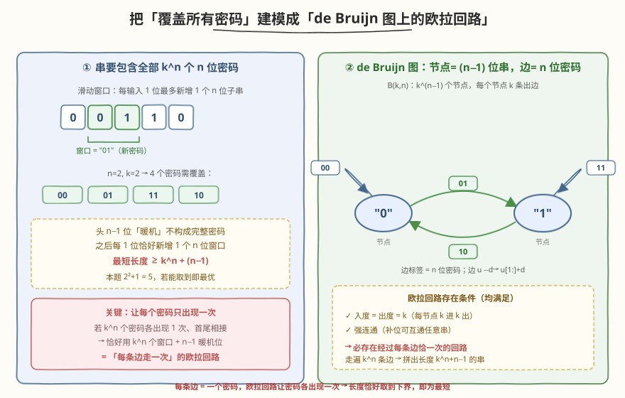
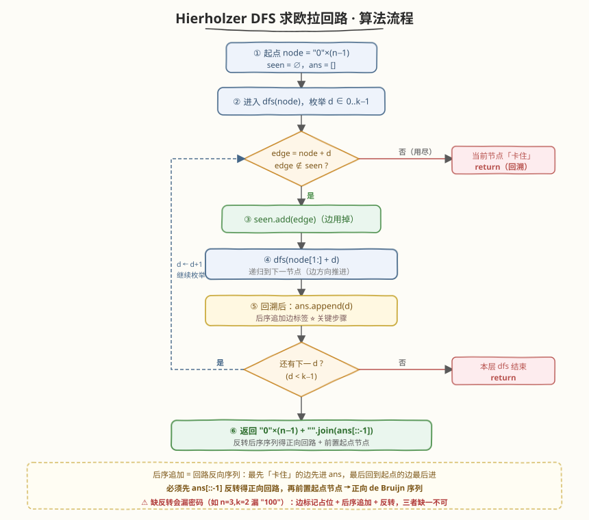
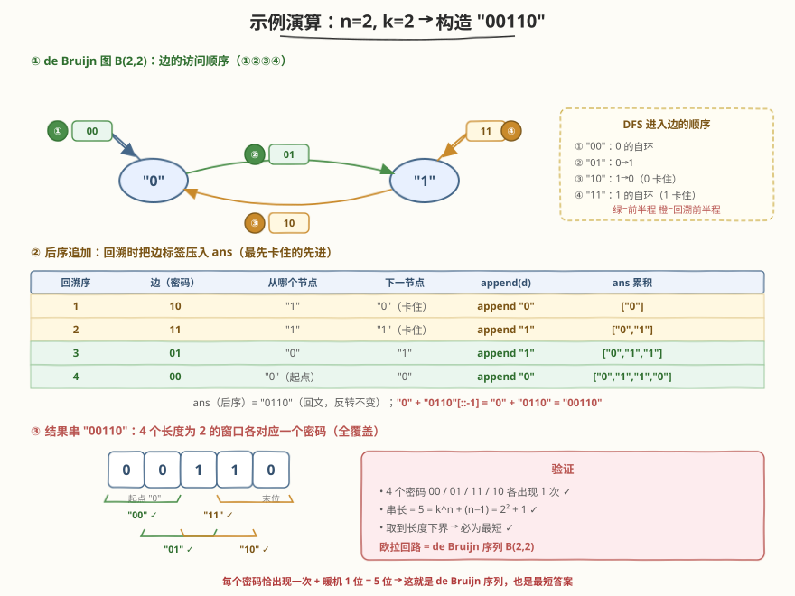

# LeetCode 破解保险箱 题解

## 1. 题目概述

- **标题 / 题号**：破解保险箱（#753，hard）
- **链接**：https://leetcode.cn/problems/cracking-the-safe/
- **难度**：困难
- **标签**：深度优先搜索、欧拉回路、图、de Bruijn 序列

**题意**：有一个密码为 `n` 位数字的保险箱，密码的每一位都是 `0` 到 `k-1` 范围内的整数（即密码共有 $k^n$ 种可能）。保险箱的输入机制是连续的：你输入一串数字流，保险箱会**持续读取最近输入的 `n` 位**，一旦这 `n` 位恰好等于密码就会打开。

给定 `n` 和 `k`，返回**任意一个长度最短**的字符串，使得无论真实密码是 $k^n$ 种里的哪一种，它都会作为这个字符串的某个长度为 `n` 的连续子串出现——也就是说，输入这串数字后**必然**能打开保险箱。

**示例 1**：

```text
输入：n = 1, k = 2
输出："10"
解释：密码是 1 位、取值 {0,1}，共 2 种。"10" 包含子串 "1" 和 "0"，覆盖全部 2 种密码，长度 2 最短。
```

**示例 2**：

```text
输入：n = 2, k = 2
输出："00110"（"01100" / "10011" / "11001" 均可）
解释：密码是 2 位、取值 {0,1}，共 4 种：00 / 01 / 11 / 10。
"00110" 的所有长度为 2 的子串依次为 00、01、11、10，恰好各出现一次，全覆盖，长度 5 最短。
```

**约束**：

- `1 <= n <= 4`
- `1 <= k <= 10`
- `1 <= k^n <= 4096`

> ⚠️ 注意三点：① 要的是「**无论密码是什么都能打开**」，即结果串必须**覆盖全部** $k^n$ 个 `n` 位密码作为子串；② 求**最短**长度，朴素地把所有密码拼接（长度 $n \cdot k^n$）远非最优；③ 答案不唯一，返回任意一个最短串即可。本题本质是构造 **de Bruijn 序列**——一个长度恰为 $k^n + (n-1)$ 的环，其所有长度为 $n$ 的窗口恰好不重不漏地遍历全部 $k^n$ 个密码。

## 2. 解题思路

### 2.1 暴力思路：拼接所有密码

最朴素的做法是把 $k^n$ 个密码字符串首尾直接拼接，长度 $n \cdot k^n$。例如 $n=2,k=2$ 得到 `"00011011"`，确实覆盖全部密码，但长度 8 远大于最优的 5。问题在于相邻密码之间**没有共享字符**，每个窗口都从新位置重新开始。

能不能让相邻窗口**重叠** $n-1$ 位？即让前一个密码的**后 $n-1$ 位**正好等于下一个密码的**前 $n-1$ 位**——这样每追加 1 个数字就能「顺带」产生一个新的 `n` 位密码。这正是 de Bruijn 序列的核心思想，它把问题转化为图上的**欧拉回路**。

### 2.2 核心观察：把「密码覆盖」建模成「de Bruijn 图上的欧拉回路」



关键一步是**换一个视角看「相邻密码的衔接」**：定义 **de Bruijn 图** $B(k,n)$——

- **节点**：所有长度为 $n-1$ 的串（共 $k^{n-1}$ 个）。例 $n=2,k=2$ 时节点为 `"0"`、`"1"`。
- **边**：每个节点 $u$ 对每个数字 $d \in \{0,\dots,k-1\}$ 有一条**出边**，边标签为 $n$ 位密码 $u + d$，指向节点 $u[1:] + d$（即丢掉 $u$ 的首位、末位补 $d$）。

于是：

- 每个节点**入度 = 出度 = $k$**（每个 $(n-1)$ 位串可由 $k$ 种首位拼成、也可向 $k$ 种末位延伸）。
- 图是**强连通**的：任意两个 $(n-1)$ 位串都能通过不断补位互相到达。
- 两个欧拉回路存在的充要条件**全部满足** → **必存在经过每条边恰好一次的回路**。

> 💡 **为什么是欧拉回路？** 一条边 = 一个 $n$ 位密码。「经过每条边恰好一次」=「每个密码恰好出现一次」。回路首尾相接时，相邻两条边的衔接处天然**重叠 $n-1$ 位**（前一边指向的节点 = 后一边的起点），所以把回路上的边标签按「首位 + 各边的末位」串起来，就得到一个长度恰为 $k^n + (n-1)$ 的串——它覆盖全部密码且无冗余。

**长度下界**：结果串的头 $n-1$ 位是「暖机」位（还不构成完整密码），之后每追加 1 位恰好产生 1 个新的长度为 $n$ 的窗口。要覆盖 $k^n$ 个密码，至少需要 $k^n$ 个窗口，故最短长度 $\ge k^n + (n-1)$。欧拉回路恰好取到这个下界，所以**一定最优**。

> ⚠️ **de Bruijn 图 vs 一般图搜索**：本题不是求最短路（那是 BFS 的活，见相邻题 [752. 打开转盘锁](752_打开转盘锁.md)），而是求「遍历每条边一次」的回路——这是**欧拉回路**问题，用 **Hierholzer 算法** $O(E)$ 解决。两者同属图搜索但目标完全不同。

### 2.3 算法流程图



**Hierholzer DFS 三步法**：

1. **起点**：取 `node = "0" * (n-1)`（任意 $(n-1)$ 位串都行，欧拉回路是闭合环，从哪开始都能走完）。
2. **DFS 主循环** `dfs(node)`：枚举数字 $d \in \{0,\dots,k-1\}$，构造边 `edge = node + d`（一个 $n$ 位密码）：
   - 若 `edge` 未访问：标记 `seen.add(edge)`（边用掉），**先递归** `dfs(node[1:] + d)` 走到下一节点，**回溯后** `ans.append(d)` 追加边标签。
   - 若已访问：跳过。
3. **拼装**：`ans` 是后序序列（回路反向），先 `ans[::-1]` 反转得正向回路，再返回 `"0"*(n-1) + "".join(ans[::-1])`——前置起点节点 + 正向边标签序列。

> 💡 **为什么后序追加 + 反转 + 前置起点能得到正向序列？** Hierholzer 的精髓：当 DFS 走到「所有出边用尽」的节点（即「卡住」）时才回溯，此时该点对应的边最先入栈。后序追加使「最先卡住的边先进 `ans`」，整体形成回路的**反向**序列；`ans[::-1]` 把它翻回正向，最后在头部补上起点节点，即得正向 de Bruijn 序列。这是标准 Hierholzer 写法——「后序入栈 + 反转输出」。

> ⚠️ **两个易错点**：（1）**边在标记时即占位**（`seen.add(edge)`），保证每条边只走一次，否则会死循环；（2）**反转不可省**——后序 `ans` 是反向回路，漏掉 `[::-1]` 会得到漏密码的错误串（详见第 3 节踩坑点）。递归深度最坏可达 $k^n \le 4096$，Python 需调大递归上限。

### 2.4 示例演算

以 $n=2,\ k=2$ 为例，de Bruijn 图 $B(2,2)$ 有 2 个节点 `"0"`、`"1"` 和 4 条边 `00 / 01 / 10 / 11`：



DFS 从 `"0"` 出发，边的进入顺序与后序追加过程如下：

| 回溯序 | 边（密码） | 起点节点 | 下一节点 | `append(d)` | `ans` 累积 |
|--------|-----------|----------|----------|-------------|-----------|
| 1 | `10` | `"1"` | `"0"`（卡住） | `"0"` | `["0"]` |
| 2 | `11` | `"1"` | `"1"`（卡住） | `"1"` | `["0","1"]` |
| 3 | `01` | `"0"` | `"1"` | `"1"` | `["0","1","1"]` |
| 4 | `00` | `"0"`（起点） | `"0"` | `"0"` | `["0","1","1","0"]` |

`ans`（后序）= `"0110"`，反转得 `"0110"`（本题恰为回文，反转不变），前置起点 `"0"` → `"0" + "0110" = "00110"`。验证：`"00110"` 的 4 个长度为 2 的窗口依次是 `00 / 01 / 11 / 10`，全覆盖且各出现一次，长度 $5 = 2^2 + 1$ 取到下界 → 最优。

> 💡 直觉上：先在 `"0"` 上走自环 `00`（拨到 0），再 `01` 跳到 `"1"`；在 `"1"` 这侧先把 `10`、`11` 两条边走完（走到尽头才回头），回头时按后序把 `11`、`10`、`01`、`00` 的末位依次拼回——于是 `0(起) + 0(00) + 1(01) + 1(11) + 0(10) = 00110`。DFS 的「走到黑再回头」天然把回路反向重建出来，反转即正向。注意 $n=2,k=2$ 的 `ans` 恰为回文使反转透明；$n \ge 3$ 时反转必不可少（否则漏密码）。

## 3. 参考代码

### C++

```cpp
class Solution {
  public:
    string crackSafe(int n, int k) {
        unordered_set<string> seen;
        string post;                              // 后序边标签（回路反向）
        dfs(string(n - 1, '0'), k, seen, post);
        reverse(post.begin(), post.end());        // 反转得正向回路
        return string(n - 1, '0') + post;         // 前置起点节点
    }
  private:
    void dfs(const string& node, int k,
             unordered_set<string>& seen, string& post) {
        for (int d = 0; d < k; ++d) {              // 枚举每条出边
            string edge = node + string(1, '0' + d);   // n 位密码 = 一条边
            if (!seen.count(edge)) {
                seen.insert(edge);                // 边用掉
                dfs(edge.substr(1), k, seen, post); // 下一节点 = node[1:] + d
                post.push_back('0' + d);          // 后序追加边标签
            }
        }
    }
};
```

### Python

```python
class Solution:
    def crackSafe(self, n: int, k: int) -> str:
        import sys
        sys.setrecursionlimit(10000)              # 递归深度可达 k^n <= 4096
        seen = set()
        ans = []

        def dfs(node):                            # node: 长度 n-1 的串
            for d in range(k):
                edge = node + str(d)              # 长度 n 的密码 = 一条边
                if edge not in seen:
                    seen.add(edge)                # 边用过即标记
                    dfs(edge[1:])                 # 下一节点 = node[1:] + d
                    ans.append(str(d))            # 后序追加边标签（回路反向）

        dfs("0" * (n - 1))
        return "0" * (n - 1) + "".join(ans[::-1]) # 反转得正向回路 + 前置起点
```

> ⚠️ **三个高频踩坑点**：
> （1）**必须反转后序序列**：后序追加使 `ans` 存的是欧拉回路的**反向**序列，必须 `ans[::-1]`（C++ `reverse`）反转后再前置起点，才得到正向 de Bruijn 序列。**漏掉反转是最常见的 bug**——例如 $n=3,k=2$ 时不反转会得到 `"0000111010"`，**漏掉密码 `"100"`**。$n=2,k=2$ 时 `ans="0110"` 恰为回文、反转不变，才侥幸蒙混过关。
> （2）**递归深度**：欧拉回路是一条长度为 $k^n$ 的路径，递归深度最坏 $O(k^n) \le 4096$，超过 Python 默认上限 1000。必须 `sys.setrecursionlimit(10000)`，否则 `n=4,k=8` 一类用例会 `RecursionError`。C++ 栈容量充足无需处理。
> （3）**`edge[1:]` 是下一节点而非下一密码**：`edge = node + d` 长度为 $n$，`edge[1:] = node[1:] + d` 长度为 $n-1$，正好是 de Bruijn 图中边指向的节点。若误写成 `dfs(edge)` 会把 $n$ 位串当节点，图结构彻底错乱。$n=1$ 时 `node=""`、`edge` 为单字符、`edge[1:]=""`，逻辑自然成立。

## 4. 复杂度分析

| 维度 | 复杂度 | 说明 |
|------|--------|------|
| **时间复杂度** | $O(n \cdot k^n)$ | de Bruijn 图有 $k^n$ 条边，每条边访问一次；每次构造 `edge` 与哈希插入代价 $O(n)$（串长 $n$） |
| **空间复杂度** | $O(n \cdot k^n)$ | `seen` 集合存 $k^n$ 条边、每条长 $n$；递归栈深 $O(k^n)$；答案串长 $k^n + n - 1$ |

> 💡 本题状态/边数 $k^n \le 4096$ 非常小，Hierholzer $O(E)$ 必然飞快通过。关键是认出「最短全覆盖 = de Bruijn 序列 = 欧拉回路」这一层建模，一旦建模正确，算法本身极简。

## 5. 扩展：迭代版 Hierholzer 与 de Bruijn 序列的数学构造

### 5.1 迭代版 Hierholzer（规避递归栈）

递归版在 $k^n$ 较大时栈深受限，可用显式栈改写为迭代版：维护「当前节点」栈，当某节点出边用尽（卡住）时弹栈写入 `path`，最后 `path[::-1]` 反转得正向节点序列，再拼成串。这是标准 Hierholzer 的迭代形态，与递归版等价。

```python
def crackSafe_iter(self, n: int, k: int) -> str:
    if n == 1:                                    # 节点为空串，特判
        return "".join(str(d) for d in range(k))
    seen = set()
    stack = ["0" * (n - 1)]
    path = []                                     # 后序节点序列（回路反向）
    while stack:
        node = stack[-1]
        moved = False
        for d in range(k):
            edge = node + str(d)
            if edge not in seen:
                seen.add(edge)
                stack.append(edge[1:])           # 推进到下一节点
                moved = True
                break
        if not moved:                             # 出边用尽 → 卡住，弹栈入 path
            stack.pop()
            path.append(node)
    circuit = path[::-1]                          # 反转得正向节点序列
    res = circuit[0]                              # 首节点全 (n-1) 位
    for v in circuit[1:]:
        res += v[-1]                              # 之后每个节点的末位
    return res
```

> ⚠️ 迭代版用「节点序列」拼串（首节点全位 + 各节点末位），$n=1$ 时空节点需特判；递归版用「边标签」拼串，$n=1$ 自然成立。两者都依赖「后序 + 反转」这一 Hierholzer 核心步骤。面试中递归版更易写对；迭代版的优势是无递归深度上限、适合 $k^n$ 极大的场景。

### 5.2 数学构造：Lyndon 词连接（Fredricksen–Kessler–Maiorana 算法）

de Bruijn 序列 $B(k,n)$ 还有一条**纯数学**构造法：把所有「字典序最小的 Lyndon 词」（长度整除 $n$ 的、长度 $\le n$ 的 Lyndon 词）按字典序拼接，所得串（循环看）即一个 de Bruijn 序列。对 $k=2,n=6$ 它比 Hierholzer 更快，但实现复杂、面试不要求，了解即可。

## 6. 面试要点

1. **如何想到用欧拉回路？为什么不是 BFS？**

   - 关键观察：要让相邻密码**重叠 $n-1$ 位**以省字符，于是把 $(n-1)$ 位串当**节点**、$n$ 位密码当**边**，建出 de Bruijn 图。「每个密码出现一次」=「每条边走一次」= 欧拉回路。BFS（[752](752_打开转盘锁.md)）求的是**最少步数/最短路**，本题求的是**遍历所有边**，目标不同、算法不同。

2. **欧拉回路为什么一定存在？长度为什么一定最优？**

   - de Bruijn 图每个节点入度=出度=$k$（全偶点），且强连通，满足欧拉回路存在的两个充要条件。回路遍历 $k^n$ 条边、相邻边重叠 $n-1$ 位，串长恰为 $k^n + (n-1)$，取到「暖机 $n-1$ 位 + 每位一窗口」的下界 → 必最优。

3. **为什么用后序追加再反转，而不是先序？为什么还要前置起点节点？**

   - Hierholzer 的本质是「走到黑再回头」：最先卡住的节点对应边最先入栈，后序追加使 `ans` 存的是回路的**反向**序列。`ans[::-1]` 把它翻回正向回路，再前置起点节点 `node`（贡献 $n-1$ 位暖机）即得正向 de Bruijn 序列。先序追加会按进入顺序记录，得到的不是合法欧拉回路（相邻边不衔接）；漏掉反转则得到漏密码的错误串（$n=3,k=2$ 漏 `"100"`）。

4. **`edge[1:]` 表示什么？为什么它就是下一节点？**

   - `edge = node + d` 是长度 $n$ 的密码（一条边）。`edge[1:]` 丢掉首位，得 `node[1:] + d`，长度 $n-1$，正是 de Bruijn 图中这条边**指向**的节点。这个「丢首补末」正是 de Bruijn 图边方向的定义。

5. **递归深度会爆吗？怎么处理？**

   - 欧拉回路长 $k^n$，递归深度最坏 $O(k^n) \le 4096$，超过 Python 默认 1000 上限。Python 需 `sys.setrecursionlimit(10000)`；C++ 默认栈够用。若担心可改迭代版（见第 5 节）。

## 同类练习题

| # | 题目 | 与本题的关联 |
|---|------|-------------|
| 332 | [重新安排行程](https://leetcode.cn/problems/reconstruct-itinerary/)（[题解](../0301-0400/332_重新安排行程.md)） | 同为 Hierholzer，对比「半欧拉图（恰两个奇点，求欧拉**路径**）」与本题「欧拉图（全偶点，求欧拉**回路**）」；同样是后序入栈 + 反向拼装 |
| 752 | [打开转盘锁](https://leetcode.cn/problems/open-the-lock/)（[题解](752_打开转盘锁.md)） | 题号相邻、同属「保险箱」主题，对比「BFS 求无权图最短路」与「DFS 求欧拉回路」——同为隐式图但目标完全不同 |
| 684 | [冗余连接](https://leetcode.cn/problems/redundant-connection/)（[题解](../0601-0700/684_冗余连接.md)） | 图论基础，对比「并查集判环找多余边」与「欧拉回路遍历每边一次」——两种经典图算法的不同切入点 |
| 79 | [单词搜索](https://leetcode.cn/problems/word-search/) | DFS 回溯遍历，对比「网格 DFS + 回溯撤销选择」与「Hierholzer 边标记不撤销」——回溯思想的两种形态 |
