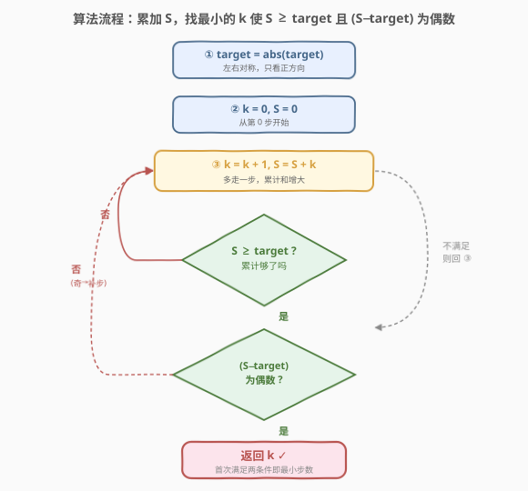
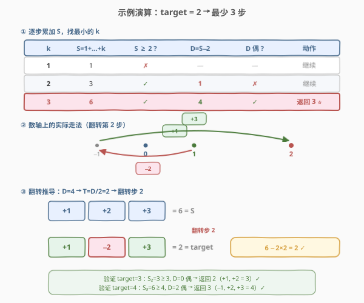

# 到达终点数字

- **题目名称**：到达终点数字
- **链接**：[754. 到达终点数字](https://leetcode.cn/problems/reach-a-number/)
- **难度**：中等
- **标签**：数学、数论、贪心

## 1. 题目概述

在一根无限长的数轴上，你站在 `0` 的位置，终点在 `target` 的位置。你可以做若干次移动 `numMoves`：

- 每次可以选择**向左或向右**移动；
- 第 $i$ 次移动（从 $i = 1$ 开始），在选择的方向上走恰好 $i$ 步。

给定整数 `target`，返回到达目标所需的**最小**移动次数。

**示例 1**：

```text
输入：target = 2
输出：3
解释：
第 1 次移动，从 0 到 1（+1）。
第 2 次移动，从 1 到 −1（−2）。
第 3 次移动，从 −1 到 2（+3）。
```

**示例 2**：

```text
输入：target = 3
输出：2
解释：
第 1 次移动，从 0 到 1（+1）。
第 2 次移动，从 1 到 3（+2）。
```

**约束条件**：

- $-10^9 \le \text{target} \le 10^9$
- $\text{target} \ne 0$

> ⚠️ 注意三点：① 第 $i$ 步**必须**走恰好 $i$ 步，不能多走也不能少走，能选的只是**方向**（左/右）；② 每一步的方向**独立**选择，不必保持同一方向；③ `target` 可为负数——但由于每步方向可任意选，向左走与向右走完全对称，故「到达 $-t$」与「到达 $t$」所需步数相同。

---

## 2. 解题思路

### 2.1 暴力思路：BFS 逐层搜索

最直白的做法：把「当前位置 + 已走步数」当作状态，从 $(0, 0)$ 出发 BFS——第 $k$ 层枚举第 $k$ 步向左/向右两种转移，首次到达 `target` 即返回步数。

问题：`target` 可达 $10^9$，而步数 $k \approx \sqrt{2 \times 10^9} \approx 44721$。BFS 每层状态数指数膨胀（$2^k$），即便加上去重，状态空间也大到不可行——这是**指数 vs 多项式**的差距，搜索完全无望。

> 💡 暴力 BFS 的失败提示我们：这题**不是搜索题**，而是**数学题**。每步走 $i$ 且只能选方向，这一结构蕴含着可被公式刻画的规律——关键在于「所有步全向右走得到累计和 $S$，再通过翻转某些步的方向来修正」。

### 2.2 核心观察：超出部分 D = S − target 必须为偶数


分三步建立洞察。

**第一步——对称化简**。由于左右方向对称，先取 $\text{target} = |\text{target}|$，只考虑正方向。

**第二步——累计和与超出量**。假设走 $k$ 步且**全部向右**，则累计位移为

$$S = 1 + 2 + \cdots + k = \frac{k(k+1)}{2}$$

当 $S \ge \text{target}$ 时，我们「走过头」了，超出量为

$$D = S - \text{target} \ge 0$$

**第三步——翻转修正与奇偶性**。要把超出量 $D$ 消掉，只需把某些原本向右（$+i$）的步**翻转为向左（$-i$）**。翻转第 $i$ 步会使总位移减少 $2i$（从 $+i$ 变 $-i$，差值 $2i$）。设被翻转的步的编号之和为 $T$，则

$$\text{target} = S - 2T \quad \Longrightarrow \quad D = S - \text{target} = 2T$$

> 💡 **关键结论**：$D = 2T$ 必须是**偶数**，且 $T = D/2$ 必须能由 $\{1, 2, \ldots, k\}$ 的某个子集凑出。当 $D$ 为偶数且 $D \le S$（即 $S \ge \text{target}$，自动满足）时，$T = D/2 \le S/2 \le S$——而 $\{1, 2, \ldots, k\}$ 的子集和能覆盖 $[0, S]$ 内的**任意整数**（经典结论：由归纳法，加入 $k$ 后新区间 $[k, S]$ 与旧区间 $[0, S-k]$ 恰好相接）。故 $T$ 总能凑出，条件等价于：

$$\boxed{S \ge \text{target} \quad \text{且} \quad (S - \text{target}) \text{ 为偶数} \quad \Longrightarrow \quad \text{返回 } k}$$

> ⚠️ **为何是偶数而非「能被某步整除」？** 翻转任意步 $i$ 都使总和变化 $2i$——变化量恒为偶数。所以无论翻转哪些步，总位移与 $S$ 的**奇偶性差恒为偶数**。这意味着 $D$ 的奇偶性是唯一的卡点：$D$ 偶则一定可调，$D$ 奇则无论怎么翻都不行。

### 2.3 算法流程图



流程极简——**无回溯、无搜索**，只有一层累加循环：

1. **对称化简**：`target = abs(target)`。
2. **初始化**：`k = 0, S = 0`。
3. **累加循环**：每轮 `k += 1; S += k`，判断是否满足 $S \ge \text{target}$ **且** $(S - \text{target})$ 为偶数。
   - 满足 → 返回 `k`。
   - 不满足 → 继续累加。

> 💡 **D 为奇数时至多再走 2 步**。设首个满足 $S \ge \text{target}$ 的步数为 $k_0$。若此时 $D$ 为奇数，则：
> - $k_0 + 1$ 步：$D' = D + (k_0+1)$。若 $k_0+1$ 为奇数，奇偶翻转 → $D'$ 偶 → 返回 $k_0+1$；
> - 若 $k_0+1$ 为偶数，$D'$ 仍奇 → 再加 $k_0+2$ 步（$k_0+2$ 必为奇数）→ $D''$ 偶 → 返回 $k_0+2$。
>
> 故循环**至多比 $k_0$ 多跑 2 轮**就必然终止——连续两个整数必含一个奇数，奇数步累加后奇偶性必翻转。这也是复杂度为 $O(\sqrt{\text{target}})$ 而非更大的保证。

### 2.4 示例演算



以 `target = 2` 为例：

| k | $S = 1+\cdots+k$ | $S \ge 2$ ? | $D = S - 2$ | $D$ 偶 ? | 动作 |
|---|------------------|-------------|-------------|----------|------|
| 1 | 1 | ✗ | — | — | 继续 |
| 2 | 3 | ✓ | 1 | ✗ | 继续 |
| **3** | **6** | **✓** | **4** | **✓** | **返回 3 ⭐** |

返回 `3` ✓。验证走法：$D = 4$，$T = D/2 = 2$，翻转步 2 即可——$+1, -2, +3 = 2$ ✓。

> 💡 **看「翻转」如何起作用**：$k=3$ 时全向右 $+1,+2,+3 = 6 = S$。要把总和从 6 降到 2（差 4），只需翻转步 2（减少 $2 \times 2 = 4$）：$+1, -2, +3 = 2$。这正是 $D = 2T$ 的直接体现——$T=2$ 恰为步 2 的编号。

再快速验证几个值：

- `target = 3`：$S_2 = 3 \ge 3$，$D = 0$ 偶 → 返回 `2`（$+1, +2 = 3$）✓
- `target = 4`：$S_3 = 6 \ge 4$，$D = 2$ 偶 → 返回 `3`（$-1, +2, +3 = 4$）✓
- `target = 5`：$S_3 = 6 \ge 5$，$D = 1$ 奇；$S_4 = 10$，$D = 5$ 奇；$S_5 = 15$，$D = 10$ 偶 → 返回 `5`（$+1, +2, +3, +4, -5 = 5$）✓

---

## 3. 参考代码

### C++

```cpp
class Solution {
  public:
    int reachNumber(int target) {
        target = abs(target);
        int k = 0, sum = 0;
        while (sum < target || (sum - target) % 2 != 0) {
            k++;
            sum += k;
        }
        return k;
    }
};
```

### Python

```python
class Solution:
    def reachNumber(self, target: int) -> int:
        target = abs(target)
        k, s = 0, 0
        while s < target or (s - target) % 2 != 0:
            k += 1
            s += k
        return k
```

> 💡 两版逻辑完全一致，核心只有两行 `k += 1; s += k` 加一个「$S \ge \text{target}$ 且 $D$ 偶」的循环条件。循环条件把「还没走到」(`s < target`) 和「走过了但奇偶不对」(`(s - target) % 2 != 0`) 合并为一个 `||`，无需分两段判断——只要任一不满足就继续累加。C++ 中 `target` 取绝对值后 $\le 10^9$，`sum` 上界约 $k(k+1)/2$，而 $k \approx \sqrt{2 \times 10^9} \approx 44721$，`sum` 最大约 $10^9$ 量级，`int` 完全够用（$< 2^{31}-1$）。

---

## 4. 复杂度分析

| 维度 | 复杂度 | 说明 |
|------|--------|------|
| **时间复杂度** | $O(\sqrt{\text{target}})$ | 循环次数 $k \approx \sqrt{2 \cdot \text{target}}$（因 $S_k = k(k+1)/2 \ge \text{target}$），且 $D$ 为奇数时至多再跑 2 轮。$\text{target} = 10^9$ 时 $k \approx 44723$，远在时限内 |
| **空间复杂度** | $O(1)$ | 仅 `k`、`sum` 两个变量，与输入规模无关 |

> 💡 **为何是 $\sqrt{n}$ 而非 $n$**？累计和 $S_k = k(k+1)/2$ 关于 $k$ 是**二次增长**，故只需 $\sqrt{2 \cdot \text{target}}$ 步就能让 $S$ 追上 $\text{target}$。这与 [400. 第 N 位数字](../0301-0400/400_第N位数字.md) 的「按位数分层 $O(\log n)$」、[172. 阶乘后的零](../0101-0200/172_阶乘后的零.md) 的「按 $5$ 的幂分层 $O(\log n)$」同属「利用数学结构降维」一族——只是本题的累计和是二次而非指数/对数增长，故降为 $\sqrt{n}$。

---

## 5. 扩展：$O(1)$ 数学公式直接定位

累加循环虽已是 $O(\sqrt{n})$，但可进一步用**求根公式** $O(1)$ 直接算出首个 $k_0$ 使 $S_{k_0} \ge \text{target}$，再按奇偶性微调。

由 $S_k = k(k+1)/2 \ge \text{target}$，解二次方程 $k^2 + k - 2 \cdot \text{target} \ge 0$，正根为

$$k \ge \frac{-1 + \sqrt{1 + 8 \cdot \text{target}}}{2}$$

故首个满足 $S_k \ge \text{target}$ 的整数为

$$k_0 = \left\lceil \frac{-1 + \sqrt{1 + 8 \cdot \text{target}}}{2} \right\rceil$$

算出 $k_0$ 后，检查 $(S_{k_0} - \text{target})$ 的奇偶性：偶则返回 $k_0$；奇则按第 2.3 节的结论最多再加 2 步（$k_0+1$ 或 $k_0+2$）。

```python
import math

class Solution:
    def reachNumber(self, target: int) -> int:
        target = abs(target)
        # 求根公式直接定位首个 S_k >= target 的 k
        k = math.ceil((-1 + math.sqrt(1 + 8 * target)) / 2)
        s = k * (k + 1) // 2
        # 奇偶性微调，至多 +2 步
        while (s - target) % 2 != 0:
            k += 1
            s += k
        return k
```

> ⚠️ **浮点精度**：`math.sqrt(1 + 8 * target)` 在 $\text{target} = 10^9$ 时参数约 $8 \times 10^9$，`sqrt` 结果约 $89442$，`double`（53 位尾数）精度足够区分相邻整数。但若题目上限更大（如 $10^{15}$），需改用整数开方（如 Python 的大整数 `isqrt`）避免浮点误差。C++ 中同理，`double` 对 $10^9$ 量级安全。

> 💡 **两种写法对照**：累加循环版代码更短、无浮点精度问题、面试更易讲清「逐步逼近」的思路；公式版体现「二次方程求根」的数学洞察，$O(1)$ 更优。实际面试推荐累加版——$44723$ 次循环对现代 CPU 是微秒级，公式版的精度风险反而不易当场解释清楚。

---

## 6. 面试要点

1. **为什么先取 `abs(target)`？**

   > 每步方向可任意选（左/右独立），所以「到达 $-t$」与「到达 $+t$」所需的步数集合完全相同——把每条到 $+t$ 的路径中所有方向取反，就得到一条到 $-t$ 的等长路径。故 `target = abs(target)` 不影响答案，只简化讨论。

2. **为什么 $D = S - \text{target}$ 必须为偶数？**

   > 翻转第 $i$ 步使总位移减少 $2i$（$+i \to -i$，差 $2i$）。设被翻转步编号之和为 $T$，则 $\text{target} = S - 2T$，即 $D = S - \text{target} = 2T$。$D$ 必须能写成 $2T$，故为偶数。更本质地说：每步翻转改变总量 $2i$（偶数），故总位移与 $S$ 的奇偶差恒为偶——$D$ 偶才能调，$D$ 奇无解。

3. **$D$ 为偶数就一定可行吗？为什么 $T = D/2$ 总能凑出？**

   > $\{1, 2, \ldots, k\}$ 的子集和能覆盖 $[0, S]$ 内任意整数（经典结论，归纳可证：加入 $k$ 后新区间 $[k, S]$ 与旧区间 $[0, S-k]$ 相接）。当 $S \ge \text{target} \ge 0$ 时 $T = D/2 = (S - \text{target})/2 \le S/2 \le S$，落在可覆盖范围内，故一定能凑出。这是「偶数即可行」的充要保证。

4. **$D$ 为奇数时为什么至多再走 2 步？**

   > 设首个 $S \ge \text{target}$ 的步数为 $k_0$。若 $D$ 奇，走第 $k_0+1$ 步后 $D' = D + (k_0+1)$：若 $k_0+1$ 奇则 $D'$ 偶，返回 $k_0+1$；若 $k_0+1$ 偶则 $D'$ 仍奇，再走第 $k_0+2$ 步（$k_0+2$ 必奇）→ $D''$ 偶，返回 $k_0+2$。连续两个整数必含一奇，故至多 2 步必翻转到偶。

5. **时间复杂度为什么是 $O(\sqrt{n})$？**

   > 累计和 $S_k = k(k+1)/2$ 关于 $k$ 二次增长，故 $S_k \ge \text{target}$ 首次成立时 $k \approx \sqrt{2 \cdot \text{target}}$。加上奇偶微调至多 2 步，总循环次数 $\Theta(\sqrt{\text{target}})$。$\text{target} = 10^9$ 时约 $44723$ 次，远在时限内。

> 💡 **一句话总结**：754 是「奇偶性 + 累计和」的招牌数学题——取绝对值化简后，全向右走 $k$ 步得 $S = k(k+1)/2$，超出量 $D = S - \text{target}$ 必须为偶（因翻转任一步改变 $2i$）；找到最小的 $k$ 使 $S \ge \text{target}$ 且 $D$ 偶即可，$O(\sqrt{n})$ 搞定。核心洞察是「翻转的奇偶不变式」——变化量恒偶，故只卡奇偶一关。

---

## 7. 同类练习题

- [877. 石子游戏](https://leetcode.cn/problems/stone-game/)（[题解](../0801-0900/877_石子游戏.md)）：同为「奇偶性决定结果」的数学题——石子堆数为偶数时 Alexander 必胜，靠的就是奇偶位置配对的洞察，与本题「翻转改变量恒偶」的奇偶不变式异曲同工
- [172. 阶乘后的零](https://leetcode.cn/problems/factorial-trailing-zeroes/)（[题解](../0101-0200/172_阶乘后的零.md)）：同为「数学闭合公式降维」——用勒让德公式 $v_5(n!) = \sum \lfloor n/5^i \rfloor$ 把暴力计数降到 $O(\log n)$，与本题用累计和公式把 BFS 降到 $O(\sqrt{n})$ 同属结构降维
- [400. 第 N 位数字](https://leetcode.cn/problems/nth-digit/)（[题解](../0301-0400/400_第N位数字.md)）：同为「累加定位」——按位数分层累加每层贡献，逐层减去锁定层数，与本题累加 $S_k$ 直至超过 target 的「逐步逼近」思路同构
- [292. Nim 游戏](https://leetcode.cn/problems/nim-game/)（[题解](../0201-0300/292_Nim游戏.md)）：同为「数学秒杀」——不搜索所有博弈分支，而是用 $n \bmod 4 \neq 0$ 的闭合判定直接定胜负，与本题用奇偶性判定代替 BFS 搜索同属「公式代替搜索」一族
- [1015. 可被 K 整除的最小整数](https://leetcode.cn/problems/smallest-integer-divisible-by-k/)：同为「找最小的 $k$」+ 模运算推理——找最小的全由 1 组成的数能被 $K$ 整除，用余数不变式判断终止，与本题用奇偶不变式判断终止的「找最小 $k$」模式相通
