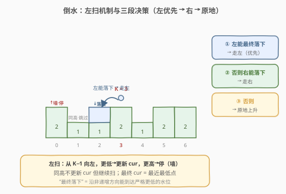
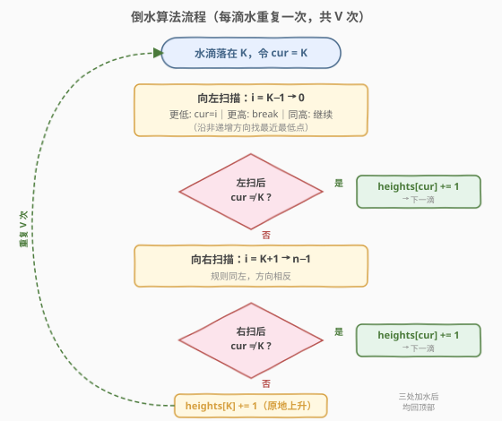
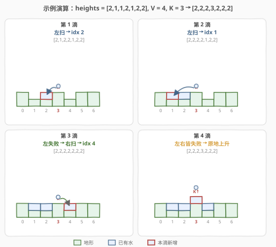

# LeetCode 倒水 题解

## 1. 题目概述

- **标题 / 题号**：倒水（#755，medium）
- **链接**：https://leetcode.cn/problems/pour-water/
- **难度**：中等
- **标签**：数组、模拟

**题意**：给定一个海拔地图 `heights`，`heights[i]` 表示位置 `i` 的地形高度，每个位置宽度为 1。现在在位置 `K` 上方倾倒 `V` 单位的水。水首先落在 `K`，叠在该列已有地形/水之上，然后按以下规则流动：

- 如果水滴**向左移动最终能落到更低处**，则向左走；
- 否则，如果水滴**向右移动最终能落到更低处**，则向右走；
- 否则，**原地上升**（该列水位 +1）。

其中「最终落下」指沿该方向移动最终会到达一个**严格更低**的水位（水位 = 地形高度 + 该列已有水量）。数组两侧视为无限高的墙，水不会流出边界。每个水滴最终必须完整落入某一格，不存在跨格平摊。

**示例 1**：

```text
输入：heights = [2,1,1,2,1,2,2], V = 4, K = 3
输出：[2,2,2,3,2,2,2]
解释：
第 1 滴：K=3 向左能落到 idx2(更低) → idx2 +1
第 2 滴：K=3 向左能落到 idx1(更低) → idx1 +1
第 3 滴：向左无更低（一路等高到墙），向右能落到 idx4 → idx4 +1
第 4 滴：左右都无更低 → 原地 idx3 +1
```

**示例 2**：

```text
输入：heights = [1,2,3,4], V = 2, K = 2
输出：[2,3,3,4]
解释：第 1 滴一路向左滚到 idx0；第 2 滴落在 idx1（再左会上升，不再落下）。
```

**示例 3**：

```text
输入：heights = [3,1,3], V = 5, K = 1
输出：[4,4,4]
解释：前 3 滴原地堆高 idx1 到 3；第 4 滴向左落到 idx0；第 5 滴向右落到 idx2。
```

**约束**：

- $1 \le \text{heights.length} \le 100$
- $0 \le \text{heights}[i] \le 99$
- $0 \le V \le 2000$
- $0 \le K < \text{heights.length}$

## 2. 解题思路

### 2.1 暴力思路

最直白的模拟：让水滴**一步一步**移动。每次在当前格判断「向左最终能否落下」——从当前格向左逐格扫，只要沿路水位**非递增**且最终遇到严格更低的水位，就判定为「能落下」；若能，向左走一格，再到新位置重新判断。向左不行再试右，都不行才原地上升。

这种「走一步、重扫一次」的做法，每滴水最多移动 $O(n)$ 格，每格又要 $O(n)$ 扫描判定，单滴 $O(n^2)$，总体 $O(V \cdot n^2)$。本题 $n \le 100$、$V \le 2000$ 时约 $2 \times 10^7$ 次操作，勉强可过，但存在大量重复扫描：水滴从 `K` 出发向左一路滚到落点，其实**只需要一次扫描**就能直接定位落点。

> 💡 **关键优化**：把「逐步移动 + 每步重判」合并为「一次扫描直接算出落点」。向左扫一遍即可确定左侧最近最低的落点；找不到再向右扫一遍；都不行才原地上升。每滴 $O(n)$，总体降到 $O(V \cdot n)$。

### 2.2 核心观察：一次扫描定位落点



水滴从 `K` 出发，向左能到达的位置受两个约束：

1. **只能沿非递增方向走**：下一格水位 $\le$ 当前格才能继续，否则被「墙」挡住。
2. **取最近最低点**：在可达的连续非递增段内，落点是**离 `K` 最近**的那个最低水位格（不是最左边的）。

这两点正好可以用一次从 `K-1` 向左的扫描刻画：维护 `cur`（当前最佳落点，初值 `K`），

- 遇到 `heights[i] < heights[cur]`：发现更低 → 更新 `cur = i`；
- 遇到 `heights[i] > heights[cur]`：遇到更高的墙 → `break`（再往左不可达）；
- 遇到 `heights[i] == heights[cur]`：等高 → **不更新 `cur` 但继续扫**（看后面有没有更低的）。

扫描结束后 `cur` 即左侧最近最低点。若 `cur != K`（即找到严格更低处），水滴落在 `cur`；否则左方向「不能最终落下」，转而向右做完全对称的扫描；右也失败则原地 `heights[K]++`。

> ⚠️ **为什么等高要「继续扫」却不更新 `cur`？** 等高意味着继续向左暂时没有「落下」，但更远处可能还有更低点，所以不能 `break`；但等高格本身不是更低点，不能替换 `cur`（否则会把落点挪到更远的等高格上，违反「最近最低」）。示例 1 第 1 滴正是停在 idx2 而非 idx1——idx1 与 idx2 等高，`cur` 保留更近的 idx2。

> 💡 **左优先于右**：题目规定先试左、左不行才试右，**即使右边落得更快**也照此顺序。这与物理直觉略有出入，是本题的离散规则，务必按题意实现。

### 2.3 算法流程图



整体是对每滴水重复一次的三段判定：左扫 →（命中则加水）→ 右扫 →（命中则加水）→ 原地上升。两次扫描结构完全对称，只是方向相反。

### 2.4 示例演算



以 `heights = [2,1,1,2,1,2,2]`、`V = 4`、`K = 3` 为例逐滴演算：

| 滴 | 起始水位（地形+水） | 左扫结果 | 右扫结果 | 落点 | 加水后水位 |
|----|---------------------|----------|----------|------|------------|
| 1 | `[2,1,1,2,1,2,2]` | idx2(1<2) ✓ | — | idx2 | `[2,1,2,2,1,2,2]` |
| 2 | `[2,1,2,2,1,2,2]` | idx1(1<2) ✓ | — | idx1 | `[2,2,2,2,1,2,2]` |
| 3 | `[2,2,2,2,1,2,2]` | 全等高到墙，无更低 ✗ | idx4(1<2) ✓ | idx4 | `[2,2,2,2,2,2,2]` |
| 4 | `[2,2,2,2,2,2,2]` | 全等高到墙 ✗ | 全等高到墙 ✗ | idx3(原地) | `[2,2,2,3,2,2,2]` |

> 💡 第 3 滴是「左失败转右」的典型：左侧一路等高（idx2、1、0 全是 2），遇不到更低，才转向右侧找到 idx4。第 4 滴左右皆平坦，按规则原地上升 `idx3`。

## 3. 参考代码

### C++

```cpp
class Solution {
  public:
    vector<int> pourWater(vector<int>& heights, int V, int K) {
        int n = heights.size();
        while (V--) {
            int cur = K;
            // 优先向左扫描：找最近最低点
            for (int i = K - 1; i >= 0; --i) {
                if (heights[i] < heights[cur]) cur = i;
                else if (heights[i] > heights[cur]) break;
            }
            if (cur != K) { heights[cur]++; continue; }
            // 向右扫描：规则同左，方向相反
            for (int i = K + 1; i < n; ++i) {
                if (heights[i] < heights[cur]) cur = i;
                else if (heights[i] > heights[cur]) break;
            }
            if (cur != K) { heights[cur]++; continue; }
            // 左右都无更低处：原地上升
            heights[K]++;
        }
        return heights;
    }
};
```

### Python

```python
class Solution:
    def pourWater(self, heights: List[int], V: int, K: int) -> List[int]:
        n = len(heights)
        for _ in range(V):
            cur = K
            # 优先向左扫描：找最近最低点
            for i in range(K - 1, -1, -1):
                if heights[i] < heights[cur]:
                    cur = i
                elif heights[i] > heights[cur]:
                    break
            if cur != K:
                heights[cur] += 1
                continue
            # 向右扫描：规则同左，方向相反
            for i in range(K + 1, n):
                if heights[i] < heights[cur]:
                    cur = i
                elif heights[i] > heights[cur]:
                    break
            if cur != K:
                heights[cur] += 1
                continue
            # 左右都无更低处：原地上升
            heights[K] += 1
        return heights
```

> ⚠️ **三个易错点**：
> 1. **更新条件用严格 `<`**：`cur` 只在遇到严格更低时更新，等高不换，保证「最近最低」而非「最远最低」。
> 2. **遇更高要 `break` 而非继续**：更高的格是「墙」，水翻不过去，继续扫会越过墙误判远处更低点为可达。
> 3. **左失败才扫右**：用 `continue` 跳过本滴剩余流程；左右扫描代码对称，复制时务必把方向、起止、`break` 条件一并镜像。

## 4. 复杂度分析

| 维度 | 复杂度 | 说明 |
|------|--------|------|
| 时间复杂度 | $O(V \cdot n)$ | 每滴水最多向左扫 $n$ 格、向右扫 $n$ 格，共 $V$ 滴 |
| 空间复杂度 | $O(1)$ | 原地修改 `heights`，仅用常数个变量 |

> ⚠️ 本题 $n \le 100$、$V \le 2000$，$V \cdot n \le 2 \times 10^5$，单次扫描常数极小，运行瞬秒。暴力逐步模拟的 $O(V \cdot n^2) \approx 2 \times 10^7$ 也能过，但一次扫描的写法更简洁、可扩展到更大规模。

## 5. 扩展：与「接雨水」的本质区别

本题常与 [42. 接雨水](../0001-0100/42_接雨水.md) 混淆，但二者模型截然不同：

| 维度 | 755 倒水 | 42 接雨水 |
|------|----------|-----------|
| **视角** | 主动：在指定点倒水，模拟流动 | 被动：给定地形，问最多能蓄多少 |
| **输出** | 每列最终水位数组 | 蓄水总量（一个数） |
| **核心** | 逐滴贪心找落点 | 每格由左右最高柱的较小值决定水位 |
| **复杂度** | $O(V \cdot n)$ | $O(n)$（双指针 / 预处理前缀后缀最大） |

接雨水关注「稳态蓄水上限」（双指针维护两侧最高），倒水关注「逐滴动态流动」（每滴独立贪心）。两者唯一的共同点是都以水位/柱状图建模，但算法内核无交集。

## 6. 面试要点

1. **「最终落下」如何判定？为什么一次扫描就能定位落点？**

   - 「最终落下」= 沿某方向走、最终到达严格更低的水位。从 `K` 向左扫一遍，维护 `cur`：遇更低更新、遇更高停（墙）、等高继续。扫完 `cur` 即左侧最近最低点；若 `cur != K` 说明左侧能落下，落点就是 `cur`。这等价于「逐步移动」的结果，但省去重复扫描。

2. **为什么遇更高要 `break`，遇等高却继续？**

   - 更高的格是墙，水翻不过去，再往左的格不可达，必须停。等高格不是更低点（不更新 `cur`），但更远处可能还有更低，故不能停，要继续扫到墙或更低。

3. **为什么左优先于右，即使右边落得更快？**

   - 题目明确规定先试左、左不行才试右。示例 1 第 1 滴即体现：向左能落（到 idx2）就选左，尽管向右也能落。这是离散规则，与物理「最速下降」直觉不同，须严格按题意。

4. **「最近最低」还是「最远最低」？为什么？**

   - 是「最近最低」（离 `K` 最近的那 个最低点）。因为 `cur` 只在严格更低时更新，等高不换，所以等高平底上 `cur` 停在最靠近 `K` 的一端。示例 1 第 1 滴落 idx2 而非 idx1 即可验证。

5. **暴力逐步模拟与一次扫描的差异？**

   - 暴力每走一格重扫一次判定方向，单滴 $O(n^2)$；一次扫描直接算出落点，单滴 $O(n)$。结果完全相同（都遵循同一规则），只是后者消除了重复扫描。$n$ 小时两者都能过，但一次扫描更优雅、可扩展。

## 同类练习题

| # | 题目 | 与本题的关联 |
|---|------|-------------|
| 42 | [接雨水](https://leetcode.cn/problems/trapping-rain-water/)（[站内题解](../0001-0100/42_接雨水.md)） | 被动计算地形蓄水上限，对比本题主动倒水逐滴模拟 |
| 407 | [接雨水 II](https://leetcode.cn/problems/trapping-rain-water-ii/) | 3D 接雨水，最小堆由外向内推进求蓄水 |
| 845 | [数组中的最长山脉](https://leetcode.cn/problems/longest-mountain-in-array/) | 分析地形剖面（先增后减的最长段），同属柱状图地形题 |
| 11 | [盛最多水的容器](https://leetcode.cn/problems/container-with-most-water/) | 双指针求两柱围成的最大容积，水题系列的几何最优型 |
