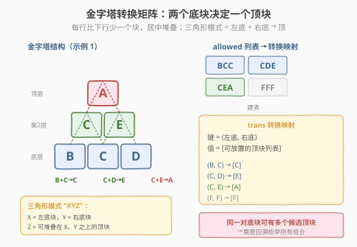
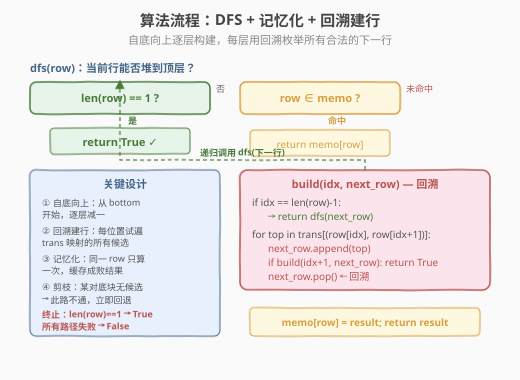
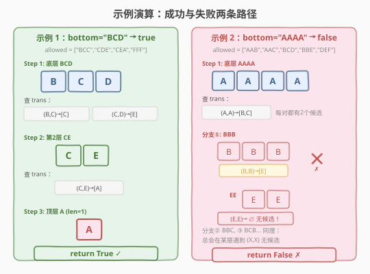

# LeetCode 金字塔转换矩阵 题解

## 1. 题目概述

- **标题 / 题号**：金字塔转换矩阵（#756，medium）
- **链接**：https://leetcode.cn/problems/pyramid-transition-matrix/
- **难度**：中等
- **标签**：回溯、DFS、记忆化搜索

**题意**：将积木堆成金字塔。每个块用一个字母（`A`–`F`）表示颜色。每一行的块比它下面一行**少一个**且居中。只有 `allowed` 列表中给出的**三角形模式**是允许的：模式 `"XYZ"` 表示左底块 `X`、右底块 `Y` 之上可放置顶块 `Z`。

从给定的 `bottom` 底层字符串出发，逐层向上堆叠，如果**每个三角形**都在 `allowed` 中，且最终能堆到**单个顶层块**，返回 `true`，否则 `false`。

**示例 1**：

```text
输入：bottom = "BCD", allowed = ["BCC","CDE","CEA","FFF"]
输出：true
解释：BCD → CE → A，三个三角形 BCC、CDE、CEA 均在 allowed 中
```

**示例 2**：

```text
输入：bottom = "AAAA", allowed = ["AAB","AAC","BCD","BBE","DEF"]
输出：false
解释：第 3 层有多种构建方式，但所有路径都会在创造第 1 层前陷入困境
```

**约束**：

- `2 <= bottom.length <= 6`
- `0 <= allowed.length <= 216`
- `allowed[i].length == 3`
- 所有字母来自集合 `{'A', 'B', 'C', 'D', 'E', 'F'}`
- `allowed` 中所有值唯一

> 💡 本题本质是**分层回溯 + 记忆化**：每一层是从下一行"翻译"而来，每一对相邻底块可能产生多个候选顶块，需要回溯枚举所有组合。与 [22. 括号生成](../0001-0100/22_括号生成.md) 的"逐位置填字符 + 剪枝"结构类似，但本题是**判定问题**（能否到达顶层）而非枚举问题，因此配合记忆化剪掉重复子问题。

## 2. 解题思路

### 2.1 暴力思路：枚举所有金字塔

从底层出发，对每一层的每对相邻块，尝试 `allowed` 中所有可能的顶块，组合出下一行的所有可能。递归到顶层（长度 1）即成功。

问题在于：**同一行字符串可能被多次重复计算**。例如底层 `"AAAA"` 可以产生 `"BBC"` 和 `"BCB"` 等多种第 3 层，它们各自向下递归时可能产生相同的第 2 层字符串，导致指数级重复。

### 2.2 核心观察：转换映射 + 记忆化 DFS



**两步建模**：

1. **转换映射** `trans`：将 `allowed` 列表预处理为 `trans[(left, right)] = [top1, top2, ...]` 的哈希表。给定一对相邻底块，$O(1)$ 查出所有可放置的顶块。
2. **记忆化 DFS** `dfs(row)`：当前行 `row` 能否堆到顶层（长度 1）。用 `memo` 缓存结果，同一行字符串只算一次。

**回溯建行**：`dfs(row)` 内部用辅助函数 `build(idx, next_row)` 逐位置填充下一行——对第 `idx` 个位置，查 `trans[(row[idx], row[idx+1])]` 得到候选列表，依次尝试每个候选并递归 `build(idx+1, ...)`。一旦填满（`idx == len(row)-1`），递归调用 `dfs(next_row)`。

> ⚠️ **为什么需要记忆化？** 不加记忆化时，DFS 树的深度为 $n-1$（$n$ = 底层长度），每层分支因子最大 $6^{k-1}$（$k$ = 当前行长）。总路径数可达 $6^{n(n-1)/2}$，$n=6$ 时约 $6^{15} \approx 4.7 \times 10^{11}$，远超时限。记忆化后，每个不同行字符串只计算一次，状态数上限 $\sum_{k=1}^{6} 6^k \approx 56000$。

### 2.3 算法流程图



**完整步骤**：

1. **预处理**：遍历 `allowed`，构建 `trans` 映射 `trans[(p[0], p[1])].append(p[2])`
2. **DFS 函数** `dfs(row)`：
   - **终止条件**：`len(row) == 1` → 返回 `True`
   - **记忆化命中**：`row ∈ memo` → 返回 `memo[row]`
   - **回溯建行** `build(idx, next_row)`：
     - `idx == len(row) - 1`（填满）→ 递归 `dfs("".join(next_row))`
     - 查 `trans[(row[idx], row[idx+1])]`，若为空 → `return False`（剪枝）
     - 对每个候选 `top`：`next_row.append(top)` → `build(idx+1, next_row)` → `next_row.pop()`（回溯）
   - **记忆化存储**：`memo[row] = result`
3. 调用 `dfs(bottom)`，返回结果

> 💡 **两层递归嵌套**：外层 `dfs(row)` 处理"层间跳跃"（一行到下一行），内层 `build(idx, ...)` 处理"行内填充"（逐位置选顶块）。这种"外层分层 + 内层回溯"的模式在金字塔/层叠结构问题中很常见。

### 2.4 示例演算



**示例 1**（`bottom = "BCD"`, `allowed = ["BCC","CDE","CEA","FFF"]`）：

| 步骤 | 当前行 | 相邻对 | trans 查询 | 下一行 | 说明 |
|------|--------|--------|-----------|--------|------|
| 1 | `BCD` | (B,C), (C,D) | [C], [E] | `CE` | 每对仅 1 个候选，唯一确定 |
| 2 | `CE` | (C,E) | [A] | `A` | 同上 |
| 3 | `A` | — | — | — | len=1 → `True` ✓ |

**示例 2**（`bottom = "AAAA"`, `allowed = ["AAB","AAC","BCD","BBE","DEF"]`）：

| 分支 | 第 3 层 | 相邻对 | 第 2 层 | 相邻对 | 第 1 层 | 结果 |
|------|---------|--------|---------|--------|---------|------|
| ① | `BBB` | (B,B)→[E] | `EE` | (E,E)→∅ | 无候选 | ✗ |
| ② | `BBC` | (B,B)→[E], (B,C)→[D] | `ED` | (E,D)→∅ | 无候选 | ✗ |
| ③ | `BCB` | (B,C)→[D], (C,B)→∅ | 无候选 | — | — | ✗ |
| ④ | `BCC` | (B,C)→[D], (C,C)→∅ | 无候选 | — | — | ✗ |
| ⑤ | `CBB` | (C,B)→∅ | 无候选 | — | — | ✗ |
| ... | ... | ... | ... | ... | ... | ✗ |

所有 8 种第 3 层组合（每对 2 候选，$2^3 = 8$）均在某层遇到无候选的相邻对，最终 `False`。

> 💡 **记忆化的价值**：示例 2 中，不同第 3 层可能产生相同的第 2 层（如 `BBC` 和 `BCB` 的某些子路径）。记忆化确保相同行字符串只计算一次，避免重复递归。

## 3. 参考代码

### C++

```cpp
// 金字塔转换矩阵.cpp —— DFS + 记忆化 + 回溯建行
// 编译: g++ -O2 -std=c++17 金字塔转换矩阵.cpp -o pyramid
#include <vector>
#include <string>
#include <unordered_map>
#include <functional>
using namespace std;

class Solution {
public:
    bool pyramidTransition(string bottom, vector<string>& allowed) {
        // trans[(left-'A')*6 + (right-'A')] = 候选顶块列表
        // 字母 A-F 共 6 个，键域 6×6=36
        vector<vector<char>> trans(36);
        for (const auto& p : allowed) {
            int key = (p[0] - 'A') * 6 + (p[1] - 'A');
            trans[key].push_back(p[2]);
        }

        unordered_map<string, bool> memo;

        function<bool(const string&)> dfs = [&](const string& row) -> bool {
            if (row.size() == 1) return true;          // 到达顶层
            if (memo.count(row)) return memo[row];      // 记忆化命中

            // 回溯：逐位置填充下一行
            function<bool(int, string&)> build = [&](int idx, string& nextRow) -> bool {
                if (idx == (int)row.size() - 1) {       // 填满 → 递归下一层
                    return dfs(nextRow);
                }
                int key = (row[idx] - 'A') * 6 + (row[idx + 1] - 'A');
                for (char top : trans[key]) {           // 遍历候选顶块
                    nextRow.push_back(top);
                    if (build(idx + 1, nextRow)) return true;
                    nextRow.pop_back();                  // 回溯
                }
                return false;                           // 无候选或所有候选失败
            };

            string nextRow;
            bool result = build(0, nextRow);
            memo[row] = result;                          // 记忆化存储
            return result;
        };

        return dfs(bottom);
    }
};
```

### Python

```python
class Solution:
    def pyramidTransition(self, bottom: str, allowed: list[str]) -> bool:
        # 预处理：构建转换映射 trans[(left, right)] = [top1, top2, ...]
        trans: dict[tuple[str, str], list[str]] = {}
        for p in allowed:
            key = (p[0], p[1])
            if key not in trans:
                trans[key] = []
            trans[key].append(p[2])

        memo: dict[str, bool] = {}

        def dfs(row: str) -> bool:
            if len(row) == 1:                   # 到达顶层
                return True
            if row in memo:                     # 记忆化命中
                return memo[row]

            # 回溯：逐位置填充下一行
            def build(idx: int, next_row: list[str]) -> bool:
                if idx == len(row) - 1:         # 填满 → 递归下一层
                    return dfs("".join(next_row))
                key = (row[idx], row[idx + 1])
                if key not in trans:            # 无候选 → 剪枝
                    return False
                for top in trans[key]:          # 遍历候选顶块
                    next_row.append(top)
                    if build(idx + 1, next_row):
                        return True
                    next_row.pop()              # 回溯
                return False

            result = build(0, [])
            memo[row] = result                  # 记忆化存储
            return result

        return dfs(bottom)
```

> 💡 **实现细节**：① C++ 用 `vector<vector<char>> trans(36)` 做定长数组索引（`key = (c-'A')*6 + (c-'A')`），比 `unordered_map` 更快；Python 直接用 `dict[tuple, list]`，代码更简洁。② `build` 函数用 `list + append/pop` 而非字符串拼接，避免每次创建新对象的 $O(k)$ 拷贝；填满后 `"".join(next_row)` 一次性转串。③ **短路返回**：`build` 中一旦某条路径成功立即 `return True`，不探索剩余分支。

## 4. 复杂度分析

| 维度 | 复杂度 | 说明 |
|------|--------|------|
| **时间** | $O(6^n \cdot 6^{n-1})$，实际远低 | $n$ = `bottom.length` ≤ 6。状态数（不同行字符串）上限 $\sum_{k=1}^{n} 6^k \approx 6^n$；每个状态回溯枚举下一行最多 $6^{k-1}$ 组合 |
| **空间** | $O(6^n)$ | `memo` 最多缓存 $\sum_{k=1}^{n} 6^k$ 个行字符串 + 递归栈深度 $n$ |

> ⚠️ **为什么实际远低于理论上界？** 三重剪枝：① **记忆化**——同一行字符串只算一次，重复子问题 $O(1)$ 返回；② **短路返回**——找到一条成功路径立即终止，不探索剩余分支；③ **自然剪枝**——某对底块无候选时立即 `return False`，不继续填充。实际运行中，LeetCode 的测试用例均在毫秒级完成。最坏情况（所有 216 模式都在 `allowed` 中且无解）需要约 $10^7$ 次操作，仍在时限内。

## 5. 扩展：位掩码状态压缩

当 `bottom.length` 增大或字母表扩展时，字符串哈希的开销和状态空间会膨胀。可以用**位掩码**优化：

- 字母集 `{'A',...,'F'}` 共 6 个，用一个 `uint8_t` 的低 6 位表示一个**候选集合**（某位置可能的顶块集合）。
- `trans` 从 `vector<vector<char>>` 改为 `uint8_t trans[36]`，每个 `trans[key]` 是一个位掩码。
- 遍历候选用 `bit_scan` 逐位提取，避免遍历 `vector`。

```cpp
// 位掩码优化版（核心改动）
uint8_t trans[36] = {0};                       // 每个键一个 6-bit 掩码
for (const auto& p : allowed) {
    int key = (p[0] - 'A') * 6 + (p[1] - 'A');
    trans[key] |= (1 << (p[2] - 'A'));         // 置位
}
// 遍历候选
uint8_t mask = trans[key];
while (mask) {
    int bit = __builtin_ctz(mask);             // 取最低位 1 的位置
    mask &= mask - 1;                          // 清除该位
    char top = 'A' + bit;
    // ... 尝试 top
}
```

> 💡 位掩码的优势：① 内存紧凑（36 字节 vs 36 个 `vector`）；② 集合运算用位运算（并 `|`、交 `&`）；③ 遍历候选用 `ctz` 指令，$O(\text{候选数})$。但本题 $n \leq 6$，字符串版已足够快，位掩码属于进阶优化。

## 6. 面试要点

1. **为什么需要记忆化？不加记忆化会怎样？**

   > 不加记忆化时，DFS 树的每个分支独立递归到顶层，同一行字符串会被不同父路径重复计算。$n=6$ 时总路径数可达 $6^{15} \approx 4.7 \times 10^{11}$，远超时限。记忆化后，每个不同行只算一次，状态数上限约 56000，配合短路返回实际运算量极小。

2. **回溯建行（`build` 函数）的过程是什么？为什么不直接枚举所有下一行？**

   > `build(idx, next_row)` 逐位置填充下一行：对第 `idx` 个位置查 `trans` 获取候选，依次尝试并递归填充下一个位置。填满后递归 `dfs(next_row)`。直接枚举所有下一行需要先生成 $6^{k-1}$ 个字符串再逐个 `dfs`，空间开销大且无法提前终止。`build` 的回溯结构允许**边填充边剪枝**——某位置无候选时立即回退，不生成完整字符串。

3. **时间复杂度如何分析？`bottom.length ≤ 6` 为什么是关键约束？**

   > 状态数（不同行字符串）上限 $\sum_{k=1}^{6} 6^k \approx 56000$。每个状态回溯枚举下一行最多 $6^{k-1}$ 组合，总运算量上限约 $10^7$。`n ≤ 6` 保证 $6^n$ 有界（6^6 = 46656），如果 $n$ 更大（如 $n = 10$），状态空间 $6^{10} \approx 6 \times 10^7$ 会爆炸。LeetCode 的约束设计正是为了让记忆化 DFS 可行。

4. **如果 `allowed` 中同一对底块有多个候选顶块，如何处理？**

   > 回溯枚举——`build` 函数对每个位置的候选列表逐个尝试，`append → 递归 → pop`。不同位置的候选组合形成一棵回溯树，叶节点对应一个完整的下一行字符串。只要有一条路径成功就返回 `True`，全部失败才返回 `False`。这与 [17. 电话号码的字母组合](../0001-0100/17_电话号码的字母组合.md) 的"每位置多选一"结构相同。

5. **本题和普通回溯（如全排列、组合总和）有什么区别？**

   > ① **分层结构**——普通回溯是在同一维度的序列上做选择，本题是"层间递归"（`dfs` 处理层跳跃）+ "层内回溯"（`build` 处理位置填充）的嵌套。② **判定 vs 枚举**——全排列/组合总和要枚举所有方案，本题只需判定可行性，配合短路返回更高效。③ **记忆化适用性**——普通回溯的路径通常不重复（排列/组合的无后效性弱），本题不同路径可能产生相同中间行，记忆化收益显著。

> 💡 **一句话总结**：756 题是"分层回溯 + 记忆化"的招牌——外层 `dfs(row)` 做层间跳跃，内层 `build(idx, next_row)` 做行内回溯，`memo` 缓存行字符串的成败结果剪掉重复子问题。核心建模是 `trans[(left, right)] = [tops]` 转换映射，将 `allowed` 列表转化为 $O(1)$ 查询。与 [22. 括号生成](../0001-0100/22_括号生成.md)（回溯构造合法序列）、[139. 单词拆分](../0001-0100/139_单词拆分.md)（记忆化判定）的思想一脉相承。

## 同类练习题

| # | 题目 | 与本题的关联 |
|---|------|-------------|
| 22 | [括号生成](https://leetcode.cn/problems/generate-parentheses/)（[题解](../0001-0100/22_括号生成.md)） | 回溯逐位置填字符 + 剪枝，构造合法序列，结构与本题的 `build` 函数类似 |
| 139 | [单词拆分](https://leetcode.cn/problems/word-break/)（[题解](../0001-0100/139_单词拆分.md)） | 记忆化 DFS 判定可行性，同样用 memo 缓存中间状态避免重复 |
| 17 | [电话号码的字母组合](https://leetcode.cn/problems/letter-combinations-of-a-phone-number/) | 每位置多选一、回溯枚举所有组合，与 `build` 的逐位置填充结构相同 |
| 79 | [单词搜索](https://leetcode.cn/problems/word-search/)（[题解](../0001-0100/79_单词搜索.md)） | DFS + 回溯多路径尝试，找到一条可行路径即返回 |
