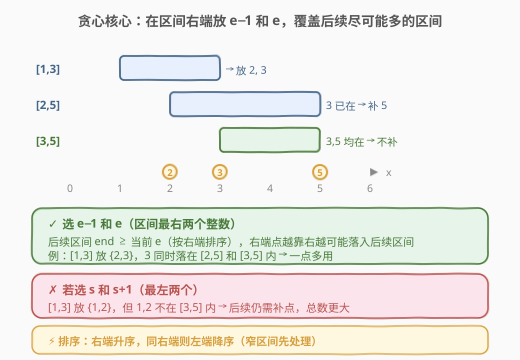
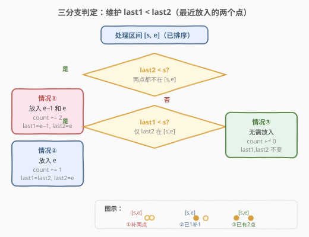
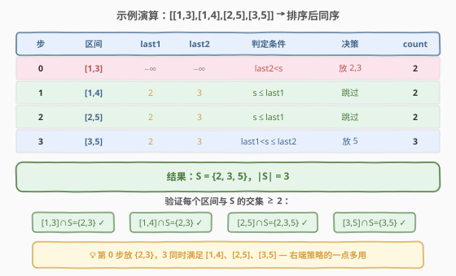

# LeetCode 设置交集大小至少为2 题解

## 1. 题目概述

- **标题 / 题号**：设置交集大小至少为2（#757，hard）
- **链接**：https://leetcode.cn/problems/set-intersection-size-at-least-two/
- **难度**：困难
- **标签**：贪心、区间调度、排序

**题意**：一个整数区间 `[a, b]`（$a < b$）表示从 $a$ 到 $b$ 的所有连续整数构成的集合（包含 $a$ 和 $b$）。给定一组区间 `intervals`，求一个**最小的整数集合** $S$，使得对每个区间 `[start_i, end_i]`，$S$ 与该区间的交集大小**至少为 2**。

**示例 1**：

```text
输入：intervals = [[1, 3], [1, 4], [2, 5], [3, 5]]
输出：3
解释：取 S = {2, 3, 5}
  [1,3] ∩ S = {2, 3}     → 大小 2 ✓
  [1,4] ∩ S = {2, 3}     → 大小 2 ✓
  [2,5] ∩ S = {2, 3, 5}  → 大小 3 ✓
  [3,5] ∩ S = {3, 5}     → 大小 2 ✓
```

**示例 2**：

```text
输入：intervals = [[1, 2], [2, 3], [2, 4], [4, 5]]
输出：5
解释：取 S = {1, 2, 3, 4, 5}
  [1,2] ∩ S = {1, 2}  → 大小 2 ✓
  [2,3] ∩ S = {2, 3}  → 大小 2 ✓
  [2,4] ∩ S = {2,3,4} → 大小 3 ✓
  [4,5] ∩ S = {4, 5}  → 大小 2 ✓
```

**约束**：

- $1 \le \text{intervals.length} \le 3000$
- $\text{intervals}[i].\text{length} = 2$
- $0 \le \text{start}_i < \text{end}_i \le 10^8$

> ⚠️ 本题是 [452. 用最少数量的箭引爆气球](https://leetcode.cn/problems/minimum-number-of-arrows-to-burst-balloons/) 的升级版：452 要求每个区间至少被 1 个点覆盖（交集 $\ge 1$），本题要求交集 $\ge 2$。从"选 1 个点"升级到"选 2 个点"，贪心策略也从"放 1 个点"变为"放 2 个点"。

## 2. 解题思路

### 2.1 暴力思路

枚举所有可能的整数集合 $S$，判断是否满足每个区间的交集 $\ge 2$，取最小者。由于值域高达 $10^8$、区间数达 3000，暴力枚举完全不可行。

> 💡 暴力的不可行说明需要利用**贪心选择性质**——是否存在一个"先放哪些点一定不亏"的策略？答案是：**按右端点排序，在区间右端放 $e-1$ 和 $e$**。

### 2.2 核心观察：右端排序 + 放最右两个点



直觉是：每个放入 $S$ 的点都有"机会成本"，我们希望**每个点尽可能多地落入后续区间**。由于后续区间的右端点 $\ge$ 当前右端点（排序保证），**越靠右的点越容易被后续区间包含**。

具体策略：

1. **排序**：按**右端点升序**，同右端点则按**左端点降序**（窄区间先处理）。
2. **维护 `last1 < last2`**：最近放入 $S$ 的两个点。
3. 对每个区间 `[s, e]`，分三种情况：
   - `last2 < s`：两点都不在 `[s, e]` 内 → 放入 $e-1$ 和 $e$。
   - `last1 < s ≤ last2`：仅 `last2` 在 `[s, e]` 内 → 放入 $e$。
   - `s ≤ last1`：两点都在 `[s, e]` 内 → 无需放入。

> 💡 **为什么选 $e-1$ 和 $e$ 而不是 $s$ 和 $s+1$？** 因为后续区间的右端点更大（排序保证），右端的点更可能落入后续区间。例如 `[1,3]` 放 `{2,3}`，其中 3 同时落入 `[2,5]` 和 `[3,5]`；若放 `{1,2}`，则 1 和 2 都不在 `[3,5]` 内，后续仍需补点。

> ⚠️ **为什么同右端点要按左端点降序（窄区间先处理）？** 若两个区间同右端 $e$，窄区间（大 $s$）更"难满足"。先处理窄区间时放入 $e-1, e$，这两个点也一定在宽区间内（宽区间 $s$ 更小）。若先处理宽区间、恰好只需补 1 个点 $e$，再处理窄区间时又需补 1 个点，但算法会再次尝试放 $e$——已存在导致计数错误且窄区间实际只有 1 个点。

### 2.3 算法流程图



**算法步骤**：

1. **排序**：`intervals.sort(key=lambda x: (x[1], -x[0]))`（右端升序，左端降序）。
2. **初始化**：`last1 = last2 = -1`（因 $\text{start} \ge 0$，保证首区间落入情况①），`count = 0`。
3. **遍历**每个区间 `[s, e]`：
   - 若 `last2 < s`：`count += 2`，`last1, last2 = e - 1, e`。
   - 否则若 `last1 < s`：`count += 1`，`last1, last2 = last2, e`。
   - 否则：跳过。

> 💡 **关键不变式**：处理完每个区间后，`last1` 和 `last2` 是 $S$ 中最大的两个元素，且 `last2 ≤ e`（当前区间的右端点）。这保证了后续区间（右端点更大）的判定只需与 `last1`、`last2` 比较即可。

### 2.4 示例演算

以 `intervals = [[1,3],[1,4],[2,5],[3,5]]` 为例，排序后顺序不变（右端 3 < 4 < 5，同右端 5 的 `[2,5]` 和 `[3,5]` 按左端降序：`[2,5]` 在前）：



| 步 | 区间 | last1 | last2 | 判定 | 决策 | count |
|----|------|-------|-------|------|------|-------|
| 0 | [1,3] | −∞ | −∞ | last2 < s | 放 2, 3 | 2 |
| 1 | [1,4] | 2 | 3 | s ≤ last1 | 跳过 | 2 |
| 2 | [2,5] | 2 | 3 | s ≤ last1 | 跳过 | 2 |
| 3 | [3,5] | 2 | 3 | last1 < s ≤ last2 | 放 5 | 3 |

最终 $S = \{2, 3, 5\}$，$|S| = 3$。第 0 步放的 3 同时满足 `[1,4]`、`[2,5]`、`[3,5]`——这正是右端策略"一点多用"的威力。

## 3. 参考代码

### C++

```cpp
class Solution {
  public:
    int intersectionSizeTwo(vector<vector<int>>& intervals) {
        // 右端升序，同右端则左端降序（窄区间先处理）
        sort(intervals.begin(), intervals.end(),
             [](const auto& a, const auto& b) {
                 if (a[1] != b[1]) return a[1] < b[1];
                 return a[0] > b[0];
             });

        int last1 = -1, last2 = -1;
        int count = 0;

        for (const auto& iv : intervals) {
            int s = iv[0], e = iv[1];
            if (last2 < s) {              // 两点都不在 [s, e]
                count += 2;
                last1 = e - 1;
                last2 = e;
            } else if (last1 < s) {       // 仅 last2 在 [s, e]
                count += 1;
                last1 = last2;
                last2 = e;
            }
            // else: 两点都在 [s, e]，跳过
        }
        return count;
    }
};
```

### Python

```python
class Solution:
    def intersectionSizeTwo(self, intervals: List[List[int]]) -> int:
        # 右端升序，同右端则左端降序（窄区间先处理）
        intervals.sort(key=lambda x: (x[1], -x[0]))

        last1, last2 = -1, -1
        count = 0

        for s, e in intervals:
            if last2 < s:                 # 两点都不在 [s, e]
                count += 2
                last1, last2 = e - 1, e
            elif last1 < s:               # 仅 last2 在 [s, e]
                count += 1
                last1, last2 = last2, e
            # else: 两点都在 [s, e]，跳过

        return count
```

> ⚠️ **两个高频踩坑点**：
> （1）**排序的二级键**：同右端必须按左端**降序**（`-x[0]`），不是升序。升序会导致同右端的宽区间先处理、窄区间后处理时重复放 $e$，计数偏大且交集不足。
> （2）**情况②更新顺序**：`last1, last2 = last2, e`——先把旧的 `last2` 存为 `last1`，再更新 `last2 = e`。写反会丢失旧值。

## 4. 复杂度分析

| 维度 | 复杂度 | 说明 |
|------|--------|------|
| **时间复杂度** | $O(n \log n)$ | 排序主导；单遍扫描 $O(n)$，每次判定 $O(1)$ |
| **空间复杂度** | $O(\log n)$ | 排序的递归调用栈；额外仅 `last1`、`last2`、`count` 三个变量 $O(1)$ |

> 💡 排序下界 $O(n \log n)$ 已无法突破。$n \le 3000$ 时总操作量约 $3 \times 10^4$ 级别，远在时限内。

## 5. 扩展：正确性证明与一般化

### 5.1 交换论证

**命题**：存在一个最优解，其中每个区间由其右端的 $e-1$ 和 $e$（或已有的等价点）满足。

**证明思路**：设最优解 $S^*$ 中某区间 $[s, e]$ 由两点 $x < y \le e$ 满足（即 $x, y \in [s, e] \cap S^*$）。将 $x, y$ 替换为 $e-1, e$：

- $e-1, e \in [s, e]$（因 $s < e$，即 $s \le e - 1$），该区间仍被满足。
- $e-1 \ge x$ 且 $e \ge y$，新点更靠右，**不会使任何后续区间变差**——后续区间的右端 $\ge e$，新点更可能落入其中。
- 集合大小不变，仍为最优。

对每个区间依次施行此替换，即可将任意最优解转化为"右端策略"的解，且大小不减。

### 5.2 同右端降序的必要性

反例：区间 `[[3,7], [5,7]]`，前置区间 `[1,3]` 已放 `{2,3}`。

- **左端降序（正确）**：先 `[5,7]` → `last2=3 < 5` → 放 6,7。再 `[3,7]` → `s=3 ≤ last1=6` → 跳过。$S = \{2,3,6,7\}$，$|S|=4$。
- **左端升序（错误）**：先 `[3,7]` → `last1=2 < 3 ≤ last2=3` → 放 7，`last1=3, last2=7`。再 `[5,7]` → `last1=3 < 5 ≤ last2=7` → 放 7（已存在！），`last1=7, last2=7`。计数=4 但实际 $S=\{2,3,7\}$，`[5,7] ∩ S = {7}` 大小 1 ✗。

### 5.3 推广到"交集 ≥ k"

将"放 2 个点"推广为"放 $k$ 个点"：对每个区间，若已有 $j < k$ 个点在其中，则补放 $e - (k - j) + 1, \ldots, e$（最右 $k - j$ 个整数）。维护最近 $k$ 个点的有序列表即可，复杂度 $O(n \log n + nk)$。

## 6. 面试要点

1. **为什么按右端点排序而不是左端点？**

   - 后续区间的右端 $\ge$ 当前右端，在右端放点能最大化与后续区间的交集概率。按左端点排序无法保证这一点——一个左端很小但右端也小的区间会误导放置位置。

2. **同右端点时为什么按左端点降序？**

   - 同右端的两个区间，窄区间（大左端）更难满足。先处理窄区间并放入 $e-1, e$，这两个点一定也在宽区间内（宽区间左端更小）。反之先处理宽区间可能只补 1 个点 $e$，导致窄区间处理时重复放 $e$ 且实际不满足。

3. **三种情况的判定条件为什么是 `last2 < s`、`last1 < s`、`s ≤ last1`？**

   - `last1 < last2 ≤ e`（排序保证），所以只需比较 $s$ 与 `last1`、`last2`：$s > \text{last2}$ 则两点都不在；$\text{last1} < s \le \text{last2}$ 则仅 `last2` 在；$s \le \text{last1}$ 则两点都在。三种情况互斥且覆盖全部。

4. **这题和 452. 用最少数量的箭引爆气球 的区别？**

   - [452](https://leetcode.cn/problems/minimum-number-of-arrows-to-burst-balloons/) 要求交集 $\ge 1$（每个区间至少 1 个点），贪心放 1 个点在最小右端；本题要求交集 $\ge 2$，放 2 个点在最大右端 $e-1, e$，并维护两个最近点做三分支判定。

5. **初始化 `last1 = last2 = -1` 安全吗？**

   - 安全。约束保证 $\text{start} \ge 0$，所以首个区间必有 $s \ge 0 > -1 = \text{last2}$，落入情况①，正确放入 $e-1, e$。

## 同类练习题

| # | 题目 | 与本题的关联 |
|---|------|-------------|
| 452 | [用最少数量的箭引爆气球](https://leetcode.cn/problems/minimum-number-of-arrows-to-burst-balloons/) | 本题的"交集 ≥ 1"退化版，按右端排序后放 1 个点，对比从 1 个点到 2 个点的策略升级 |
| 435 | [无重叠区间](https://leetcode.cn/problems/non-overlapping-intervals/)（[题解](../0401-0500/435_无重叠区间.md)） | 同为"按右端排序"的区间贪心家族，目标不同（最多不重叠 vs 最小覆盖集） |
| 56 | [合并区间](https://leetcode.cn/problems/merge-intervals/)（[题解](../0001-0100/56_合并区间.md)） | 区间排序的祖师题，按左端排序后合并，对比排序键选择差异 |
| 1288 | [删除被覆盖区间](https://leetcode.cn/problems/remove-covered-intervals/) | 区间排序后判断包含关系，同为"排序 + 单遍扫描"套路 |
| 352 | [将数据流变为多个不相交区间](https://leetcode.cn/problems/data-stream-as-disjoint-intervals/) | 区间设计题，维护有序区间集合的动态插入，对比静态排序贪心 |
