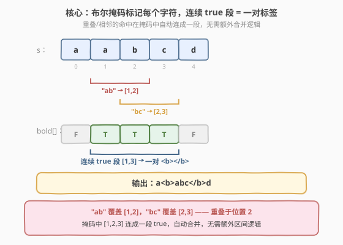
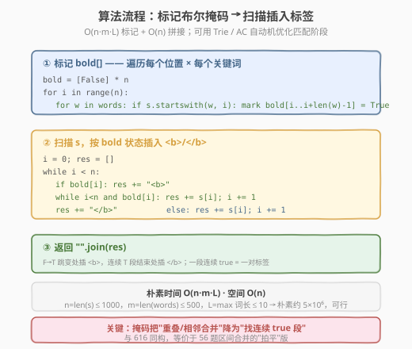
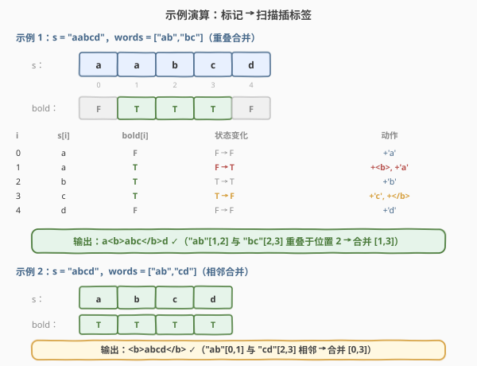

# 字符串中的加粗单词

- **题目名称**：字符串中的加粗单词
- **链接**：[758. 字符串中的加粗单词](https://leetcode.cn/problems/bold-words-in-string/)
- **难度**：中等
- **标签**：字符串、字典树、字符串匹配、AC 自动机、数组、哈希表

## 1. 题目概述

给定一个关键词数组 `words` 和一个字符串 `s`，将 `s` 中所有出现在 `words` 里的子串用一对加粗标签 `<b>` 和 `</b>` 包裹。规则：

- 若两个这样的子串**重叠**，则合并为一对加粗标签（不是各包各的）。
- 若两个子串**相邻**（端点接触，无间隙），也合并为一对加粗标签。

换言之，所有被任一关键词覆盖到的位置构成若干「连续 true 段」，每段用一对 `<b>...</b>` 包裹。

**示例 1**：

```text
输入：words = ["ab","bc"], s = "aabcd"
输出："a<b>abc</b>d"
解释：
  "ab" 命中 [1,2]，"bc" 命中 [2,3] → 二者重叠于位置 2，合并为 [1,3]
  故 [1,3] = "abc" 用一对标签包裹，首尾 'a'、'd' 不包
```

**示例 2**：

```text
输入：words = ["ab","cd"], s = "abcd"
输出："<b>abcd</b>"
解释："ab" 命中 [0,1]，"cd" 命中 [2,3] → 二者相邻（端点接触），合并为 [0,3]
      整串被一对标签包裹
```

**约束条件**：

- $1 \le \text{s.length} \le 1000$
- $1 \le \text{words.length} \le 500$
- $1 \le \text{words[i].length} \le 10$
- `words[i]` 和 `s` 仅由小写英文字母组成
- `words` 中不含重复单词

> 💡 本题是 LeetCode **Plus 会员专享题**，与免费的 [616. 给字符串添加加粗标签](../0601-0700/616_给字符串添加加粗标签.md) 是同一问题的姊妹题——核心算法完全相同（布尔掩码标记 + 扫描插标签）。区别在于：758 的关键词**数量更多**（$\le 500$ vs $\le 100$）但**更短**（$\le 10$ vs $\le 100$），且官方标签明确包含**字典树**与 **AC 自动机**，提示在大规模关键词场景下应用多模式匹配优化匹配阶段。

---

## 2. 解题思路

### 2.1 暴力思路：直接插入标签

对 `s` 中每个关键词的每次命中，直接在字符串里插入 `<b>`/`</b>`。问题立即出现：

- 重叠时会产生嵌套标签 `<b>...<b>...</b>...</b>`，需要去嵌套
- 相邻时会产生 `<b>...</b><b>...</b>`，需要合并相邻标签对
- 插入会改变下标，后续命中的位置全部错位

按插入顺序修补这些情况极易出错（边界、下标偏移、传递性合并）。根本原因是没有先「把所有命中位置算清楚」再统一包裹。

> ⚠️ 暴力插入法的困境在于「边匹配边改串」。破局思路：**先离线标记所有应加粗的位置**，再一次性扫描生成结果——把「匹配」和「包裹」两阶段解耦。

### 2.2 核心观察：布尔掩码标记 + 连续 true 段

**关键转换**：用一个长度为 $n$ 的布尔数组 `bold[i]`，标记 `s[i]` 这个位置是否被任一关键词覆盖。

- 遍历每个位置 $i$ 与每个关键词 $w$，若 $s[i:i+\text{len}(w)] == w$，则把 `bold[i..i+len(w)-1]` 全部置 `true`。
- **重叠/相邻自动合并**：两个命中区间重叠或相邻时，对应位置的 `bold` 会连成一段连续 `true`——无需任何额外合并逻辑。
- 最后扫描 `bold`：`F→T` 处插入 `<b>`，连续 `T` 段结束时插入 `</b>`。



> 💡 **为什么布尔数组能自动处理重叠与相邻？** 「重叠」意味着两段 `true` 在某些位置共同覆盖，自然连成一段；「相邻」意味着前一段的末尾 `true` 紧挨后一段的开头 `true`，中间没有 `false` 间隔——也是连续 `true`。两种情况在布尔数组里都体现为「一段连续 true」，统一由扫描时的 `F→T` / `T→F` 跳变点插入标签。这正是把区间合并问题「拍平」为数组标记的精髓。

### 2.3 算法流程图



**完整步骤**：

1. **标记**：`bold = [False] * n`。对每个 $i$，对每个 $w \in \text{words}$，若 $s.\text{startswith}(w, i)$，则 `bold[i .. i+len(w)-1] = True`
2. **扫描拼接**：$i = 0$，结果数组 `res = []`
   - `bold[i]` 为 `True`：`res.append("<b>")`，然后 `while i < n and bold[i]: res.append(s[i]); i += 1`，最后 `res.append("</b>")`
   - `bold[i]` 为 `False`：`res.append(s[i]); i += 1`
3. **返回** `"".join(res)`

### 2.4 示例演算

以示例 1 `s = "aabcd"`，`words = ["ab","bc"]` 为例：



| 步骤 | i | s[i] | bold[i] | 状态变化 | 动作 |
|------|---|------|---------|----------|------|
| 1 | 0 | a | F | F → F | `+'a'` |
| 2 | 1 | a | T | F → T | `+<b>`, `+'a'` |
| 3 | 2 | b | T | T → T | `+'b'` |
| 4 | 3 | c | T | T → F | `+'c'`, `+</b>` |
| 5 | 4 | d | F | F → F | `+'d'` |

**最终** `res = "a<b>abc</b>d"`，与示例一致。

**步骤 2 详解**：$i=1$ 处 `bold` 由 `F` 变 `T`（前可视为 `bold[0]=F`），插入开标签 `<b>`，随后把 $i=1..3$ 的字符依次追加（连续 `T` 段），到 $i=4$ 时 `bold` 转 `F`，闭合 `</b>`。$i=3$ 既是字符追加又是闭合点——闭合发生在内层 `while` 退出之后，由 `T→F` 跳变触发。

> 💡 **示例 2 的对照**：`bold = [T,T,T,T]`，"ab" 覆盖 [0,1] 与 "cd" 覆盖 [2,3] 端点接触，四格全 `true` 连成一段。扫描时只有一次 `F→T` 跳变（在 $i=0$，视为 `bold[-1]=F`），生成一对 `<b>abcd</b>`。可见「相邻」在掩码中同样表现为连续 `true`，与「重叠」无差别处理。

---

## 3. 参考代码

### C++

```cpp
#include <string>
#include <vector>
using namespace std;

class Solution {
  public:
    string boldWords(vector<string>& words, string s) {
        int n = s.size();
        vector<bool> bold(n, false);

        // ① 标记：每个位置 i，检查是否被某个关键词覆盖
        for (int i = 0; i < n; ++i) {
            for (const string& w : words) {
                int l = w.size();
                if (i + l <= n && s.compare(i, l, w) == 0) {
                    for (int j = i; j < i + l; ++j) bold[j] = true;
                }
            }
        }

        // ② 扫描：按 bold 状态插入 <b>/</b>
        string res;
        for (int i = 0; i < n; ) {
            if (bold[i]) {
                res += "<b>";
                while (i < n && bold[i]) res += s[i++];
                res += "</b>";
            } else {
                res += s[i++];
            }
        }
        return res;
    }
};
```

### Python

```python
class Solution:
    def boldWords(self, words: list[str], s: str) -> str:
        n = len(s)
        bold = [False] * n

        # ① 标记：每个位置 i，检查是否被某个关键词覆盖
        for i in range(n):
            for w in words:
                l = len(w)
                if s.startswith(w, i):
                    for j in range(i, i + l):
                        bold[j] = True

        # ② 扫描：按 bold 状态插入 <b>/</b>
        res = []
        i = 0
        while i < n:
            if bold[i]:
                res.append("<b>")
                while i < n and bold[i]:
                    res.append(s[i])
                    i += 1
                res.append("</b>")
            else:
                res.append(s[i])
                i += 1
        return "".join(res)
```

> 💡 **实现细节**：Python 用 `s.startswith(w, i)` 在位置 $i$ 处检查前缀匹配，比切片 `s[i:i+l] == w` 更省内存（不创建子串）。C++ 用 `s.compare(i, l, w) == 0` 等价。注意外层循环用 `i` 不在 `for` 内自增（`while i < n and bold[i]: i += 1` 跳过整段），所以 C++ 的扫描段写成 `for (int i = 0; i < n; )` 且仅在 `else` 分支 `i++`。

---

## 4. 复杂度分析

| 维度 | 复杂度 | 说明 |
|------|--------|------|
| **时间复杂度** | $O(n \cdot m \cdot L)$ | 标记阶段：$n$ 个位置 × $m$ 个词 × 每次比较 $O(L)$；扫描阶段 $O(n)$ |
| **空间复杂度** | $O(n)$ | 布尔数组 `bold` + 结果字符串（结果长度 $O(n)$） |
| **可优化时间** | $O(n \cdot L_{\max} + \sum L_i)$ | 用 Trie 把多模式匹配从 $O(n \cdot m \cdot L)$ 降到 $O(n \cdot L_{\max})$，见第 5 节 |
| **理论最优** | $O(n + \sum L_i)$ | AC 自动机一次扫描线性匹配，见第 5 节 |

> ⚠️ **关于 $m \cdot L$**：$n \le 1000$、$m \le 500$、$L \le 10$，最坏约 $5 \times 10^6$ 次字符比较，在限定下完全可接受。但 758 的 $m$（$\le 500$）远大于 616（$\le 100$），当 $m$ 继续增大时，逐位置 × 逐词匹配的 $O(n \cdot m \cdot L)$ 会成为瓶颈——这正是官方标签包含**字典树**与 **AC 自动机**的原因。

---

## 5. 扩展：Trie 优化与 AC 自动机

### 5.1 Trie 优化匹配阶段

朴素法的瓶颈在于「每个位置 $i$ 都要遍历全部 $m$ 个词」。用 **Trie** 把所有关键词组织成一棵前缀树后，对每个起始位置 $i$，只需沿 Trie 向下走至多 $L_{\max}$（$=10$）层即可找出所有命中——无需遍历 $m$ 个词。

**核心改进**：

- **建 Trie**：把 $m$ 个词插入 Trie，标记词尾节点。建树 $O(\sum L_i)$。
- **逐位置匹配**：对每个 $i \in [0, n)$，从 Trie 根出发，依次比对 $s[i], s[i+1], \ldots$，每碰到词尾节点就把 `bold[i..当前]` 置 `true`。匹配 $O(n \cdot L_{\max})$。
- **总计**：$O(\sum L_i + n \cdot L_{\max})$，当 $m=500,\ L_{\max}=10$ 时约 $5 \times 10^3 + 10^4$，比朴素的 $5 \times 10^6$ 快约 500 倍。

```python
class TrieNode:
    def __init__(self):
        self.children = {}
        self.end = False

class Solution:
    def boldWords(self, words: list[str], s: str) -> str:
        n = len(s)
        bold = [False] * n

        # 建 Trie
        root = TrieNode()
        for w in words:
            node = root
            for ch in w:
                if ch not in node.children:
                    node.children[ch] = TrieNode()
                node = node.children[ch]
            node.end = True

        # 逐位置沿 Trie 匹配，标记 bold
        for i in range(n):
            node = root
            for j in range(i, n):
                ch = s[j]
                if ch not in node.children:
                    break
                node = node.children[ch]
                if node.end:
                    for k in range(i, j + 1):
                        bold[k] = True

        # 扫描插标签（与朴素法完全相同）
        res = []
        i = 0
        while i < n:
            if bold[i]:
                res.append("<b>")
                while i < n and bold[i]:
                    res.append(s[i])
                    i += 1
                res.append("</b>")
            else:
                res.append(s[i])
                i += 1
        return "".join(res)
```

> 💡 **Trie 的优势在于「共享前缀剪枝」**：若 `s[i:]` 的前缀不匹配任何关键词的前缀，Trie 会提前 `break`，而朴素法仍要对剩余的 $m-1$ 个词逐一比较。关键词越多、共享前缀越多，Trie 优势越大。这与 [208. 实现 Trie](https://leetcode.cn/problems/implement-trie-prefix-tree/) 和 [648. 单词替换](../0601-0700/648_单词替换.md) 是同源思路。

### 5.2 AC 自动机：理论最优匹配

Trie 仍有冗余：对每个起始位置 $i$ 都从根重新出发，未利用已匹配信息。**AC 自动机**（Aho–Corasick）在 Trie 上添加 `fail` 指针（类似 KMP 的 `next` 数组），使得一次线性扫描 $s$ 即可找出所有命中——无需对每个位置重新匹配。

| 解法 | 时间 | 空间 | 思路 |
|------|------|------|------|
| 朴素枚举 | $O(n \cdot m \cdot L)$ | $O(n)$ | 每位置 × 每词逐一比较（$n \le 1000$ 时推荐） |
| Trie | $O(\sum L_i + n \cdot L_{\max})$ | $O(\sum L_i)$ | 共享前缀剪枝，每位置沿 Trie 走 $L_{\max}$ 层 |
| AC 自动机 | $O(n + \sum L_i)$ | $O(\sum L_i)$ | fail 指针复用匹配状态，单次扫描线性匹配 |
| 区间合并 | $O(n \cdot m \cdot L + k \log k)$ | $O(k)$ | 收集命中区间 + 排序合并，$k$ 为命中数 |

> ⚠️ **AC 自动机的 `fail` 指针**指向「当前匹配失败后，最长可复用的后缀对应的 Trie 节点」。它把 KMP 的单模式线性匹配推广到多模式：扫描 $s$ 时维护当前 Trie 节点，每读一个字符沿 `children` / `fail` 转移，途经的词尾节点即为命中。这是 [212. 单词搜索 II](https://leetcode.cn/problems/word-search-ii/) 的同源算法。在本题限定（$n \le 1000$）下 Trie 已足够，AC 自动机是 $n$ 更大（如 $10^5$ 级）时的终极方案。

### 5.3 区间合并解法（等价于 56 题）

把每个关键词的每次命中视为区间 $[i, i+\text{len}-1]$，收集所有区间后按 [56. 合并区间](../0001-0100/56_合并区间.md) 的「排序 + 线性扫描」合并（相邻也算合并，阈值 `+1`），再根据合并后的区间在原串上插标签。此思路在 [616 题解](../0601-0700/616_给字符串添加加粗标签.md) 的 5.1 节有完整代码，此处不再赘述——布尔掩码法是它的「拍平」版本，用 $O(n)$ 数组代替区间列表，省去排序。

---

## 6. 面试要点

1. **为什么用布尔数组而不是直接插入标签？**

   - 直接插入会改变下标，导致后续命中位置错位；且重叠产生嵌套标签、相邻产生相邻标签对，需反复修补
   - 布尔数组把「匹配」与「包裹」两阶段解耦：先离线标记所有应加粗位置，再统一扫描生成
   - 重叠/相邻在布尔数组里自然表现为「连续 true 段」，无需任何额外合并代码

2. **重叠和相邻在算法里是怎么统一处理的？**

   - 重叠：两段 `true` 在共同覆盖位置连成一段
   - 相邻：前段末尾 `true` 紧挨后段开头 `true`，中间无 `false`，也是连续 `true`
   - 二者在 `bold` 数组里都是「一段连续 true」，扫描时由 `F→T` 跳变开标签、`T→F` 跳变闭标签统一处理
   - 这等价于区间合并里把「相邻」也视为可合并（阈值 `+1`）

3. **这题和 616、56 题有什么关系？**

   - 758 与 [616. 给字符串添加加粗标签](../0601-0700/616_给字符串添加加粗标签.md) 是同一问题的姊妹题，算法完全相同——616 是免费版，758 是 Plus 会员版
   - 二者都与 [56. 合并区间](../0001-0100/56_合并区间.md) 同构：每个命中是区间 $[i, i+\text{len}-1]$，重叠/相邻要合并
   - 布尔数组法是区间合并的「拍平」版本——用 $O(n)$ 数组代替区间列表，省去排序

4. **朴素法 $O(n \cdot m \cdot L)$ 在本题够用吗？何时需要 Trie / AC 自动机？**

   - 本题 $n \le 1000,\ m \le 500,\ L \le 10$，朴素约 $5 \times 10^6$ 次比较，完全可行
   - 当 $m$ 增大到 $10^4$ 级或 $n$ 增大到 $10^5$ 级时，Trie（$O(n \cdot L_{\max})$）或 AC 自动机（$O(n + \sum L_i)$）成为必要
   - 758 官方标签含 Trie 与 AC 自动机，面试官可能追问优化方向——Trie 是「先建树再逐位置沿树匹配」的实用折中，AC 自动机是理论最优

5. **扫描时 `i` 的自增要注意什么？**

   - 进入 `bold[i]=True` 分支后，内层 `while` 已把 `i` 推到下一段 `false`（或末尾），外层**不能再 `i++`**
   - C++ 写成 `for (int i = 0; i < n; )`，仅在 `else` 分支 `i++`；Python 同理用 `while i < n` 手动控制
   - 这是本题最容易写错的细节：在内层循环里自增后又被外层 `for` 自增一次，会跳过字符

> 💡 **一句话总结**：758 是「字符串上的区间合并」——把每个关键词命中拍平成布尔掩码，重叠/相邻自动合并为连续 true 段，扫描跳变点插标签即可。它与 [616](../0601-0700/616_给字符串添加加粗标签.md) 同构，是 [56. 合并区间](../0001-0100/56_合并区间.md) 的「拍平」版；大规模关键词时用 Trie / AC 自动机优化匹配阶段。

---

## 7. 同类练习题

- [616. 给字符串添加加粗标签](https://leetcode.cn/problems/add-bold-tag-in-string/)：本题的免费姊妹题，算法完全相同，616 的词更长（$\le 100$）而 758 的词更多（$\le 500$），对照练习理解约束对解法选择的影响
- [56. 合并区间](https://leetcode.cn/problems/merge-intervals/)：区间合并母题，本题的区间合并解法直接套用其排序 + 线性扫描，布尔掩码是其「拍平」等价
- [208. 实现 Trie](https://leetcode.cn/problems/implement-trie-prefix-tree/)：Trie 模板题，第 5 节 Trie 优化的基础设施，理解前缀树建树与查询
- [648. 单词替换](https://leetcode.cn/problems/replace-words/)：Trie 前缀匹配应用——在字典中找最短前缀替换单词，与本题 Trie 优化的「沿树匹配」同源
- [212. 单词搜索 II](https://leetcode.cn/problems/word-search-ii/)：Trie + DFS 回溯找多词，AC 自动机标签的同源题，理解 fail 指针的多模式匹配思想
