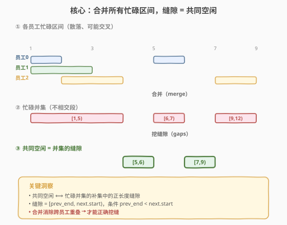
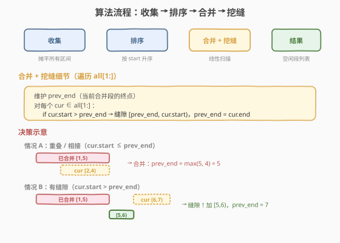
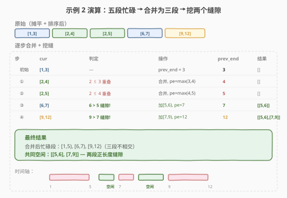

# LeetCode 员工空闲时间 题解

## 1. 题目概述

- **标题 / 题号**：员工空闲时间（#759，hard）
- **链接**：https://leetcode.cn/problems/employee-free-time/
- **难度**：困难
- **标签**：数组、排序、区间合并、堆

**题意**：给定一组员工的日程安排 `schedule`，其中 `schedule[i]` 表示第 `i` 个员工的**忙碌时间段**列表。每个员工的忙碌区间列表已按起点排序且**内部互不重叠**。求**所有员工共同空闲**的时间段（即**任意员工都不忙碌**的区间），返回按起点排序的列表，且每段空闲时间长度必须为正。

每个时间区间用 `Interval(start, end)` 表示，遵循**半开区间** $[\text{start}, \text{end})$ 约定：包含 `start`，不包含 `end`。两次安排 $[s_1, e_1)$ 与 $[s_2, e_2)$ **不重叠**的充要条件是 $e_1 \leq s_2$ 或 $e_2 \leq s_1$。

**示例 1**：

```text
输入：schedule = [[[1,2],[5,6]],[[1,3]],[[4,10]]]
输出：[[3,4]]
解释：
  员工 0 忙：[1,2], [5,6]
  员工 1 忙：[1,3]
  员工 2 忙：[4,10]
  合并所有忙碌区间 → [1,3], [4,10]
  共同空闲 = 两个忙碌段之间的缝隙 → [3,4]
```

**示例 2**：

```text
输入：schedule = [[[1,3],[6,7]],[[2,4]],[[2,5],[9,12]]]
输出：[[5,6],[7,9]]
解释：
  合并所有忙碌区间 → [1,5], [6,7], [9,12]
  缝隙 1：[5,6]（[1,5] 与 [6,7] 之间）
  缝隙 2：[7,9]（[6,7] 与 [9,12] 之间）
```

**约束**：

- $1 \leq \text{schedule.length} \leq 50$（员工数）
- $0 \leq \text{schedule[i].length} \leq 50$（每人的区间数）
- $0 \leq \text{start} < \text{end} \leq 10^8$

> 💡 **题目本质**：「共同空闲」= 全部忙碌区间的**并集**取**补集**中的缝隙。核心就是两步：① 把所有人的忙碌区间**合并**成不相交的并集段（[56. 合并区间](../0001-0100/56_合并区间.md) 的模板）；② 在相邻并集段之间**挖缝隙** $[\text{prev.end}, \text{next.start})$。难度标「困难」更多是因为它需要**跨列表聚合**（多个员工的区间散落在不同子列表中），而非算法本身复杂。

## 2. 解题思路

### 2.1 暴力思路：逐时刻扫描

把所有端点收集起来，找到最小起点 `lo` 和最大终点 `hi`，对 $[\text{lo}, \text{hi})$ 中每个整数时刻检查「是否所有员工在此刻都空闲」——若是，则归入当前空闲段；若否，则封存当前空闲段。

> ⚠️ **致命缺陷**：值域高达 $10^8$，逐时刻扫描直接 TLE/MLE。即便用布尔差分数组也需要 $10^8$ 个标记位（约 100 MB），且无法表示连续实数时间。必须用**区间级**操作而非点级操作。

### 2.2 核心观察：合并忙碌 → 挖缝隙



关键洞察分两层：

**第一层——「共同空闲」等价于「忙碌并集的补集」**：

某时刻 $t$ 是共同空闲 $\iff$ 没有任何员工在 $t$ 忙碌 $\iff$ $t$ 不在任何忙碌区间内 $\iff$ $t$ 在忙碌并集的补集中。

**第二层——「补集中的正长度缝隙」等价于「相邻并集段之间的间隔」**：

把所有忙碌区间合并成不相交的并集段 $[L_1, R_1), [L_2, R_2), \dots, [L_k, R_k)$（按起点有序、互不相交）。则正长度空闲段恰为：

$$[\underbrace{R_i}_{\text{前段终点}}, \underbrace{L_{i+1}}_{\text{后段起点}}), \quad \text{其中 } R_i < L_{i+1}$$

> 💡 **为什么「合并」是关键一步？** 如果不合并，不同员工的区间可能互相交错重叠（如员工 A 忙 $[1,5]$、员工 B 忙 $[3,8]$），直接在原始区间列表里找缝隙会**误判**——$[5,8]$ 虽是 A 的空闲但 B 仍忙碌。合并后并集段 $[1,8]$ 把重叠部分吃掉，才能保证「缝隙 = 真正无人忙碌的时段」。

### 2.3 算法流程图



**方法一（排序 + 合并，推荐）**：

1. **收集**：把所有员工的忙碌区间摊平到一个列表 `all`（丢弃员工归属信息，因为求并集不需要它）。
2. **排序**：按 `start` 升序排序（`start` 相同则按 `end` 升序）。
3. **合并 + 挖缝**：维护 `prev_end = all[0].end`，遍历 `all[1:]`：
   - 若 `cur.start > prev_end` → 有缝隙 $[\text{prev\_end}, \text{cur.start})$，加入结果；然后 `prev_end = cur.end`。
   - 否则（`cur.start <= prev_end`）→ 重叠或相接，合并：`prev_end = max(prev_end, cur.end)`。
4. 返回结果。

> ⚠️ **缝隙判定用 `>` 而非 `>=`**：`cur.start > prev_end` 产出正长度缝隙；若 `cur.start == prev_end`（相接），两段无缝隙（如 $[1,3)$ 与 $[3,5)$ 在点 $3$ 相接，$3$ 属于后者忙碌，非共同空闲），合并即可。这与 [56. 合并区间](../0001-0100/56_合并区间.md) 用 `<=` 合并相接区间完全一致。

**方法二（小顶堆多路归并）**：

利用「每个员工的区间列表已按起点有序」这一性质，用小顶堆做 **k 路归并**：

1. 把每个员工的**第一个**区间入堆（按 `start` 排序）。
2. 维护 `prev_end` = 堆顶区间的 `end`。
3. 循环弹出堆顶 `top`：
   - 若 `top.start > prev_end` → 缝隙 $[\text{prev\_end}, \text{top.start})$，加入结果。
   - `prev_end = max(prev_end, top.end)`。
   - 若该员工还有下一个区间，入堆。
4. 返回结果。

> 💡 **两种方法对比**：方法一排序 $O(n \log n)$、实现极简，是面试首选；方法二利用「每行已有序」做 k 路归并 $O(n \log k)$（$k$ = 员工数 $\leq 50$，$n$ = 总区间数 $\leq 2500$），当 $k \ll n$ 时略优，但实现更复杂。本题 $n$ 很小，两者均可。

### 2.4 示例演算

以**示例 2** 演示「收集 → 排序 → 合并 → 挖缝」全过程：



| 步骤 | 区间 cur | cur.start vs prev_end | 操作 | prev_end | 结果（缝隙） |
|------|----------|----------------------|------|----------|-------------|
| 初始 | [1,3] | — | 设 prev_end = 3 | 3 | [] |
| ① | [2,4] | 2 ≤ 3 → 重叠 | 合并，prev_end = max(3,4) = 4 | 4 | [] |
| ② | [2,5] | 2 ≤ 4 → 重叠 | 合并，prev_end = max(4,5) = 5 | 5 | [] |
| ③ | [6,7] | 6 > 5 → 缝隙！ | 加 [5,6)，prev_end = 7 | 7 | [[5,6]] |
| ④ | [9,12] | 9 > 7 → 缝隙！ | 加 [7,9)，prev_end = 12 | 12 | [[5,6],[7,9]] |

> 💡 **看第 ① ② 步**：$[2,4]$ 和 $[2,5]$ 的起点都 $\leq$ 当前 `prev_end`，与已合并段重叠（员工 2 的 $[2,5]$ 把忙碌范围从 $[1,4]$ 扩展到 $[1,5]$），合并而非挖缝。**第 ③ ④ 步**：$[6,7]$ 起点严格大于 $5$ → 真正的无人忙碌缝隙 $[5,6)$。整个流程本质就是 [56. 合并区间](../0001-0100/56_合并区间.md) 的合并 + 额外的「挖缝」一步。

## 3. 参考代码

### 方法一：排序 + 合并 + 挖缝（O(n log n)，推荐）

### C++

```cpp
class Solution {
  public:
    vector<Interval> employeeFreeTime(vector<vector<Interval>> schedule) {
        vector<Interval> all;
        for (auto& person : schedule)
            for (auto& iv : person)
                all.push_back(iv);

        sort(all.begin(), all.end(), [](auto& a, auto& b) {
            return a.start != b.start ? a.start < b.start : a.end < b.end;
        });

        vector<Interval> res;
        int prev_end = all[0].end;
        for (int i = 1; i < all.size(); i++) {
            if (all[i].start > prev_end) {          // 缝隙
                res.emplace_back(prev_end, all[i].start);
                prev_end = all[i].end;
            } else {                                // 重叠或相接，合并
                prev_end = max(prev_end, all[i].end);
            }
        }
        return res;
    }
};
```

### Python

```python
class Solution:
    def employeeFreeTime(self, schedule: list[list[Interval]]) -> list[Interval]:
        all_iv = [iv for person in schedule for iv in person]
        all_iv.sort(key=lambda x: (x.start, x.end))

        res = []
        prev_end = all_iv[0].end
        for iv in all_iv[1:]:
            if iv.start > prev_end:                 # 缝隙
                res.append(Interval(prev_end, iv.start))
                prev_end = iv.end
            else:                                   # 重叠或相接，合并
                prev_end = max(prev_end, iv.end)
        return res
```

### 方法二：小顶堆多路归并（O(n log k)）

### C++

```cpp
class Solution {
  public:
    vector<Interval> employeeFreeTime(vector<vector<Interval>> schedule) {
        auto cmp = [](pair<int, int>& a, pair<int, int>& b) {
            return schedule[a.first][a.second].start >
                   schedule[b.first][b.second].start;
        };
        priority_queue<pair<int, int>, vector<pair<int, int>>, decltype(cmp)>
            pq(cmp);

        for (int i = 0; i < schedule.size(); i++)
            if (!schedule[i].empty())
                pq.emplace(i, 0);

        vector<Interval> res;
        int prev_end = schedule[pq.top().first][pq.top().second].end;
        while (!pq.empty()) {
            auto [pid, idx] = pq.top();
            pq.pop();
            Interval cur = schedule[pid][idx];
            if (cur.start > prev_end) {             // 缝隙
                res.emplace_back(prev_end, cur.start);
                prev_end = cur.end;
            } else {                                // 合并
                prev_end = max(prev_end, cur.end);
            }
            if (idx + 1 < schedule[pid].size())
                pq.emplace(pid, idx + 1);
        }
        return res;
    }
};
```

### Python

```python
import heapq


class Solution:
    def employeeFreeTime(self, schedule: list[list[Interval]]) -> list[Interval]:
        heap = []
        for pid, person in enumerate(schedule):
            if person:
                heapq.heappush(heap, (person[0].start, pid, 0))

        res = []
        prev_end = schedule[heap[0][1]][heap[0][2]].end
        while heap:
            _, pid, idx = heapq.heappop(heap)
            cur = schedule[pid][idx]
            if cur.start > prev_end:                # 缝隙
                res.append(Interval(prev_end, cur.start))
                prev_end = cur.end
            else:                                   # 合并
                prev_end = max(prev_end, cur.end)
            if idx + 1 < len(schedule[pid]):
                heapq.heappush(heap, (schedule[pid][idx + 1].start, pid, idx + 1))
        return res
```

> ⚠️ **Python 堆中存 `(start, pid, idx)` 而非 `Interval` 对象**：Python 的 `heapq` 按元组字典序比较，若第一个元素 `start` 相同则比较 `pid`——`Interval` 对象不可比较会报错。存 `(start, pid, idx)` 三元组保证堆顶始终是起点最小的区间，`pid` 仅作 tie-breaker（不影响正确性，因为相同起点的区间谁先出都行）。

## 4. 复杂度分析

| 维度 | 方法 | 复杂度 | 说明 |
|------|------|--------|------|
| 时间复杂度 | 排序+合并 | $O(n \log n)$ | 排序主导；线性扫描挖缝 $O(n)$。$n$ = 总区间数 $\leq 2500$ |
| 空间复杂度 | 排序+合并 | $O(n)$ | 收集所有区间到 `all` 列表 + 结果数组 |
| 时间复杂度 | 小顶堆 | $O(n \log k)$ | $k$ 路归并，每次堆操作 $O(\log k)$，$k$ = 员工数 $\leq 50$ |
| 空间复杂度 | 小顶堆 | $O(k)$ | 堆中最多 $k$ 个元素（每员工一个） |

> 💡 本题 $n \leq 50 \times 50 = 2500$，$k \leq 50$。排序+合并 $O(n \log n) \approx 2500 \times 11 \approx 2.8 \times 10^4$，堆 $O(n \log k) \approx 2500 \times 6 \approx 1.5 \times 10^4$——两者均可忽略不计。面试中优先选排序+合并，**实现更简洁、不易出错**；堆解法适合面试官追问「能否利用每行已有序」时展示。

## 5. 扩展：扫描线 / 差分数组思路

除「合并 + 挖缝」外，还可用**扫描线（差分思想）**求解：

- 把所有区间的 `start` 标记为 $+1$（进入忙碌），`end` 标记为 $-1$（离开忙碌），按时间排序。
- 扫描时维护 `active`（当前忙碌人数），`active` 从 $> 0$ 降为 $0$ 的时刻是空闲段起点，从 $0$ 升为 $> 0$ 的时刻是空闲段终点。

| 维度 | 合并+挖缝 | 扫描线差分 |
|------|----------|------------|
| 核心操作 | 合并重叠区间，取缝隙 | 端点 $\pm1$，追踪 active 归零区间 |
| 时间 | $O(n \log n)$ | $O(n \log n)$（排序端点） |
| 空间 | $O(n)$ | $O(n)$（端点数组） |
| 适合场景 | 求「所有人共同空闲」（本题） | 求「恰好 $k$ 人空闲」等更灵活变体 |

> 💡 **何时选扫描线？** 若题目变体为「求恰有 $m$ 人空闲的时段」或「求至少 $m$ 人空闲的时段」，合并法不便处理（需要追踪人数而非布尔）；扫描线天然支持——`active == n - m` 即为所求。本题只求「全部空闲」（`active == 0`），合并+挖缝最直接。扫描线思路可参考 [732. 我的日程安排表 III](https://leetcode.cn/problems/my-calendar-iii/) 的差分解法。

## 6. 面试要点

1. **「共同空闲」和「忙碌并集的补集」是什么关系？**

   - 某时刻 $t$ 是共同空闲 $\iff$ 没有任何员工在 $t$ 忙碌 $\iff$ $t$ 不在忙碌并集中 $\iff$ $t$ 在并集的补集中。
   - 因此先把所有人的忙碌区间**合并成不相交的并集段**，再在相邻段之间**挖缝隙**，缝隙就是共同空闲。合并是为了消除跨员工的重叠，避免误判缝隙。

2. **为什么缝隙判定用 `cur.start > prev_end` 而非 `>=`？**

   - 半开区间 $[\text{start}, \text{end})$ 下，若 `cur.start == prev_end`（如 $[1,3)$ 与 $[3,5)$ 在点 $3$ 相接），则 $3$ 属于后一段的忙碌区间，**非共同空闲**——相接点无缝隙。
   - 用 `>` 保证只产出**正长度**的缝隙 $[\text{prev\_end}, \text{cur.start})$（长度 $= \text{cur.start} - \text{prev\_end} > 0$）。用 `>=` 会把相接情形误判为长度 $0$ 的缝隙，需额外过滤。

3. **本题和 [56. 合并区间](../0001-0100/56_合并区间.md) 的关系？**

   - 本题前半段就是 56 题：把散落的区间按起点排序后线性合并。56 题返回**合并后的区间**，本题返回合并后区间**之间的缝隙**——多一步「挖缝」。
   - 合并条件完全一致：`cur.start <= prev_end` → 重叠/相接，合并（`prev_end = max(prev_end, cur.end)`）。

4. **小顶堆方法相比排序有什么优势？**

   - 排序法需要把所有区间摊平后整体排序 $O(n \log n)$；堆法利用「每个员工的列表已有序」，做 k 路归并 $O(n \log k)$。
   - 当 $k \ll n$（员工少、每人区间多）时堆法更优；当 $k \approx n$（每人一两个区间）时两者接近。本题 $k \leq 50, n \leq 2500$，差异可忽略，排序法更简洁。

5. **为什么不需要记录区间来自哪个员工？**

   - 求「共同空闲」= 求「忙碌并集的补集」。并集只关心区间的起止位置，与来源无关——无论 $[1,3]$ 来自员工 A 还是 B，它对并集的贡献相同。
   - 若题目变体为「求至少 $m$ 个员工空闲的时段」，则需追踪每个时刻的忙碌人数，此时须用扫描线差分法（见第 5 节扩展）。

## 同类练习题

| # | 题目 | 与本题的关联 |
|---|------|-------------|
| 56 | [合并区间](https://leetcode.cn/problems/merge-intervals/)（[题解](../0001-0100/56_合并区间.md)） | 本题的前置模板——排序 + 线性合并重叠区间，本题在此基础上多一步「挖缝隙」 |
| 57 | [插入区间](https://leetcode.cn/problems/insert-interval/)（[题解](../0001-0100/57_插入区间.md)） | 向已排序无交区间集合插入新区间并合并，与本题的合并步骤同构 |
| 729 | [我的日程安排表 I](https://leetcode.cn/problems/my-calendar-i/)（[题解](729_我的日程安排表I.md)） | 维护互不相交的半开区间集合，判定新事件是否重叠——本题「合并后区间互不相交」的动态版 |
| 732 | [我的日程安排表 III](https://leetcode.cn/problems/my-calendar-iii/) | 追踪最大重叠层数（区间加法），本题扩展节扫描线思路的来源 |
| 986 | [区间列表的交集](https://leetcode.cn/problems/interval-list-intersections/)（[题解](../0901-1000/986_区间列表的交集.md)） | 两个有序区间列表求交集——本题求的是「并集的补集」，互为对偶问题 |
