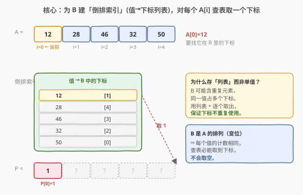
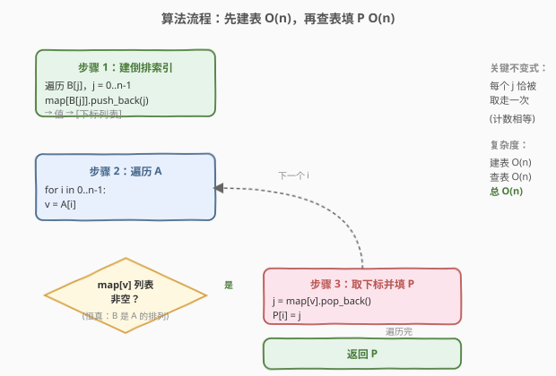
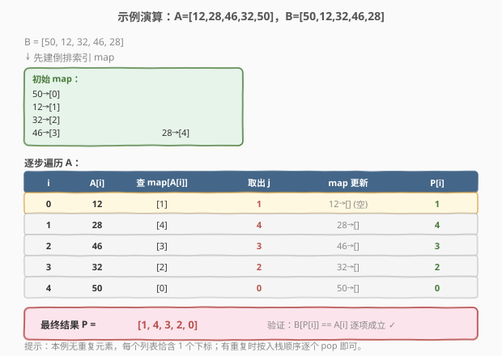

# 找出变位映射

- **题目名称**：找出变位映射
- **链接**：[760. 找出变位映射](https://leetcode.cn/problems/find-anagram-mappings/)
- **难度**：简单
- **标签**：数组、哈希表

## 1. 题目概述

给定两个整数数组 `nums1` 和 `nums2`，其中 `nums2` 是 `nums1` 的一个**变位映射（anagram）**，即 `nums2` 是 `nums1` 中元素的一种**排列**（每个值出现的次数完全相同）。

要求返回一个**下标映射数组** `P`，长度与 `nums1` 相同，使得对每个下标 `i` 都有：

$$\text{nums2}[P[i]] = \text{nums1}[i]$$

即 `P[i]` 表示 `nums1` 的第 `i` 个元素在 `nums2` 中所处的下标。若同一值在 `nums2` 中出现多次，返回**任意一个合法映射**均可。

**示例 1**：

```text
输入：nums1 = [12, 28, 46, 32, 50], nums2 = [50, 12, 32, 46, 28]
输出：[1, 4, 3, 2, 0]
解释：
  P[0] = 1，因为 nums2[1] = 12 = nums1[0]
  P[1] = 4，因为 nums2[4] = 28 = nums1[1]
  P[2] = 3，因为 nums2[3] = 46 = nums1[2]
  P[3] = 2，因为 nums2[2] = 32 = nums1[3]
  P[4] = 0，因为 nums2[0] = 50 = nums1[4]
```

**示例 2**：

```text
输入：nums1 = [84, 46], nums2 = [46, 84]
输出：[1, 0]
```

**约束条件**：

- $1 \leq \text{nums1.length} \leq 100$
- $\text{nums2.length} = \text{nums1.length}$
- $0 \leq \text{nums1}[i], \text{nums2}[i] < 10^5$
- `nums1` 与 `nums2` 互为排列（变位映射）

> 💡 **题目本质**：把 `nums2` 看作一个"已打乱顺序"的数组，对 `nums1` 中的每个元素，问它"被搬到了 `nums2` 的哪个位置"。这是经典的**倒排索引（inverted index）**应用——把"值→下标"的映射预先建好，查询时 $O(1)$ 取用。本题是 [1. 两数之和](../0001-0100/1_两数之和.md) 哈希查找思想的姊妹题：两题都是"为 $O(n)$ 暴力查找配哈希加速到 $O(1)$"，只是一个查补数、一个查位置。

---

## 2. 解题思路

### 2.1 暴力思路：对每个 A[i] 线性扫描 B

最直观的做法：对每个 `nums1[i]`，从左到右扫描 `nums2`，找到第一个满足 `nums2[j] == nums1[i]` 的下标 `j`，记为 `P[i]`。

```text
for i in 0..n-1:
    for j in 0..n-1:
        if nums2[j] == nums1[i]:
            P[i] = j; break
```

时间复杂度 $O(n^2)$。对 $n \leq 100$ 的数据规模，约 $10^4$ 次比较，能过但低效。问题出在：对每个 `nums1[i]`，定位 `nums2` 中的位置用了 $O(n)$ 线性扫描——这正是哈希表能优化到 $O(1)$ 的环节。

> ⚠️ **重复元素的隐患**：若 `nums2` 含重复值（如 `nums1 = [1,1]`, `nums2 = [1,1]`），暴力"找第一个"会让 `P = [0, 0]`，虽然 `nums2[P[i]] == nums1[i]` 仍成立，但两个 `P` 值相同。题目允许任意合法映射，所以这不算错；但若要求 `P` 本身也是排列（双射），暴力法需额外标记"已用过"的下标避免复用。下文哈希解法用"列表 + 取出"天然保证不重复使用。

### 2.2 核心观察：为 B 建「倒排索引」，O(1) 查表取下标



关键洞察分两层：

**第一层——把"找位置"转化为"查表"**：`P[i]` 的本质是"`nums1[i]` 这个值在 `nums2` 中的位置"。与其每次线性扫 `nums2`，不如**一次性**把 `nums2` 的"值→下标"关系存进哈希表，之后每次查询 $O(1)$。

**第二层——值可能重复，要存"下标列表"而非单值**：`nums2` 中同一个值可能出现多次（占据多个不同下标）。若哈希表只存单值 `map[v] = j`，遇到重复值会丢失部分下标。正确做法是存**下标列表** `map[v] = [j1, j2, ...]`，查询时从列表里**取出一个**（pop）。由于 `nums2` 是 `nums1` 的排列，每个值的计数相等，列表绝不会在中途取空。

> 💡 **为什么不直接存单值也能 AC？** 因为题目只要求 `nums2[P[i]] == nums1[i]`，不强求 `P` 是双射。`map[v] = j`（存最后一个下标）对每个 `nums1[i]` 都能给出一个合法 `j`，结果是合法映射（但不一定是双射）。存列表 + pop 的版本额外保证了 `P` 本身也是排列（每个下标恰用一次），更"干净"，是更推荐的写法。

### 2.3 算法流程图



整个流程两阶段：

1. **建表**：遍历 `nums2`，对每个 `j`，执行 `map[nums2[j]].push_back(j)`。得到"值 → 下标列表"的倒排索引。$O(n)$。
2. **查表填 P**：遍历 `nums1`，对每个 `i`，取 `v = nums1[i]`，从 `map[v]` 弹出一个下标 `j`（`pop_back`），令 `P[i] = j`。$O(n)$。

总时间 $O(n)$，空间 $O(n)$。每个下标恰被存一次、取一次，无浪费。

### 2.4 示例演算

以**示例 1** 演算全过程：



| 步骤 | i | nums1[i] | 查 map | 取出 j | map 更新 | P[i] |
|------|---|----------|--------|--------|----------|------|
| ① | 0 | 12 | [1] | 1 | 12→[] | 1 |
| ② | 1 | 28 | [4] | 4 | 28→[] | 4 |
| ③ | 2 | 46 | [3] | 3 | 46→[] | 3 |
| ④ | 3 | 32 | [2] | 2 | 32→[] | 2 |
| ⑤ | 4 | 50 | [0] | 0 | 50→[] | 0 |

> 💡 **看不变式**：每步"取出 j"后，该值在 `map` 中的列表变空（本例无重复，每值恰 1 个下标）。最终 `P = [1,4,3,2,0]`，验证 `nums2[P[i]] = [12,28,46,32,50] = nums1` ✓。若有重复值（如 `nums2 = [5,5]`），map 中 `5→[0,1]`，第一个查询 pop 出 1、第二个 pop 出 0（后进先出），`P = [1,0]`，仍满足 `nums2[P[i]] == nums1[i]` 且 `P` 是双射。

---

## 3. 参考代码

### C++（哈希表 + 下标列表）

```cpp
class Solution {
  public:
    vector<int> anagramMappings(vector<int>& nums1, vector<int>& nums2) {
        unordered_map<int, vector<int>> mp; // 值 -> 下标列表（倒排索引）
        for (int j = 0; j < nums2.size(); j++)
            mp[nums2[j]].push_back(j);

        vector<int> P(nums1.size());
        for (int i = 0; i < nums1.size(); i++) {
            auto& lst = mp[nums1[i]];
            P[i] = lst.back(); // 取一个下标
            lst.pop_back();    // 弹出，避免重复使用
        }
        return P;
    }
};
```

### Python

```python
class Solution:
    def anagramMappings(self, nums1: List[int], nums2: List[int]) -> List[int]:
        from collections import defaultdict
        pos = defaultdict(list)  # 值 -> 下标列表
        for j, v in enumerate(nums2):
            pos[v].append(j)

        P = [0] * len(nums1)
        for i, v in enumerate(nums1):
            P[i] = pos[v].pop()  # 取一个下标（弹出，避免重复使用）
        return P
```

> ⚠️ **存单值的简化版（仅当不需要 P 为双射时）**：若题目保证值无重复，或接受 `P` 非双射，可省去列表：`mp = {v: j for j, v in enumerate(nums2)}`，然后 `P[i] = mp[nums1[i]]`。更简洁但遇到重复值会丢失部分下标（仍给出合法但非双射的映射）。面试中推荐列表版，鲁棒且能解释清楚"为什么不重复使用下标"。

---

## 4. 复杂度分析

| 维度 | 复杂度 | 说明 |
|------|--------|------|
| 时间复杂度 | $O(n)$ | 建表遍历 `nums2` 一次 $O(n)$；填 `P` 遍历 `nums1` 一次 $O(n)$；每次哈希操作 $O(1)$ |
| 空间复杂度 | $O(n)$ | 哈希表存全部 $n$ 个下标（分散在各值的列表中），结果数组 $O(n)$ |

> 💡 本题 $n \leq 100$，$O(n^2)$ 暴力也轻松通过，但哈希解法展示了"用空间换时间"的经典思想，是面试中展示分析能力的更好选择。

---

## 5. 扩展：要求 P 为双射时的保证

题目只要求 `nums2[P[i]] == nums1[i]`，并未要求 `P` 本身是排列。但"列表 + pop"的写法**额外**保证了 `P` 是一个双射（每个 `nums2` 的下标恰被使用一次）。其正确性源于不变式：

- **建表后**：`map[v]` 的长度 = 值 `v` 在 `nums2` 中的出现次数。
- **填 P 过程中**：对 `nums1` 中值 `v` 的每次查询，`map[v]` 长度减 1；由于 `nums1` 与 `nums2` 互为排列，`v` 在 `nums1` 中的出现次数等于在 `nums2` 中的出现次数，故每次查询时 `map[v]` 必非空，且遍历结束后所有列表恰好清空。
- **结论**：`P` 的每个元素互不相同（每个 `nums2` 下标被 pop 一次），构成双射。

> 💡 这一不变式与 [1. 两数之和](../0001-0100/1_两数之和.md) 的"先查后存"顺序保证类似：都是通过操作次序维护一个不变式，避免"重复使用"的错误。两题共享"哈希表 + 计数/次序不变式"的核心范式。

---

## 6. 面试要点

1. **为什么用哈希表？它把哪一步从 O(n) 降到了 O(1)？**

   - 暴力法对每个 `nums1[i]` 在 `nums2` 中线性扫描找位置，这一步 $O(n)$。哈希表把"按值查位置"优化到 $O(1)$ 平均时间，整体从 $O(n^2)$ 降到 $O(n)$。

2. **为什么要存「下标列表」而不是单个下标？**

   - `nums2` 可能含重复值，同一值占据多个不同下标。若只存单值 `map[v] = j`，会丢失其余下标。存列表 `map[v] = [j1, j2, ...]` 才能完整记录所有位置，并在查询时逐个取用。

3. **`pop_back` / `pop` 操作保证了什么？为什么不会取空？**

   - 取出后立即弹出，保证每个 `nums2` 下标至多被使用一次，使 `P` 构成双射。不会取空是因为 `nums2` 是 `nums1` 的排列：每个值在两数组中出现次数相等，查询次数恰等于列表初始长度（见第 5 节不变式）。

4. **如果只存单值（不弹列表），结果还正确吗？**

   - 仍正确——题目只要求 `nums2[P[i]] == nums1[i]`，单值版对每个 `nums1[i]` 都能给出一个使等式成立的 `j`。但 `P` 可能非双射（多个 `nums1[i]` 映射到同一 `nums2` 下标）。若面试官追问"能否保证 `P` 也是排列"，再升级为列表版。

5. **本题和 [1. 两数之和](../0001-0100/1_两数之和.md) 的哈希用法有何异同？**

   - 相同：都用哈希表把一次 $O(n)$ 查找优化到 $O(1)$，整体 $O(n^2) \to O(n)$，都是"空间换时间"。
   - 不同：两数之和查的是"补数"（边查边存，单向追溯）；本题查的是"值的位置"（先全量建表，再批量查询）。两数之和的哈希表存"已遍历部分"，本题存"整个 `nums2`"——因为查询对象不同，建表时机也不同。

---

## 7. 同类练习题

- [1. 两数之和](https://leetcode.cn/problems/two-sum/)（[题解](../0001-0100/1_两数之和.md)）：哈希表把"找配对元素"从 $O(n)$ 降到 $O(1)$，本题的姊妹题（一个查补数、一个查位置）
- [350. 两个数组的交集 II](https://leetcode.cn/problems/intersection-of-two-arrays-ii/)：用哈希表统计一个数组的值频率，再遍历另一个数组匹配——与本题"建倒排索引再查表"同构
- [290. 单词规律](https://leetcode.cn/problems/word-pattern/)（[题解](../0001-0100/290_单词规律.md)）：双向哈希建立"字符↔单词"的映射关系，与本题"值↔下标"映射同属哈希查表范式
- [219. 存在重复元素 II](https://leetcode.cn/problems/contains-duplicate-ii/)：哈希表记录每个值最近的下标，查询时比对下标差——同为"值→下标"哈希索引的应用
