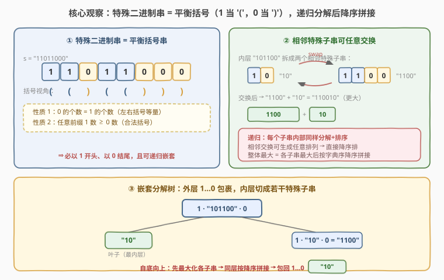
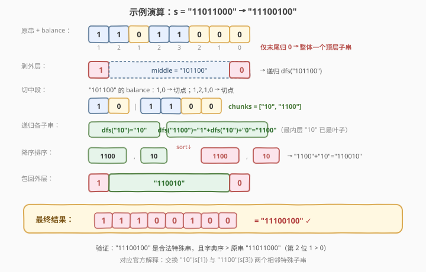

# 特殊的二进制字符串

- **题目名称**：特殊的二进制字符串
- **链接**：[761. 特殊的二进制字符串](https://leetcode.cn/problems/special-binary-string/)
- **难度**：困难
- **标签**：递归、分治、排序、字符串、括号匹配

## 1. 题目概述

**特殊的二进制字符串**是具有以下两条性质的二进制序列：

- `0` 的数量与 `1` 的数量相等；
- 每一个前缀中 `1` 的数量都大于等于 `0` 的数量。

给定一个特殊二进制字符串 `s`。一次操作：选择 `s` 中**两个连续的、非空的特殊子串**并交换它们（连续指前一个的末字符与后一个的首字符下标相差 1）。返回任意次操作后能得到的**字典序最大**的字符串。

**示例 1**：

```text
输入：s = "11011000"
输出："11100100"
解释：将子串 "10"（出现在 s[1]）和 "1100"（出现在 s[3]）交换，得到字典序最大的结果。
```

**示例 2**：

```text
输入：s = "10"
输出："10"
解释：只有一个特殊子串，无法交换，原样返回。
```

**约束条件**：

- $1 \leq \text{s.length} \leq 50$
- `s[i]` 为 `'0'` 或 `'1'`
- `s` 本身是一个特殊的二进制字符串

> ⚠️ 两条性质合起来正是**合法括号串**的定义：把 `1` 当作 `'('`、`0` 当作 `')'`，则「0、1 等量」= 左右括号等量，「前缀 1 ≥ 0」= 任意前缀左括号不少于右括号。本题本质是「重排一个合法括号串使其字典序最大」。

---

## 2. 解题思路

### 2.1 暴力思路

枚举所有可能的交换序列，在巨大状态空间里搜索字典序最大的结果。特殊子串可能位于任意嵌套层级，相邻交换的组合数随长度指数增长，$n=50$ 时完全不可行。

退一步：能否贪心地「把较大的子串往前挪」？难点在于子串是**嵌套**的——一个特殊串外层 `1…0` 里还包着若干特殊子串，必须先处理内部再决定外部顺序。这提示了**自底向上的递归分治**。

> 💡 暴力的核心痛点：没有看出「特殊二进制串 = 合法括号串」这一结构，因而无法利用括号的**唯一嵌套分解**。

### 2.2 核心观察：把特殊串当括号串，递归分解后降序拼接



关键一步是换上括号视角。一个非空特殊串 $S$（即合法括号串）必有：

- **首字符是 `1`、末字符是 `0`**：若首字符为 `0`，第一个前缀 `0` 中 `1<0`，违反性质 2；若末字符为 `1`，由等量性知存在更早的 `0` 使某前缀 `1<0`，同样违反。
- 于是 $S = 1 \cdot M \cdot 0$，其中 $M$（去掉首 1 末 0 的中段）仍是合法括号串（可能为空）。

**唯一分解**：用计数器 `balance`（遇 `1` 加 1、遇 `0` 减 1）扫描 $S$，每当 `balance` 归 0 就切出一个**顶层特殊子串**。这些顶层子串彼此相邻、互不嵌套，是「不可再合并」的最大平衡单元（也称**本原 Dyck 词**）。切分结果是唯一的。

> 💡 **为什么 `balance` 归 0 的切点恰好是顶层边界？** `balance` 归 0 意味着从 `start` 到当前位 `0、1` 等量且所有前缀非负——正是一个完整特殊子串。若不在这里切，继续往后会进入「前缀 balance 又升高」的区间，说明后段被包进了一个新的平衡单元，二者无法合并为一个本原单元。

**两层最优化**：

1. **层内**：每个顶层子串 $c_i = 1 \cdot M_i \cdot 0$，其内部 $M_i$ 可递归地重排到最大，再包回 `1…0` 得到 $c_i$ 的最大形态。
2. **层间**：各顶层子串（已是各自最大形态）是「相邻特殊子串」，相邻交换可生成**任意排列**，因此直接按字典序**降序拼接**即得该层最大。

> ⚠️ **为什么「直接降序排序」就最优，而不需要「最大数」那种 $a+b$ vs $b+a$ 的自定义比较器？** 因为顶层子串都是**本原 Dyck 词**：没有任何一个是另一个的真前缀（若 $A$ 是 $B$ 的真前缀且都平衡，则 $B=A+X$，$X$ 非空平衡，于是 $B$ 在 $|A|$ 处 `balance` 就归 0，不本原——矛盾）。对「互不为前缀」的串，$a \ge b \iff a+b \ge b+a$（比较在第一个相异位即决出），故字典序降序等价于拼接序最大，普通 `sort(reverse=True)` 即正确。这是本题与 [179. 最大数](https://leetcode.cn/problems/largest-number/) 的关键区别。

### 2.3 算法流程图


**递归三步法** `dfs(s)`：

1. **出口**：`len(s) <= 2` 直接返回 `s`（即 `"10"` 或空串，已无可交换项，天然最大）。
2. **切分**：`balance` 扫描，每次归 0 取出顶层子串 `chunk = s[start..i]`，剥掉首 1 末 0 得 `middle = s[start+1..i]`，递归 `dfs(middle)` 后包回，得到 `"1" + dfs(middle) + "0"`，加入 `chunks`。
3. **排序拼接**：`chunks` 按字典序降序排序，返回 `"".join(chunks)`。

> 💡 递归是**自底向上**的：先到达最内层（叶子 `"10"`），回溯时把同层子串降序拼好，再包回外层 `1…0`，逐层向上。整棵嵌套树都被最大化。

### 2.4 示例演算

以 $s = \text{"11011000"}$ 为例：



| 步骤 | 操作 | 结果 |
|------|------|------|
| 扫描 | `balance` 仅在末位归 0 → 整体是一个顶层子串 | 顶层 = `"11011000"` |
| 剥外层 | 去首 1 末 0，得中段 `middle = "101100"` | 递归 `dfs("101100")` |
| 切中段 | `balance` 在位 1、位 5 归 0 → 切成 `"10"` 与 `"1100"` | `chunks = ["10","1100"]` |
| 递归各子串 | `dfs("10")="10"`；`dfs("1100")="1"+dfs("10")+"0"="1100"` | `["10","1100"]`（已最大） |
| 降序排序 | `"1100" > "10"` → `["1100","10"]` | 拼得 `"110010"` |
| 包回外层 | `"1" + "110010" + "0"` | `"11100100"` ✓ |

验证：`"11100100"` 仍是合法特殊串（`balance` 全程非负、末位归 0），且第 2 位 `1 > 0` 使其字典序严格大于原串 `"11011000"`。对应官方解释：交换 `"10"`(s[1]) 与 `"1100"`(s[3]) 这两个相邻特殊子串。

---

## 3. 参考代码

### C++

```cpp
class Solution {
  public:
    string makeLargestSpecial(string s) {
        return dfs(s);
    }
  private:
    string dfs(const string& s) {
        if (s.size() <= 2) return s;                 // "10" 或空，天然最大
        vector<string> chunks;
        int bal = 0, start = 0;
        for (int i = 0; i < (int)s.size(); ++i) {
            bal += (s[i] == '1') ? 1 : -1;
            if (bal == 0) {                          // 顶层特殊子串边界
                string middle = s.substr(start + 1, i - start - 1);
                chunks.push_back("1" + dfs(middle) + "0");  // 递归中段再包回
                start = i + 1;
            }
        }
        sort(chunks.begin(), chunks.end(), greater<string>());  // 降序拼接
        string res;
        for (auto& c : chunks) res += c;
        return res;
    }
};
```

### Python

```python
class Solution:
    def makeLargestSpecial(self, s: str) -> str:
        if len(s) <= 2:                              # "10" 或空，天然最大
            return s
        chunks = []
        bal = 0
        start = 0
        for i, ch in enumerate(s):
            bal += 1 if ch == '1' else -1
            if bal == 0:                             # 顶层特殊子串边界
                middle = s[start + 1:i]
                chunks.append('1' + self.makeLargestSpecial(middle) + '0')
                start = i + 1
        return ''.join(sorted(chunks, reverse=True))  # 降序拼接
```

> ⚠️ **三个高频踩坑点**：
> （1）**剥的是「中段」而非整段递归**：`chunk = "1" + middle + "0"`，递归调用传 `middle`（去掉首 1 末 0），再把结果包回 `1…0`。若直接对 `chunk` 整段递归会重复剥层、破坏结构。
> （2）**`balance` 必须从 `start` 处归零计数**：每个顶层子串的 `balance` 从 1 起步、在其末位归 0。误用全局 `balance` 不重置会把多个子串糊成一团。代码中 `bal` 在每段内自然从 1 走到 0，`start` 同步推进，无需显式重置。
> （3）**别套用「最大数」比较器**：本题顶层子串互不为前缀（本原 Dyck 词），普通字典序降序即最优；若画蛇添足用 `a+b < b+a` 排序虽不致错但徒增复杂度，且模糊了「本原性」这一关键性质。

---

## 4. 复杂度分析

| 维度 | 复杂度 | 说明 |
|------|--------|------|
| **时间复杂度** | $O(n^2)$ | 递归深度最深 $O(n)$（完全嵌套如 $1^n0^n$）；每个字符按其嵌套深度被反复扫描，总计 $O(n^2)$；同层排序比较字符串最长 $O(n)$ |
| **空间复杂度** | $O(n)$ | 递归栈深 $O(n)$；每层 `chunks` 切片合计 $O(n)$（输出串不计） |

> 💡 $n \leq 50$，任何多项式复杂度都瞬时通过。本题的难点不在性能而在**识破括号结构与递归分解**——一旦建模正确，代码不到 10 行。

---

## 5. 扩展：本原 Dyck 词与「降序即最优」的证明

### 5.1 顶层子串互不为前缀

顶层子串都是**本原 Dyck 词**——`balance` 仅在末位首次归 0。若本原词 $A$ 是另一本原词 $B$ 的真前缀，则 $B = A + X$（$X$ 非空平衡），于是 $B$ 在 $|A|$ 处 `balance` 已归 0，与「本原」矛盾。故任意两个顶层子串互不为前缀。

### 5.2 互不为前缀 ⇒ 字典序降序即拼接最大

对互不为前缀的串 $a, b$，设 $k$ 为首个相异位。在 $a+b$ 中第 $k$ 位是 $a[k]$，在 $b+a$ 中第 $k$ 位是 $b[k]$，二者比较与 $a$ vs $b$ 同位决出，故 $a \ge b \iff a+b \ge b+a$。由交换论证，按字典序降序排列即得全局拼接最大。这正是本题能用普通 `sort` 而无需自定义比较器的原因。

### 5.3 操作不变量

允许的「相邻特殊子串交换」保持**顶层子串多重集**不变（交换两个顶层单元只重排顺序；交换某单元内部的两段只影响该单元内部，递归处理）。因此整个问题可分解为「逐层最大化 + 层间降序」，递归解即为全局最优。

---

## 6. 面试要点

1. **如何想到把特殊二进制串当成括号串？**

   - 两条性质逐条对照：`0、1` 等量 ↔ 左右括号等量；前缀 `1` ≥ `0` ↔ 前缀左括号 ≥ 右括号。把 `1` 当 `'('`、`0` 当 `')'` 即一一对应。识别出合法括号串后，套用括号的唯一嵌套分解即可递归处理。

2. **为什么用 `balance` 归 0 来切分顶层子串？**

   - `balance` 从段首 `1` 起步，每当它回到 0，意味着这一段 `0、1` 等量且全程非负——正是一个完整特殊子串；不在此切则会进入新的平衡单元，无法合并为本原单元。切分结果是唯一且互不嵌套的顶层单元序列。

3. **为什么递归处理的是「中段」而不是整个子串？**

   - 一个顶层子串形如 `1 · M · 0`，外层 `1…0` 不可拆（已本原），能被重排的只有内部 $M$。故递归 `dfs(M)` 把中段最大化，再包回 `1…0`。直接递归整段会重复剥层、破坏嵌套结构。

4. **为什么普通降序排序就最优，不用「最大数」的比较器？**

   - 顶层子串都是本原 Dyck 词，互不为前缀。对互不为前缀的串，$a \ge b \iff a+b \ge b+a$，字典序降序等价于拼接最大。最大数问题里候选可能互为前缀（如 `"11"` 与 `"110"`），才需要 $a+b$ vs $b+a$ 的自定义比较器。

5. **递归深度会爆吗？**

   - 最坏完全嵌套（如 `"111…000"`）深度 $O(n)$，$n \le 50$ 远低于 Python 默认 1000 上限，无需调整。若 $n$ 极大可改用显式栈的迭代版（自底向上按嵌套深度分层处理）。

---

## 7. 同类练习题

- [20. 有效括号](https://leetcode.cn/problems/valid-parentheses/)（[题解](../0001-0100/20_有效括号.md)）：栈判定合法括号，对比本题「1/0 当括号」的基础视角
- [22. 括号生成](https://leetcode.cn/problems/generate-parentheses/)（[题解](../0001-0100/22_括号生成.md)）：回溯构造平衡括号串，对比本题「分解并重排已有平衡括号串」
- [32. 最长有效括号](https://leetcode.cn/problems/longest-valid-parentheses/)（[题解](../0001-0100/32_最长有效括号.md)）：在串中找最长合法括号子段，对比「整体合法」与「子段合法」
- [301. 删除无效的括号](https://leetcode.cn/problems/remove-invalid-parentheses/)（[题解](../0301-0400/301_删除无效的括号.md)）：括号合法性 + 回溯剪枝，同属括号家族
- [1111. 有效括号的嵌套深度](https://leetcode.cn/problems/maximum-nesting-depth-of-two-valid-parentheses-strings/)：同样把平衡括号串递归分解为顶层组，对比「分配深度」与「降序重排」
