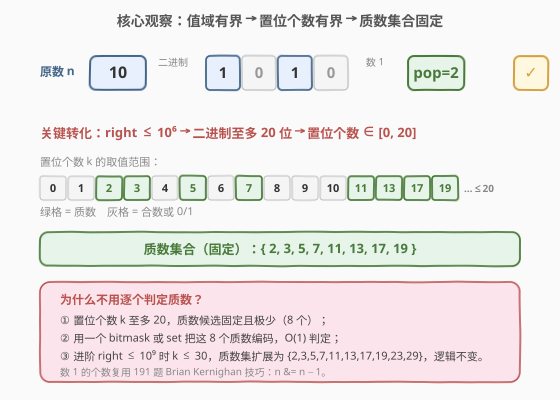
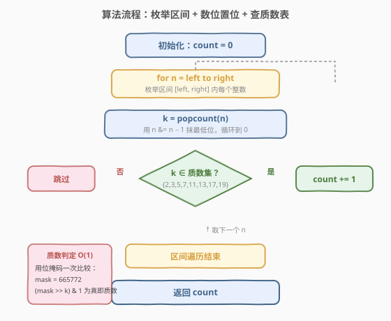
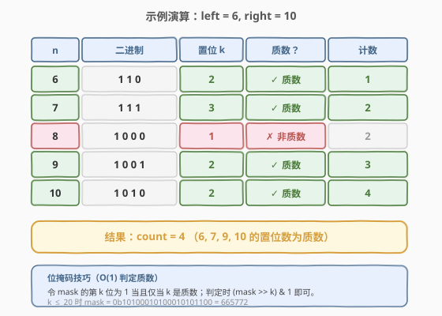

# 二进制表示中质数个置位

- **题目名称**：二进制表示中质数个置位
- **链接**：[762. 二进制表示中质数个置位](https://leetcode.cn/problems/prime-number-of-set-bits-in-binary-representation/)
- **难度**：简单
- **标签**：位运算、数学

## 1. 题目概述

给定两个整数 `left` 和 `right`，返回区间 `[left, right]`（含两端）内**二进制表示中 `1` 的个数为质数**的整数数目。

> 💡 **置位（set bit）**：二进制中值为 `1` 的位，其总数又称「汉明重量 / popcount」（见 [191. 位 1 的个数](../0001-0100/191_位1的个数.md)）。

**示例 1**：

```text
输入：left = 6, right = 10
输出：4
解释：
  6  = 110   → 2 个置位（2 是质数）  ✓
  7  = 111   → 3 个置位（3 是质数）  ✓
  8  = 1000  → 1 个置位（1 非质数）  ✗
  9  = 1001  → 2 个置位（2 是质数）  ✓
  10 = 1010  → 2 个置位（2 是质数）  ✓
  共 4 个。
```

**示例 2**：

```text
输入：left = 10, right = 15
输出：5
解释：
  10 = 1010 → 2（质数）  ✓
  11 = 1011 → 3（质数）  ✓
  12 = 1100 → 2（质数）  ✓
  13 = 1101 → 3（质数）  ✓
  14 = 1110 → 3（质数）  ✓
  15 = 1111 → 4（非质数）✗
  共 5 个。
```

**约束条件**：

- $1 \le \text{left} \le \text{right} \le 10^6$

> ⚠️ **进阶**：若 $\text{right} \le 10^9$，方法是否仍适用？见第 5 节——答案是可以，因为 $10^9 < 2^{30}$，置位个数至多 30，质数集合只是稍微扩大。

---

## 2. 解题思路

### 2.1 暴力思路

对区间 `[left, right]` 中的每个数 `n`：

1. 数出其二进制中 `1` 的个数 `k`（popcount）；
2. 判定 `k` 是否为质数；
3. 若是质数则计数器 `+1`。

朴素实现中，popcount 可逐位移位统计，质数判定可对 `k` 试除到 $\sqrt{k}$。由于 $right \le 10^6$，区间至多 $10^6$ 个数，popcount 至多循环 20 次，质数判定至多试除 $\sqrt{20} \approx 4$ 次，总运算量约 $8 \times 10^7$，能 AC 但有明显冗余。

> 💡 转机在于：**值域有界**这一约束把「质数判定」从「需要计算的问题」变成了「查表即可的常量」。

### 2.2 核心观察：值域有界 → 质数集合固定



关键观察分两步：

1. **置位个数有上界**：$\text{right} \le 10^6 < 2^{20}$，故任意 $n \in [\text{left}, \text{right}]$ 的二进制位数不超过 20，置位个数 $k \in [0, 20]$。
2. **质数集合固定**：$[0, 20]$ 内的质数只有 **8 个**：$\{2, 3, 5, 7, 11, 13, 17, 19\}$。$0$ 和 $1$ 不是质数，$4=2\times2$、$6=2\times3$ 等为合数。

> 💡 **关键转化**：既然 $k$ 的取值范围只有 21 种可能，而其中质数仅 8 个，就无需对每个 $k$ 重新做试除——**把这 8 个质数预先编码进一个位掩码（bitmask）或集合**，判定 $k$ 是否为质数变为 $O(1)$ 的查表。

**位掩码技巧**：构造整数 `mask`，其第 $k$ 位为 `1` 当且仅当 $k$ 是质数。判定时只需检查 `(mask >> k) & 1` 是否为 `1`：

$$
\text{mask} = \sum_{p \in \{2,3,5,7,11,13,17,19\}} 2^p = 665772
$$

即 `mask = 0b10100010100010101100 = 665772`。

> ⚠️ **注意 $k=0$ 与 $k=1$**：`n=0` 的置位数为 0（非质数），`n=1`（二进制 `1`）的置位数为 1（1 不是质数）。掩码中第 0、1 位均为 `0`，天然排除。

### 2.3 算法流程图



算法只需一个循环加两个 $O(1)$ 步骤：

1. `count = 0`，预置质数掩码 `mask = 665772`。
2. 对每个 $n \in [\text{left}, \text{right}]$：
   - 用 **Brian Kernighan 技巧** `n & (n-1)` 数出置位个数 $k$（复用 [191](../0001-0100/191_位1的个数.md) 的方法）；
   - 检查 `(mask >> k) & 1` 是否为 `1`；
   - 为 `1` 则 `count += 1`。
3. 返回 `count`。

> 💡 **为什么 popcount 也用位运算？** 题目标签是「位运算」，面试官期待看到 `n & (n-1)` 抹最低位的写法而非 `bin(n).count('1')`。两者结果一致，但前者展示了位运算功底，且在 C++ 中无需依赖标准库。

### 2.4 示例演算

以示例 1 的 `left = 6, right = 10` 为例，逐数推演：



| $n$ | 二进制 | 置位 $k$ | $k$ 质数？ | 计数 |
|-----|--------|---------|-----------|------|
| 6 | `110` | 2 | ✓ 质数 | 1 |
| 7 | `111` | 3 | ✓ 质数 | 2 |
| 8 | `1000` | 1 | ✗ 非质数 | 2 |
| 9 | `1001` | 2 | ✓ 质数 | 3 |
| 10 | `1010` | 2 | ✓ 质数 | 4 |

5 个数中 4 个满足条件，`count = 4` ✓。注意 `8`（`1000`）只有一个置位，而 `1` 不是质数，被排除。

> 💡 **观察**：$k=1$ 永远不是质数，这意味着所有 $2$ 的幂（$1, 2, 4, 8, 16, \ldots$）都不计入结果——它们二进制恰有一个 `1`。

---

## 3. 参考代码

### C++

```cpp
class Solution {
  public:
    int countPrimeSetBits(int left, int right) {
        int count = 0;
        // mask 第 k 位为 1 当且仅当 k 是质数（k ∈ {2,3,5,7,11,13,17,19}）
        int mask = 0b10100010100010101100;  // = 665772
        for (int n = left; n <= right; ++n) {
            int k = __builtin_popcount(n);  // 数 1 的个数
            if (mask >> k & 1) {
                ++count;
            }
        }
        return count;
    }
};
```

若不使用 `__builtin_popcount`，可用 Brian Kernighan 技巧手写 popcount：

```cpp
class Solution {
  public:
    int countPrimeSetBits(int left, int right) {
        int count = 0;
        int mask = 665772;
        for (int n = left; n <= right; ++n) {
            int k = 0, t = n;
            while (t) {
                t &= t - 1;  // 抹掉最低设置位
                ++k;
            }
            if (mask >> k & 1) {
                ++count;
            }
        }
        return count;
    }
};
```

### Python

```python
class Solution:
    def countPrimeSetBits(self, left: int, right: int) -> int:
        # mask 第 k 位为 1 当且仅当 k 是质数（k ≤ 20）
        mask = 0b10100010100010101100  # 665772
        count = 0
        for n in range(left, right + 1):
            k = n.bit_count()          # Python 3.10+，等价于 bin(n).count('1')
            if mask >> k & 1:
                count += 1
        return count
```

> ⚠️ **Python 版本差异**：`int.bit_count()` 是 Python 3.10+ 引入的。若环境较旧，用 `bin(n).count('1')` 替代，语义等价但稍慢。本题 $n \le 10^6$，性能差异可忽略。

也可用集合写法，可读性更好但语义等价：

```python
class Solution:
    def countPrimeSetBits(self, left: int, right: int) -> int:
        primes = {2, 3, 5, 7, 11, 13, 17, 19}
        return sum(1 for n in range(left, right + 1)
                   if n.bit_count() in primes)
```

---

## 4. 复杂度分析

| 维度 | 复杂度 | 说明 |
|------|--------|------|
| 时间复杂度 | $O((\text{right} - \text{left}) \cdot \log \text{right})$ | 遍历 $\text{right}-\text{left}+1$ 个数，每个数 popcount 至多循环 20 次（Brian Kernighan 为 popcount 次）；质数判定 $O(1)$ |
| 空间复杂度 | $O(1)$ | 仅 `mask`、`count` 等常数个变量 |

> 💡 由于 $\text{right} \le 10^6$，置位个数至多 20，popcount 的循环次数被常数封顶，故时间复杂度也可表述为 $O(\text{right} - \text{left})$。位掩码把质数判定从 $O(\sqrt{k})$ 降为 $O(1)$，是本题的核心优化点。

---

## 5. 扩展：进阶 right ≤ 10⁹

若约束放宽到 $\text{right} \le 10^9$，方法是否仍适用？

**仍然适用**，只需扩大质数集合。因为 $10^9 < 2^{30}$，置位个数 $k \in [0, 30]$，$[0, 30]$ 内的质数为：

$$
\{2, 3, 5, 7, 11, 13, 17, 19, 23, 29\}
$$

共 10 个。对应的位掩码为：

$$
\text{mask}_{30} = \sum_{p} 2^p = 545925292
$$

> 💡 此值小于 $2^{31}-1$，32 位整数即可容纳；Python 整数无此问题。

逻辑完全不变——这就是「值域有界 → 质数集合固定」思路的威力：**无论值域多大，只要置位个数有界（必然有界，因为整数位数有限），质数集合就是有限且固定的**。

```python
# right ≤ 10⁹ 版本，仅 mask 不同
mask_30 = 545925292  # {2,3,5,7,11,13,17,19,23,29}
```

---

## 6. 面试要点

1. **为什么质数集合可以预先固定？**

   - 因为 $\text{right} \le 10^6 < 2^{20}$，任意 $n$ 的置位个数 $k \le 20$，而 $[0,20]$ 内质数只有 $\{2,3,5,7,11,13,17,19\}$ 这 8 个。值域有界导致置位个数有界，进而质数候选固定，无需逐个试除。

2. **位掩码 `(mask >> k) & 1` 为什么是 O(1) 判定？**

   - `mask` 的第 $k$ 位预先编码了「$k$ 是否为质数」。右移 $k$ 位后取最低位，等价于查一张大小为 21 的布尔表。位移和按位与都是单条 CPU 指令，常数时间。

3. **`k = 0` 或 `k = 1` 时会怎样？**

   - `mask` 的第 0 位和第 1 位均为 `0`（0 和 1 都不是质数），故 `(mask >> 0) & 1 = 0`、`(mask >> 1) & 1 = 0`，自动判为非质数。无需特判，掩码设计已覆盖。

4. **为什么所有 2 的幂都不计入结果？**

   - $2$ 的幂的二进制恰有一个 `1`，即 $k = 1$。而 $1$ 不是质数（质数定义要求大于 1 的自然数），故被排除。这解释了 $1, 2, 4, 8, 16, \ldots$ 都不在答案中。

5. **popcount 用 `__builtin_popcount` 还是手写 `n & (n-1)`？**

   - 两者等价。`__builtin_popcount` 映射到 CPU `POPCNT` 指令，最快；手写 `n & (n-1)` 循环展示位运算功底，是面试官想看到的写法。本题规模下差异可忽略，但提及两种实现并说明取舍是加分项。

---

## 7. 同类练习题

- [191. 位 1 的个数](https://leetcode.cn/problems/number-of-1-bits/)（[题解](../0001-0100/191_位1的个数.md)）：`n & (n-1)` 抹最低设置位的母题，本题 popcount 的直接来源
- [338. 比特位计数](https://leetcode.cn/problems/counting-bits/)：对 `0..n` 批量求 popcount，用 DP 复用 `ans[i & (i-1)]`，本题的「批量版」
- [204. 计数质数](https://leetcode.cn/problems/count-primes/)（[题解](../0201-0300/204_计数质数.md)）：埃氏筛预计算质数表，与本题「质数集合预固定」思路同源
- [231. 2 的幂](https://leetcode.cn/problems/power-of-two/)：`n & (n-1) == 0` 判定，与本题「2 的幂恰有 1 个置位」相互印证
- [693. 交替位二进制数](https://leetcode.cn/problems/binary-number-with-alternating-bits/)：位运算性质判定，同样考察对二进制表示的观察
