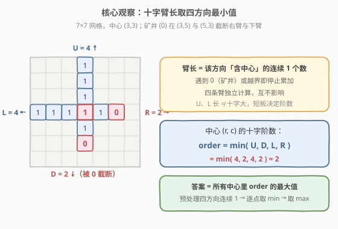
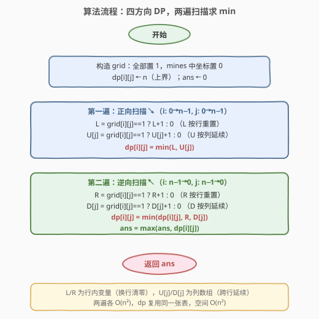

# LeetCode 最大加号标志 题解

## 1. 题目概述

- **标题 / 题号**：最大加号标志（#764，medium）
- **链接**：https://leetcode.cn/problems/largest-plus-sign/
- **难度**：中等
- **标签**：数组、动态规划

**题意**：在一个从 `(0, 0)` 到 `(n-1, n-1)` 的 `n × n` 网格中，每个格子默认为 `1`，只有给定的 `mines` 列表中的格子为 `0`。

一个**阶数为 `k` 的加号标志**（axis-aligned plus sign of order `k`）以某个格子 `(r, c)` 为中心，并向**上、下、左、右**四个方向各延伸长度 `k-1` 的「臂」，所有这些格子（含中心）都必须为 `1`。

返回网格中**最大**的加号标志阶数；若不存在任何加号标志，返回 `0`。

**示例 1**：

```text
输入：n = 5, mines = [[4, 2]]
输出：2
解释：网格如下，(4,2) 为 0：
     1 1 1 1 1
     1 1 1 1 1
     1 1 1 1 1
     1 1 1 1 1
     1 1 0 1 1
     最大的加号阶数为 2，例如以 (1,2) 或 (2,1) 等为中心。
```

**示例 2**：

```text
输入：n = 1, mines = [[0, 0]]
输出：0
解释：唯一的格子是 0，无法形成任何加号。
```

**约束**：

- `1 <= n <= 500`
- `1 <= mines.length <= n * n`
- `mines[i] = [xi, yi]`，且各 `mines` 互不相同
- `0 <= xi, yi < n`

> 💡 注意「阶数 `k`」的口径：阶数 `k` 的加号，四条臂各长 `k-1`（不含中心），即**某个方向（含中心）的连续 `1` 个数为 `k`**。因此阶数 $=1$ 表示只有中心自身为 `1`（最小加号）。

## 2. 解题思路

### 2.1 暴力思路

枚举每个格子作为中心，再对每个中心向四个方向逐步延伸，统计能延伸多少格才遇到 `0` 或越界，取四方向的最小值即为该中心的阶数。单点判定 `O(n)`，共 `O(n^2)` 个中心，总复杂度 `O(n^3)`。`n = 500` 时 `n^3 = 1.25 × 10^8`，会超时。

### 2.2 核心观察：四方向「连续 1 个数」取最小值



把暴力里「向某方向延伸」的结果预先算好：对每个格子 `(i, j)`，定义四个量

- $L[i][j]$：从 `(i, j)` 向**左**（含自身）的连续 `1` 个数；
- $R[i][j]$：向**右**（含自身）的连续 `1` 个数；
- $U[i][j]$：向**上**（含自身）的连续 `1` 个数；
- $D[i][j]$：向**下**（含自身）的连续 `1` 个数。

那么以 `(i, j)` 为中心的最大加号阶数就是四者的**最小值**：

$$
\text{order}(i, j) = \min\bigl(L[i][j],\ R[i][j],\ U[i][j],\ D[i][j]\bigr)
$$

> 💡 **关键转化**：四个方向各自只关心「沿该方向能连续走多远」，彼此独立。每个方向都是一维的「连续 `1` 计数」问题，可以用 DP 以 $O(1)$ 转移：
> - 向左：$L[i][j] = \text{grid}[i][j]==1\ ?\ L[i][j-1]+1 : 0$
> - 向右：$R[i][j] = \text{grid}[i][j]==1\ ?\ R[i][j+1]+1 : 0$
> - 向上：$U[i][j] = \text{grid}[i][j]==1\ ?\ U[i-1][j]+1 : 0$
> - 向下：$D[i][j] = \text{grid}[i][j]==1\ ?\ D[i+1][j]+1 : 0$
>
> 边界处（`j-1<0` 等）视为 `0`。整张表只需四遍扫描即可填完，每遍 $O(n^2)$。

### 2.3 算法流程图



实现上可以把四张表合并复用一张 `dp`：

- **正向扫描**（`i: 0→n-1`，`j: 0→n-1`）：同时算 `L`（行内变量，换行清零）与 `U[j]`（列方向数组，跨行延续），令 `dp[i][j] = min(L, U[j])`；
- **逆向扫描**（`i: n-1→0`，`j: n-1→0`）：同时算 `R` 与 `D[j]`，令 `dp[i][j] = min(dp[i][j], R, D[j])`，并更新答案 `ans = max(ans, dp[i][j])`。

两遍各 $O(n^2)$，空间 $O(n^2)$（`dp` + 两个长度为 `n` 的列数组 `U`、`D`）。

### 2.4 示例演算

![示例演算：n = 5, mines = [[4,2]]](../images/largest_plus_sign_example_walkthrough.svg)

以 `n = 5, mines = [[4,2]]` 为例，四张方向表与最终的 `min` 表如上图：

- `L` 表：每行从左累加，遇到 `0` 归零。`(4,2)` 是矿井，故第 4 行被截成 `1 2 0 1 2`。
- `U` 表：每列从上累加，矿井所在列 `(4,2)` 处归零。
- `R` 表：每行从右累加。
- `D` 表：每列从下累加，注意 `(0,2)` 向下只能走到 `(3,2)`（`(4,2)` 是 `0`），故 `D[0][2]=4`。
- `min` 表逐点取四方向最小值：`max = 2`（出现在 `(1,1)、(1,2)、(1,3)、(2,1)、(2,2)、(2,3)、(3,1)、(3,3)` 等格）。

最终答案为 `2`。

## 3. 参考代码

### C++

```cpp
class Solution {
  public:
    int orderOfLargestPlusSign(int n, vector<vector<int>>& mines) {
        // 用二维 dp 复用四张方向表；banned 记录矿井
        vector<vector<int>> dp(n, vector<int>(n, n));   // 初始化为上界 n
        unordered_set<int> banned;
        for (auto& m : mines) banned.insert(m[0] * n + m[1]);

        int ans = 0;
        // 第一遍：正向扫描，算 L（行内）与 U（列方向）
        vector<int> col(n, 0);                          // U[j]，跨行延续
        for (int i = 0; i < n; i++) {
            int left = 0;                               // L，行内重置
            for (int j = 0; j < n; j++) {
                bool one = !banned.count(i * n + j);
                left  = one ? left + 1  : 0;
                col[j] = one ? col[j] + 1 : 0;
                dp[i][j] = min(left, col[j]);
            }
        }
        // 第二遍：逆向扫描，算 R（行内）与 D（列方向），并取 min、更新答案
        vector<int> col2(n, 0);                         // D[j]
        for (int i = n - 1; i >= 0; i--) {
            int right = 0;                              // R，行内重置
            for (int j = n - 1; j >= 0; j--) {
                bool one = !banned.count(i * n + j);
                right  = one ? right + 1 : 0;
                col2[j] = one ? col2[j] + 1 : 0;
                dp[i][j] = min(dp[i][j], min(right, col2[j]));
                ans = max(ans, dp[i][j]);
            }
        }
        return ans;
    }
};
```

### Python

```python
class Solution:
    def orderOfLargestPlusSign(self, n: int, mines: List[List[int]]) -> int:
        banned = {(x, y) for x, y in mines}
        dp = [[n] * n for _ in range(n)]

        ans = 0
        # 第一遍：正向，L（行内）+ U（列方向）
        col = [0] * n
        for i in range(n):
            left = 0
            for j in range(n):
                one = (i, j) not in banned
                left = left + 1 if one else 0
                col[j] = col[j] + 1 if one else 0
                dp[i][j] = min(left, col[j])

        # 第二遍：逆向，R（行内）+ D（列方向），取 min 并更新答案
        col2 = [0] * n
        for i in range(n - 1, -1, -1):
            right = 0
            for j in range(n - 1, -1, -1):
                one = (i, j) not in banned
                right = right + 1 if one else 0
                col2[j] = col2[j] + 1 if one else 0
                dp[i][j] = min(dp[i][j], right, col2[j])
                ans = max(ans, dp[i][j])
        return ans
```

> ⚠️ **两个易错点**：
> 1. **矿井用哈希集合存，不要显式建 `n×n` 的 `grid` 再遍历填 `1`**。`n ≤ 500` 时 `grid` 也就 $2.5×10^5$，显式建也行，但用 `banned` 集合判定 `grid[i][j] == 1` 更省空间、更直接。注意把 `(i, j)` 编码成 `i * n + j`（C++）或元组 `(i, j)`（Python）。
> 2. **`dp` 初值取 `n`（上界），不是 `0`**。第一遍只写入了 `min(L, U)`，第二遍再用 `min(dp, R, D)` 收紧。若初值为 `0`，`min` 永远是 `0`，答案必错。等价地也可初值设 `INT_MAX`，但 `n` 已是每个方向的最大可能值，更贴合题意。

## 4. 复杂度分析

| 维度 | 复杂度 | 说明 |
|------|--------|------|
| 时间复杂度 | $O(n^2)$ | 两遍扫描，每遍遍历全部 $n^2$ 格；建 `banned` 集合 $O(m)$ |
| 空间复杂度 | $O(n^2)$ | `dp` 表 $n \times n$；`col`/`col2`/`banned` 均为 $O(n)$ 或 $O(m)$，被 $O(n^2)$ 吸收 |

## 5. 扩展：能否做到 $O(n)$ 空间？

本题 `dp` 表必须同时承载「四方向取 min」的结果，难以直接降到 $O(n)$。但若只需求**最大阶数**而不必回溯每个中心，可借助如下观察压缩：

- `L` 与 `R` 都是行内一维信息，可逐行算完即用；
- 但 `U`/`D` 是列方向信息，需跨行累积，必须保留列历史。

一个折中是「分两次」：先只用 `U`、`D` 两列数组算出每格的纵向臂长 $\min(U, D)$ 存入一张 $n \times n$ 表（仍 $O(n^2)$），再逐行扫 `L`、`R` 与之取 min。因此 $O(n^2)$ 空间在本题的「四方向交汇」结构下基本不可避免，是这类**多向 DP** 的固有代价。

> 💡 若把题目改成「只看横向加号」（只取左右臂），则可降到 $O(n)$ 空间——因为没有跨行信息。本题的 $O(n^2)$ 来自「纵向臂长需要逐列记忆」。

## 6. 面试要点

1. **为什么阶数是四方向连续 `1` 个数的 `min`，而不是 `max` 或 `sum`？**

   - 阶数 `k` 要求四条臂**同时**各延伸 `k-1` 格。任何一条方向先遇到 `0`/越界，该中心就无法支撑更大的 `k`。所以「最短的那条臂」决定上限，取 `min`。

2. **`L/R` 是行内变量、`U/D` 却要用列数组，为什么？**

   - `L`、`R` 只依赖同一行左侧/右侧的连续 `1`，扫描到本行时即可一路累加，换行自然清零，用标量即可。`U`、`D` 依赖同一列上方/下方的状态，扫描跨行进行，必须用长度为 `n` 的数组 `col[j]` 把每列的「当前连续 `1` 个数」带到下一行。

3. **为什么两遍扫描可以合并复用同一张 `dp`？**

   - 第一遍写入 `min(L, U)`，这只是个「上界」估计（横向 + 纵向各自的最短，但还没考虑 `R`、`D`）。第二遍反向算出 `R`、`D` 后再 `min` 进去收紧，最终 `dp[i][j]` 即四方向最小值。两遍方向相反、互不干扰，合并到一张表上是对的。

4. **`mines` 给的是坐标列表，怎么高效判定 `grid[i][j]` 是否为 `1`？**

   - 放入哈希集合：C++ 用 `unordered_set<int>` 存 `i*n+j`，Python 用 `set` 存 `(i, j)`。判定 $O(1)$。若题目保证 `mines` 已排序也可二分，但哈希更通用。

5. **如果 `n` 很大（如 $10^5$）但 `mines` 很少，还能用 $O(n^2)$ 吗？**

   - 不能。此时绝大多数格子为 `1`，加号阶数主要受**离最近矿井（或边界）的距离**限制。可转化为「每个矿井向四方向广播截断」或用「多源 BFS / 离矿井最近距离」等稀疏化思路，复杂度取决于 `mines` 数量而非 `n`。这是本题的进阶变体。

## 同类练习题

| # | 题目 | 与本题的关联 |
|---|------|-------------|
| 221 | [最大正方形](https://leetcode.cn/problems/maximal-square/) | 同为「以各点为中心/右下角的 DP」，三方向取 min +1，结构高度相似 |
| 304 | [二维区域和检索 - 数组不可变](https://leetcode.cn/problems/range-sum-query-2d-immutable/)（[题解](../0201-0300/304_二维区域和检索_数组不可变.md)） | 二维预处理的另一经典形态，体会「预计算表 + O(1) 查询」的范式 |
| 53 | [最大子数组和](https://leetcode.cn/problems/maximum-subarray/)（[题解](../0001-0100/53_最大子数组和.md)） | 一维「连续段」DP 的祖师题，本题为它的四方向版本 |
| 1277 | [统计全为 1 的正方形子矩阵](https://leetcode.cn/problems/count-square-submatrices-with-all-ones/) | 与 221 同源，DP 转移同样取三方向 min，可对照练习 |
| 200 | [岛屿数量](https://leetcode.cn/problems/number-of-islands/)（[题解](../0101-0200/200_岛屿数量.md)） | 网格上「连续 1」的另一种问法，从计数角度对照本题的「最值」角度 |
