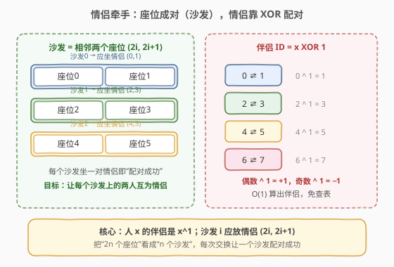
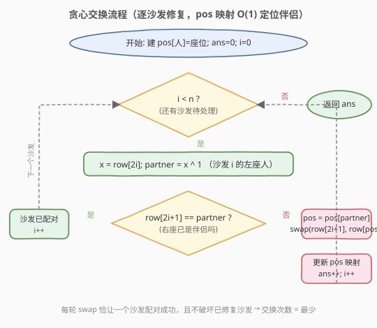
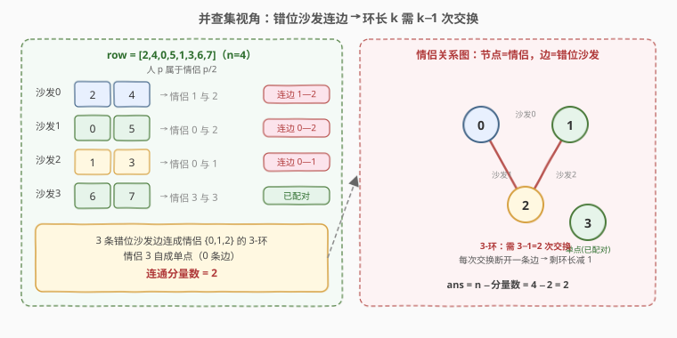

# 情侣牵手

- **题目名称**：情侣牵手
- **链接**：[765. 情侣牵手](https://leetcode.cn/problems/couples-holding-hands/)
- **难度**：困难
- **标签**：贪心、并查集、图

## 1. 题目概述

`n` 对情侣坐在连续排列的 `2n` 个座位上，想要牵到对方的手。人和座位由整数数组 `row` 表示，`row[i]` 是坐在第 `i` 个座位上的人的 ID。情侣按顺序编号：`(0, 1)`、`(2, 3)`、……、`(2n - 2, 2n - 1)`。

座位也天然两两成组：相邻的 `(0, 1)`、`(2, 3)`、……、`(2n - 2, 2n - 1)` 构成一个个**沙发**。目标是让每个沙发上的两人恰好是一对情侣。每次交换可选任意两人互换座位，返回让所有情侣并肩坐在一起的**最少交换次数**。

**示例 1**：

```text
输入：row = [0,2,1,3]
输出：1
解释：交换第二个人（row[1]=2）与第三个人（row[2]=1），row 变为 [0,1,2,3]，沙发0 是 (0,1)、沙发1 是 (2,3)，全部配对。
```

**示例 2**：

```text
输入：row = [3,2,0,1]
输出：0
解释：沙发0 是 (3,2) → 情侣 (2,3)；沙发1 是 (0,1) → 情侣 (0,1)。无需交换。
```

**约束条件**：

- `2n == row.length`
- `2 <= n <= 30`
- `n` 是偶数
- `0 <= row[i] < 2n`
- `row` 中所有元素均无重复

---

## 2. 解题思路

> 💡 **核心抽象**：把 `2n` 个座位看成 `n` 个「沙发」(seat pair `(2i, 2i+1)`)。人 `x` 的情侣伴侣是 `x ^ 1`（偶数 `^1 = +1`，奇数 `^1 = −1`）。于是「让情侣并肩」等价于「让每个沙发上的两人互为 `^1`」。

### 2.1 暴力思路

枚举所有可能的交换序列：每次任选两人互换，搜索到全部配对为止，BFS 取最浅层。状态空间是 `(2n)!` 种排列，`n=30` 时完全不可行。即便加剪枝（只交换能减少错位沙发数的对），最坏仍指数级。

**优化方向**：注意到一个沙发一旦配对成功，后续交换只需操作「尚未配对」的座位，不必再动它。于是可以**从左到右逐个沙发修复**：沙发 `i` 的左座人 `x = row[2i]` 一旦固定，它的伴侣 `x^1` 必须坐到右座 `2i+1`——要么已经在，要么从别处换过来。这是一种**贪心**：每轮保证一个沙发配对，且不破坏已修复的沙发。

### 2.2 核心观察：贪心交换 + 位置映射



关键直觉：

- 用一个**位置映射** `pos[人] = 座标`，可在 $O(1)$ 内找到任意人当前坐在哪。
- 对沙发 `i`（座位 `2i, 2i+1`）：取左座人 `x = row[2i]`，其伴侣 `partner = x ^ 1`。
  - 若 `row[2i+1] == partner`：该沙发已配对，跳过。
  - 否则：找到 `partner` 当前位置 `p = pos[partner]`，**交换 `row[2i+1]` 与 `row[p]`**，更新 `pos` 映射，`ans++`。
- 一次交换至少让沙发 `i` 配对成功，且被换走的人原本坐在 `p > 2i+1`（已修复沙发 `0..i-1` 的人不会被涉及），故**不破坏前置成果**。

> 💡 一句话：**左座不动，把伴侣换到右座**。每次交换恒使配对沙发数 +1，所以交换次数最少——下文 2.5 用并查集给出「最少」的严格证明（环长 `k` 需 `k−1` 次，贪心恰好达成）。

### 2.3 算法流程图



外层 `for i in 0..n-1` 每轮至多一次交换，每次交换 $O(1)$（位置映射免扫描），整体 $O(n)$。注意必须同步更新 `pos`：交换 `row[a]` 与 `row[b]` 后，`pos[row[a]] = a`、`pos[row[b]] = b`。

### 2.4 示例演算

![示例演算：row = [0,2,1,3]，1 次交换](../images/couples_walkthrough.svg)

以 `row = [0,2,1,3]`（`n=2`）为例：

| 沙发 i | 左座 x | partner = x^1 | 右座 row[2i+1] | 动作 | row 变化 | ans |
|--------|--------|---------------|----------------|------|----------|-----|
| 0 | 0 | 1 | 2 | partner 在座位 2，交换座位1↔座位2 | `[0,1,2,3]` | 1 |
| 1 | 2 | 3 | 3 | 已配对，跳过 | `[0,1,2,3]` | 1 |

返回 `ans = 1`。注意一次交换同时修好了沙发 0 和沙发 1——它们本就互相「错位」（一个 2-环），一次交换即归位。

### 2.5 为什么是最少？并查集的环视角



把**每对情侣看作一个节点**（人 `p` 属于情侣 `p // 2`）。对每个沙发 `(2i, 2i+1)`，若其上两人 `row[2i]` 与 `row[2i+1]` 属于**不同情侣** `a = row[2i]//2`、`b = row[2i+1]//2`，就在情侣节点 `a`、`b` 间连一条无向边。如此得到一张图，它有两条性质：

1. **每个节点度数恰为 2**（每对情侣有两人，各占一个沙发的某一座，故恰好连出两条边，可能自环 = 已配对）。度数全为 2 的图 ⇒ 每个连通分量是一个**环**（含自环 / 2-环 / 长环）。
2. **长度为 k 的环需要 k−1 次交换修复**：每次交换在环上「断开一条边」（让一个沙发配对，把一对情侣从环中摘出），环长减 1，直到剩 1 个节点（自环，已配对）。

设情侣图有 `c` 个连通分量（环），总节点数 `n`，则：

$$\text{最少交换} = \sum_{\text{各环}} (k - 1) = n - c$$

贪心做法每轮断开一条边（`ans++` 对应环长减 1），最终把每个环拆到长度 1，交换次数恰好 $n - c$，故为最优。并查集维护「连边后情侣所在连通分量」，统计 `c` 即可直接得答案，连交换都不用模拟。

> ⚠️ 注意「自环」（沙发已配对，`a == b`）也计入一个分量，但它对应 `k=1`，贡献 `1−1=0` 次交换，与「该沙发无需交换」一致。所以公式 $n - c$ 对已配对的沙发也成立。

---

## 3. 参考代码

### 方法一：贪心 + 位置映射（推荐）

### C++

```cpp
class Solution {
  public:
    int minSwapsCouples(vector<int>& row) {
        int n = row.size() / 2;               // 沙发数 = 情侣对数
        vector<int> pos(row.size());          // pos[人] = 座位
        for (int i = 0; i < (int)row.size(); ++i) pos[row[i]] = i;
        int ans = 0;
        for (int i = 0; i < n; ++i) {         // 逐个沙发修复
            int x = row[2 * i];               // 左座人
            int partner = x ^ 1;              // 伴侣 ID
            if (row[2 * i + 1] == partner) continue;          // 已配对
            int p = pos[partner];             // 伴侣当前座位
            swap(row[2 * i + 1], row[p]);     // 把伴侣换到右座
            pos[row[2 * i + 1]] = 2 * i + 1;  // 同步更新 pos
            pos[row[p]] = p;
            ++ans;
        }
        return ans;
    }
};
```

### Python

```python
class Solution:
    def minSwapsCouples(self, row: List[int]) -> int:
        n = len(row) // 2                    # 沙发数 = 情侣对数
        pos = {p: i for i, p in enumerate(row)}   # pos[人] = 座位
        ans = 0
        for i in range(n):                   # 逐个沙发修复
            x = row[2 * i]                   # 左座人
            partner = x ^ 1                  # 伴侣 ID
            if row[2 * i + 1] == partner:
                continue                     # 已配对
            p = pos[partner]                 # 伴侣当前座位
            row[2 * i + 1], row[p] = row[p], row[2 * i + 1]   # 换到右座
            pos[row[2 * i + 1]] = 2 * i + 1  # 同步更新 pos
            pos[row[p]] = p
            ans += 1
        return ans
```

> ⚠️ **两个易错点**：
> 1. **必须更新 `pos`**：交换后两人在 `row` 中的位置变了，`pos` 映射要同步刷新，否则后续 `pos[partner]` 取到旧位置，逻辑崩坏。C++ 里 `swap` 之后用 `row[p]`（已被换走的原右座人）刷新它的 `pos`。
> 2. **伴侣用 `x ^ 1`**：偶数 `^1` 得 `+1`、奇数 `^1` 得 `−1`，正是情侣配对规律。别写成 `x + 1`（对奇数错）。也可写 `x ^ 1` 或 `(x % 2 == 0) ? x + 1 : x - 1`，等价。

### 方法二：并查集（环计数）

### C++

```cpp
class Solution {
    vector<int> fa;
    int find(int x) { return fa[x] == x ? x : fa[x] = find(fa[x]); }
    void unite(int a, int b) { fa[find(a)] = find(b); }
  public:
    int minSwapsCouples(vector<int>& row) {
        int n = row.size() / 2;
        fa.resize(n);
        iota(fa.begin(), fa.end(), 0);
        for (int i = 0; i < n; ++i) {
            int a = row[2 * i] / 2;          // 左座人所属情侣
            int b = row[2 * i + 1] / 2;      // 右座人所属情侣
            if (a != b) unite(a, b);         // 错位沙发 → 连边
        }
        int c = 0;                           // 连通分量数
        for (int i = 0; i < n; ++i) if (fa[i] == i) ++c;
        return n - c;                        // 最少交换 = n − 分量数
    }
};
```

### Python

```python
class Solution:
    def minSwapsCouples(self, row: List[int]) -> int:
        n = len(row) // 2
        fa = list(range(n))

        def find(x: int) -> int:
            while fa[x] != x:
                fa[x] = fa[fa[x]]
                x = fa[x]
            return x

        def union(a: int, b: int) -> None:
            fa[find(a)] = find(b)

        for i in range(n):
            a = row[2 * i] // 2              # 左座人所属情侣
            b = row[2 * i + 1] // 2          # 右座人所属情侣
            if a != b:
                union(a, b)                 # 错位沙发 → 连边

        c = sum(1 for i in range(n) if fa[i] == i)   # 连通分量数
        return n - c                        # 最少交换 = n − 分量数
```

> 💡 **两种方法对比**：贪心法**模拟实际交换过程**，直观、能输出每步操作，面试讲解易；并查集法**只统计不动手**，一行公式 `n − c` 出答案，代码短且揭示「环」本质。两者复杂度同级（$O(n)$ / $O(n \alpha(n))$）。理解并查集的环分解是把握「为什么最少」的关键。

---

## 4. 复杂度分析

| 维度 | 方法 | 复杂度 | 说明 |
|------|------|--------|------|
| 时间复杂度 | 贪心 + 位置映射 | $O(n)$ | 建 `pos` 映射 $O(n)$；外层 `n` 个沙发每轮至多一次交换，每次 $O(1)$（`pos` 免扫描） |
| 空间复杂度 | 贪心 + 位置映射 | $O(n)$ | `pos` 映射 $O(n)$；原地修改 `row` |
| 时间复杂度 | 并查集 | $O(n \, \alpha(n))$ | `n` 个沙发每轮一次 `union/find`，均摊近似 $O(n)$ |
| 空间复杂度 | 并查集 | $O(n)$ | 并查集 `fa` 数组 $O(n)$ |

> ⚠️ 本题 $n \le 30$，两种方法都极快。若把规模放到 $10^6$，贪心的 $O(n)$ 仍稳，并查集 $O(n \alpha(n))$ 也安全；切忌写不带 `pos` 的 $O(n^2)$ 扫描找伴侣。

---

## 5. 扩展：环分解与「置换」的视角

「情侣图度数全为 2 → 每个分量是环」并非巧合，它对应**置换的循环分解**。把「沙发 `i` 应放情侣 `i`」视为目标排列，当前 `row` 把每个情侣错位到别的沙发上，这构成一个置换。每个置换都可唯一分解为若干不相交的**轮换**（cycle）：

- 一个长度为 `k` 的轮换，把它归位所需**最少对换（两人交换）数恰为 `k − 1`**。
- 全部轮换的代价求和 = $\sum (k - 1) = n - (\text{轮换个数})$。

这正是 $n - c$ 的组合数学来源。同类结论在很多题里复现：排序中「用最少交换把数组排好」也是「置换轮换数」决定（每个长度 `k` 的轮换需 `k−1` 次交换）。本题只是把「目标排列」具象化为「情侣归位到对应沙发」。

> 💡 因此本题等价于：**求置换的轮换个数**，答案 = 元素总数 − 轮换个数。并查集正是求轮换个数的高效工具。

---

## 6. 面试要点

1. **为什么贪心每次交换至少修好一个沙发？**

   - 贪心固定左座人 `x`，把伴侣 `x^1` 换到右座 `2i+1`。换完后沙发 `i` 必然配对成功。被换走的人坐在 `p`，而 `p` 不可能是已修复沙发 `0..i-1` 的座位（那些沙发的右座早已是正确伴侣，不会出现在别处待换）——所以前置成果不被破坏。每轮配对沙发数严格 +1。

2. **为什么贪心得到的是「最少」交换次数？**

   - 用并查集的环视角：错位沙发在情侣图上连成若干环，长度 `k` 的环至少需要 `k−1` 次交换（每次交换在环上至多断开一条边，使环长至多减 1）。贪心每轮断开一条边，总次数 = $\sum(k−1) = n - c$，达到下界，故最优。

3. **位置映射 `pos` 的作用？不维护会怎样？**

   - `pos[人]=座位` 让找伴侣位置 $O(1)$，整体 $O(n)$。若不维护、每次线性扫描 `row` 找伴侣，退化为 $O(n^2)$（本题 $n\le30$ 仍过，但面试会扣分）。交换后必须同步刷新 `pos`，否则后续取到旧位置导致错误。

4. **并查集法为什么是 `n − c` 而不是边数之类？**

   - 情侣图每个节点度数恰为 2（每对情侣两人，各连一条边），故每个连通分量是一个长度 `k` 的环。环长 `k` 需 `k−1` 次交换，求和 $\sum(k−1) = \sum k - \sum 1 = n - c$。`c` 是连通分量（环）的个数。

5. **`x ^ 1` 和 `p // 2` 两个核心位运算分别用在哪？**

   - `x ^ 1`：给定人 `x` 求其伴侣 ID（贪心法用）——偶数伴侣 `+1`、奇数伴侣 `−1`。
   - `p // 2`：给定人 `p` 求其所属情侣编号（并查集法用）——`(0,1)→0`、`(2,3)→1`、……。两个运算互为「情侣内」与「情侣间」视角。

6. **能否不限制「左座不动」，任意交换也更优？**

   - 任意交换不会更少。环分解的下界 $n-c$ 对任何交换策略都成立（每次交换至多让两个错位沙发变正确，等价于环上至多断一条边）。贪心已达到该下界，所以「左座不动 + 把伴侣换到右座」这种受限策略已是最优，无需考虑更复杂的交换。

---

## 7. 同类练习题

- [547. 省份数量](../0501-0600/547_省份数量.md)：并查集统计连通分量数，是本题「数 `c`」的纯模板
- [684. 冗余连接](../0601-0700/684_冗余连接.md)：并查集判无向图中的环，对照「度数全 2 的图必为环」的理解
- [785. 判断二分图](./785_判断二分图.md)：图上贪心染色 + 连通分量处理，对照不同图问题的通用套路
- [200. 岛屿数量](../0101-0200/200_岛屿数量.md)：连通分量计数的另一经典场景（DFS/BFS 版），体会「分量数」这一高频统计量
- [LCP 23. 黑白翻转棋](https://leetcode.cn/problems/er83lX/)：连通性 + 模拟，延伸练习图上「连通块」的判定与计数
