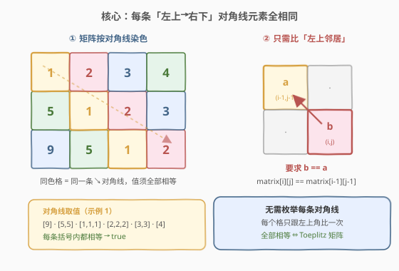
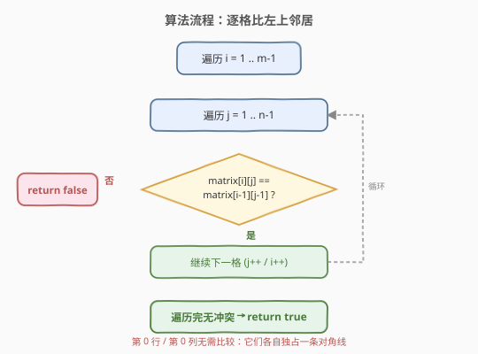
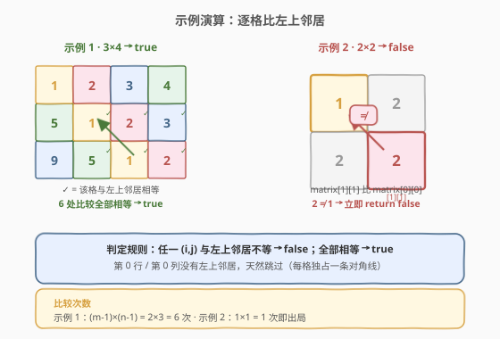

# LeetCode 托普利茨矩阵 题解

## 1. 题目概述

- **标题 / 题号**：托普利茨矩阵（#766，easy）
- **链接**：https://leetcode.cn/problems/toeplitz-matrix/
- **难度**：简单
- **标签**：数组、矩阵

**题意**：给你一个 `m × n` 的矩阵 `matrix`。如果该矩阵是**托普利茨矩阵（Toeplitz Matrix）**，返回 `true`；否则返回 `false`。

托普利茨矩阵的定义：**从左上到右下的每一条对角线上的元素全部相同**。也就是说，对于矩阵中任意满足 `i > 0` 且 `j > 0` 的位置 `(i, j)`，都有 `matrix[i][j] == matrix[i-1][j-1]`。

**示例 1**：

```text
输入：matrix = [[1,2,3,4],[5,1,2,3],[9,5,1,2]]
输出：true
解释：
对角线分别如下：
[9]               —— 单元素，天然相同
[5, 5]            —— 相同
[1, 1, 1]         —— 相同
[2, 2, 2]         —— 相同
[3, 3]            —— 相同
[4]               —— 单元素
每条对角线元素全部相等，故为托普利茨矩阵。
```

**示例 2**：

```text
输入：matrix = [[1,2],[2,2]]
输出：false
解释：
对角线 [1, 2]（由 (0,0) 与 (1,1) 组成）中 1 ≠ 2，故不是托普利茨矩阵。
```

**约束**：

- `m == matrix.length`
- `n == matrix[i].length`
- `1 <= m, n <= 20`
- `0 <= matrix[i][j] <= 99`

> 💡 **进阶**：如果矩阵存储在磁盘上，且内存一次只能加载**一行**数据，该如何判定？（见第 5 节扩展）

## 2. 解题思路

### 2.1 暴力思路

按定义枚举每一条对角线，收集对角线上所有元素后判断是否全部相等。对角线可用「列下标减行下标」`j - i` 来标识，同一条对角线上的格子 `j - i` 恒为定值。需要额外的哈希表或数组分组存放各对角线元素，空间 `O(m + n)`，且实现相对繁琐。

### 2.2 核心观察：只比左上邻居



关键洞察：**`(i, j)` 与 `(i-1, j-1)` 恰好位于同一条「左上→右下」对角线上**（它们的 `j - i` 相同）。因此「整条对角线元素相同」等价于「每个格子等于它的左上邻居」。

于是无需分组枚举对角线，只要对每个 `i ≥ 1` 且 `j ≥ 1` 的格子检查 `matrix[i][j] == matrix[i-1][j-1]`：

- 全部成立 → 托普利茨矩阵；
- 出现一处不等 → 立即返回 `false`。

> 💡 **为什么第 0 行 / 第 0 列不用比？** 它们各自独占一条对角线（没有左上邻居），单元素对角线天然满足「全部相同」，所以从 `i=1, j=1` 开始扫描即可。

### 2.3 算法流程图



双重循环遍历 `i ∈ [1, m)`、`j ∈ [1, n)`，每个格子做一次 `O(1)` 比较，遇到不等立即剪枝返回。

### 2.4 示例演算



以两个示例对照：

| 示例 | 矩阵 | 比较次数 `(m-1)×(n-1)` | 结果 |
|------|------|------------------------|------|
| 1 | `[[1,2,3,4],[5,1,2,3],[9,5,1,2]]` | `2 × 3 = 6`，全相等 | `true` |
| 2 | `[[1,2],[2,2]]` | `1 × 1 = 1`，`matrix[1][1]=2 ≠ matrix[0][0]=1` | `false` |

示例 2 在第一次比较时即剪枝返回，无需扫描其余格子。

## 3. 参考代码

### C++

```cpp
class Solution {
  public:
    bool isToeplitzMatrix(vector<vector<int>>& matrix) {
        int m = matrix.size(), n = matrix[0].size();
        for (int i = 1; i < m; i++) {
            for (int j = 1; j < n; j++) {
                if (matrix[i][j] != matrix[i - 1][j - 1])
                    return false;
            }
        }
        return true;
    }
};
```

### Python

```python
class Solution:
    def isToeplitzMatrix(self, matrix: List[List[int]]) -> bool:
        m, n = len(matrix), len(matrix[0])
        for i in range(1, m):
            for j in range(1, n):
                if matrix[i][j] != matrix[i - 1][j - 1]:
                    return False
        return True
```

> ⚠️ **写法细节**：循环从 `1` 开始（不是 `0`），因为第 0 行 / 第 0 列无左上邻居，访问 `matrix[i-1][j-1]` 时 `i-1`、`j-1` 均需非负。一旦发现不等**立即 `return false`**，提前剪枝，避免无谓扫描。

## 4. 复杂度分析

| 维度 | 复杂度 | 说明 |
|------|--------|------|
| 时间复杂度 | `O(m × n)` | 最坏遍历除首行首列外的所有格子；不等时可提前剪枝 |
| 空间复杂度 | `O(1)` | 仅用常数个下标变量，原地比较，无额外数据结构 |

## 5. 扩展：按行流式读取（内存仅容一行）

题目进阶问：矩阵存在磁盘上，内存一次只能放一行，怎么判定？

思路：**只保留上一行**。读入当前行 `cur` 时，把它与上一行 `prev` 的**前 `n-1` 个元素**逐位比较——`cur[j]` 应等于 `prev[j-1]`（对 `j ∈ [1, n)`）。比较完将 `prev = cur`，继续读下一行。

```python
class Solution:
    def isToeplitzMatrix(self, matrix: List[List[int]]) -> bool:
        prev = matrix[0]
        for i in range(1, len(matrix)):
            cur = matrix[i]
            # cur[1:] 应与 prev[:-1] 逐位相等
            if any(cur[j] != prev[j - 1] for j in range(1, len(cur))):
                return False
            prev = cur
        return True
```

> 💡 这正是「只比左上邻居」的逐行版：`cur[j]` 是 `(i, j)`，`prev[j-1]` 是 `(i-1, j-1)`。磁盘场景下读一行、比一行、丢一行，内存稳定 `O(n)`。若进一步按行分块或用游标读流，同理只需缓存上一行。

## 6. 面试要点

1. **为什么「比左上邻居」就足够，而不必枚举每条对角线？**

   - `(i, j)` 与 `(i-1, j-1)` 的 `j - i` 相同，必属同一条对角线。一条对角线 `a₀, a₁, …, aₖ` 全相等，等价于相邻项 `aₜ == aₜ₋₁` 全成立——而相邻项正是沿对角线方向的「左上邻居」关系。故逐格比左上邻居是对角线判等的**充分且必要**条件。

2. **第 0 行 / 第 0 列为何跳过？**

   - 它们没有左上邻居，且每个格子各自独占一条对角线（只有自己一个元素），天然满足「同对角线元素相同」。从 `i=1, j=1` 起扫既正确又省去边界判断。

3. **如何用数学语言刻画「同一条对角线」？**

   - 对角线由常量 `d = j - i` 标识：`d` 相同的所有格子构成一条「左上→右下」对角线。判定 Toeplitz 等价于「对每个 `d`，该对角线上取值恒定」。

4. **进阶：内存只能装一行时怎么做？**

   - 只缓存上一行 `prev`，读入当前行 `cur` 后比较 `cur[j] == prev[j-1]`（`j ∈ [1, n)`），再令 `prev = cur`。空间 `O(n)`，适合流式/磁盘读取。

5. **能不能用 Python 一行流求解？**

   - 可以：`all(r[i] == r2[i-1] for r, r2 in pairwise(matrix) for i in range(1, len(r)))`。可读性见仁见智，面试中建议先写清晰的双重循环版本再提一句简写。

## 同类练习题

| # | 题目 | 与本题的关联 |
|---|------|-------------|
| 766 | [托普利茨矩阵](https://leetcode.cn/problems/toeplitz-matrix/) | 本题，逐格比左上邻居 |
| 422 | [有效的单词方块](https://leetcode.cn/problems/valid-word-square/) | 行列对称的逐格比较，思路同构（比 `matrix[i][j]` 与 `matrix[j][i]`） |
| 896 | [单调数列](https://leetcode.cn/problems/monotonic-array/) | 相邻项比较判定全局性质，同为「邻项关系 ⇒ 整体性质」范式 |
| 303 | [区域和检索 - 数组不可变](https://leetcode.cn/problems/range-sum-query-immutable/)（[题解](../0201-0300/304_二维区域和检索-数组不可变.md)） | 矩阵预处理思想对照，体会「逐格扫描」与「预处理」不同侧重 |
