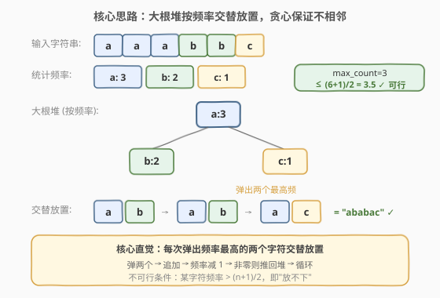
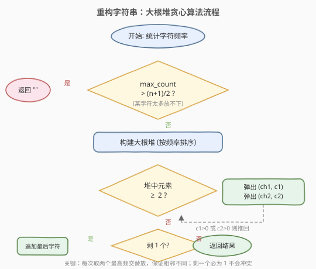
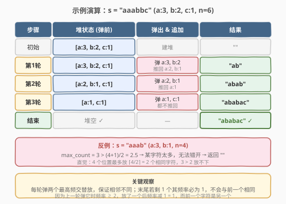

# LeetCode 重构字符串 题解

## 1. 题目概述

- **标题 / 题号**：重构字符串（#767，medium）
- **链接**：https://leetcode.cn/problems/reorganize-string/
- **难度**：中等
- **标签**：贪心、堆、字符串、计数

**题意**：给定一个字符串 `s`，请重新排列 `s` 中的字符，使得**任意两个相邻的字符都不相同**。返回任意一个满足条件的重排结果；如果无法做到，返回空字符串 `""`。

**示例 1**：

```text
输入：s = "aab"
输出："aba"
解释：'a' 和 'a' 不相邻，满足条件。
```

**示例 2**：

```text
输入：s = "aaab"
输出：""
解释：'a' 出现 3 次，总长 4，无法让所有 'a' 都不相邻。
```

**约束**：

- `1 <= s.length <= 500`
- `s` 仅由小写英文字母组成

## 2. 解题思路

### 2.1 暴力思路

生成所有排列，检查每个排列是否有相邻重复。时间复杂度 $O(n! \times n)$，完全不可行。

退一步：用回溯逐位填字符，每位选一个与上一位不同的字符。最坏情况仍需搜索大量分支，且难以快速判断「当前局面是否一定无解」。

> 💡 暴力的核心痛点：没有利用**频率信息**——如果某个字符出现次数过多，它注定要被「均匀散开」，而随机排列很难做到这一点。

### 2.2 核心观察：大根堆贪心交替放置



关键直觉是**每次取出频率最高的两个字符，交替放置一个**：

- **为什么取两个？** 如果只取一个放在末尾，下一个可能还是同一个字符，导致相邻重复。取两个不同的字符 `ch1`、`ch2`，先放 `ch1` 再放 `ch2`，天然保证这两个不相邻。
- **为什么取最高频的？** 最高频的字符最「危险」——如果不尽早消耗它，最后会堆积成一串连续相同字符。贪心地优先消耗高频字符，相当于把它们均匀打散。

**不可行条件**：如果某个字符的频率 `max_count > (n + 1) / 2`（即 `⌈n/2⌉`），则无论怎么排列，它都必然在某个位置与自身相邻。例如 `n = 4` 时最多放 `⌈4/2⌉ = 2` 个相同字符，`"aaab"` 中 `a` 出现 3 次 `> 2`，无解。

> ⚠️ 不可行判断必须在排列之前完成。一旦 `max_count > ⌈n/2⌉`，直接返回 `""`，无需尝试排列。

### 2.3 算法流程图



整体流程：

1. 统计每个字符的频率。
2. 检查 `max_count > (n+1)/2`，若是则返回 `""`。
3. 将所有 `(频率, 字符)` 放入**大根堆**（按频率排序）。
4. 循环：当堆中至少有 2 个元素时，弹出两个最高频的 `(c1, ch1)` 和 `(c2, ch2)`，追加 `ch1`、`ch2` 到结果，频率各减 1，若仍 `> 0` 则推回堆。
5. 循环结束后若堆中剩 1 个元素，追加它（其频率必为 1，不会与前一字符相同）。

### 2.4 示例演算



以 `s = "aaabbc"`（`a:3, b:2, c:1, n=6`）为例：

| 步骤 | 堆状态（弹前） | 弹出 & 追加 | 推回 | 结果 |
|------|---------------|------------|------|------|
| 初始 | `[a:3, b:2, c:1]` | 建堆 | — | `""` |
| 第 1 轮 | `[a:3, b:2, c:1]` | 弹 `a:3, b:2` | `a:2, b:1` | `"ab"` |
| 第 2 轮 | `[a:2, b:1, c:1]` | 弹 `a:2, b:1` | `a:1` | `"abab"` |
| 第 3 轮 | `[a:1, c:1]` | 弹 `a:1, c:1` | 无 | `"ababac"` |
| 结束 | 堆空 | — | — | `"ababac"` ✓ |

**反例**：`s = "aaab"`（`a:3, b:1, n=4`），`max_count = 3 > ⌈4/2⌉ = 2`，直接返回 `""`。

> 💡 **为什么末尾剩 1 个时安全？** 进入最后一轮时，该字符的频率恰为 1。它上一轮被弹出时频率 ≥ 2，放了一个后频率减 1 = 1，而当时与它一起被弹出的是**另一个字符**——所以结果的倒数第二个字符不是它，追加它不会造成相邻重复。

## 3. 参考代码

### 方法一：大根堆贪心（推荐）

### C++

```cpp
class Solution {
  public:
    string reorganizeString(string s) {
        int n = s.size();
        int cnt[26] = {0};
        for (char c : s) cnt[c - 'a']++;

        int maxCnt = 0;
        for (int i = 0; i < 26; i++) maxCnt = max(maxCnt, cnt[i]);
        if (maxCnt > (n + 1) / 2) return "";

        // 大根堆：(频率, 字符)
        priority_queue<pair<int, char>> pq;
        for (int i = 0; i < 26; i++)
            if (cnt[i] > 0) pq.push({cnt[i], 'a' + i});

        string result;
        while (pq.size() >= 2) {
            auto [f1, ch1] = pq.top(); pq.pop();
            auto [f2, ch2] = pq.top(); pq.pop();
            result += ch1;
            result += ch2;
            if (--f1 > 0) pq.push({f1, ch1});
            if (--f2 > 0) pq.push({f2, ch2});
        }
        if (!pq.empty()) result += pq.top().second;
        return result;
    }
};
```

### Python

```python
class Solution:
    def reorganizeString(self, s: str) -> str:
        n = len(s)
        cnt = Counter(s)

        if max(cnt.values()) > (n + 1) // 2:
            return ""

        # Python 最小堆 → 频率取负模拟大根堆
        heap = [(-freq, ch) for ch, freq in cnt.items()]
        heapq.heapify(heap)

        result = []
        while len(heap) >= 2:
            f1, ch1 = heapq.heappop(heap)
            f2, ch2 = heapq.heappop(heap)
            result.append(ch1)
            result.append(ch2)
            if f1 + 1 < 0:   # f 为负数，+1 等于绝对值减 1
                heapq.heappush(heap, (f1 + 1, ch1))
            if f2 + 1 < 0:
                heapq.heappush(heap, (f2 + 1, ch2))

        if heap:
            result.append(heap[0][1])

        return "".join(result)
```

> ⚠️ Python 没有内置大根堆，用**频率取负** + `heapq`（最小堆）来模拟。`f1 + 1` 相当于频率减 1（因为 `f1` 是负数，`-3 + 1 = -2` 表示频率从 3 降到 2）。判断 `f1 + 1 < 0` 等价于「频率减 1 后仍大于 0」。

## 4. 复杂度分析

| 维度 | 复杂度 | 说明 |
|------|--------|------|
| 时间复杂度 | $O(n \log k)$ | 每个字符入堆、出堆各一次，每次堆操作 $O(\log k)$，$k$ 为不同字符数（≤ 26） |
| 空间复杂度 | $O(k)$ | 堆最多存 $k$ 个元素，$k \leq 26$ |

> 💡 由于字符集仅为 26 个小写字母，$\log k \leq \log 26 \approx 4.7$，堆操作近似 $O(1)$，总体可视为 $O(n)$。若字符集扩大（如 Unicode），则 $\log k$ 不可忽略。

## 5. 扩展：奇偶位置填充法（O(n) 时间，无需堆）

还有一种更巧妙的贪心——**按频率降序排列字符，先填偶数位置再填奇数位置**：

```python
class Solution:
    def reorganizeString(self, s: str) -> str:
        n = len(s)
        cnt = Counter(s)
        if max(cnt.values()) > (n + 1) // 2:
            return ""

        # 按频率降序展开字符列表
        sorted_chars = sorted(cnt, key=lambda c: -cnt[c])
        chars = []
        for c in sorted_chars:
            chars.extend([c] * cnt[c])

        # 先填偶数下标 (0,2,4...)，再填奇数下标 (1,3,5...)
        result = [''] * n
        idx = 0
        for i in range(0, n, 2):
            result[i] = chars[idx]; idx += 1
        for i in range(1, n, 2):
            result[i] = chars[idx]; idx += 1
        return ''.join(result)
```

**为什么这样做保证不相邻？**

- 偶数位置 `0, 2, 4, ...` 和奇数位置 `1, 3, 5, ...` 是**交错**的。
- 同一字符被连续放在 `chars` 中，先填满偶数位置再填奇数位置，使得同一字符要么全在偶数位置、要么跨越偶数→奇数边界。
- 不可行条件 `max_count ≤ ⌈n/2⌉` 恰好保证最高频字符不会填满所有偶数位置后溢出到相邻的奇数位置。

> 💡 两种方法殊途同归：大根堆法「**动态**地每次取两个最高频交替」，奇偶填充法「**静态**地一次性把高频字符散开」。面试中两种都值得提及——大根堆法更直观、可迁移到 [621. 任务调度器](../0601-0700/621_任务调度器.md) 等需要「冷却期」的变体；奇偶填充法更高效，适合字符集固定的场景。

## 6. 面试要点

1. **如何判断无解？**

   - 统计最高频字符的次数 `max_count`，若 `max_count > ⌈n/2⌉`（即 `(n+1)/2`），直接返回 `""`。直觉：`n` 个位置最多能放 `⌈n/2⌉` 个相同字符且不相邻（隔一个放一个）。

2. **为什么每次弹两个而不是一个？**

   - 弹一个放在末尾，下一轮可能还是同一字符导致相邻。弹两个不同的交替放置，天然保证不相邻，同时高效消耗两个字符的频率。

3. **大根堆法和奇偶填充法的区别？**

   - **大根堆**：动态地每轮取两个最高频，时间 $O(n \log k)$，适合字符集较大或需「冷却期」的变体。
   - **奇偶填充**：静态地按频率降序填偶数位再填奇数位，时间 $O(n \log k)$（排序）或 $O(n)$（桶排序），常数更小但思路更巧妙。

4. **末尾剩一个字符时为什么安全？**

   - 该字符频率恰为 1，上一轮它被弹出时频率 ≥ 2，放了一个后频率减到 1，而与它一起弹出的是另一个字符——所以结果末尾不是它，追加不会冲突。

5. **和 621. 任务调度器的联系与区别？**

   - 两者都是「按频率贪心安排字符位置」。621 需要冷却期 `n`（相同任务间隔至少 `n` 个槽），用「最多频率 + 空槽填充」计算；767 只需不相邻（间隔 ≥ 1），用大根堆交替放置即可。621 是 767 的泛化版。

## 同类练习题

| # | 题目 | 与本题的关联 |
|---|------|-------------|
| 621 | [任务调度器](https://leetcode.cn/problems/task-scheduler/)（[题解](../0601-0700/621_任务调度器.md)） | 同属「按频率贪心安排」，增加冷却期约束 |
| 451 | [根据字符出现频率排序](https://leetcode.cn/problems/sort-characters-by-frequency/) | 按频率降序排列字符，堆/桶排序的简化版 |
| 1054 | [距离相等的条形码](https://leetcode.cn/problems/distant-barcodes/) | 与 767 完全同构，只是输入是数字数组 |
| 358 | [K 距离间隔重排字符串](https://leetcode.cn/problems/rearrange-string-k-distance-apart/)（会员题） | 767 的泛化版，要求相同字符间隔至少为 `k` |
| 767 | [重构字符串](https://leetcode.cn/problems/reorganize-string/) | 本题，大根堆贪心交替放置 |
