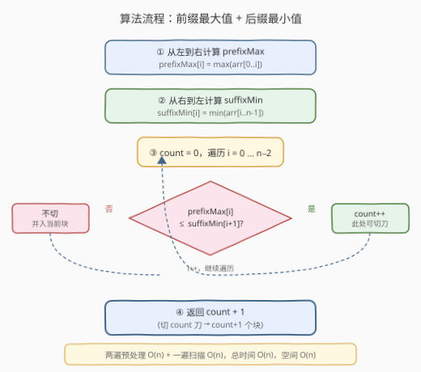

# 最多能完成排序的块 II

- **题目名称**：最多能完成排序的块 II
- **链接**：[768. 最多能完成排序的块 II](https://leetcode.cn/problems/max-chunks-to-make-sorted-ii/)
- **难度**：困难
- **标签**：数组、单调栈、排序

## 1. 题目概述

给你一个整数数组 `arr`。将 `arr` 分割成若干**块**，并将这些块分别进行排序。之后再连接起来，使得连接的结果和按升序排序后的原数组相同。返回能将数组分成的**最多块数**。

**示例 1**：

```text
输入：arr = [5,4,3,2,1]
输出：1
解释：分成 2 块或者更多块，都无法得到所需的结果。
例如分成 [5, 4], [3, 2, 1] 的结果是 [4, 5, 1, 2, 3]，这不是有序的数组。
```

**示例 2**：

```text
输入：arr = [2,1,3,4,4]
输出：4
解释：可以分成 [2, 1], [3], [4], [4]，得到最多的块数。
```

**约束条件**：

- `1 <= arr.length <= 2000`
- `0 <= arr[i] <= 10^8`

> 💡 本题是 [769. 最多能完成排序的块](https://leetcode.cn/problems/max-chunks-to-make-sorted/) 的进阶版。769 题中 `arr` 是 `[0, 1, ..., n-1]` 的排列（无重复、值即下标），只需判断 `max(arr[0..i]) == i` 即可切刀。本题允许**任意值和重复元素**，需要更强的判定条件。

---

## 2. 解题思路

### 2.1 暴力思路

枚举第一个切刀位置 `i`（`0 <= i < n-1`），验证 `max(arr[0..i]) <= min(arr[i+1..n-1])` 是否成立——若成立则在此切一刀，对右半部分递归。最坏情况每重切刀要 `O(n)` 求区间 max/min，共 `O(n)` 层递归，总时间 `O(n^2)`。对 `n <= 2000` 虽能通过，但不够优雅。

> 💡 暴力思路已经点出了核心判定条件：**左半最大值 ≤ 右半最小值**。优化方向是把「求区间 max/min」从 `O(n)` 降到 `O(1)`——预处理前缀最大值和后缀最小值即可。

### 2.2 核心观察：前缀最大值 ≤ 后缀最小值即可切刀

![核心观察：prefixMax[i] ≤ suffixMin[i+1] → 位置 i 后可切刀](../images/max_chunks2_concept.svg)

关键直觉：在位置 `i` 处切刀，将数组分成 `[0..i]` 和 `[i+1..n-1]` 两部分。**只要左半的最大值 ≤ 右半的最小值**，就保证左半任意元素 ≤ 右半任意元素——那么左半排序后、右半排序后拼接，等价于整体排序。

形式化地，定义：

- `prefixMax[i] = max(arr[0..i])`——前缀最大值
- `suffixMin[i] = min(arr[i..n-1])`——后缀最小值

则位置 `i` 后可切刀的**充要条件**为：

$$\text{prefixMax}[i] \leq \text{suffixMin}[i+1]$$

> ⚠️ **为什么是 `<=` 而不是 `<`？** 因为相等的元素可以分属不同块。例如 `arr = [4, 4]`，`prefixMax[0] = 4`，`suffixMin[1] = 4`，`4 <= 4` 成立，可以切成 `[4], [4]` 两块——各自排序后拼接仍是 `[4, 4]`，与整体排序结果一致。

### 2.3 算法流程图



整体三步走：

1. **从左到右**计算 `prefixMax` 数组。
2. **从右到左**计算 `suffixMin` 数组。
3. **从左到右扫描** `i = 0 ... n-2`，统计满足 `prefixMax[i] <= suffixMin[i+1]` 的位置数 `count`。

最终答案为 `count + 1`（切了 `count` 刀，得到 `count + 1` 个块）。

### 2.4 示例演算

![示例演算：arr = [2,1,3,4,4]](../images/max_chunks2_example_walkthrough.svg)

以 `arr = [2, 1, 3, 4, 4]` 为例：

- **预处理**：`prefixMax = [2, 2, 3, 4, 4]`，`suffixMin = [1, 1, 3, 4, 4]`。
- **i=0**：`prefixMax[0]=2`，`suffixMin[1]=1`，`2 <= 1`？否，不切。
- **i=1**：`prefixMax[1]=2`，`suffixMin[2]=3`，`2 <= 3`？是，切刀！→ 块 `[2, 1]`。
- **i=2**：`prefixMax[2]=3`，`suffixMin[3]=4`，`3 <= 4`？是，切刀！→ 块 `[3]`。
- **i=3**：`prefixMax[3]=4`，`suffixMin[4]=4`，`4 <= 4`？是，切刀！→ 块 `[4]`。
- **末尾**：剩余 `[4]` 自动成为第 4 块。

`count = 3`，答案 = `3 + 1 = 4`。

---

## 3. 参考代码

### C++

```cpp
class Solution {
  public:
    int maxChunksToSorted(vector<int>& arr) {
        int n = arr.size();
        vector<int> prefixMax(n), suffixMin(n);

        prefixMax[0] = arr[0];
        for (int i = 1; i < n; i++)
            prefixMax[i] = max(prefixMax[i - 1], arr[i]);

        suffixMin[n - 1] = arr[n - 1];
        for (int i = n - 2; i >= 0; i--)
            suffixMin[i] = min(suffixMin[i + 1], arr[i]);

        int count = 0;
        for (int i = 0; i < n - 1; i++)
            if (prefixMax[i] <= suffixMin[i + 1])
                count++;
        return count + 1;
    }
};
```

### Python

```python
class Solution:
    def maxChunksToSorted(self, arr: List[int]) -> int:
        n = len(arr)
        prefix_max = [0] * n
        suffix_min = [0] * n

        prefix_max[0] = arr[0]
        for i in range(1, n):
            prefix_max[i] = max(prefix_max[i - 1], arr[i])

        suffix_min[-1] = arr[-1]
        for i in range(n - 2, -1, -1):
            suffix_min[i] = min(suffix_min[i + 1], arr[i])

        count = 0
        for i in range(n - 1):
            if prefix_max[i] <= suffix_min[i + 1]:
                count += 1
        return count + 1
```

> ⚠️ **边界注意**：扫描循环只到 `i = n - 2`（即 `range(n - 1)`），因为 `suffixMin[i + 1]` 在 `i = n - 1` 时越界。最后一个元素总是构成最末一个块，无需判断。

---

## 4. 复杂度分析

| 维度 | 复杂度 | 说明 |
|------|--------|------|
| 时间复杂度 | O(n) | 三次独立线性遍历：计算 prefixMax、计算 suffixMin、扫描统计切刀数 |
| 空间复杂度 | O(n) | 两个辅助数组 `prefixMax` 和 `suffixMin`，各 `O(n)` |

---

## 5. 扩展：单调栈单遍扫描

上述方法需要两遍预处理 + 一遍扫描。利用**单调栈**可以单遍完成，且更贴近「在线构建块」的直觉。

**思路**：用一个**单调递增栈**存储每个块的最大值（从栈底到栈顶递增）。遍历每个元素 `x`：

- 若 `x >= 栈顶`（栈空同理）：`x` 不小于上一个块的最大值，可以独立成新块，**入栈**。
- 若 `x < 栈顶`：`x` 比上一个块的最大值还小，不能独立成块，需要**向前合并**所有最大值 `> x` 的块。合并后这些块变成一个块，其最大值不变（仍是这些块中最大的，即栈顶值）。

```cpp
class Solution {
  public:
    int maxChunksToSorted(vector<int>& arr) {
        stack<int> st; // 存每个块的最大值，栈底到栈顶单调递增
        for (int x : arr) {
            if (st.empty() || x >= st.top()) {
                st.push(x); // 新块
            } else {
                int curMax = st.top();
                st.pop();
                while (!st.empty() && st.top() > x)
                    st.pop();   // 合并所有 max > x 的块
                st.push(curMax); // 合并后的块，最大值不变
            }
        }
        return st.size();
    }
};
```

```python
class Solution:
    def maxChunksToSorted(self, arr: List[int]) -> int:
        st = []  # 存每个块的最大值，栈底到栈顶单调递增
        for x in arr:
            if not st or x >= st[-1]:
                st.append(x)  # 新块
            else:
                cur_max = st.pop()
                while st and st[-1] > x:
                    st.pop()    # 合并所有 max > x 的块
                st.append(cur_max)  # 合并后的块，最大值不变
        return len(st)
```

以 `arr = [2, 1, 3, 4, 4]` 为例追踪栈的变化：

| 步骤 | x | 操作 | 栈（底→顶） |
|------|---|------|-------------|
| 1 | 2 | 栈空，入栈 | [2] |
| 2 | 1 | 1 < 2，合并；栈空后推回 2 | [2] |
| 3 | 3 | 3 ≥ 2，入栈 | [2, 3] |
| 4 | 4 | 4 ≥ 3，入栈 | [2, 3, 4] |
| 5 | 4 | 4 ≥ 4，入栈 | [2, 3, 4, 4] |

栈大小 = 4，即答案。

> 💡 **单调栈 vs 前缀后缀**：两者时间复杂度均为 `O(n)`，空间均为 `O(n)`（最坏情况栈存 `n` 个元素）。单调栈只需一遍遍历且无需额外数组，但理解难度稍高；前缀后缀法更直观、易于证明正确性。面试中两种方法任选其一即可，建议先讲前缀后缀法（好解释），再引出单调栈作为优化。

---

## 6. 面试要点

1. **为什么 `prefixMax[i] <= suffixMin[i+1]` 是切刀的充要条件？**

   - **充分性**：若左半最大值 ≤ 右半最小值，则左半任意元素 ≤ 右半任意元素。左半排序后仍全 ≤ 右半排序后的最小值，拼接即整体升序。
   - **必要性**：若左半最大值 > 右半最小值，说明左半存在某元素 > 右半某元素。排序后该大元素仍在左半块中、该小元素仍在右半块中，拼接后大元素在小元素之前，不满足升序。故不可切。

2. **与 769 题的区别是什么？**

   - 769 题中 `arr` 是 `[0, 1, ..., n-1]` 的排列，无重复且值即排名。此时 `max(arr[0..i]) == i` 就等价于「前 `i+1` 个位置恰好包含了值 `0..i`」，可简化判定。768 允许任意值和重复，必须用前缀 max 与后缀 min 比较，不能靠 `== i` 判断。

3. **为什么用 `<=` 而非 `<`？**

   - 相等时仍可切刀。如 `[4, 4]`：`prefixMax[0] = 4`，`suffixMin[1] = 4`，`4 <= 4` 成立，切成 `[4], [4]` 各自排序后拼接仍为 `[4, 4]`，正确。若改用 `<` 则漏掉此合法切刀。

4. **答案为什么是 `count + 1`？**

   - `count` 是切刀次数（满足条件的位置数），每切一刀增加一个块。初始（未切刀时）整个数组是 1 个块，所以总块数 = `1 + count`。

5. **单调栈法中，为什么合并时推回的是 `curMax` 而非 `x`？**

   - 被合并的那些块的最大值是 `curMax`（栈顶，即最大者），`x < curMax`。合并后新块包含 `x` 和原来这些块的所有元素，其最大值仍为 `curMax`（`x` 没有超过它）。若推回 `x` 会丢失真实最大值，导致后续判断出错。

---

## 7. 同类练习题

- [769. 最多能完成排序的块](https://leetcode.cn/problems/max-chunks-to-make-sorted/)：本题的简化版，`arr` 为 `[0..n-1]` 的排列，用 `max(arr[0..i]) == i` 判定切刀
- [84. 柱状图中最大的矩形](https://leetcode.cn/problems/largest-rectangle-in-histogram/)（[题解](../0001-0100/84_柱状图中最大的矩形.md)）：单调栈经典题，同样利用栈的单调性维护区间信息
- [739. 每日温度](https://leetcode.cn/problems/daily-temperatures/)（[题解](../0701-0800/739_每日温度.md)）：单调栈找右侧第一个更大元素，与本题单调栈法思路对照
- [42. 接雨水](https://leetcode.cn/problems/trapping-rain-water/)（[题解](../0001-0100/42_接雨水.md)）：同样使用前缀 max / 后缀 min 预处理的思想，可对比两种「预处理辅助数组」的套路
- [239. 滑动窗口最大值](https://leetcode.cn/problems/sliding-window-maximum/)（[题解](../0201-0300/239_滑动窗口最大值.md)）：单调队列维护窗口最值，与单调栈维护块最值是同一思想的不同变体
