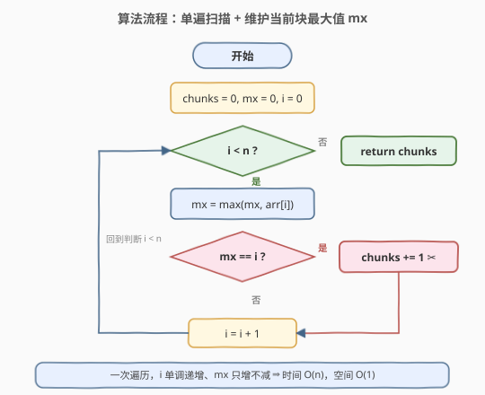

# LeetCode 最多能完成排序的块 题解

## 1. 题目概述

- **标题 / 题号**：最多能完成排序的块（#769，medium）
- **链接**：https://leetcode.cn/problems/max-chunks-to-make-sorted/
- **难度**：中等
- **标签**：数组、贪心、栈

**题意**：给定一个长度为 `n` 的整数数组 `arr`，其中 `arr` 是 `[0, 1, ..., n-1]` 的一个**排列**。我们要把 `arr` 切成若干**块**（连续子数组），对每一块内部**单独排序**，再把所有块按原顺序拼接起来。

要求拼接结果恰好等于**整体排序后**的数组 `[0, 1, ..., n-1]`。返回最多能切出多少块。

**示例 1**：

```text
输入：arr = [4,3,2,1,0]
输出：1
解释：
arr 是 [0,1,2,3,4] 的排列，整体排序结果就是 [0,1,2,3,4]。
分成 [4],[3],[2],[1],[0] 拼接后得 [4,3,2,1,0] ≠ [0,1,2,3,4]，非法。
只能整段成一块 [4,3,2,1,0]，排序后恰为 [0,1,2,3,4]，合法。
最多 1 块。
```

**示例 2**：

```text
输入：arr = [1,0,2,3,4]
输出：4
解释：
切成 [1,0],[2],[3],[4]，分别排序得 [0,1],[2],[3],[4]，拼接为 [0,1,2,3,4]，合法。
最多 4 块。
```

**约束**：

- `n == arr.length`
- `1 <= n <= 10`
- `arr` 是 `[0, 1, ..., n - 1]` 的一个排列

> 💡 本题数据范围极小（`n ≤ 10`），暴力/DFS 也能过；但背后的观察可以推广到任意长度的排列，且是 [768. 最多能完成排序的块 II](https://leetcode.cn/problems/max-chunks-to-make-sorted-ii/)（允许重复元素）的基础。

## 2. 解题思路

### 2.1 暴力思路

枚举第一个块的结束位置 `j`，把 `arr[0..j]` 排序后检查是否等于 `[0,1,...,j]`（即该块的元素集合恰好是前 `j+1` 个最小值）；若是，则在此切一刀，对剩余部分 `arr[j+1..]` 递归求最大块数，取所有合法 `j` 中的最大值。

由于 `arr` 是排列，集合相等等价于「块内最大值等于 `j`」，因此单次校验 `O(j)`，整体 `O(n^2)`，对 `n ≤ 10` 完全够用。但我们要追求更简洁、可推广的线性解法。

### 2.2 核心观察：块内最大值等于块的右端下标

![核心观察：max(arr[i..j]) == j 时可独立成块](../images/max_chunks_concept.svg)

由于 `arr` 是 `[0, n-1]` 的排列，排序后的目标数组在位置 `i` 处恰好是 `i`。考虑一个块 `arr[i..j]`，它单独排序后要落在原位 `i..j`，即块内元素集合必须恰好是 `{i, i+1, ..., j}`。对一个排列而言，这等价于：

$$\max_{k=i..j} arr[k] \;=\; j$$

> 💡 **直觉**：块内的最大值若是 `j`，而排列里 `[0, j]` 这些数总共只有 `j+1` 个，块长也是 `j+1`，那么块里就恰好装满了 `0..j` 这些数（既没有缺，也不会有越界的更大值）。这样排序后自然各就各位。

于是问题转化为：从左到右扫描，维护「当前未闭合块」的最大值 `mx`；每当 `mx == i`（当前位置下标），说明到目前为止这一段可以独立成块，**立即切一刀**，块数 `+1`。

切得越早，剩余可切的机会越多——这是贪心。

### 2.3 算法流程图



整个过程只有一重循环，`i` 单调递增，`mx` 只增不减，因此是线性 `O(n)`。

### 2.4 示例演算

![示例演算：arr = [1,0,2,3,4] 与 [4,3,2,1,0]](../images/max_chunks_example_walkthrough.svg)

以 `arr = [1,0,2,3,4]` 为例：

| `i` | `arr[i]` | `mx` | `mx == i`？ | 动作 | 累计块数 |
|-----|----------|------|-------------|------|----------|
| 0 | 1 | 1 | 否 | 继续扩张 | 0 |
| 1 | 0 | 1 | **是** | 切刀，块 `[1,0]` | 1 |
| 2 | 2 | 2 | **是** | 切刀，块 `[2]` | 2 |
| 3 | 3 | 3 | **是** | 切刀，块 `[3]` | 3 |
| 4 | 4 | 4 | **是** | 切刀，块 `[4]` | 4 |

最终答案 `4`。

再看 `arr = [4,3,2,1,0]`：`mx` 从 `4` 开始一路不降，直到 `i=4` 时才满足 `mx == i`，整段只能切成 1 块，答案 `1`。

## 3. 参考代码

### C++

```cpp
class Solution {
  public:
    int maxChunksToSorted(vector<int>& arr) {
        int chunks = 0, mx = 0;
        for (int i = 0; i < arr.size(); i++) {
            mx = max(mx, arr[i]);   // 维护当前块的最大值
            if (mx == i) {          // 当前段恰好覆盖 0..i，可独立成块
                chunks++;
            }
        }
        return chunks;
    }
};
```

### Python

```python
class Solution:
    def maxChunksToSorted(self, arr: List[int]) -> int:
        chunks = mx = 0
        for i, v in enumerate(arr):
            mx = max(mx, v)   # 维护当前块的最大值
            if mx == i:        # 当前段恰好覆盖 0..i，可独立成块
                chunks += 1
        return chunks
```

> ⚠️ **注意**：判断条件是 `mx == i`，不是 `mx <= i`。因为 `mx` 是当前段的最大值，而段长 `i+1`；只有当最大值恰为 `i` 时才能保证段内元素恰为 `{0,..,i}`。`mx < i` 在排列中不可能出现（前 `i+1` 个位置里必然出现 `0..i` 中的数，最大值不可能小于 `i`）。

## 4. 复杂度分析

| 维度 | 复杂度 | 说明 |
|------|--------|------|
| 时间复杂度 | O(n) | 单遍扫描，每个元素只参与一次 `max` 与一次比较 |
| 空间复杂度 | O(1) | 仅用 `chunks`、`mx` 两个变量，无额外数据结构 |

## 5. 扩展：栈视角与推广到 II

本题还有一种**单调栈**视角，便于推广到允许重复元素的 [768. 最多能完成排序的块 II](https://leetcode.cn/problems/max-chunks-to-make-sorted-ii/)：

- 维护一个栈，栈中存放「已闭合块」的**最大值**（栈自底向上单调递增，因为后一个块的最大值一定大于前一个块的最大值）。
- 扫描到 `arr[i]` 时：若 `arr[i]` 大于栈顶，说明它属于当前正在生长的最大块，弹出所有比它小的块最大值，记录新的当前块最大值；否则它落进某个更早的块，把那些块合并。
- 最终栈的大小即为块数。

对排列（无重复元素）的特殊情形，栈视角会退化为上面 `mx == i` 的极简判断。II 题因为元素可能重复，`max == i` 不再成立，需要用「块内最大值 ≤ 后续所有元素的最小值」这类更复杂的条件，栈方案因此更通用。

> 💡 **为什么 `mx == i` 在排列下总是成立到切点？** 排列保证了 `[0..i]` 这 `i+1` 个不同数必然分布在 `arr` 的前 `i+1` 个位置中的某个子集里；当 `mx == i` 时，前 `i+1` 个位置出现的数最大值是 `i`，又因为它们两两不同且都 ≤ `i`，必然恰好是 `{0,1,...,i}`。

## 6. 面试要点

1. **为什么「块内最大值等于右端下标 `j`」是块合法的充要条件？**

   - **充分性**：块长 `j-i+1`，块内是排列的一部分（互不相同），最大值为 `j`，则块内只能取自 `{0..j}` 共 `j+1` 个值；块长 `j-i+1` 且这些值互异，结合位置约束，块内恰为 `{i..j}`，排序后归位。
   - **必要性**：若块合法，排序后块占据位置 `i..j`，即块内元素集合恰为 `{i..j}`，其最大值必为 `j`。

2. **为什么贪心「能切就切」是最优的？**

   - 设第一个合法切点为 `j`。在 `j` 之前任何位置切开，块的元素集合都不是 `{0..k}`（因为 `mx > k`），非法。所以 `j` 是最早的合法切点；选它后剩余子问题是 `[j+1..]` 的同构问题，由归纳每步取最早合法切点即得最多块数。

3. **`mx < i` 会出现吗？为什么只判断 `mx == i`？**

   - 排列中不会。前 `i+1` 个位置必包含 `0..i` 中的全部 `i+1` 个数（因为它们要在前 `i+1` 个位置之外没有别处可放），所以 `mx ≥ i` 恒成立；只需判等。

4. **如果 `arr` 不是排列、可能有重复元素（即 768 题），这套判断还成立吗？**

   - 不成立。重复元素使「最大值等于 `j`」不再保证集合恰为 `{i..j}`（例如 `[1,1,2]`，`max=2` 但元素集合不是 `{0,1,2}`）。768 题需用前缀最大值 ≤ 后缀最小值，或单调栈合并块的方案。

5. **能否用前缀和/前缀最大值预处理后一次比较？**

   - 可以。预处理 `preMax[i] = max(arr[0..i])`，然后扫一遍统计 `preMax[i] == i` 的次数，本质上与上述代码等价，只是把维护 `mx` 显式写成数组。空间从 `O(1)` 变 `O(n)`，无实质收益，仅用于讲解。

## 同类练习题

| # | 题目 | 与本题的关联 |
|---|------|-------------|
| 768 | [最多能完成排序的块 II](https://leetcode.cn/problems/max-chunks-to-make-sorted-ii/) | 本题的进阶版，允许重复元素，需用单调栈或前缀最值方案，是「块合法判定」从排列推广到一般数组的直接延伸 |
| 763 | [划分字母区间](https://leetcode.cn/problems/partition-labels/)（[题解](763_划分字母区间.md)） | 同为「单遍扫描 + 维护一个不断扩张的右边界 `end`，触到即切刀」的贪心模板，思路可对照 |
| 581 | [最短无序连续子数组](https://leetcode.cn/problems/shortest-unsorted-continuous-subarray/) | 用前缀最大值/后缀最小值定位「未排序区间」，与本题「块内最大值 vs 下标」是同一类单调性观察 |
| 55 | [跳跃游戏](https://leetcode.cn/problems/jump-game/)（[题解](../0001-0100/55_跳跃游戏.md)） | 维护可达最远右边界 `mx` 的贪心祖题，与本题 `mx == i` 的边界追踪同源 |
| 912 | [排序数组](https://leetcode.cn/problems/sort-an-array/)（[题解](../0001-0100/912_排序数组.md)） | 理解「块内排序」最终要归并成全局有序，可对照块切分与整体排序的关系 |
