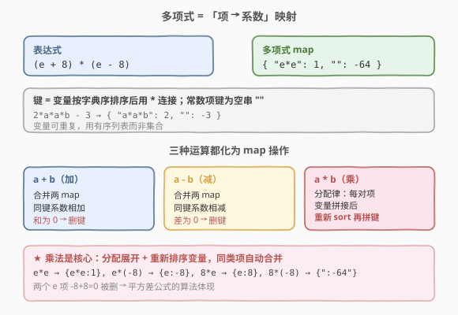
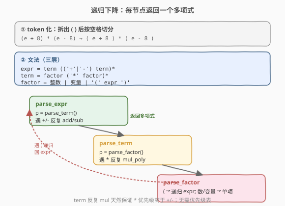
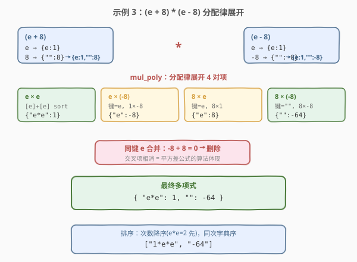

# 基本计算器IV

- **题目名称**：基本计算器IV
- **链接**：[770. 基本计算器 IV](https://leetcode.cn/problems/basic-calculator-iv/)
- **难度**：困难
- **标签**：栈、递归、字符串、数学

## 1. 题目概述

给定一个表达式 `expression`（含 `+`、`-`、`*`、`(`、`)`、变量与非负整数，**所有块与符号之间用一个空格隔开**），以及一个求值映射：`evalvars`（变量名列表）与 `evalints`（对应整数值）。要求先把映射中的变量替换为整数，再**展开并化简**表达式，返回特定格式的标记列表。

**表达式结构**：

- 交替使用「块」与「符号」，块与符号之间恰好一个空格。
- **块** = 括号中的表达式 `(...)` / 变量（小写字母串）/ 非负整数。
- 变量无前导系数、无一元符号（不会出现 `2x`、`-x`）。
- 运算优先级：先括号，再乘法，再加减。

**输出格式**：

1. 每个项中变量按**字典序**排列并用 `*` 连接（绝不写 `b*a*c`，只写 `a*b*c`）。
2. 项按**次数（变量个数，含重复）从大到小**排列；次数相同按变量部分字典序升序（**忽略前导系数**）。
3. 前导系数写在最左，用 `*` 与变量分隔；**系数为 1 也要写出**（如 `1*e*e`）。
4. **系数为 0 的项（含常数项）一律省略**；全为零时返回 `[]`。
5. 常数项只写数字（如 `-6`），不带 `*`。

**示例 1**：

```text
输入：expression = "e + 8 - a + 5", evalvars = ["e"], evalints = [1]
输出：["-1*a","14"]
解释：e=1，得 1 + 8 - a + 5 = 14 - a → ["-1*a","14"]
```

**示例 2**：

```text
输入：expression = "e - 8 + temperature - pressure",
      evalvars = ["e", "temperature"], evalints = [1, 12]
输出：["-1*pressure","5"]
解释：e=1, temperature=12 → 1 - 8 + 12 - pressure = 5 - pressure
```

**示例 3**：

```text
输入：expression = "(e + 8) * (e - 8)", evalvars = [], evalints = []
输出：["1*e*e","-64"]
解释：(e+8)(e-8) = e*e - 64（平方差展开，合并后 e 的交叉项相消）
```

**约束条件**：

- `1 <= expression.length <= 250`
- `expression` 由小写字母、数字、`'+'`、`'-'`、`'*'`、`'('`、`')'`、`' '` 组成，无前导/尾随空格
- `0 <= evalvars.length <= 100`，`evalvars[i]` 长度 1–20
- `evalints.length == evalvars.length`，`-100 <= evalints[i] <= 100`
- 所有中间结果与最终结果均在 32 位整数范围内

> 💡 本题是**多项式代数 + 递归下降解析**的招牌题。它和 224/772 的本质区别：那里结果是一个**整数**，这里结果是一组**符号项**（带变量的多项式）。因此不能再用「带符号入栈累加」的数值法，而要把每个子表达式表示成一个 `项 → 系数` 的映射，乘法做**分配律展开 + 变量排序合并**。难点不在解析，而在「多项式的表示与运算」与「输出排序规则」。

---

## 2. 解题思路

### 2.1 暴力思路：数值求值？

最直觉的误判是「这跟 224 一样，算个整数就行」。但题目要的是**符号化简**：变量未被映射时必须保留。例如 `(e + 8) * (e - 8)` 中 `e` 没有给定值，必须输出 `1*e*e - 64`，这就要求把乘法**展开分配**、把同类项**合并**。任何「先代入数值」的尝试都行不通——未映射的变量根本没有数可代。

正确方向：把每个子表达式的值建模成一个**多项式**（若干「系数 × 变量积」之和），用递归下降解析语法树，每个节点返回一个多项式，乘法节点做分配律展开。这正是**计算机代数系统（CAS）**的最小可用实现。

### 2.2 核心观察：多项式 = `项 → 系数` 映射



关键直觉有三点：

**① 用 `map<string, int>` 表示一个多项式。**

- **键**：该项的变量部分，把所有变量按字典序排序后用 `*` 连接。常数项的键为空串 `""`。
- **值**：该项的系数（整数）。
- 例：`2*a*a*b - 3` → `{"a*a*b": 2, "": -3}`；`e*e - 64` → `{"e*e": 1, "": -64}`。

> ⚠️ 变量可重复（如 `a*a`），所以键用**有序列表的拼接**而非集合。`sorted(["a","a","b"])=["a","a","b"]` → `"a*a*b"`。同一组变量必然拼出同一键，合并天然发生在 map 的同键累加里。

**② 三种运算都化为 map 操作。**

| 运算 | 做法 |
|------|------|
| `a + b` | 合并两 map，同键系数**相加**；和为 0 的键删除 |
| `a - b` | 合并两 map，同键系数**相减**；差为 0 的键删除 |
| `a * b` | **分配律**：对两 map 每对项 `(k1,v1)×(k2,v2)`，变量列表拼接后**重新排序**得新键，系数相乘；同键累加，为 0 删除 |

乘法是核心：`(e+8)*(e-8)` 展开时，`e*e`、`e*(-8)`、`8*e`、`8*(-8)` 四个乘积分别产生 `{"e*e":1}`、`{"e":-8}`、`{"e":8}`、`{"":-64}`，其中两个 `e` 项相消（`-8+8=0` 被删），最终得 `{"e*e":1, "":-64}`。

**③ 递归下降解析：每个语法节点返回一个多项式。**

由于输入「块与符号之间均有空格」，只需把 `(`、`)` 拆成独立 token 再按空格切分，就能得到干净的 token 流。文法是标准的「表达式 → 项 → 因子」三层：

```
expr   = term (('+' | '-') term)*
term   = factor ('*' factor)*
factor = 整数 | 变量 | '(' expr ')'
```

- `factor` 命中变量时，先查 `evalmap`：有值则返回常数项，无值返回 `{变量名: 1}`。
- `term` 反复做 `mul_poly`，天然处理乘法优先级高于加减。
- `expr` 反复做 `add_poly`/`sub_poly`。

> 💡 **为什么不需要处理一元负号？** 题目保证「块与符号交替」，块只能是括号表达式/变量/非负整数，符号只能是 `+ - *`。表达式和子表达式都以**块开头**，故 `-` 永远是二元运算符，绝不会出现 `(-5)`、`-x`。这让解析器免去了 224 里处理一元负号的麻烦。

### 2.3 算法流程图



整体一遍递归扫描，每个 token 至多消费一次。设 `n` 为 token 数、`T` 为多项式最大项数。每个 `mul_poly` 是 $O(T_a \cdot T_b \cdot L\log L)$（$L$ 为单项变量数，排序开销），最坏项数随乘法次数指数增长，但题目规模小（表达式长 ≤ 250、变量短），实测非常快。

### 2.4 示例演算

以示例 3 `(e + 8) * (e - 8)` 为例，跟踪每个语法节点返回的多项式：

| 步骤 | 节点 | 动作 | 返回的多项式 |
|------|------|------|--------------|
| 1 | `(e + 8)` | factor 命中 `(` → 递归 parse_expr | — |
| 2 | `e` | factor：变量，不在 evalmap | `{e:1}` |
| 3 | `8` | factor：整数 | `{"":8}` |
| 4 | `e + 8` | add_poly | `{e:1, "":8}` |
| 5 | `(e - 8)` | 同理 | `{e:1, "":-8}` |
| 6 | `*` | mul_poly：分配律展开四对项 | 见下 |
| 6a | `e * e` | `[e]+[e]` 排序 → `e*e`，1×1 | `{"e*e":1}` |
| 6b | `e * (-8)` | 键=`e`，1×(-8) | `{"e":-8}` |
| 6c | `8 * e` | 键=`e`，8×1 | `{"e":8}`（与 6b 合并 → `0` 删除）|
| 6d | `8 * (-8)` | 键=`""`，8×(-8) | `{"":-64}` |
| 7 | 合并结果 | — | `{"e*e":1, "":-64}` |
| 8 | 排序输出 | `e*e` 次数 2 先，`""` 次数 0 后 | `["1*e*e","-64"]` |



> 💡 6b 与 6c 的合并正是「平方差公式」的算法体现：交叉项 `±8e` 系数相加为零被删除，只剩 `e*e` 与 `-64`。这把代数恒等式变成了 map 同键累加的自动副产品。

---

## 3. 参考代码

### C++

```cpp
class Solution {
  public:
    vector<string> basicCalculatorIV(string expression, vector<string>& evalvars,
                                     vector<int>& evalints) {
        unordered_map<string, int> evalmap;
        for (int i = 0; i < (int)evalvars.size(); i++)
            evalmap[evalvars[i]] = evalints[i];

        // token 化：把 ( ) 拆成独立 token，再按空格切分
        vector<string> tokens;
        string buf;
        for (char c : expression) {
            if (c == '(' || c == ')') {
                if (!buf.empty()) { tokens.push_back(buf); buf.clear(); }
                tokens.push_back(string(1, c));
            } else if (c == ' ') {
                if (!buf.empty()) { tokens.push_back(buf); buf.clear(); }
            } else {
                buf.push_back(c);
            }
        }
        if (!buf.empty()) tokens.push_back(buf);

        using Poly = unordered_map<string, int>;

        auto addPoly = [](Poly a, const Poly& b) {
            for (auto& [k, v] : b) {
                a[k] += v;
                if (a[k] == 0) a.erase(k);
            }
            return a;
        };
        auto subPoly = [](Poly a, const Poly& b) {
            for (auto& [k, v] : b) {
                a[k] -= v;
                if (a[k] == 0) a.erase(k);
            }
            return a;
        };
        auto splitVars = [](const string& s) {
            vector<string> v;
            string cur;
            for (char c : s) {
                if (c == '*') { v.push_back(cur); cur.clear(); }
                else cur.push_back(c);
            }
            v.push_back(cur);
            return v;
        };
        auto mulPoly = [&](const Poly& a, const Poly& b) {
            Poly r;
            for (auto& [k1, v1] : a) {
                for (auto& [k2, v2] : b) {
                    string key;
                    if (k1.empty()) key = k2;
                    else if (k2.empty()) key = k1;
                    else {
                        vector<string> vars = splitVars(k1);
                        auto tmp = splitVars(k2);
                        vars.insert(vars.end(), tmp.begin(), tmp.end());
                        sort(vars.begin(), vars.end());
                        key = vars[0];
                        for (int i = 1; i < (int)vars.size(); i++) key += "*" + vars[i];
                    }
                    r[key] += v1 * v2;
                    if (r[key] == 0) r.erase(key);
                }
            }
            return r;
        };

        int pos = 0;
        function<Poly()> parseExpr, parseTerm, parseFactor;

        parseExpr = [&]() {
            Poly p = parseTerm();
            while (pos < (int)tokens.size() && (tokens[pos] == "+" || tokens[pos] == "-")) {
                string op = tokens[pos++];
                Poly q = parseTerm();
                p = (op == "+") ? addPoly(p, q) : subPoly(p, q);
            }
            return p;
        };
        parseTerm = [&]() {
            Poly p = parseFactor();
            while (pos < (int)tokens.size() && tokens[pos] == "*") {
                pos++;
                p = mulPoly(p, parseFactor());
            }
            return p;
        };
        parseFactor = [&]() -> Poly {
            const string& t = tokens[pos];
            if (t == "(") {
                pos++;
                Poly p = parseExpr();
                pos++;  // 跳过 ')'
                return p;
            }
            pos++;
            bool isInt = !t.empty();
            for (char c : t) if (!isdigit((unsigned char)c)) { isInt = false; break; }
            if (isInt) {
                int v = stoi(t);
                return v == 0 ? Poly{} : Poly{{"", v}};
            }
            if (evalmap.count(t)) {
                int v = evalmap[t];
                return v == 0 ? Poly{} : Poly{{"", v}};
            }
            return Poly{{t, 1}};
        };

        Poly poly = parseExpr();

        // 排序：次数降序，同次按变量部分字典序升序
        vector<string> keys;
        for (auto& [k, _] : poly) keys.push_back(k);
        sort(keys.begin(), keys.end(), [&](const string& a, const string& b) {
            int da = a.empty() ? 0 : (int)count(a.begin(), a.end(), '*') + 1;
            int db = b.empty() ? 0 : (int)count(b.begin(), b.end(), '*') + 1;
            if (da != db) return da > db;
            return a < b;
        });

        vector<string> res;
        for (auto& k : keys) {
            int c = poly[k];
            if (c == 0) continue;
            res.push_back(k.empty() ? to_string(c) : to_string(c) + "*" + k);
        }
        return res;
    }
};
```

### Python

```python
class Solution:
    def basicCalculatorIV(self, expression: str, evalvars: list[str],
                          evalints: list[int]) -> list[str]:
        evalmap = {v: i for v, i in zip(evalvars, evalints)}
        tokens = expression.replace('(', ' ( ').replace(')', ' ) ').split()
        pos = [0]

        def add_poly(a, b):
            r = dict(a)
            for k, v in b.items():
                r[k] = r.get(k, 0) + v
                if r[k] == 0:
                    del r[k]
            return r

        def sub_poly(a, b):
            r = dict(a)
            for k, v in b.items():
                r[k] = r.get(k, 0) - v
                if r[k] == 0:
                    del r[k]
            return r

        def mul_poly(a, b):
            r = {}
            for k1, v1 in a.items():
                for k2, v2 in b.items():
                    if k1 == '' or k2 == '':
                        key = k1 + k2
                    else:
                        key = '*'.join(sorted(k1.split('*') + k2.split('*')))
                    r[key] = r.get(key, 0) + v1 * v2
                    if r[key] == 0:
                        del r[key]
            return r

        def parse_expr():
            p = parse_term()
            while pos[0] < len(tokens) and tokens[pos[0]] in ('+', '-'):
                op = tokens[pos[0]]
                pos[0] += 1
                p = add_poly(p, parse_term()) if op == '+' else sub_poly(p, parse_term())
            return p

        def parse_term():
            p = parse_factor()
            while pos[0] < len(tokens) and tokens[pos[0]] == '*':
                pos[0] += 1
                p = mul_poly(p, parse_factor())
            return p

        def parse_factor():
            t = tokens[pos[0]]
            if t == '(':
                pos[0] += 1
                p = parse_expr()
                pos[0] += 1  # 跳过 ')'
                return p
            pos[0] += 1
            if t.isdigit():
                v = int(t)
                return {} if v == 0 else {'': v}
            if t in evalmap:
                v = evalmap[t]
                return {} if v == 0 else {'': v}
            return {t: 1}

        poly = parse_expr()

        def sort_key(k):
            deg = 0 if k == '' else k.count('*') + 1
            return (-deg, k)

        res = []
        for k in sorted(poly.keys(), key=sort_key):
            c = poly[k]
            if c == 0:
                continue
            res.append(str(c) if k == '' else f"{c}*{k}")
        return res
```

> 💡 两处细节决定成败：① **乘法后必须重新排序变量**（`sorted(k1.split('*') + k2.split('*'))`），否则同类项因键不同而无法合并；② **系数为 0 即删键**，既省内存又免去输出时再过滤（输出循环里仍保留 `if c == 0: continue` 作双保险）。常数项 `0` 用空 map `{}` 表示，自然不会出现在结果中。

---

## 4. 复杂度分析

| 维度 | 复杂度 | 说明 |
|------|--------|------|
| 时间复杂度 | $O(n \cdot T^2 \cdot L\log L)$ | $n$ 为 token 数；每次 `mul_poly` 是两多项式项数的乘积 $T_a \cdot T_b$，单项变量排序 $O(L\log L)$；$T$ 为过程中最大项数 |
| 空间复杂度 | $O(T \cdot L + n)$ | 多项式 map 存储 $O(T \cdot L)$，递归栈与 token 流 $O(n)$ |

> ⚠️ 项数 $T$ 理论上随连续乘法指数增长，但本题表达式长度 ≤ 250、变量短、乘法链有限，实测项数很小。若需支持超长乘法链，可改用「稀疏多项式 + 哈希键」进一步压常数，但本题无需。

---

## 5. 扩展：输出排序的字典序等价性

题目要求「同次数项按变量部分字典序升序」。我们用 `*` 连接排序后的变量作为比较键，等价于**对变量列表逐元素字典序比较**，原因在于分隔符 `*` 的 ASCII（42）小于所有小写字母（97–122）：

- 设两变量列表 $A=[a_1,\dots,a_k]$、$B=[b_1,\dots,b_k]$（同长度），拼接串 $S_A = a_1\text{*}a_2\text{*}\dots$、$S_B$ 同理。
- 逐字符比较 $S_A$ 与 $S_B$：在首个不同的变量处，`*` 充当「小于任何字母」的哨兵，恰好复现「短串是长串前缀时更小」的列表语义。
- 因此 `sort(key=lambda k: (-deg, k))` 与「按 $(-$次数$,$ 变量列表字典序$)$」完全等价。

> 💡 若误把 `*` 换成 ASCII 更大的分隔符（如 `~`，126 > 字母），则 `a` 与 `ab` 这类前缀关系会失序，导致同次项顺序错误。选用 `*` 既是题目输出格式，也恰好满足排序不变性，一举两得。

---

## 6. 面试要点

1. **为什么不能用 224 的数值栈法？**
   - 224 的结果是整数，本题结果是**符号多项式**：未映射的变量必须保留并展开。数值法无法表达 `e*e`，必须把子表达式值建模成 `项 → 系数` 映射，乘法做分配律展开。

2. **多项式的键为什么用「排序后的变量拼接」而非集合？**
   - 变量可重复（`a*a`），集合会丢重复信息导致次数错算。有序列表拼接既保留重复、又保证同组变量拼出同键，使合并自动发生在 map 同键累加里。

3. **乘法节点如何保证同类项合并？**
   - 每对项相乘后，把双方变量列表**拼接后重新 `sort`** 再拼键。这样 `(a*b)*(b*a)` 与 `(a*a)*(b*b)` 都归一到 `a*a*b*b`，系数自动累加。

4. **为什么不需要处理一元负号？**
   - 题目规定「块与符号交替」，块只能是括号表达式/变量/非负整数，表达式与子表达式均以块开头，故 `-` 恒为二元运算符。这比 224 简单——224 允许 `-2+1` 这类一元负号。

5. **输出排序规则有哪些坑？**
   - 次数降序、同次按变量部分字典序升序（忽略系数）；系数 1 必须写出（`1*e*e`）；系数 0 的项全部省略；常数项不带 `*`。用 `(-deg, key)` 排序，`*` 作分隔符恰好等价于变量列表字典序。

---

## 7. 同类练习题

- [224. 基本计算器](https://leetcode.cn/problems/basic-calculator/)（[站内题解](../0201-0300/224_基本计算器.md)）：只有 `+ - ()` 的数值求值，单栈 + 符号变量，对照本题的「符号多项式」差异
- [227. 基本计算器 II](https://leetcode.cn/problems/basic-calculator-ii/)：含 `* /` 的数值求值，乘除立即结合，是 224→770 的中间形态
- [736. Lisp 语法解析](https://leetcode.cn/problems/parse-lisp-expression/)（[站内题解](736_Lisp语法解析.md)）：递归下降 + 作用域栈，同属「自相似语法树解析」家族
- [1096. 花括号展开 II](https://leetcode.cn/problems/brace-expansion-ii/)：嵌套集合表达式解析 + 多项式合并，本题的「集合代数」变体
