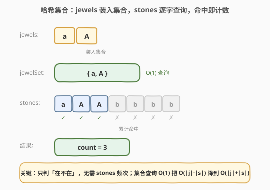
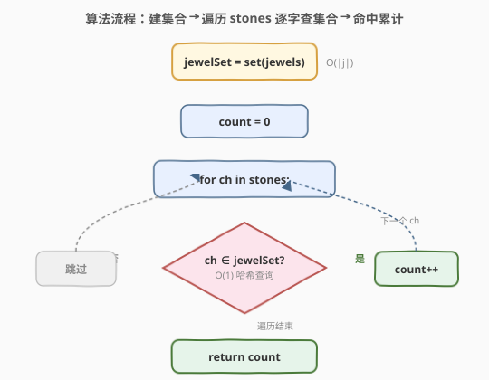
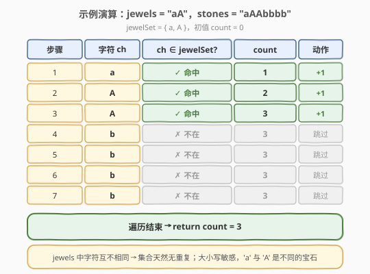

# LeetCode 宝石与石头 题解

## 1. 题目概述

- **标题 / 题号**：宝石与石头（#771，easy）
- **链接**：https://leetcode.cn/problems/jewels-and-stones/
- **难度**：简单
- **标签**：哈希表、字符串

**题意**：给你字符串 `jewels` 代表石头中**宝石的类型**，字符串 `stones` 代表你拥有的石头。`stones` 中每个字符代表一种你拥有的石头，你想知道你拥有的石头中有多少是宝石。

> ⚠️ 注意：字母**区分大小写**，`"a"` 与 `"A"` 是不同类型的石头。`jewels` 中的字符**互不相同**。

**示例 1**：

```text
输入：jewels = "aA", stones = "aAAbbbb"
输出：3
解释：jewels 中有 'a' 和 'A' 两种宝石；stones 里的 'a'、'A'、'A' 共 3 颗是宝石。
```

**示例 2**：

```text
输入：jewels = "z", stones = "ZZ"
输出：0
解释：jewels 只有 'z'（小写），而 stones 全是 'Z'（大写），大小写不同，无一颗是宝石。
```

**约束**：

- $1 \le \text{jewels.length}, \text{stones.length} \le 50$
- `jewels` 和 `stones` 仅由**英文字母**组成
- `jewels` 中的字符互不相同

> 💡 数据规模极小（`n ≤ 50`），暴力双重循环也能通过。但「把 jewels 装进哈希集合、stones 逐个 $O(1)$ 查询」是把 $O(|j| \cdot |s|)$ 降到 $O(|j|+|s|)$ 的关键，是本题考点。更进阶地，因字符集只有 $52$ 种英文字母，可用一个 $64$ 位整数的位图代替集合，空间 $O(1)$ 且常数极小。

## 2. 解题思路

### 2.1 暴力思路

对 `stones` 中的每个字符 `ch`，遍历 `jewels` 检查是否相等。最坏情况下每个字符都要扫完整个 `jewels`，时间 $O(|j| \cdot |s|)$，空间 $O(1)$。由于 $|j|, |s| \le 50$，最多 $2500$ 次比较，能通过但未利用题目结构。

> ⚠️ 暴力法的根源：它把 `jewels` 当作「散乱序列」反复线性搜索，而没有利用「只需知道一个字符**在不在** jewels 里」这一关键抽象。

### 2.2 核心观察：哈希集合——jewels 装入集合，stones 逐字查询



把 `jewels` 看作一个**宝石类型集合**（题目保证元素互不相同，天然适合集合）。先扫一遍 `jewels` 建立哈希集合 `jewelSet`，再扫 `stones`，对每个字符做 $O(1)$ 的集合成员查询：在集合里 → 是宝石，计数 $+1$；不在 → 跳过。

> 💡 **核心判据**：本题只关心「在不在」，**不关心频次**——这区别于 [383. 赎金信](../0301-0400/383_赎金信.md) 的「计数扣减判赤字」。因此用**集合**（`set`）而非**计数表**（`Counter`）即可，语义更贴合、空间也更省。

这与「计数家族」共享同一套「建表 + 扫描查询」骨架，但判据更弱：

| 维度 | 383 赎金信 | 771 宝石与石头 |
|------|-----------|---------------|
| 关系 | `magazine` **单向覆盖** `ransom` | `stones` 中的字符**属于** `jewels` |
| 所需信息 | 每种字母**还剩多少**（频次） | 字母**在不在**（存在性） |
| 数据结构 | 计数表 `cnt[26]` | 哈希集合 `set` |
| 终判 | 扣减后**无赤字** | 命中即**计数 $+1$** |
| 提前退出 | 赤字即返 `false` | 无（必须扫完才能数全） |

正因只需判存在性、且要数出**全部**命中数，本题**不能**提前退出，必须遍历完整串 `stones`。

### 2.3 算法流程图



两阶段流程：

1. **建集合**：遍历 `jewels`，对每个字符 `ch` 执行 `jewelSet.insert(ch)`（或 `add`），耗时 $O(|j|)$。
2. **计数**：`count = 0`，遍历 `stones`，对每个字符 `ch`：
   - 若 `ch ∈ jewelSet` → `count += 1`；
   - 否则跳过。
3. 遍历结束 → 返回 `count`。

> 💡 **为什么先建集合再查询，而不是边统计边匹配？** 一次性建集合让 `jewels` 的「类型全集」完整可见，查询阶段每个字符都是 $O(1)$ 查改，总复杂度严格 $O(|j| + |s|)$。若边建边匹配则要反复扫描 `jewels`，退化为暴力。

### 2.4 示例演算



以 `jewels = "aA"`，`stones = "aAAbbbb"` 为例（`jewelSet = {a, A}`，初值 `count = 0`）：

| 步骤 | 字符 `ch` | `ch ∈ jewelSet?` | `count` | 动作 |
|------|----------|------------------|---------|------|
| 1 | a | ✓ 命中 | 1 | +1 |
| 2 | A | ✓ 命中 | 2 | +1 |
| 3 | A | ✓ 命中 | 3 | +1 |
| 4 | b | ✗ 不在 | 3 | 跳过 |
| 5 | b | ✗ 不在 | 3 | 跳过 |
| 6 | b | ✗ 不在 | 3 | 跳过 |
| 7 | b | ✗ 不在 | 3 | 跳过 |
| 终判 | — | — | 3 | → **返回 3** |

对照示例 2 `jewels = "z"`，`stones = "ZZ"`：`jewelSet = {z}`，`'Z'` 大写与小写 `'z'` 不同 → 两步均 ✗ → **返回 0**。这正是「大小写敏感」的体现。

## 3. 参考代码

### C++

```cpp
class Solution {
  public:
    int numJewelsInStones(string jewels, string stones) {
        unordered_set<char> jewelSet(jewels.begin(), jewels.end());
        int count = 0;
        for (char ch : stones) {
            if (jewelSet.count(ch)) {
                ++count;
            }
        }
        return count;
    }
};
```

### Python

```python
class Solution:
    def numJewelsInStones(self, jewels: str, stones: str) -> int:
        jewel_set = set(jewels)
        return sum(ch in jewel_set for ch in stones)
```

> 💡 Python 版用 `sum(ch in jewel_set for ch in stones)`：生成器逐字符判定 `in`，`True` 视作 `1` 求和，一行表达「计数命中」。注意先 `set(jewels)` 再判定，保证每次查询 $O(1)$；若写成 `sum(ch in jewels for ch in stones)` 则 `in` 对字符串是 $O(|j|)$ 线性扫描，退化为暴力 $O(|j| \cdot |s|)$。

> ⚠️ **易错点**：务必把 `jewels` 转成 `set` 后再查询。`set` 的 `in` 是哈希 $O(1)$，而 `str` 的 `in` 是线性 $O(|j|)$——一字之差，复杂度天壤之别。

## 4. 复杂度分析

| 维度 | 复杂度 | 说明 |
|------|--------|------|
| 时间 | $O(|j| + |s|)$ | 建集合扫一次 `jewels`，计数扫一次 `stones`，每字符 $O(1)$ |
| 空间 | $O(|j|)$ | 哈希集合存 `jewels` 中所有字符；因字符互不相同，集合大小恰为 $|j|$ |
| 提前退出 | 无 | 必须数出全部命中数，不能提前返回 |

> ⚠️ 若字符集不限定为英文字母（如 Unicode），集合大小仍为 $O(|j|)$（实际用到的不同字符数），时间仍 $O(|j| + |s|)$。本题因 $|j|, |s| \le 50$，任何解法都能过，优化的是「思路」而非「能不能过」。

## 5. 扩展：位图解法（64 位整数代替集合）

因 `jewels` 与 `stones` 仅含英文字母（大小写共 $52$ 种），可用一个 $64$ 位整数的每一位表示「某字符是否为宝石」，把哈希集合压缩成 $O(1)$ 定长空间，且位运算常数极小。

**字符到位的映射**：观察 ASCII，`'A'`=65、`'Z'`=90、`'a'`=97、`'z'`=122。取 `ch & 63`（即低 6 位）：

- `'A'`(65) & 63 = 1，…，`'Z'`(90) & 63 = 26
- `'a'`(97) & 63 = 33，…，`'z'`(122) & 63 = 58

于是大写字母映射到第 $1\sim26$ 位、小写字母映射到第 $33\sim58$ 位，**互不冲突**，且最大位 $58 < 64$，一个 `unsigned long long` 足以容纳。

```cpp
class Solution {
  public:
    int numJewelsInStones(string jewels, string stones) {
        unsigned long long mask = 0;
        for (char ch : jewels) {
            mask |= 1ULL << (ch & 63);          // 标记该位为宝石
        }
        int count = 0;
        for (char ch : stones) {
            if (mask >> (ch & 63) & 1) {        // 测试该位
                ++count;
            }
        }
        return count;
    }
};
```

```python
class Solution:
    def numJewelsInStones(self, jewels: str, stones: str) -> int:
        mask = 0
        for ch in jewels:
            mask |= 1 << (ord(ch) & 63)
        return sum((mask >> (ord(ch) & 63)) & 1 for ch in stones)
```

> 💡 **为什么 `ch & 63` 而不是 `ch - 'A'`？** `ch - 'A'` 只能处理大写，需为大小写分别建映射（如 `ch <= 'Z'` 用一区、否则用另一区）；而 `ch & 63` 利用 ASCII 低 6 位的天然分布让大小写自动落到不同位段，**一次运算全覆盖**且无冲突。这是 [187. 重复的DNA序列](../0201-0300/187_重复的DNA序列.md)「$2$ 位编码」同类的位运算压缩思想：用整数位代替显式哈希表，把空间压到常数。

> ⚠️ 此位图解法**依赖 ASCII 编码**与「仅英文字母」的约束。若字符集扩大到任意 Unicode，`ch & 63` 会产生冲突（不同字符可能落到同一位），此时应退回哈希集合解法。位图是「字符集小且固定」时的常数优化，不是通用解。

## 6. 面试要点

1. **为什么用集合而不是计数表？**

   本题只关心 `stones` 中的字符「在不在」`jewels` 里，**不关心它出现了几次**。集合表达「存在性」正合适，计数表（频次数组）虽然也能做（建频次表后查 `>0`），但多存了用不到的频次信息，语义不贴合。对比 [383. 赎金信](../0301-0400/383_赎金信.md) 必须用计数表（要扣减配额判赤字），可见「所需信息」决定数据结构选择。

2. **`set` 的 `in` 和 `str` 的 `in` 复杂度为何不同？**

   `set` 基于哈希表，`in` 是 $O(1)$ 平均；`str` 的 `in` 是线性扫描 $O(|j|)$。Python 中 `sum(ch in jewels ...)`（字符串）与 `sum(ch in set(jewels) ...)`（集合）写法几乎一样，但前者 $O(|j| \cdot |s|)$、后者 $O(|j| + |s|)$，是本题最隐蔽的坑。

3. **题目保证 `jewels` 字符互不相同，对解法有什么影响？**

   这条约束让 `jewels` 天然适合装入集合（无需去重），集合大小恰为 $|j|$。若无此保证，仍可用集合（自动去重），逻辑不变，但 `|j|` 与集合大小的关系需留意。

4. **大小写敏感如何体现？为什么要单独强调？**

   `'a'`(97) 与 `'A'`(65) 是不同字符，哈希集合天然区分（作不同键）。位图解法中 `& 63` 后落到不同位（$33$ vs $1$）也自动区分。强调是因为示例 2（`"z"` vs `"ZZ"`）专测这一点，粗心者易误把大小写当同一字符。

5. **进阶：如果 `stones` 极长（如 $10^9$）怎么办？**

   建集合的 $O(|j|)$ 不变，瓶颈在扫描 `stones` 的 $O(|s|)$。若只需近似或可流式处理，仍逐字符查询集合即可（集合常驻内存）；若 `jewels` 也极大且字符集固定，位图解法用 $O(1)$ 空间更稳。但本题不能提前退出（要数全），扫描成本无法避免。

## 同类练习题

| # | 题目 | 与本题的关联 |
|---|------|-------------|
| 383 | [赎金信](https://leetcode.cn/problems/ransom-note/)（[题解](../0301-0400/383_赎金信.md)） | 哈希计数家族，单向覆盖判定（扣减判赤字）；对比本题只判存在性、用集合而非计数表 |
| 242 | [有效的字母异位词](https://leetcode.cn/problems/valid-anagram/)（[题解](../0201-0300/242_有效的字母异位词.md)） | 频次双向相等判定，计数模板的母题，与本题同为「字符集合关系」家族 |
| 349 | [两个数组的交集](https://leetcode.cn/problems/intersection-of-two-arrays/)（[题解](../0301-0400/349_两个数组的交集.md)） | 集合求交集，本题「集合成员查询」的近亲——都是用哈希集合把 $O(n \cdot m)$ 降到 $O(n + m)$ |
| 350 | [两个数组的交集 II](https://leetcode.cn/problems/intersection-of-two-arrays-ii/)（[题解](../0301-0400/350_两个数组的交集II.md)） | 计数法求交集（取每种元素的最小频次），同为「计数 + 抵消」家族，对照 349 的集合版 |
