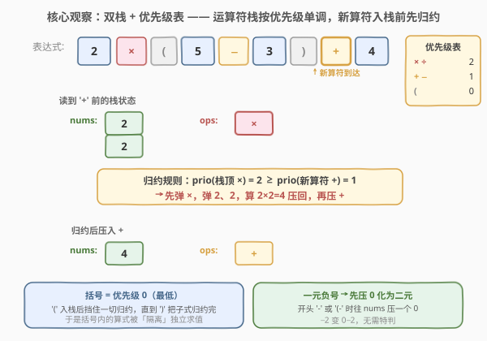
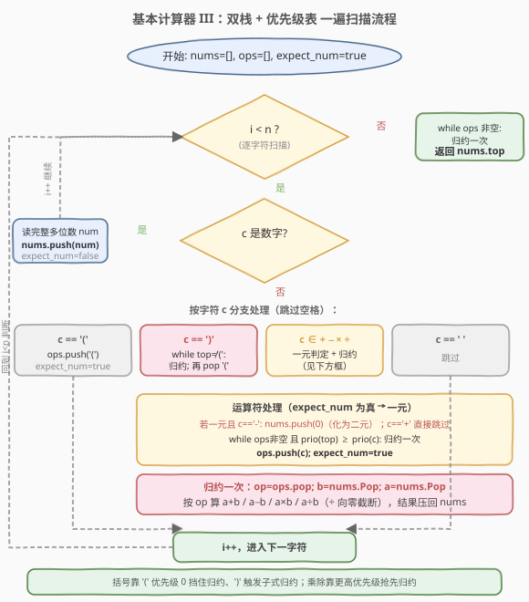
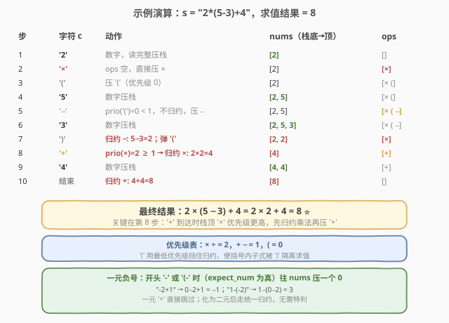

# LeetCode 基本计算器III 题解

## 1. 题目概述

- **标题 / 题号**：基本计算器III（#772，hard）
- **链接**：https://leetcode.cn/problems/basic-calculator-iii/
- **难度**：困难
- **标签**：栈、字符串、数学

**题意**：给定一个字符串表达式 `s`，包含**非负整数**、运算符 `+`、`-`、`*`、`/`、括号 `(`、`)` 以及若干空格。求表达式的值。

- **整数除法**只保留**整数部分**（向零截断，即 $\text{trunc}(a/b)$）。
- 保证表达式合法、无除以零，所有中间结果与最终结果均在 32 位整数范围内。
- 可能出现**一元负号**（如 `-2+1`、`1-(-2)`、`-(3+4)`）。

**示例 1**：

```text
输入：s = "1 + 1"
输出：2
```

**示例 2**：

```text
输入：s = "6-4 / 2"
输出：4
解释：4 / 2 = 2，6 - 2 = 4。
```

**示例 3**：

```text
输入：s = "2*(5-3)+4"
输出：8
解释：5 - 3 = 2，2 × 2 = 4，4 + 4 = 8。
```

**示例 4**：

```text
输入：s = "(2+6* 3+5- (3*14/7+2)*5)+3"
输出：-12
```

**约束**：

- `1 <= s.length <= 3 * 10^5`
- `s` 由数字、`'+'`、`'-'`、`'*'`、`'/'`、`'('`、`')'`、`' '` 组成
- `' '` 只作分隔，不参与运算

> 💡 本题是 **224（括号）+ 227（乘除）的合体**：运算符有两级优先级（`* /` 高于 `+ -`），又有嵌套括号，还可能有一元负号。这正是经典「表达式求值」的完整形态——双栈 + 优先级表（调度场算法变体）一招通吃。

## 2. 解题思路

### 2.1 暴力思路

两种常规做法：

1. **递归**：遇到 `'('` 找到匹配的 `')'`，对子串递归求值。但本题有 `* /`，递归内部仍要处理优先级，等于把 227 的逻辑嵌进 224 的递归里，层层套写起来繁琐。
2. **227 的「带符号入栈 + 立即结合」+ 224 的「括号暂存上下文」拼接**：逻辑分两层，但两套机制混在一个循环里容易打架（一元负号、`*` 与括号的交互都需特判）。

最干净的统一框架是**双栈 + 优先级表**：操作数栈 `nums` + 运算符栈 `ops`，用一张优先级表把 `+ - * / ( )` 一视同仁地调度。这正是编译原理里「表达式求值」的标准做法，也是 224/227 题解里预告过的 772 解法。

### 2.2 核心观察：运算符栈按优先级单调，新算符入栈前先归约



关键直觉有三点：

**① 给每个运算符一个优先级，`(` 设最低。**

| 运算符 | 优先级 |
|--------|--------|
| `*` `/` | 2（高） |
| `+` `-` | 1（低） |
| `(` | 0（最低） |

**② 读到新运算符时，先把栈顶「优先级 ≥ 新算符」的运算符归约掉，再压入新算符。**

- 归约一次 = 弹一个运算符 `op`、弹两个操作数 `a`、`b`（`a` 先入栈在下，`b` 在上），算 `a op b` 压回 `nums`。
- 因为 `* /` 优先级高于 `+ -`，读到 `+` 时栈顶若有 `*`，会被先归约掉——这等价于「先乘除后加减」。
- 同级（如 `+` 后遇 `-`）也归约：`a + b - c` 中读到 `-` 时栈顶 `+` 先算成 `a+b`，保证左结合。

> 为什么是 `≥` 而不是 `>`？因为同级运算符**左结合**：`a - b - c` 必须先算 `a-b` 再减 `c`。读到第二个 `-` 时栈顶是第一个 `-`（同级），用 `≥` 触发归约，把 `a-b` 先算掉。若用 `>` 则两个 `-` 都会留在栈上，最后从右往左归约成 `a-(b-c)`，违反左结合。

**③ 括号靠 `'('` 的最低优先级挡住归约，`')'` 触发子式归约。**

- `'('` 入 `ops` 栈后，它优先级为 0，任何后续运算符的优先级都 `≥ 0`？不——归约条件是「栈顶优先级 `≥` 新算符优先级」，而 `'('` 优先级 0 严格小于 `+ -` (1) 和 `* /` (2)，所以 `'('` 之上的运算符**不会被提前归约**，括号内的算式被隔离。
- 读到 `')'` 时，不断归约直到弹到 `'('`，括号内子式求值完成，再弹出 `'('`。

> 💡 这就把 224 的「括号暂存上下文」和 227 的「乘除优先」统一成了一件事：**栈天然记住层级，优先级表天然决定先后**。无需为括号单写一套递归。

### 2.3 算法流程图



整体一重循环，每个字符 `O(1)`（数字多位时内层 while 读完整数，均摊仍 `O(1)`），总复杂度 `O(n)`。

> ⚠️ **三个易错点**：
> 1. **数字可能多位**：读到数字字符要内层循环 `num = num * 10 + int(c)` 读完整，再压栈。
> 2. **一元负号**：用 `expect_num` 标志判定——初始为真，读到 `(` 或运算符后置真，读到数字/`)` 后置假。当 `-` 在 `expect_num=true` 时出现（开头或 `(-`），往 `nums` 压一个 `0`，把 `-2` 化成 `0-2` 走二元归约；一元 `+` 直接跳过。**全程无需特判**。
> 3. **除法向零截断**：C++ 整除天然向零截断；Python 的 `//` 对负数向下取整（`-3 // 2 == -2`），而一元负号会让被除数为负，故必须用 `int(a / b)` 或自写 `trunc_div`。

### 2.4 示例演算



逐步跟踪 `s = "2*(5-3)+4"`，重点看第 7 步 `')'` 把子式 `5-3` 归约成 `2`，以及第 8 步 `'+'` 到达时栈顶 `×` 优先级更高、被先归约：

- `'2'`：数字压栈，`nums=[2]`，`ops=[]`
- `'*'`：`ops` 空，直接压，`nums=[2]`，`ops=[×]`
- `'('`：压 `'('`，`nums=[2]`，`ops=[× (]`
- `'5'`：数字压栈，`nums=[2,5]`，`ops=[× (]`
- `'-'`：`prio('(')=0 < 1`，不归约，压 `−`，`nums=[2,5]`，`ops=[× ( −]`
- `'3'`：数字压栈，`nums=[2,5,3]`，`ops=[× ( −]`
- `')'`：归约到 `'('`：弹 `−`，算 `5-3=2`，`nums=[2,2]`，`ops=[× (]`；弹 `'('`，`ops=[×]`
- `'+'`：`prio(×)=2 ≥ 1` → 归约 `×`：`2*2=4`，`nums=[4]`，`ops=[]`；压 `+`，`nums=[4]`，`ops=[+]`
- `'4'`：数字压栈，`nums=[4,4]`，`ops=[+]`
- 串尾：归约 `+`：`4+4=8`，`nums=[8]`，`ops=[]`

最终结果 `8`。

## 3. 参考代码

### C++

```cpp
class Solution {
  public:
    int calculate(string s) {
        stack<long long> nums;
        stack<char> ops;
        auto prio = [](char c) {
            if (c == '+' || c == '-') return 1;
            if (c == '*' || c == '/') return 2;
            return 0;  // '('
        };
        auto apply = [&]() {
            char op = ops.top(); ops.pop();
            long long b = nums.top(); nums.pop();
            long long a = nums.top(); nums.pop();
            long long r = 0;
            if (op == '+') r = a + b;
            else if (op == '-') r = a - b;
            else if (op == '*') r = a * b;
            else r = a / b;  // C++ 整除向零截断
            nums.push(r);
        };

        int n = s.size();
        bool expect_num = true;  // 下一个应是操作数（开头 / '(' 后 / 运算符后）
        for (int i = 0; i < n; i++) {
            char c = s[i];
            if (c == ' ') continue;
            if (isdigit((unsigned char)c)) {
                long long num = 0;
                while (i < n && isdigit((unsigned char)s[i])) {
                    num = num * 10 + (s[i] - '0');
                    i++;
                }
                i--;  // 回退一步，外层 for 会再 i++
                nums.push(num);
                expect_num = false;
            } else if (c == '(') {
                ops.push(c);
                expect_num = true;
            } else if (c == ')') {
                while (ops.top() != '(') apply();
                ops.pop();  // 弹出 '('
                expect_num = false;
            } else {  // + - * /
                if (expect_num) {
                    if (c == '-') nums.push(0);  // 一元负号化为二元
                    else continue;               // 一元正号直接跳过
                }
                while (!ops.empty() && prio(ops.top()) >= prio(c)) apply();
                ops.push(c);
                expect_num = true;
            }
        }
        while (!ops.empty()) apply();
        return (int)nums.top();
    }
};
```

### Python

```python
class Solution:
    def calculate(self, s: str) -> int:
        nums = []
        ops = []
        prio = {"+": 1, "-": 1, "*": 2, "/": 2, "(": 0}

        def trunc_div(a, b):
            # 向零截断（Python // 对负数向下取整，会出错）
            q = abs(a) // abs(b)
            return q if (a >= 0) == (b >= 0) else -q

        def apply():
            op = ops.pop()
            b = nums.pop()
            a = nums.pop()
            if op == "+":
                nums.append(a + b)
            elif op == "-":
                nums.append(a - b)
            elif op == "*":
                nums.append(a * b)
            else:
                nums.append(trunc_div(a, b))

        expect_num = True
        i, n = 0, len(s)
        while i < n:
            c = s[i]
            if c == " ":
                i += 1
                continue
            if c.isdigit():
                num = 0
                while i < n and s[i].isdigit():
                    num = num * 10 + int(s[i])
                    i += 1
                nums.append(num)
                expect_num = False
                continue  # 内层 while 已自增 i，不再 i+=1
            if c == "(":
                ops.append(c)
                expect_num = True
            elif c == ")":
                while ops[-1] != "(":
                    apply()
                ops.pop()  # 弹出 '('
                expect_num = False
            else:  # + - * /
                if expect_num:
                    if c == "-":
                        nums.append(0)  # 一元负号化为二元
                    else:
                        i += 1
                        continue  # 一元正号跳过
                while ops and prio[ops[-1]] >= prio[c]:
                    apply()
                ops.append(c)
                expect_num = True
            i += 1

        while ops:
            apply()
        return nums[-1]
```

> 💡 **两处细节决定成败**：① **归约条件用 `≥`** 保证同级左结合（`a-b-c` 先算 `a-b`）；② **一元负号靠 `expect_num` + 压 0 化二元**，避免为负号单写分支。`expect_num` 在读到数字或 `)` 后置假，读到 `(` 或运算符后置真——状态机只有这一位标志，极简。

> ⚠️ **Python 除法陷阱**：`-3 // 2 == -2`（向下取整），而题目要求向零截断（`-1`）。一元负号会让被除数为负，故 `//` 不可用。本实现用纯整数 `trunc_div`（按符号决定商的正负、用 `abs` 求绝对值商），规避浮点精度问题。量级在 32 位内时 `int(a / b)` 也安全，但纯整数版更稳妥。

## 4. 复杂度分析

| 维度 | 复杂度 | 说明 |
|------|--------|------|
| 时间复杂度 | $O(n)$ | 每个字符处理一次 `O(1)`；每个运算符至多入栈、出栈各一次，归约总次数 `O(n)` |
| 空间复杂度 | $O(n)$ | 两栈深度之和不超过 `n`（最深如 `((((...))))` 或 `1+2+3+...`） |

## 5. 扩展：递归下降解法

双栈 + 优先级表是「自底向上归约」的调度场风格；另一种等价写法是**递归下降**（与 [770. 基本计算器 IV](../0701-0800/770_基本计算器IV.md) 同构，只是 770 返回多项式、本题返回整数）。文法三层：

```
expr   = term (('+' | '-') term)*
term   = factor ('*' | '/' factor)*
factor = 整数 | '(' expr ')' | ('+' | '-') factor   // 末项处理一元号
```

`expr` 处理加减、`term` 处理乘除、`factor` 处理括号与一元号，优先级由**语法嵌套层级**天然表达，无需优先级表。优点是结构清晰、易扩展（加 `^` 幂运算只需新增一层）；缺点是递归栈深度等于括号嵌套，最坏 `O(n)` 空间，与双栈相同。

> 💡 整个「基本计算器」家族由此成体系：224（单栈 + 符号变量，仅 `+ - ()`）→ 227（一栈 + 立即结合，加 `* /` 无括号）→ 772（双栈 + 优先级表，`+ - * / ()` 全功能）→ 770（递归下降 + 多项式，符号化简）。掌握 772 的双栈框架，就握住了通用的「表达式求值」母题。

## 6. 面试要点

1. **为什么归约条件是 `prio(top) >= prio(c)` 而不是 `>`？**

   - 同级运算符**左结合**。`a - b - c` 读到第二个 `-` 时栈顶是第一个 `-`（同级），用 `≥` 触发归约先算 `a-b`；若用 `>` 则两个 `-` 都留栈，最后从右往左归约成 `a-(b-c)`，结果错误。

2. **括号为什么不需要单独的递归或上下文栈？**

   - `'('` 优先级设为 0（最低），归约条件 `prio(top) >= prio(c)` 永远不会对 `'('` 成立（除非 `c` 也是 `'('`，但 `'('` 直接入栈不进归约分支），所以 `'('` 之上的运算符被隔离不被提前归约。`')'` 则不断归约直到弹到 `'('`，等价于对子式求值。栈的层级天然替代了递归调用栈。

3. **一元负号怎么处理？为什么要压 0？**

   - 用 `expect_num` 标志：开头、`(` 后、运算符后为真，表示期待操作数。此时若遇 `-`，往 `nums` 压一个 `0`，`-2` 就化成了 `0-2`，走标准二元归约，无需特判分支。一元 `+` 直接跳过。例如 `-2+1` → `0-2+1 = -1`，`1-(-2)` → `1-(0-2) = 3`。

4. **为什么 C++ 用 `long long`、Python 不能用 `//`？**

   - C++ 中间累加可能短暂超 32 位（如多个大数相乘后再减），用 `long long` 累加、最后转 `int` 更稳妥；C++ 整除天然向零截断。Python `//` 对负数**向下取整**（`-3 // 2 == -2`），而一元负号让被除数可能为负，必须用纯整数 `trunc_div` 或 `int(a / b)`（32 位内安全）实现向零截断。

5. **双栈和递归下降哪个更好？**

   - 双栈 + 优先级表是**迭代**、常数因子低、易加运算符（改优先级表即可）；递归下降结构更清晰、优先级由语法层级表达、易扩展（加 `^` 幂运算加一层文法）。两者复杂度同为 `O(n)` 时间、`O(n)` 空间。面试中双栈更常被要求手写，递归下降更常被作为「更优雅的解法」讨论。

## 同类练习题

| # | 题目 | 与本题的关联 |
|---|------|-------------|
| 224 | [基本计算器](https://leetcode.cn/problems/basic-calculator/)（[站内题解](../0201-0300/224_基本计算器.md)） | 只有 `+ - ()` 的退化版，单栈 + 符号变量，对照本题的双栈统一框架 |
| 227 | [基本计算器 II](https://leetcode.cn/problems/basic-calculator-ii/)（[站内题解](../0201-0300/227_基本计算器II.md)） | 去掉括号、保留 `* /`，一栈 + 立即结合，是 224→772 的中间形态 |
| 770 | [基本计算器 IV](https://leetcode.cn/problems/basic-calculator-iv/)（[站内题解](770_基本计算器IV.md)） | 递归下降 + 多项式符号化简，同族「表达式求值」的符号代数版 |
| 150 | [逆波兰表达式求值](https://leetcode.cn/problems/evaluate-reverse-polish-notation/) | 后缀表达式直接用栈求值，是「归约」操作的最纯粹形态 |
| 736 | [Lisp 语法解析](https://leetcode.cn/problems/parse-lisp-expression/)（[站内题解](736_Lisp语法解析.md)） | 递归下降 + 作用域栈，同属「自相似语法树解析」家族 |
