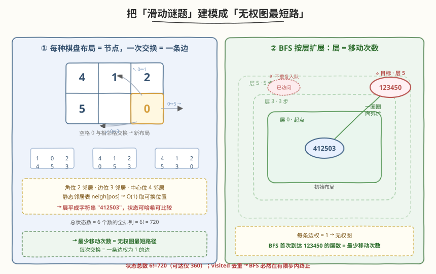
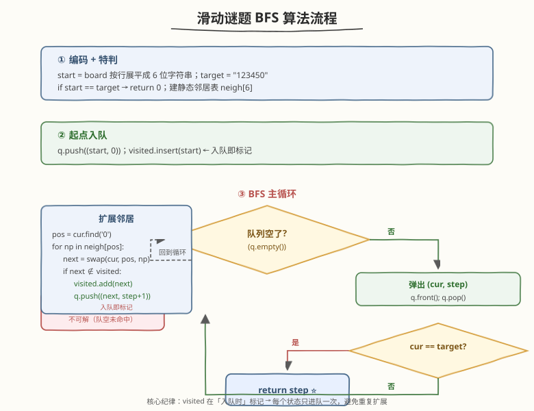
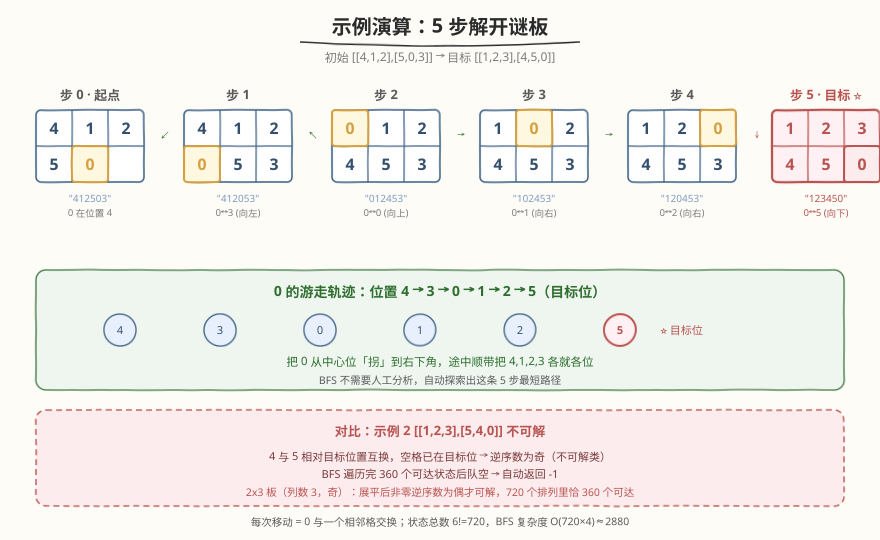

# LeetCode 滑动谜题 题解

## 1. 题目概述

- **标题 / 题号**：滑动谜题（#773，hard）
- **链接**：https://leetcode.cn/problems/sliding-puzzle/
- **难度**：困难
- **标签**：广度优先搜索、状态空间搜索、最短路径

**题意**：在一个 `2 x 3` 的板（`board`）上有 5 块砖瓦，用数字 `1~5` 表示，以及一块空缺用 `0` 表示。一次**移动**定义为选择 `0` 与一个相邻数字（上/下/左/右）进行交换。

当板的结果是 `[[1,2,3],[4,5,0]]` 时谜板被解开。给出初始状态 `board`，返回解开谜板的**最少移动次数**；若不能解开则返回 `-1`。

**示例 1**：

```text
输入：board = [[1,2,3],[4,0,5]]
输出：1
解释：交换 0 和 5，1 步完成。
```

**示例 2**：

```text
输入：board = [[1,2,3],[5,4,0]]
输出：-1
解释：没有办法完成谜板（4 和 5 相对目标位置互换，且空格已在目标位，奇偶性不可逆）。
```

**示例 3**：

```text
输入：board = [[4,1,2],[5,0,3]]
输出：5
解释：最少移动 5 次，一种路径：
  [[4,1,2],[5,0,3]]
  [[4,1,2],[0,5,3]]
  [[0,1,2],[4,5,3]]
  [[1,0,2],[4,5,3]]
  [[1,2,0],[4,5,3]]
  [[1,2,3],[4,5,0]]   ⭐ 命中目标
```

**约束**：

- `board.length == 2`，`board[i].length == 3`
- `0 <= board[i][j] <= 5`，每个值都**不同**（恰好是 `0~5` 的一个排列）

> ⚠️ 注意三点：① 每次移动是「`0` 与某个相邻数字**交换**」，不是滑动一整行/列；② 目标态固定为 `[[1,2,3],[4,5,0]]`；③ 求的是**最少**移动次数，对应无权图上的**最短路径**。6 个格子放 6 个互异的数，总状态数恰好是 $6! = 720$，规模极小——这是本题能用 BFS 直接搜到底的关键。

## 2. 解题思路

### 2.1 暴力思路：DFS 全枚举

从初始状态出发，每次任选一个相邻交换，递归尝试所有走法，记录到达目标的步数取最小值。问题在于：状态会反复来回（`A→B→A→...`），不加记忆化则指数爆炸；加记忆化又会因为「带环 + 求最短」而退化为求最短路——这恰好引出下面的关键观察。

### 2.2 核心观察：把「滑动谜题」建模成「无权图最短路」



关键一步是**换一个视角看状态**：把每一种棋盘布局看成一个**节点**，两种布局之间连一条边当且仅当它们只差「一次 `0` 与相邻格的交换」。于是：

- 节点总数 = $6! = 720$（6 个互异数字的所有排列）。
- 每个节点的出边数 = `0` 所在位置的**邻居数**（角上 2 条、边上非角 3 条、中心位 4 条）。
- 「最少移动次数」= 从初始布局到目标布局 `[[1,2,3],[4,5,0]]` 的**边数最少**的路径 = 无权图上的**最短路径**。

> 💡 **无权图最短路径 = BFS**。BFS 按「层数」一圈圈扩展：初始态在层 0，它一次交换能到的布局在层 1，再交换一次能到的在层 2……**第一次**访问到目标态的层数就是最少移动次数。每个状态只入队一次（`visited` 去重），总共至多 720 个状态，复杂度可控。

> ⚠️ **为什么不能用 DFS / Dijkstra？** DFS 找到的不一定是最短，且带环难剪枝；Dijkstra 处理**带权**图，而本题每条边权都是 1（无权），用 BFS 即可 $O(V+E)$ 解决。A*（启发式搜索，用曼哈顿距离作启发函数）也能做，但状态空间太小、收益不明显。

**状态编码**：把 `2x3` 棋盘按行展平成 6 位字符串，如 `[[1,2,3],[4,5,0]]` → `"123450"`。这样可以直接用字符串作哈希键，避免二维数组拷贝。

**邻居表**：`0` 在位置 `i` 时能换到哪些位置？按行优先编号 `0 1 2 / 3 4 5`：

| `0` 的位置 | 可交换的位置 |
|-----------|-------------|
| 0 | 1, 3 |
| 1 | 0, 2, 4 |
| 2 | 1, 5 |
| 3 | 0, 4 |
| 4 | 1, 3, 5 |
| 5 | 2, 4 |

> 💡 这张**静态邻居表**是本题最实用的技巧：把「`0` 的位置 → 可换位置」预先写死成数组 `neigh = [[1,3],[0,2,4],[1,5],[0,4],[1,3,5],[2,4]]`，转移时只需遍历 `neigh[pos]` 即可，不用每次判断「上下左右是否越界」。

### 2.3 算法流程图



**三步法**：

1. **编码 + 特判**：把初始 `board` 按行展平成字符串 `start`，目标 `target = "123450"`。若 `start == target` 直接返回 `0`。
2. **BFS 主循环**：队列存放 `(当前状态字符串, 步数)`，`visited` 集合记录已入队状态。每轮取出队首 `(cur, step)`：
   - 若 `cur == target`，返回 `step`（BFS 首次到达即最短）。
   - 否则找到 `0` 在 `cur` 中的下标 `pos`，遍历 `neigh[pos]` 里的每个位置 `np`：把 `cur` 的 `pos` 与 `np` 字符交换得到 `next`；若 `next` 不在 `visited`，则标记 `visited` 并入队 `(next, step+1)`。
3. **队空未命中**：返回 `-1`。

> 💡 **两个易错点**：（1）`visited` 必须在「**入队时**」标记，而不是出队时——否则同一状态会被它的多个前驱重复入队，队列与时间都炸到指数级，这是所有 BFS 的通用纪律；（2）**交换字符**时要用可变结构（C++ 的 `string` 或 Python 转成 `list` 再拼回），不可直接修改字符串字面量。

### 2.4 示例演算

以示例 3 `board = [[4,1,2],[5,0,3]]`（展平为 `"412503"`，`0` 在位置 4）为例，BFS 沿最短路径逐层扩展：



| 步 | 棋盘 | 字符串 | `0` 位置 | 这次交换 |
|----|------|--------|---------|---------|
| 0 | `4 1 2 / 5 0 3` | `412503` | 4 | 起点 |
| 1 | `4 1 2 / 0 5 3` | `412053` | 3 | `0` ↔ 左(3) |
| 2 | `0 1 2 / 4 5 3` | `012453` | 0 | `0` ↔ 上(0) |
| 3 | `1 0 2 / 4 5 3` | `102453` | 1 | `0` ↔ 右(1) |
| 4 | `1 2 0 / 4 5 3` | `120453` | 2 | `0` ↔ 右(2) |
| **5** | **`1 2 3 / 4 5 0`** ⭐ | **`123450`** | 5 | `0` ↔ 下(5)，命中目标 |

> 💡 直觉上：这 5 步是把 `0` 从中心位（位置 4）一路「拐」到右下角目标位（位置 5），途中顺带把 `4、1、2、3` 各就各位。BFS 不需要任何这种人工分析，它会自动探索出这条最短路径——这正是「状态空间搜索」的威力。而示例 2 的 `[[1,2,3],[5,4,0]]` 中 `4` 与 `5` 相对目标互换、空格已在目标位，属于「逆序数为奇」的不可解状态，BFS 遍历完 360 个可达状态后队空，自动返回 `-1`。

## 3. 参考代码

### C++

```cpp
class Solution {
  public:
    int slidingPuzzle(vector<vector<int>>& board) {
        // 按行展平成 6 位字符串
        string start;
        for (auto& row : board)
            for (int x : row)
                start.push_back('0' + x);
        const string target = "123450";
        if (start == target) return 0;

        // 静态邻居表：0 在位置 i 时可交换到的位置
        static const vector<vector<int>> neigh = {
            {1, 3}, {0, 2, 4}, {1, 5},
            {0, 4}, {1, 3, 5}, {2, 4}
        };

        unordered_set<string> visited;
        queue<pair<string, int>> q;
        q.push({start, 0});
        visited.insert(start);                  // 入队即标记

        while (!q.empty()) {
            auto [cur, step] = q.front(); q.pop();
            if (cur == target) return step;     // 首次到达即最短
            int pos = cur.find('0');            // 找空格位置
            for (int np : neigh[pos]) {
                string next = cur;
                swap(next[pos], next[np]);      // 0 与相邻格交换
                if (!visited.count(next)) {
                    visited.insert(next);       // 入队即标记，避免重复入队
                    q.push({next, step + 1});
                }
            }
        }
        return -1;                              // 队空仍未命中 → 不可解
    }
};
```

### Python

```python
class Solution:
    def slidingPuzzle(self, board: List[List[int]]) -> int:
        # 按行展平成 6 位字符串
        start = "".join(str(x) for row in board for x in row)
        target = "123450"
        if start == target:
            return 0

        # 静态邻居表：0 在位置 i 时可交换到的位置
        neigh = [
            [1, 3], [0, 2, 4], [1, 5],
            [0, 4], [1, 3, 5], [2, 4]
        ]

        from collections import deque
        visited = {start}
        q = deque([(start, 0)])                 # 队列存 (状态, 步数)

        while q:
            cur, step = q.popleft()
            if cur == target:
                return step                     # 首次到达即最短
            pos = cur.index("0")                # 找空格位置
            for np in neigh[pos]:
                nxt = list(cur)
                nxt[pos], nxt[np] = nxt[np], nxt[pos]   # 0 与相邻格交换
                nxt = "".join(nxt)
                if nxt not in visited:
                    visited.add(nxt)            # 入队即标记
                    q.append((nxt, step + 1))
        return -1                               # 队空仍未命中 → 不可解
```

> ⚠️ **两个高频踩坑点**：
> （1）**`visited` 标记时机**：必须在「**入队时**」标记，而不是「出队时」。若出队才标记，同一个状态会被它的多个前驱重复入队，队列与时间都炸到指数级。这条纪律对所有 BFS 通用。
> （2）**字符串不可变**：Python 中字符串是不可变对象，交换字符必须先转 `list` 再 `join`；C++ 的 `string` 可直接下标交换。

## 4. 复杂度分析

| 维度 | 复杂度 | 说明 |
|------|--------|------|
| **时间复杂度** | $O(V + E) = O(6!)$ | 状态总数 $V = 6! = 720$，每个状态至多 4 条出边，$E \le 4V$；总工作量 $\le 720 \times 4 \approx 2880$ 次状态转移，常数极小 |
| **空间复杂度** | $O(6!)$ | `visited` 集合与队列最多存全部 720 个状态，每个状态为 6 字节字符串 |

> 💡 本题状态空间**极小**（720 个状态），所以 BFS 必然在极短时间内终止。注意：并非所有 720 个状态都能到达目标——`2x3` 滑动谜题的可达状态恰为 360 个（由排列逆序数奇偶性决定），另一半不可解，BFS 遍历完可达集后队空即返回 `-1`。只要记住「**状态总数 = BFS 的时间上界**」即可判断可行性。

## 5. 扩展：A* 启发式搜索与可解性判定

### 5.1 A* 加速

当状态空间更大（如 `3x3` 的八数码问题，$9! = 362880$ 个状态）时，普通 BFS 可能偏慢。可用 **A\*** 搜索：用「已走步数 + 启发函数」作为优先级，启发函数取**各数字到目标位置的曼哈顿距离之和**（不计 `0`）。该启发函数是**可采纳**的（不会高估真实剩余步数），故 A* 首次弹出目标态时即为最短路径。在 `2x3` 本题中状态太少，A* 与 BFS 几乎无差异；在八数码等更大规模上收益明显。

### 5.2 可解性的奇偶性判定

滑动谜题的可解性由**排列逆序数奇偶性**决定（空格所在行的奇偶性也参与，视棋盘列数而定）。对于 `2x3`（列数为 3，奇数）板，**展平后非零数字的逆序数为偶数**当且仅当可达目标。故可在 BFS 前先 $O(6)$ 判定，不可解直接返回 `-1`，省去搜索。本题 BFS 已足够快，此判定主要在更大棋盘（八数码 `3x3`、十五数码 `4x4`）上用于剪枝。

```python
def is_solvable(board_flat: str) -> bool:
    nums = [int(c) for c in board_flat if c != '0']
    inv = sum(1 for i in range(len(nums))
                  for j in range(i + 1, len(nums)) if nums[i] > nums[j])
    return inv % 2 == 0      # 列数为 3(奇) 时：逆序数为偶才可解
```

> ⚠️ 此判定的具体形式依赖棋盘**列数的奇偶性**：列数为奇数时只看逆序数奇偶；列数为偶数时还要叠加 `0` 所在行（从下往上数）的奇偶。本题固定 `2x3`（列数 3，奇），直接用逆序数判定即可。

## 6. 面试要点

1. **为什么用 BFS 而不是 DFS / Dijkstra？**

   - 每条边权都是 1（一次交换），是**无权图最短路**问题。BFS 按「层数」扩展，首次到达目标即为最短，$O(V+E)$。DFS 找到的不保证最短且带环难剪枝；Dijkstra 是带权图算法，对无权图是「杀鸡用牛刀」且常数更大。

2. **`visited` 为什么必须在入队时标记，不能在出队时标记？**

   - 若出队才标记，同一状态会被它的多个前驱**重复入队**。最坏情况下队列规模从 $O(V)$ 膨胀到 $O(b^V)$，直接 TLE / OOM。入队即标记能保证每个状态只进队一次，这是 BFS 的核心纪律。

3. **状态如何编码？为什么用字符串而不用二维数组？**

   - 把 `2x3` 棋盘按行展平成 6 位字符串（如 `"123450"`），可直接作哈希键、比较与拷贝都 $O(6)$。若用二维数组或 tuple-of-tuples，哈希与比较开销更大、代码也更啰嗦。状态编码的原则是「**最小化、可哈希、转移 $O(1)$**」。

4. **`0` 的邻居怎么快速确定？**

   - 预先建一张**静态邻居表** `neigh = [[1,3],[0,2,4],[1,5],[0,4],[1,3,5],[2,4]]`，按 `0` 所在位置索引即可 $O(1)$ 取出可交换位置，免去每次判断「上下左右是否越界」的分支。这是所有「棋盘滑动题」的通用套路。

5. **为什么有些初始状态无解？**

   - 滑动谜题的可解性由**排列逆序数奇偶性**决定。`2x3` 板（列数 3，奇）中，展平后非零数字逆序数为偶的状态才可达目标，故 720 个排列里只有 360 个可解。BFS 遍历完可达集后队空即返回 `-1`，无需额外判定；但若想提前剪枝，可用逆序数奇偶 $O(6)$ 判定。

## 同类练习题

| # | 题目 | 与本题的关联 |
|---|------|-------------|
| 752 | [打开转盘锁](https://leetcode.cn/problems/open-the-lock/)（[题解](752_打开转盘锁.md)） | 最接近的镜像题——状态=4 位数字串，邻居=拨一个转盘 ±1，BFS 求最少拨动次数；同样是「隐式图 + 状态去重」模板，状态空间 $10^4$ 比本题 720 略大 |
| 127 | [单词接龙](https://leetcode.cn/problems/word-ladder/) | 状态=单词，邻居=只差一个字母的词典单词，BFS 求最短转换序列；状态空间大，是双向 BFS 的最佳练手题 |
| 1654 | [到家的最少跳跃次数](https://leetcode.cn/problems/minimum-jumps-to-reach-home/) | 状态=位置，`forbidden` 集合等价死亡组合，BFS 求最短跳跃；带方向/限制域时需注意上界剪枝 |
| 200 | [岛屿数量](https://leetcode.cn/problems/number-of-islands/)（[题解](../0101-0200/200_岛屿数量.md)） | 对比「网格 BFS」与本题「隐式图 BFS」——前者图是显式网格、后者图由转移规则隐式定义 |
| 994 | [腐烂的橘子](https://leetcode.cn/problems/rotting-oranges/)（[题解](../0901-1000/994_腐烂的橘子.md)） | 多源 BFS 求最短感染时间，同样依赖「BFS 层数 = 最短步数」的核心性质 |
