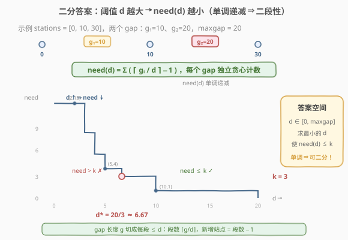
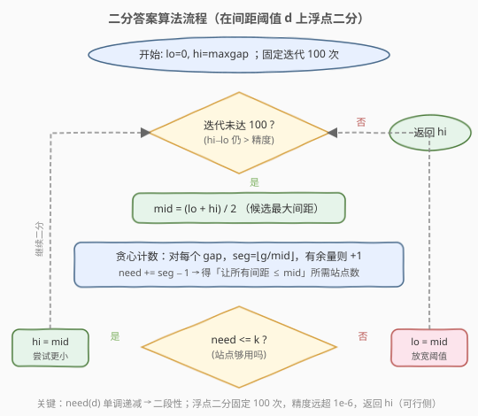

# LeetCode 最小化去加油站的最大距离 题解

## 1. 题目概述

- **标题 / 题号**：最小化去加油站的最大距离（#774，hard）
- **链接**：https://leetcode.cn/problems/minimize-max-distance-to-gas-station/
- **难度**：困难
- **标签**：数组、二分查找、二分答案、贪心

**题意**：给定一条数轴上**已存在**的 $n$ 个加油站位置 `stations`（**已按升序排序**），以及一个整数 $k$。你可以在数轴上**任意实数位置**（不限于整数）新增 $k$ 个加油站。新增完成后，求**相邻加油站的距离的最大值**的最小可能值。答案与标准答案误差不超过 $10^{-6}$ 即视为正确。

**示例 1**：

```text
输入：stations = [1,2,3,4,5,6,7,8,9,10], k = 9
输出：0.50000
解释：10 个站均匀分布在 1~10，相邻间距均为 1。在每个间距中点各加 1 个站（共 9 个），新间距全部变为 0.5，最大距离 = 0.5。
```

**示例 2**：

```text
输入：stations = [23,24,36,39,46,56,57,65,84,98], k = 1
输出：14.00000
解释：相邻间距为 [1,12,3,7,10,1,8,19,14]，最大间距 19（65 与 84 之间）。
       在它的中点加 1 个站，19 被分成两个 9.5，此时全局最大间距变为次大的 14（98−84），故答案为 14。
```

**约束**：

- $10 \le n \le 2000$
- $0 \le \text{stations}[i] \le 10^8$
- `stations` 严格递增
- $1 \le k \le 10^6$

## 2. 解题思路

### 2.1 暴力思路

新增站点可放在**任意实数位置**，解空间是连续的，无法枚举所有放法；即便退一步「只在候选位置放」，候选位置也无穷多。

换个角度：答案 $d^*$（最大间距的最小值）一定落在 $[0,\ \max(\text{gap})]$ 之间。能否对每个候选 $d$ 判断「能否用 $\le k$ 个站把所有间距压到 $\le d$」？若逐个试 $d$，每次判定 $O(n)$，但 $d$ 是连续实数，无法逐枚举。

> 💡 **关键转化**：把「求最小最大间距」变成「求最小的 $d$，使用 $\le k$ 个站即可让所有间距 $\le d$」——这是**二分答案**的标准信号，与 [410. 分割数组的最大值](../0401-0500/410_分割数组的最大值.md)、[719. 找出第 K 小的数对距离](719_找出第K小的数对距离.md) 同骨架。

### 2.2 核心观察：二分答案 + 贪心计数



定义 $\text{need}(d)$ =「让所有相邻间距 $\le d$ 所需新增站点数」。它关于 $d$ **单调递减**：

- $d$ 越大（允许间距越宽），每个 gap 要切的段数越少，$\text{need}(d)$ 越小。
- $d \to \infty$ 时 $\text{need} = 0$；$d \to 0^+$ 时 $\text{need} \to \infty$。

于是存在分界点 $d^*$：

```text
d < d* → need(d) > k    (站点不够，d 太严)
d ≥ d* → need(d) ≤ k    (站点够，d 够松)
```

这正是二分所需的**二段性**。在 $[0,\ \max\text{gap}]$ 上二分，每次 $O(n)$ 计算 $\text{need}(\text{mid})$，可行则收缩右界找更小，不可行则放大左界。

> 💡 **识别信号**：题目求「最小的最大值」+ 能高效验证某阈值的可行性 → 想「二分答案」。本题的 `check()` 是「每个 gap 独立贪心计数」。

**如何计算单个 gap 的 need？** 对一段长度为 $g$ 的间距，要切成若干段每段 $\le d$，需要的段数为 $\lceil g/d \rceil$，因此新增站点数 $= \lceil g/d \rceil - 1$。所有 gap 求和即 $\text{need}(d)$。

> ⚠️ **浮点取整的坑**：$g$ 是整数（位置差），$d$ 是浮点候选值。直接 `(int)ceil(g/d)` 在 $g$ 恰被 $d$ 整除时可能因浮点误差多算 1。稳妥写法：先 `seg = (long long)(g/d)`（即 $\lfloor g/d \rfloor$），若 $g - \text{seg}\cdot d$ 明显大于 0（有余量）则 `seg++`（变 $\lceil g/d \rceil$），最后 `need += seg - 1`。

### 2.3 算法流程图



浮点二分不用 `lo <= hi` 而用**固定迭代次数**（如 100 次）或 `hi - lo > 10^{-7}`，避免死循环；最终返回 `hi`（可行侧的极限）。

### 2.4 示例演算

![示例演算：stations=[0,10,30], k=3](../images/mmdgs_example_walkthrough.svg)

以简化示例 `stations = [0, 10, 30]`、$k = 3$ 演示（两个 gap：$g_1 = 10$、$g_2 = 20$，$\max\text{gap} = 20$，答案 $= 20/3 \approx 6.667$）：

| 轮次 | `[lo, hi]` | mid | need(mid) | 判定 | 动作 |
|------|-----------|-----|-----------|------|------|
| 1 | [0, 20] | 10 | $g_2\!:\!1,\ g_1\!:\!0 \to 1$ | $1 \le 3$ ✓ | hi=10 |
| 2 | [0, 10] | 5 | $g_2\!:\!3,\ g_1\!:\!1 \to 4$ | $4 > 3$ ✗ | lo=5 |
| 3 | [5, 10] | 7.5 | $g_2\!:\!2,\ g_1\!:\!1 \to 3$ | $3 \le 3$ ✓ | hi=7.5 |
| 4 | [5, 7.5] | 6.25 | $g_2\!:\!3,\ g_1\!:\!1 \to 4$ | $4 > 3$ ✗ | lo=6.25 |
| 5 | [6.25, 7.5] | 6.875 | $g_2\!:\!2,\ g_1\!:\!1 \to 3$ | $3 \le 3$ ✓ | hi=6.875 |
| … | … | … | … | … | … |

最终 `hi` 收敛到 $20/3 \approx 6.667$。直观理解：把 2 个站放进 gap20（切成 3 段，每段 $20/3$）、1 个站放进 gap10（切成 2 段，每段 5），全局最大间距 $= 20/3$。这正是答案——大 gap 多分站、小 gap 少分站，让各段尽量均衡。

## 3. 参考代码

### C++

```cpp
class Solution {
  public:
    double minmaxGasDist(vector<int>& stations, int k) {
        int n = stations.size();
        double maxGap = 0;
        for (int i = 1; i < n; ++i)
            maxGap = max(maxGap, (double)(stations[i] - stations[i - 1]));
        double lo = 0, hi = maxGap;
        for (int it = 0; it < 100; ++it) {        // 固定迭代次数，精度远超 1e-6
            double mid = (lo + hi) / 2;
            if (check(stations, mid) <= k) hi = mid;   // 可行，尝试更小
            else                          lo = mid;    // 站不够，放宽
        }
        return hi;
    }
  private:
    long long check(const vector<int>& st, double d) {
        long long need = 0;
        for (int i = 1; i < (int)st.size(); ++i) {
            double gap = (double)(st[i] - st[i - 1]);
            long long seg = (long long)(gap / d);       // floor(gap / d)
            if (gap - seg * d > 1e-9) seg++;            // 有余量 → 多切一段
            need += seg - 1;                            // 段数 − 1 = 新增站点
        }
        return need;
    }
};
```

### Python

```python
class Solution:
    def minmaxGasDist(self, stations: List[int], k: int) -> float:
        gaps = [stations[i] - stations[i - 1] for i in range(1, len(stations))]
        lo, hi = 0.0, max(gaps)
        for _ in range(100):
            mid = (lo + hi) / 2
            need = 0
            for g in gaps:
                seg = int(g / mid)               # floor(g / mid)
                if g - seg * mid > 1e-9:         # 有余量 → 多切一段
                    seg += 1
                need += seg - 1
            if need <= k:
                hi = mid                         # 可行，尝试更小
            else:
                lo = mid                         # 站不够，放宽
        return hi
```

> ⚠️ **三个易错点**：
> 1. **二分用固定迭代次数而非 `while lo <= hi`**：浮点二分没有「恰好相等」的终止点，固定 100 次迭代可将区间缩到 $10^{8}/2^{100}$，远小于 $10^{-6}$。
> 2. **返回 `hi` 而非 `lo`**：`hi` 始终保持在「可行侧」，`lo` 在「不可行侧」，最终 `hi` 即最小可行值。
> 3. **`need` 用 `long long`**：$d$ 很小时 $\text{need}$ 可能远超 `int` 范围，需 64 位防溢出。

## 4. 复杂度分析

| 维度 | 复杂度 | 说明 |
|------|--------|------|
| 时间复杂度 | $O\!\left(n \log \dfrac{W}{\varepsilon}\right)$ | 每次判定 $O(n)$，二分迭代 $O(\log(W/\varepsilon))$ 次；$W = \max\text{gap} \le 10^8$，$\varepsilon = 10^{-6}$，约 $\log_2 10^{14} \approx 47$ 次，实际 100 次足够 |
| 空间复杂度 | $O(1)$ | 仅常数额外空间（不计输入） |

> ⚠️ 本题 $n \le 2000$、迭代约 100 次，每次 $O(n)$，总计 $\approx 2 \times 10^5$ 次运算，远快于优先队列贪心的 $O(k \log n) \approx 10^7$。**面试首选二分答案**。

## 5. 扩展：优先队列贪心解法

除二分答案外，还有一类直观的**贪心**思路：维护每个 gap「当前切成 $m$ 段后的段长 $= g/m$」，用**大顶堆**每次取出当前段长最大的 gap，给它多分 1 个站（$m \mathrel{+}= 1$），重复 $k$ 次，最终堆顶即答案。

```text
堆初始化：(g_i, m=1) for each gap
重复 k 次:
    pop 段长最大的 (g, m)
    push (g / (m+1), m+1)
返回堆顶
```

**为什么贪心也正确？** cost 函数 $g/m$ 关于 $m$ 单调递减且凸，每次削减当前最大值是「最小化最终最大值」的最优策略（与「总把任务分给当前负载最小的机器」对偶）。可证明：若某步不选当前最大 gap 而选别的，最终最大值不会更小。

**复杂度** $O(k \log n)$：$k \le 10^6$、$n \le 2000$ 时约 $1.1 \times 10^7$，可过但远慢于二分答案的 $O(n \log W)$；且堆中频繁比较浮点数有精度风险。因此**面试中优先二分答案**，贪心作为思路启发与「为什么能二分」的直觉来源。

> ⚠️ **注意区分错误的「对半切」贪心**：若把「切最大 gap」理解成每次对当前最大段**二等分**（而非把原始 gap 多分一段），则不优。例：gap = $[9, 1]$、$k = 2$，对半切得 $[2.25, 2.25, 4.5, 1]$ 最大 $4.5$；而最优是把 2 个站都放进 9，切成 3 段 $3$，最大 $3$。正确贪心是「给原始 gap 增加分段数 $m$」，段长 $= g/m$，而非二等分。

## 6. 面试要点

1. **为什么能二分？二段性体现在哪？**

   - $\text{need}(d)$（让所有间距 $\le d$ 所需站点数）随 $d$ 单调递减。存在分界点 $d^*$，使 $d < d^*$ 时 $\text{need} > k$（不合法）、$d \ge d^*$ 时 $\text{need} \le k$（合法）。这种「左不合法 / 右合法」结构即二段性，可二分定位 $d^*$。

2. **单个 gap 需要多少站？公式怎么推？**

   - 长度 $g$ 切成每段 $\le d$，需 $\lceil g/d \rceil$ 段，新增站点 $= \text{段数} - 1 = \lceil g/d \rceil - 1$。例 $g = 20, d = 7.5$：$\lceil 2.67 \rceil - 1 = 3 - 1 = 2$ 站（切成 3 段 $6.67$）。

3. **浮点取整为什么不能直接 `ceil(g/d)`？**

   - 当 $g$ 恰被 $d$ 整除（如 $g = 20, d = 5$），$g/d$ 应为 $4.0$，但浮点运算可能得 $4.0000000001$，`ceil` 误升为 $5$。改用 `seg = floor(g/d); if (g - seg*d > ε) seg++`，以 $\varepsilon = 10^{-9}$ 容忍误差，避免多算一段。

4. **为什么二分上界取 $\max\text{gap}$？**

   - 答案不可能超过最大原始间距：即便一个站都不加，最大间距就是 $\max\text{gap}$；而 $k \ge 1$ 时只会减小它。故 $d^* \in [0, \max\text{gap}]$，上界取 $\max\text{gap}$ 即可。

5. **贪心「每次切最大 gap」和二分答案谁更优？**

   - 都正确（cost $g/m$ 凸，贪心最优），但复杂度不同：贪心 $O(k \log n)$，二分 $O(n \log(W/\varepsilon))$。$k$ 可达 $10^6$ 时贪心较慢且浮点比较有精度风险，面试首选二分答案。注意贪心必须按「原始 gap 增加分段数」做，不能二等分。

## 同类练习题

| # | 题目 | 与本题的关联 |
|---|------|-------------|
| 410 | [分割数组的最大值](https://leetcode.cn/problems/split-array-largest-sum/) | 同骨架二分答案，`check` 换成贪心划段数 |
| 719 | [找出第 K 小的数对距离](https://leetcode.cn/problems/find-k-th-smallest-pair-distance/) | 二分答案 + 双指针计数，整数阈值版近亲 |
| 1011 | [在 D 天内送达包裹的能力](https://leetcode.cn/problems/capacity-to-ship-packages-within-d-days/) | 二分运载能力 + 贪心验证 |
| 875 | [爱吃香蕉的珂珂](https://leetcode.cn/problems/koko-eating-bananas/) | 二分吃速，`check` 用向上取整求和 |
| 644 | [最大平均子数组 II](https://leetcode.cn/problems/maximum-average-subarray-ii/) | 浮点二分答案的同伴训练 |
