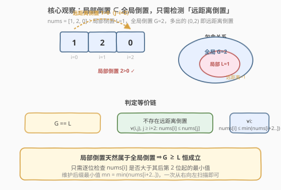
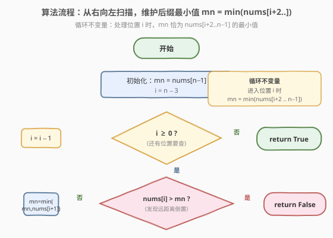

# LeetCode 全局倒置与局部倒置 题解

## 1. 题目概述

- **标题 / 题号**：全局倒置与局部倒置（#775，medium）
- **链接**：https://leetcode.cn/problems/global-and-local-inversions/
- **难度**：中等
- **标签**：数组、数学、贪心

**题意**：给定一个长度为 `n` 的整数数组 `nums`，它是 `[0, 1, ..., n-1]` 的一个**排列**。

- **全局倒置** 数目：满足 `0 <= i < j < n` 且 `nums[i] > nums[j]` 的不同下标对 `(i, j)` 的个数（即排列中**所有**逆序对）。
- **局部倒置** 数目：满足 `0 <= i < n - 1` 且 `nums[i] > nums[i + 1]` 的下标 `i` 的个数（即**相邻**逆序对）。

当全局倒置数等于局部倒置数时返回 `true`，否则返回 `false`。

**示例 1**：

```text
输入：nums = [1,0,2]
输出：true
解释：全局倒置 (0,1)：1>0 共 1 个；局部倒置 (0,1)：1>0 共 1 个。两者相等。
```

**示例 2**：

```text
输入：nums = [1,2,0]
输出：false
解释：全局倒置 (0,2)：1>0、(1,2)：2>0 共 2 个；局部倒置 (1,2)：2>0 共 1 个。2 ≠ 1。
```

**约束**：

- `n == nums.length`
- `1 <= n <= 10^5`
- `0 <= nums[i] < n`
- `nums` 中所有整数**互不相同**
- `nums` 是 `[0, n - 1]` 内所有数字组成的一个排列

> 💡 注意数据范围 `n ≤ 10^5`，暴力 $O(n^2)$ 数逆序对会超时，需要利用「排列」性质把判定降到 $O(n)$。

## 2. 解题思路

### 2.1 暴力思路

最直接的做法是分别统计两类倒置再比较：

- **局部倒置**：一遍扫描相邻对即可，$O(n)$。
- **全局倒置**：即排列的逆序对总数，可用**归并排序**或**树状数组**在 $O(n \log n)$ 内统计（参见 [315. 计算右侧小于当前元素的个数](https://leetcode.cn/problems/count-of-smaller-numbers-after-self/) 的套路）。

最后比较两者是否相等。这是稳妥的 $O(n \log n)$ 基线，能过本题。但题目给了「排列」这一强条件，存在更优雅的 $O(n)$ 判定——我们不必真的把两个数都算出来。

### 2.2 核心观察：局部倒置 ⊂ 全局倒置，只需检测「远距离倒置」



关键性质：**每一个局部倒置天然也是一个全局倒置**——因为相邻对 `(i, i+1)` 满足 `i < i+1`，当 `nums[i] > nums[i+1]` 时它同时符合两类定义。因此：

$$\text{局部倒置数} \;\le\; \text{全局倒置数} \quad\text{恒成立}$$

于是 `G == L` 等价于 `G - L == 0`，即「**全局倒置中那些不是局部倒置的部分为零**」。把不是局部倒置的全局倒置称为**远距离倒置**：

$$\text{远距离倒置} \;=\; \{(i,j) \mid j \ge i+2,\; \text{nums}[i] > \text{nums}[j]\}$$

判定就化为：**是否存在一对相距至少 2 的逆序对**。

> 💡 **直觉**：相邻的「错位」是允许的（算局部倒置，会被两边同时计数而抵消）；但若一个数「跨过」了至少一个位置去压住一个更小的数，就产生了多余的全局倒置，导致 `G > L`。

进一步，对每个位置 `i`，只需检查它后面**第 2 位起**的范围内是否有比 `nums[i]` 更小的数，即：

$$\text{nums}[i] \;>\; \min_{k \ge i+2} \text{nums}[k] \;\;?$$

若任意一个 `i` 命中，即存在远距离倒置，返回 `false`；否则返回 `true`。这个「右侧第 2 位起的 suffix-min」可用一次**从右向左**的扫描维护。

> ⚠️ **常见错误**：只检查 `nums[i] > nums[i+2]`（仅看相距恰为 2 的对）是**不够的**。反例 `nums = [2,0,3,1]`：相距 2 的对 `(0,2): 2>3?否`、`(1,3): 0>1?否` 都不是逆序，但相距 3 的对 `(0,3): 2>1` 是远距离倒置，`G=3 ≠ L=2` 应返回 `false`。正确做法必须看 `min(nums[i+2..])`，而非只看 `nums[i+2]`。

### 2.3 算法流程图



维护**循环不变量**：处理位置 `i` 时，变量 `mn` 恰好等于 $\min(\text{nums}[i+2\,..\,n-1])$。

- 初始 `i = n-3`，`mn = nums[n-1]`（即 `min(nums[n-1..])`，恰为 `i+2 = n-1` 起的后缀最小值）。
- 每步判断 `nums[i] > mn`，若是则发现远距离倒置，立即返回 `false`。
- 否则更新 `mn = min(mn, nums[i+1])`，把 `i+1` 并入后缀，为下一轮 `i-1` 准备好 `min(nums[i+1..])`。
- `i` 递减到 `-1` 都未命中，返回 `true`。

整个过程只扫一遍、用两个标量变量，时间 $O(n)$、空间 $O(1)$。

### 2.4 示例演算

![示例演算：[1,0,2] 与 [1,2,0]](../images/glob_loc_example_walkthrough.svg)

以 `nums = [1,0,2]` 为例（`n=3`，初始 `mn = nums[2] = 2`，`i` 从 `0` 起）：

| `i` | `nums[i]` | `mn = min(nums[i+2..])` | `nums[i] > mn`? | 动作 |
|-----|-----------|------------------------|-----------------|------|
| 0 | 1 | 2 | 否（1 ≯ 2） | 继续 |

未命中，无远距离倒置，`G==L==1`，返回 `true`。

再看 `nums = [1,2,0]`（初始 `mn = nums[2] = 0`）：

| `i` | `nums[i]` | `mn = min(nums[i+2..])` | `nums[i] > mn`? | 动作 |
|-----|-----------|------------------------|-----------------|------|
| 0 | 1 | 0 | **是（1 > 0）** | 命中 `(0,2)` 远距离倒置 |

立即返回 `false`（`G=2 ≠ L=1`）。

## 3. 参考代码

### C++

```cpp
class Solution {
  public:
    bool isIdealPermutation(vector<int>& nums) {
        int n = nums.size();
        int mn = nums[n - 1];          // min(nums[i+2..])，初始对应 i = n-3
        for (int i = n - 3; i >= 0; --i) {
            if (nums[i] > mn) {        // 发现远距离倒置
                return false;
            }
            mn = min(mn, nums[i + 1]); // 把 i+1 并入后缀，为 i-1 准备
        }
        return true;
    }
};
```

### Python

```python
class Solution:
    def isIdealPermutation(self, nums: List[int]) -> bool:
        n = len(nums)
        mn = nums[-1]                  # min(nums[i+2..])，初始对应 i = n-3
        for i in range(n - 3, -1, -1):
            if nums[i] > mn:           # 发现远距离倒置
                return False
            mn = min(mn, nums[i + 1])  # 把 i+1 并入后缀，为 i-1 准备
        return True
```

> ⚠️ **边界**：`n <= 2` 时循环不执行，直接返回 `true`。排列 `[0,1]` 与 `[1,0]` 的全局倒置数都等于局部倒置数（前者均 0，后者均 1），符合预期。更新 `mn` 必须放在判断**之后**，确保判断时 `mn` 仍是 `min(nums[i+2..])` 而非 `min(nums[i+1..])`。

## 4. 复杂度分析

| 维度 | 复杂度 | 说明 |
|------|--------|------|
| 时间复杂度 | $O(n)$ | 单遍从右向左扫描，每个元素参与一次比较与一次 `min` |
| 空间复杂度 | $O(1)$ | 仅用 `mn`、`i` 两个变量，无额外数据结构 |

## 5. 扩展：利用排列性质的 $O(n)$ 一行判定

本题还有一个更精炼的等价判定，直接利用「排列」性质：

$$\text{G == L} \;\iff\; \forall i:\; |\,\text{nums}[i] - i\,| \le 1$$

即**每个元素离自己排序后的目标位置 `i` 最多偏移 1**。

```python
class Solution:
    def isIdealPermutation(self, nums: List[int]) -> bool:
        return all(abs(v - i) <= 1 for i, v in enumerate(nums))
```

**正确性简证**（依赖 `nums` 是 `[0,n-1]` 的排列）：

- **充分性**：若所有 $|\text{nums}[i]-i| \le 1$，则对任意 $j \ge i+2$，有 $\text{nums}[i] \le i+1$ 且 $\text{nums}[j] \ge j-1 \ge i+1$，故 $\text{nums}[i] \le \text{nums}[j]$，不存在远距离倒置，`G==L`。
- **必要性**：若存在 $i$ 使 $\text{nums}[i] \ge i+2$（设 $v=\text{nums}[i]$），则值 $i$ 必落在某个位置 $p \ne i$；由于 $v \ge i+2$，可推出存在相距 $\ge 2$ 的逆序对（值 $i$ 被挤到 $v$ 附近而与位置 $i$ 形成远距离错位），即 `G > L`。`nums[i] <= i-2` 的情形对称。

> 💡 两种 $O(n)$ 解法等价：`|nums[i]-i| <= 1` 代码更短，但「后缀最小值」解法的正确性更直观、不依赖排列的细致计数论证，且思路（子集关系 ⇒ 检测补集）可迁移到其他「判定两类计数是否相等」的问题。

## 6. 面试要点

1. **为什么不需要把全局倒置和局部倒置都算出来？**

   - 因为局部倒置是全局倒置的**子集**（相邻对是所有对的真子集），所以 `L <= G` 恒成立。判定 `G == L` 等价于判定「差集为空」，即是否存在**远距离倒置**。只需检测补集是否非空，不必计算两个绝对数值。

2. **为什么只检查 `nums[i] > nums[i+2]` 是错的？**

   - 远距离倒置的距离可以是 $2, 3, \dots, n-1$ 中的任意值。只看相距恰为 2 的对会漏掉相距 $\ge 3$ 的远距离倒置。反例 `[2,0,3,1]`：相距 2 的对都不是逆序，但 `(0,3): 2>1` 是相距 3 的远距离倒置。正确做法是检查 `nums[i] > min(nums[i+2..])`，用后缀最小值一次性覆盖所有更远位置。

3. **如何做到 $O(1)$ 空间维护 `min(nums[i+2..])`？**

   - 从右向左扫描。处理 `i` 时 `mn` 持有 `min(nums[i+2..])`；判断后执行 `mn = min(mn, nums[i+1])`，把 `i+1` 并入后缀，恰好得到下一轮 `i-1` 所需的 `min(nums[(i-1)+2..]) = min(nums[i+1..])`。注意更新顺序：**先判断后更新**，否则 `mn` 会变成 `min(nums[i+1..])` 而误把相邻元素也算进比较。

4. **`n=1` 或 `n=2` 时为什么直接返回 `true`？**

   - `n=1`：没有对，`G=L=0`。`n=2`：排列只有 `[0,1]`（`G=L=0`）和 `[1,0]`（唯一的对 `(0,1)` 相距 1，既是局部也是全局，`G=L=1`）。两种情况都没有相距 $\ge 2$ 的对，循环天然不执行，返回 `true` 正确。

5. **`|nums[i]-i| <= 1` 这个判定为什么依赖「排列」条件？**

   - 充分性证明用了「值 `nums[j]` 至少为 `j-1`」「值 `nums[i]` 至多为 `i+1`」这类由排列性质保证的界。若数组有重复元素或值域不是 `[0,n-1]`，这些界不成立，判定也就失效。本题若推广到一般数组，只能回到归并排序数逆序对的 $O(n \log n)$ 方案。

## 同类练习题

| # | 题目 | 与本题的关联 |
|---|------|-------------|
| 315 | [计算右侧小于当前元素的个数](https://leetcode.cn/problems/count-of-smaller-numbers-after-self/)（[题解](../0301-0400/315_计算右侧小于当前元素的个数.md)） | 用归并排序/树状数组统计每个位置右侧更小元素的个数，正是「全局倒置按位置拆分」的逐位计数版，可作为暴力基线 $O(n\log n)$ 的实现来源 |
| 769 | [最多能完成排序的块](https://leetcode.cn/problems/max-chunks-to-make-sorted/)（[题解](769_最多能完成排序的块.md)） | 同为「`[0,n-1]` 排列 + 利用 max/i 关系做 $O(n)$ 判定」的贪心，与本题对排列位置的精细观察一脉相承 |
| 768 | [最多能完成排序的块 II](https://leetcode.cn/problems/max-chunks-to-make-sorted-ii/) | 允许重复元素时的进阶版，`max==i` 不再成立，可对照理解「排列性质」带来的简化有多大 |
| 剑指 Offer 51 | [数组中的逆序对](https://leetcode.cn/problems/shu-zu-zhong-de-ni-xu-dui-lcof/) | 归并排序统计逆序对总数的经典题，是「数全局倒置」$O(n\log n)$ 暴力方案的直接来源，与本题「不必真数、只判差集」形成对照 |
| 912 | [排序数组](https://leetcode.cn/problems/sort-an-array/)（[题解](../0901-1000/912_排序数组.md)） | 归并排序的母题，理解逆序对统计的底层机制，是「数全局倒置」暴力方案的基础 |
