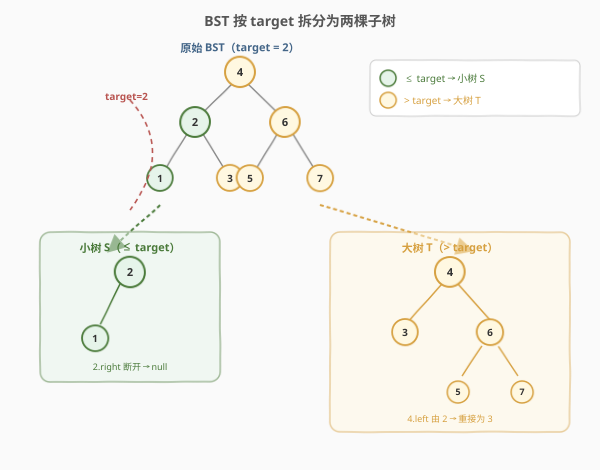
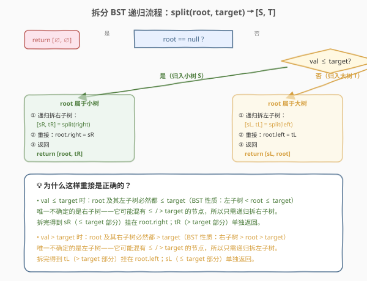

# 拆分二叉搜索树

- **题目名称**：拆分二叉搜索树
- **链接**：[776. 拆分二叉搜索树](https://leetcode.cn/problems/split-bst/)
- **难度**：中等
- **标签**：树、二叉搜索树、递归

## 1. 题目概述

给定一棵**二叉搜索树（BST）**的根节点 `root` 和一个目标值 `target`，将这棵树拆分成两棵子树：

- **小树 `S`**：所有节点值 $\le \text{target}$
- **大树 `T`**：所有节点值 $> \text{target}$

拆分后两棵子树都应保持原有的 BST 结构与性质，返回 `[S, T]`（两个根节点）。

**BST 性质回顾**：对任意节点，左子树所有值 $<$ 根值 $<$ 右子树所有值。

**示例 1**：

```text
输入：root = [4,2,6,1,3,5,7], target = 2
输出：[[2,1],[4,3,6,null,null,null,7]]

       4                    2              4
      / \                  /              / \
     2   6      →        1              3   6
    / \   \                                 / \
   1   3   5                               5   7
        \
         7

小树 S = [2,1]       大树 T = [4,3,6,null,null,null,7]
```

**示例 2**：

```text
输入：root = [1], target = 1
输出：[[1],[]]
解释：1 ≤ target，全部归入小树，大树为空
```

**约束条件**：

- 树中节点数在 $[1, 50]$ 范围内
- $1 \le \text{Node.val} \le 50$
- `root` 是合法的 BST
- $1 \le \text{target} \le 50$

---

## 2. 解题思路

### 2.1 暴力思路：中序重建法

先中序遍历整棵 BST 得到升序数组，然后按 `target` 把数组切成两段：$\le \text{target}$ 的段重建为一棵 BST（小树），$> \text{target}$ 的段重建为另一棵 BST（大树）。

简单直观，但有两个明显缺陷：

- 需要 $O(n)$ 额外空间存储节点；
- **完全丢弃原树结构**后重建，破坏了原有的父子关系，且重建若不保证平衡还会退化成链。

> 更优的做法是**就地拆分**：沿着 BST 的搜索路径走一遍，只改动必要的指针，原树结构最大程度保留。

### 2.2 核心观察：沿搜索路径就地拆分



关键直觉来自 BST 的有序性：**从根出发沿搜索路径查找 `target` 时，路径上的每个节点天然"偏向"某一侧**。

- 若 `root.val ≤ target`：则 `root` 及其**整个左子树**都 $\le \text{target}$（BST 性质：左子树 $<$ root $\le$ target），它们全部归入小树 `S`。唯一不确定的是**右子树**——它可能混有 $\le$ / $> \text{target}$ 的节点，需要递归拆分。
- 若 `root.val > target`：则 `root` 及其**整个右子树**都 $> \text{target}$（BST 性质：右子树 $>$ root $>$ target），它们全部归入大树 `T`。唯一不确定的是**左子树**，需要递归拆分。

> 💡 **每层只递归一侧**：BST 的有序性保证另一侧"整片"确定归属，无需下探。这把原本可能遍历整棵树的 $O(n)$ 工作量压缩到搜索路径长度 $O(H)$。

### 2.3 算法流程图



递归函数 `split(root, target)` 返回 `[S, T]` 两个根节点：

- **base case**：`root == null` → 返回 `[null, null]`
- **`root.val ≤ target`**（归入小树）：递归拆右子树得 `[sR, tR]`，重接 `root.right = sR`，返回 `[root, tR]`
- **`root.val > target`**（归入大树）：递归拆左子树得 `[sL, tL]`，重接 `root.left = tL`，返回 `[sL, root]`

### 2.4 示例演算

![示例演算：root=[4,2,6,1,3,5,7]，target=2](../images/split_bst_walkthrough.svg)

以 `root = [4,2,6,1,3,5,7]`，`target = 2` 为例，递归调用栈如下：

| 步骤 | 调用 | 判定 | 递归方向 | 重接 & 返回 |
|------|------|------|----------|------------|
| ① | `split(4, 2)` | 4 > 2 → 大树 | 拆左 `split(2)` | await [sL, tL] |
| ② | `split(2, 2)` | 2 ≤ 2 → 小树 | 拆右 `split(3)` | await [sR, tR] |
| ③ | `split(3, 2)` | 3 > 2 → 大树 | 拆左 `split(null)`=[∅,∅] | `3.left=∅`；return [∅, 3] |
| ②′ | 回到 `split(2)` | — | [sR, tR]=[∅, 3] | `2.right=∅`（断开 3）；return [2, 3] |
| ①′ | 回到 `split(4)` | — | [sL, tL]=[2, 3] | `4.left=3`（左子由 2 重接为 3）；return [2, 4] |

最终返回 `[2, 4]`：小树根为 `2`（只剩左孩子 `1`），大树根为 `4`（左孩子改为 `3`，右子树 `6` 原样保留）。与示例 1 一致 ✅。

> 💡 注意步骤 ②′：`2.right` 原本指向 `3`，拆分后 `3` 归入大树，于是把 `2.right` 改指向 `sR=∅`（断开），而 `3` 通过 `tR` 向上"冒泡"到步骤 ①′，被挂回 `4.left`。整棵树没有任何节点被复制或丢弃，只改了两根指针。

---

## 3. 参考代码

### C++

```cpp
/**
 * Definition for a binary tree node.
 * struct TreeNode {
 *     int val;
 *     TreeNode *left;
 *     TreeNode *right;
 *     TreeNode() : val(0), left(nullptr), right(nullptr) {}
 *     TreeNode(int x) : val(x), left(nullptr), right(nullptr) {}
 *     TreeNode(int x, TreeNode *left, TreeNode *right) : val(x), left(left), right(right) {}
 * };
 */
class Solution {
public:
    vector<TreeNode*> splitBST(TreeNode* root, int target) {
        if (!root) return {nullptr, nullptr};          // base case

        if (root->val <= target) {
            // root 及左子树归入小树，递归拆右子树
            auto sub = splitBST(root->right, target);
            root->right = sub[0];                      // sR 挂回右
            return {root, sub[1]};                     // [root, tR]
        } else {
            // root 及右子树归入大树，递归拆左子树
            auto sub = splitBST(root->left, target);
            root->left = sub[1];                       // tL 挂回左
            return {sub[0], root};                     // [sL, root]
        }
    }
};
```

### Python

```python
class Solution:
    def splitBST(self, root: Optional[TreeNode], target: int) -> List[Optional[TreeNode]]:
        if not root:
            return [None, None]                        # base case

        if root.val <= target:
            # root 及左子树归入小树，递归拆右子树
            sR, tR = self.splitBST(root.right, target)
            root.right = sR                            # sR 挂回右
            return [root, tR]                          # [root, tR]
        else:
            # root 及右子树归入大树，递归拆左子树
            sL, tL = self.splitBST(root.left, target)
            root.left = tL                             # tL 挂回左
            return [sL, root]                          # [sL, root]
```

> 💡 **递归的精髓**：`root->right = sub[0]` / `root->left = sub[1]` 这一步同时完成了「断开不属于本侧的子树」和「重接递归拆出的同侧子树」。递归返回的 `[S, T]` 中，属于本侧的那个直接挂回，属于对侧的那个向上"冒泡"交给父层处理。与 [450. 删除 BST 中的节点](../0401-0500/450_删除二叉搜索树中的节点.md) 中 `root->left = deleteNode(root->left, key)` 是同一套「递归返回值即重连结果」的树递归范式。

---

## 4. 复杂度分析

| 维度 | 复杂度 | 说明 |
|------|--------|------|
| 时间复杂度 | $O(H)$ | 每层只递归一侧，递归深度等于搜索路径长度 $H$（树高） |
| 空间复杂度 | $O(H)$ | 递归栈深度等于树高；平衡 BST 为 $O(\log n)$，链状退化为 $O(n)$ |

> ⚠️ 之所以是 $O(H)$ 而非 $O(n)$，是因为 BST 有序性让"非搜索方向"的整棵子树一次性确定归属，无需下探。若把树改成普通二叉树（无序），则必须遍历全部节点，退化为 $O(n)$。

---

## 5. 扩展：迭代写法（O(1) 空间）

递归本质是沿搜索路径下行，可用循环改写为 $O(1)$ 额外空间。核心是预先准备两个哑节点 `dummyS` / `dummyT`，用两个游标 `s` / `t` 沿途把节点"接到"对应子树上：

```cpp
class Solution {
public:
    vector<TreeNode*> splitBST(TreeNode* root, int target) {
        TreeNode dummyS(0), dummyT(0);
        TreeNode *s = &dummyS, *t = &dummyT;
        while (root) {
            if (root->val <= target) {
                s->right = root;          // root 归小树
                s = root;
                TreeNode* nxt = root->right;
                root->right = nullptr;    // 暂断右，待下轮决定
                root = nxt;
            } else {
                t->left = root;           // root 归大树
                t = root;
                TreeNode* nxt = root->left;
                root->left = nullptr;     // 暂断左，待下轮决定
                root = nxt;
            }
        }
        return {dummyS.right, dummyT.left};
    }
};
```

`dummyS.right` 最终是小树根，`dummyT.left` 最终是大树根。小树用右链串联（沿搜索路径，值递增），大树用左链串联（值递减）。时间仍为 $O(H)$，空间降为 $O(1)$。

---

## 6. 面试要点

1. **为什么每层只递归一侧就够了？**
   - BST 的有序性保证：当 `root.val ≤ target` 时，整个左子树都 $<$ root $\le$ target，必然全归小树；只有右子树可能"跨界"，需递归。反之同理。这是把 $O(n)$ 压缩到 $O(H)$ 的关键。

2. **重接指针时为什么只改一个方向？**
   - `root.val ≤ target` 时 `root` 归小树，其左子树本就属于小树无需动，只需处理右子树：把递归拆出的 `sR`（右子树中 $\le$ target 的部分）挂回 `root.right`，`tR`（$>$ target 的部分）向上冒泡。只改 `root.right` 一根指针即可。

3. **会不会丢失节点？**
   - 不会。每个节点要么留在原侧（通过 `root` 本身或整片子树保留），要么通过对侧返回值"冒泡"到上层被挂回。整个过程中没有任何节点被复制或丢弃，只改动了搜索路径上的 $O(H)$ 根指针。

4. **返回的两个根为什么是 `dummyS.right` 和 `dummyT.left`（迭代版）？**
   - 小树沿搜索路径"向右"生长（值递增），所以用右链串联，根是最早接入的 `dummyS.right`；大树沿搜索路径"向左"生长（值递减），用左链串联，根是 `dummyT.left`。

5. **如果 target 小于树中所有值 / 大于树中所有值会怎样？**
   - target 小于所有值：全程走 `root.val > target` 分支，小树为空，大树为原树。
   - target 大于所有值：全程走 `root.val ≤ target` 分支，小树为原树，大树为空。两种边界都被 base case 与递归自然处理。

---

## 7. 同类练习题

- [450. 删除二叉搜索树中的节点](https://leetcode.cn/problems/delete-node-in-a-bst/)（[站内题解](../0401-0500/450_删除二叉搜索树中的节点.md)）：同属 BST 就地指针操作，递归返回值即重连结果
- [701. 二叉搜索树中的插入操作](https://leetcode.cn/problems/insert-into-a-binary-search-tree/)（[站内题解](701_二叉搜索树中的插入操作.md)）：沿搜索路径下行 + 递归重连，与本题迭代版同骨架
- [98. 验证二叉搜索树](https://leetcode.cn/problems/validate-binary-search-tree/)（[站内题解](../0001-0100/98_验证二叉搜索树.md)）：BST 有序性是本题"每层只递归一侧"成立的前提
- [108. 将有序数组转换为二叉搜索树](https://leetcode.cn/problems/convert-sorted-array-to-binary-search-tree/)（[站内题解](../0101-0200/108_将有序数组转换为二叉搜索树.md)）：暴力法重建 BST 的对照练习
- [235. 二叉搜索树的最近公共祖先](https://leetcode.cn/problems/lowest-common-ancestor-of-a-binary-search-tree/)：同样利用"沿搜索路径下行"判定节点归属
