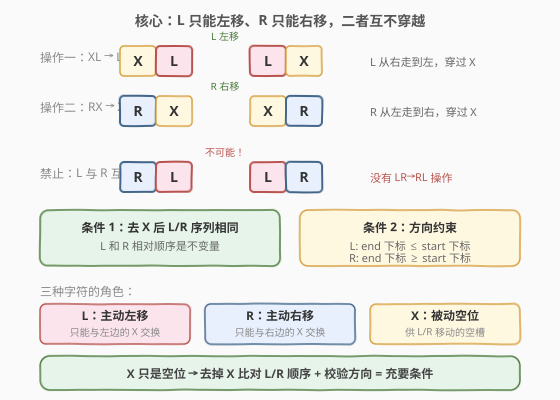
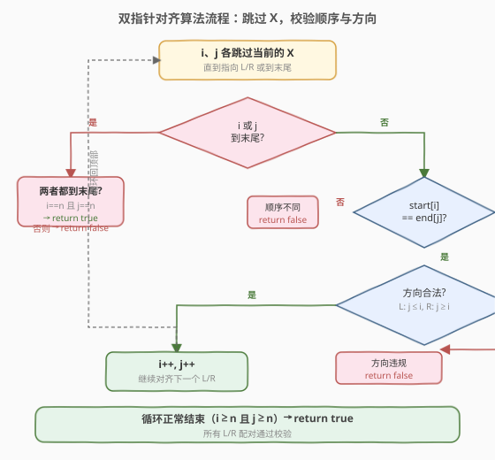
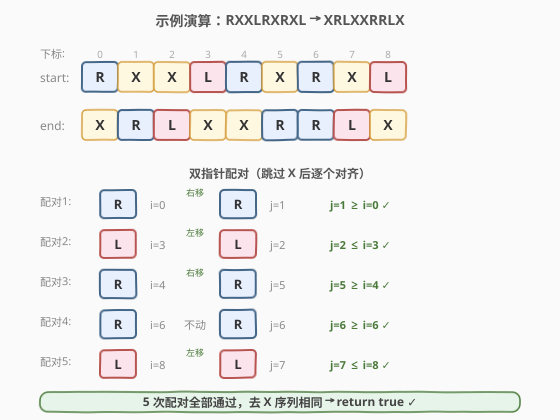

# 在LR字符串中交换相邻字符

- **题目名称**：在LR字符串中交换相邻字符
- **链接**：[777. 在LR字符串中交换相邻字符](https://leetcode.cn/problems/swap-adjacent-in-lr-string/)
- **难度**：中等
- **标签**：双指针、字符串、贪心

## 1. 题目概述

在一个由 `'L'`、`'R'` 和 `'X'` 三种字符组成的字符串中，可以通过以下两种操作对字符串进行变换：

- 将 `"XL"` 替换为 `"LX"`（即 **L 向左移动一格**，与左边的 X 交换）
- 将 `"RX"` 替换为 `"XR"`（即 **R 向右移动一格**，与右边的 X 交换）

给定起始字符串 `start` 和目标字符串 `end`，判断是否存在一系列变换能将 `start` 转换成 `end`。

**示例 1**：

```text
输入：start = "RXXLRXRXL", end = "XRLXXRRLX"
输出：true
解释：
  RXXLRXRXL
  → XRXLRXRXL   (位置 0-1 的 RX → XR，R 右移)
  → XRLXRXRXL   (位置 2-3 的 XL → LX，L 左移)
  → XRLXXRRXL   (位置 4-5 的 RX → XR，R 右移)
  → XRLXXRRLX   (位置 7-8 的 XL → LX，L 左移) = end ✓
```

**示例 2**：

```text
输入：start = "X", end = "L"
输出：false
解释：单个 X 无法变成 L，L/R 的数量必须守恒。
```

**示例 3**：

```text
输入：start = "LLR", end = "RRL"
输出：false
解释：去掉 X 后 L/R 顺序不同，L 与 R 无法穿过彼此。
```

**约束条件**：

- $1 \leq \text{start.length} \leq 10^4$
- `start.length == end.length`
- `start` 和 `end` 仅由 `'L'`、`'R'`、`'X'` 组成

---

## 2. 解题思路

### 2.1 暴力思路

从 `start` 出发，对所有可变换的位置进行 BFS，每次尝试所有可能的 `XL→LX` 和 `RX→XR` 替换，看能否到达 `end`。

> ⚠️ 状态空间随字符串长度指数膨胀，$n = 10^4$ 时完全不可行。暴力 BFS 没有抓住「L 只能左移、R 只能右移、二者互不穿越」这一**不变量**。

### 2.2 核心观察：L/R 相对顺序不变 + 方向约束



三种字符的「身份」截然不同：

| 字符 | 运动方向 | 能否与其他字符交换 |
|------|---------|------------------|
| `L` | 只能**向左**移动（`XL→LX`） | 只与 `X` 交换，不能穿过 `R` 或另一个 `L` |
| `R` | 只能**向右**移动（`RX→XR`） | 只与 `X` 交换，不能穿过 `L` 或另一个 `R` |
| `X` | 被动填充 | 不主动移动，作为 L/R 移动的「空位」 |

由此得出两条**充要条件**：

> 💡 **条件 1（顺序守恒）**：去掉所有 `X` 后，`start` 和 `end` 的 L/R 序列必须**完全相同**。因为 L 和 R 无法互相穿越，也无法改变彼此的相对顺序。

> 💡 **条件 2（方向约束）**：按 L/R 序列配对后——
> - 每个 `L` 在 `end` 中的下标 $\leq$ 在 `start` 中的下标（L 只能左移或不动）；
> - 每个 `R` 在 `end` 中的下标 $\geq$ 在 `start` 中的下标（R 只能右移或不动）。

这两条合起来是**充分必要**的：顺序相同保证了「L 和 R 没有互相穿越」，方向约束保证了「每个字符只朝合法方向移动」，而 X 作为空位可以自由填补，不会构成障碍（因为只要方向正确，总能找到一连串 X 让 L/R 逐步移动到位）。

### 2.3 算法流程图



用**双指针** `i`、`j` 分别扫描 `start` 和 `end`，跳过所有 `X`，只对齐 L/R 字符：

1. 双指针各跳过当前的 `X`，直到都指向 L/R 或到达末尾。
2. 若一方到末尾而另一方未到 → L/R 数量不同 → 返回 `false`。
3. 若 `start[i] != end[j]` → 顺序不同 → 返回 `false`。
4. 若是 `L` 且 $i < j$（L 试图右移）→ 返回 `false`。
5. 若是 `R` 且 $i > j$（R 试图左移）→ 返回 `false`。
6. 两指针同步前进，重复直到两串都扫完。

### 2.4 示例演算



以 `start = "RXXLRXRXL"`、`end = "XRLXXRRLX"` 为例，双指针跳过 X 后逐个对齐：

| 配对序号 | start 字符 | start 下标 `i` | end 字符 | end 下标 `j` | 方向校验 | 结果 |
|---------|-----------|---------------|---------|-------------|---------|------|
| 1 | `R` | 0 | `R` | 1 | $j=1 \geq i=0$ ✓ R 右移 | 通过 |
| 2 | `L` | 3 | `L` | 2 | $j=2 \leq i=3$ ✓ L 左移 | 通过 |
| 3 | `R` | 4 | `R` | 5 | $j=5 \geq i=4$ ✓ R 右移 | 通过 |
| 4 | `R` | 6 | `R` | 6 | $j=6 \geq i=6$ ✓ R 不动 | 通过 |
| 5 | `L` | 8 | `L` | 7 | $j=7 \leq i=8$ ✓ L 左移 | 通过 |

5 次配对全部通过，且两串同时扫完 → 返回 `true`。

**反例**：`start = "LLR"`、`end = "RRL"`。去 X 后序列分别为 `LLR` 和 `RRL`，第 1 次配对 `start[0]='L'` vs `end[0]='R'` 不匹配 → 立即返回 `false`。

---

## 3. 参考代码

### C++

```cpp
class Solution {
public:
    bool canTransform(string start, string end) {
        int n = start.size();
        int i = 0, j = 0;
        while (i < n || j < n) {
            while (i < n && start[i] == 'X') i++;
            while (j < n && end[j] == 'X') j++;

            if (i == n || j == n) {
                return i == n && j == n;
            }

            if (start[i] != end[j]) return false;

            if (start[i] == 'L' && i < j) return false;
            if (start[i] == 'R' && i > j) return false;

            i++;
            j++;
        }
        return true;
    }
};
```

### Python

```python
class Solution:
    def canTransform(self, start: str, end: str) -> bool:
        n = len(start)
        i = j = 0
        while i < n or j < n:
            while i < n and start[i] == 'X':
                i += 1
            while j < n and end[j] == 'X':
                j += 1

            if i == n or j == n:
                return i == n and j == n

            if start[i] != end[j]:
                return False

            if start[i] == 'L' and i < j:
                return False
            if start[i] == 'R' and i > j:
                return False

            i += 1
            j += 1
        return True
```

> 💡 **双指针为何等价于「去 X 比较」？** 两个内层 `while` 跳过 `X`，等价于把 `X` 全部删除后逐字符对齐。`i`、`j` 保留了**原始下标**，所以能在对齐的同时检查方向约束（`i < j` 或 `i > j`），一石二鸟。

---

## 4. 复杂度分析

| 维度 | 复杂度 | 说明 |
|------|--------|------|
| 时间复杂度 | $O(n)$ | 双指针各遍历一次，每个字符至多访问一次 |
| 空间复杂度 | $O(1)$ | 仅用两个指针变量，无额外数据结构 |

> 💡 本题最优解为单趟线性扫描，无需预处理或哈希表。相比 BFS 的指数级状态空间，双指针利用**不变量**将问题从「搜索」降维为「校验」。

---

## 5. 扩展：为什么方向约束 + 顺序相同是充分的？

上面只证明了必要性（能变换 → 顺序同 + 方向对），还需说明充分性（顺序同 + 方向对 → 一定能变换）。

**构造性论证**：假设条件满足，可以按以下策略逐步变换——

1. **先处理所有 R**：从左到右扫描 `start`，每遇到一个 `R` 需要右移到 `end` 中的目标位置，由于目标位置 $\geq 当前位置$，且中间全是 `X`（因为 L/R 顺序相同，中间不会有越界的 L 阻挡），逐步用 `RX→XR` 将 R 推到目标位。
2. **再处理所有 L**：从右到左扫描，每遇到一个 `L` 需要左移到 `end` 中的目标位置，由于目标位置 $\leq 当前位置$，且中间全是 `X`，逐步用 `XL→LX` 将 L 拉到目标位。

关键在于：处理 R 时 L 还在原位（且在 R 的右边，不会阻挡），处理 L 时 R 已经就位（且在 L 的左边，不会阻挡）。X 自动填充剩余空位，最终得到 `end`。

> ⚠️ 这个构造性证明说明：只要满足两条条件，变换序列**一定存在**，无需真的模拟。这也是双指针 $O(n)$ 校验的底气。

---

## 6. 面试要点

1. **为什么 L 和 R 不能互相穿越？**

   - 两种操作 `XL→LX` 和 `RX→XR` 都只涉及 L/R 与 X 的交换，不存在 L 与 R 直接交换的操作。因此 L 和 R 的相对顺序是**不变量**。

2. **为什么去 X 后序列相同 + 方向约束 = 充要条件？**

   - 必要性：能变换则必然满足（顺序不变 + L 只左移 + R 只右移）。
   - 充分性：满足时可构造变换序列——先右移所有 R 到目标位，再左移所有 L 到目标位，中间 X 不构成障碍。

3. **双指针为什么要跳过 X 而不直接比较原串？**

   - 跳过 X 等价于「去 X 后比较 L/R 序列」，同时保留原始下标 `i`、`j` 用于方向校验。直接比较原串无法区分「X 的移动」和「L/R 的移动」。

4. **如果 start 和 end 长度不同怎么办？**

   - 题目保证 `start.length == end.length`。若不保证，则先比长度，不同直接返回 `false`。此外 L/R 的总数量也必须相同（由去 X 序列相同隐含保证）。

5. **能否用计数法（只数 L/R 个数）替代双指针？**

   - 不行。仅计数相同不能保证**顺序**和**方向**。例如 `start="LR"`、`end="RL"`，L/R 各 1 个但顺序不同，无法变换。双指针同时校验顺序与方向，是本题的最优范式。

---

## 7. 同类练习题

- [2337. 移动片段得到字符串](https://leetcode.cn/problems/move-pieces-to-obtain-a-string/)：几乎同构的题目，`L` 左移、`R` 右移、`_` 作空位，双指针校验顺序与方向
- [392. 判断子序列](https://leetcode.cn/problems/is-subsequence/)（[题解](../0301-0400/392_判断子序列.md)）：双指针跳过不匹配字符逐个对齐，与本题「跳 X 对齐 L/R」同构
- [283. 移动零](https://leetcode.cn/problems/move-zeroes/)：保持非零元素相对顺序的同时将零移到一端，体现了「相对顺序不变」的思想
- [765. 情侣牵手](https://leetcode.cn/problems/couples-holding-hands/)（[题解](../0701-0800/765_情侣牵手.md)）：也是位置配对/交换问题，但机制不同（任意交换 vs 方向受限交换）
- [1004. 最大连续1的个数 III](https://leetcode.cn/problems/max-consecutive-ones-iii/)：双指针维护窗口，体现了「跳过特定字符」的滑窗技巧
