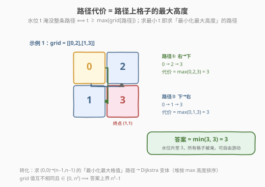
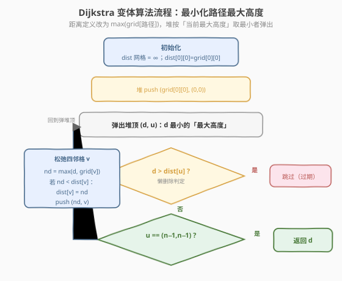
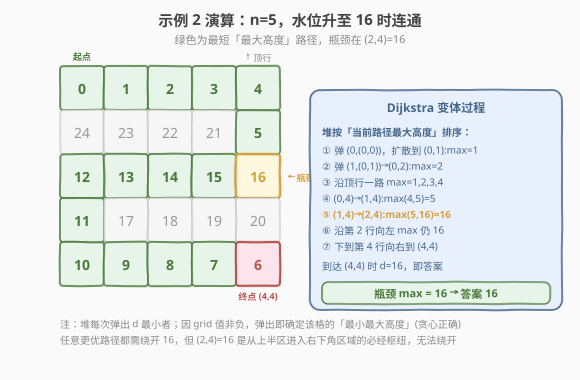

# LeetCode 水位上升的泳池中游泳 题解

## 1. 题目概述

- **标题 / 题号**：水位上升的泳池中游泳（#778，hard）
- **链接**：https://leetcode.cn/problems/swim-in-rising-water/
- **难度**：困难
- **标签**：图、最短路径、Dijkstra、堆/优先队列、并查集、二分查找

**题意**：在一个 $n \times n$ 的整数矩阵 `grid` 中，`grid[i][j]` 表示位置 $(i, j)$ 的平台**高度**。开始下雨后，在时间为 $t$ 时水位为 $t$。你可以从一个平台游向四邻格的任意一个，但前提是**水位必须同时淹没这两个平台**（即 $t \ge \max(\text{grid[cur]},\ \text{grid[next]})$）。可以瞬间移动（在格子内部游泳不耗时），但必须始终待在坐标方格内。

从左上 $(0, 0)$ 出发，返回到达右下 $(n-1,\ n-1)$ 所需的**最少时间**。

> 💡 **关键约束**：`grid[i][j]` **互不相同**且 $0 \le \text{grid}[i][j] < n^2$——即 `grid` 是 $0$ 到 $n^2-1$ 的一个排列。这保证答案上界为 $n^2-1$，且任意高度值在网格中唯一出现。

**示例 1**：

```text
输入：grid = [[0,2],[1,3]]
输出：3
解释：t=0 时位于 (0,0)，相邻平台高度 2 和 1 都大于水位 0，无法移动。
      t=3 时水位淹没所有平台（最大高度为 3），可游到 (1,1)。
```

**示例 2**：

```text
输入：grid = [[0,1,2,3,4],[24,23,22,21,5],[12,13,14,15,16],[11,17,18,19,20],[10,9,8,7,6]]
输出：16
解释：必须等到 t=16，才能保证 (0,0) 与 (4,4) 连通（路径瓶颈在 (2,4)=16）。
```

**约束**：

- $n == \text{grid.length} == \text{grid}[i].\text{length}$
- $1 \le n \le 50$
- $0 \le \text{grid}[i][j] < n^2$
- `grid[i][j]` 中每个值**均无重复**

## 2. 解题思路

### 2.1 暴力思路

时间 $t$ 从 $\text{grid}[0][0]$ 到 $n^2-1$ 逐个枚举，每个 $t$ 用 BFS/DFS 判断：只经过 `grid[i][j] <= t` 的格子，$(0,0)$ 能否到达 $(n-1,n-1)$。第一个可行的 $t$ 即答案。每次验证 $O(n^2)$，枚举 $O(n^2)$ 次，整体 $O(n^4)$，$n=50$ 时约 $6.25 \times 10^6$ 次格子访问——虽可能勉强可过，但不够优雅。

> 💡 **关键转化**：把「等待时间 $t$」与「路径上的最大平台高度」挂钩。一条路径在时间 $t$ 可走，当且仅当该路径上**所有格子的高度都 $\le t$**，即 $t \ge \max_{(i,j) \in \text{路径}} \text{grid}[i][j]$。于是**最少等待时间 = 所有 $(0,0)\to(n-1,n-1)$ 路径中「最大格值」的最小值**。这正是「最小化路径上的最大边权」的最短路问题。

### 2.2 核心观察：Dijkstra 变体——最小化路径最大高度



把每个格子看作图中的节点，相邻格子之间有无权边。定义**路径代价**为路径上所有格子高度的最大值：

$$\text{cost}(\text{路径}) = \max_{(i,j) \in \text{路径}} \text{grid}[i][j]$$

目标是求所有 $(0,0)\to(n-1,n-1)$ 路径中代价最小者。这与 [743. 网络延迟时间](../0701-0800/743_网络延迟时间.md) 的标准 Dijkstra（路径代价 = 边权之和）仅差在「聚合方式」：**累加 → 取最大**。于是套用同一个堆优化框架：

- 维护 `dist[i][j]` = 从 $(0,0)$ 到 $(i,j)$ 的「最小最大高度」估计，初始 `dist[0][0] = grid[0][0]`，其余为 $\infty$。
- **最小堆**存放 `(当前路径最大高度, r, c)`，每次取出最大高度最小的格子 `u`。
- **松弛**邻格 $v$：`nd = max(d, grid[v])`；若 `nd < dist[v]`，更新并入堆。
- 当首次弹出 $(n-1,n-1)$ 时，其 `d` 即为答案。

> 💡 **贪心正确性**：「边权」（这里是格值 `grid[v]`）非负，因此路径代价 `max(d, grid[v])` 关于路径延展**单调不降**。被堆弹出的 `d` 最小的格子，其 `dist` 已不可能被更小的值更新——任何"绕远"的路径只会让 `max` 更大或持平。所以弹出的格子代价就此确定，与标准 Dijkstra 同理。这与 [1631. 最小体力消耗路径](https://leetcode.cn/problems/path-with-minimum-effort/) 的「最小化最大边差」是同一类变体。

> ⚠️ 注意 `dist[0][0]` 初始化为 `grid[0][0]` 而非 `0`：起点的平台高度本身就是路径代价的一部分（水位必须淹没起点才能"待在"那里）。

### 2.3 算法流程图



### 2.4 示例演算

以示例 2 的 $5 \times 5$ 网格为例。Dijkstra 变体从 $(0,0)=0$ 出发，堆按「当前路径最大高度」排序逐格扩散：



| 步骤 | 弹出 (d, 格子) | 松弛邻格 | 关键 dist 变化 |
|------|---------------|---------|---------------|
| 1 | (0, (0,0)) | 向右扩散 | (0,1)=max(0,1)=1 |
| 2-4 | (1,(0,1))→(2,(0,2))→(3,(0,3))→(4,(0,4)) | 沿顶行一路 max 递增 | (0,4)=4 |
| 5 | (4, (0,4)) | 下到 (1,4)=5 | (1,4)=max(4,5)=5 |
| 6 | (5, (1,4)) | 下到 (2,4)=16 | (2,4)=max(5,16)=16 ← 瓶颈 |
| 7+ | (16, (2,4)) | 沿第 2 行向左、再下到第 4 行 | (2,3)=15、(2,2)=14…均 max 仍 16 |
| 终 | 弹出 (16, (4,4)) | 到达终点 | 返回 16 |

> 💡 观察第 6 步：进入 $(2,4)=16$ 后，后续格子的高度都 $\le 16$，`max` 不再增长。因此整条路径代价被 $(2,4)$ 这一个"高墙"卡在 16——这就是"瓶颈"。任意更优路径都需绕开 16，但 $(2,4)$ 是从网格上半区进入右下角区域的必经枢纽，无法绕开。

## 3. 参考代码

### 方法一：Dijkstra 变体（推荐）

### C++

```cpp
class Solution {
  public:
    int swimInWater(vector<vector<int>>& grid) {
        int n = grid.size();
        const int INF = INT_MAX / 2;
        vector<vector<int>> dist(n, vector<int>(n, INF));
        dist[0][0] = grid[0][0];

        // 最小堆：(当前路径最大高度, r, c)
        priority_queue<tuple<int,int,int>, vector<tuple<int,int,int>>, greater<>> pq;
        pq.push({grid[0][0], 0, 0});

        int dr[] = {1, -1, 0, 0};
        int dc[] = {0, 0, 1, -1};
        while (!pq.empty()) {
            auto [d, r, c] = pq.top(); pq.pop();
            if (d > dist[r][c]) continue;          // 懒删除：旧记录已失效
            if (r == n - 1 && c == n - 1) return d;
            for (int k = 0; k < 4; ++k) {
                int nr = r + dr[k], nc = c + dc[k];
                if (nr < 0 || nr >= n || nc < 0 || nc >= n) continue;
                int nd = max(d, grid[nr][nc]);     // 路径代价取最大高度
                if (nd < dist[nr][nc]) {
                    dist[nr][nc] = nd;
                    pq.push({nd, nr, nc});
                }
            }
        }
        return -1;                                 // 本题保证可达
    }
};
```

### Python

```python
class Solution:
    def swimInWater(self, grid: List[List[int]]) -> int:
        n = len(grid)
        INF = float('inf')
        dist = [[INF] * n for _ in range(n)]
        dist[0][0] = grid[0][0]

        pq = [(grid[0][0], 0, 0)]  # 最小堆：(当前路径最大高度, r, c)
        while pq:
            d, r, c = heapq.heappop(pq)
            if d > dist[r][c]:          # 懒删除：旧记录已失效
                continue
            if (r, c) == (n - 1, n - 1):
                return d
            for nr, nc in ((r+1, c), (r-1, c), (r, c+1), (r, c-1)):
                if 0 <= nr < n and 0 <= nc < n:
                    nd = max(d, grid[nr][nc])   # 路径代价取最大高度
                    if nd < dist[nr][nc]:
                        dist[nr][nc] = nd
                        heapq.heappush(pq, (nd, nr, nc))
        return -1
```

> 💡 **与标准 Dijkstra 的唯一差异**：松弛时把 `nd = d + w` 换成 `nd = max(d, grid[v])`。模板完全复用 [743](../0701-0800/743_网络延迟时间.md) 的懒删除写法。提前返回（弹出终点即返回 `d`）比遍历完再读 `dist[n-1][n-1]` 更省时。

## 4. 复杂度分析

| 维度 | 复杂度 | 说明 |
|------|--------|------|
| 时间复杂度 | $O(n^2 \log n)$ | 共 $n^2$ 个格子，每个最多入堆 4 次（四邻格各松弛一次），堆操作 $O(\log n^2) = O(\log n)$ |
| 空间复杂度 | $O(n^2)$ | `dist` 网格 $O(n^2)$、堆最坏 $O(n^2)$ |

> ⚠️ 本题 $n \le 50$，$n^2 = 2500$，$\log n \approx 6$，总计约 $1.5 \times 10^4$ 次堆操作，非常快。**面试首选 Dijkstra 变体**：单趟扫描、无需二分外层、且模板可迁移到 1631 等同类题。

## 5. 扩展：二分答案 + BFS / 并查集

本题有三种主流解法，思路同源（都围绕「水位 $t$ 与路径最大高度」的转化），但实现路径不同。

### 方法二：二分答案 + BFS

答案落在 $[\text{grid}[0][0],\ n^2-1]$ 上。对候选水位 `mid`，用 BFS 判定只走 `grid[i][j] <= mid` 的格子能否到达终点——这是 [二分答案](../0701-0800/719_找出第K小的数对距离.md) 的标准信号：`can(mid)` 关于 `mid` 单调（水位越高，可达区域越大）。

```python
def swimInWater(self, grid: List[List[int]]) -> int:
    n = len(grid)
    def can(t: int) -> bool:
        if grid[0][0] > t or grid[n-1][n-1] > t:
            return False
        seen = [[False] * n for _ in range(n)]
        q = deque([(0, 0)]); seen[0][0] = True
        while q:
            r, c = q.popleft()
            if (r, c) == (n - 1, n - 1):
                return True
            for nr, nc in ((r+1,c),(r-1,c),(r,c+1),(r,c-1)):
                if 0 <= nr < n and 0 <= nc < n and not seen[nr][nc] and grid[nr][nc] <= t:
                    seen[nr][nc] = True
                    q.append((nr, nc))
        return False
    lo, hi = grid[0][0], n * n - 1
    while lo < hi:
        mid = (lo + hi) // 2
        if can(mid): hi = mid
        else: lo = mid + 1
    return lo
```

复杂度 $O(n^2 \log n)$，与 Dijkstra 变体同阶，但常数更大（多次 BFS）。优点是思路最直白。

### 方法三：并查集（水位上升的最自然模拟）

把所有格子按高度**升序排序**，依次"淹没"（激活）。每激活一个格子，就把它与**已激活**的相邻格子 union。激活完高度为 $t$ 的格子后，若 `find(0) == find(n²-1)`（起点与终点连通），则 $t$ 即答案。这是"水位上涨"隐喻最直接的映射，承接 [547. 省份数量](../0501-0600/547_省份数量.md) 的并查集模板。

```python
def swimInWater(self, grid: List[List[int]]) -> int:
    n = len(grid)
    parent = list(range(n * n))
    def find(x):
        while parent[x] != x:
            parent[x] = parent[parent[x]]  # 路径压缩
            x = parent[x]
        return x
    def union(a, b):
        ra, rb = find(a), find(b)
        if ra != rb: parent[ra] = rb

    order = sorted((grid[r][c], r, c) for r in range(n) for c in range(n))
    seen = [[False] * n for _ in range(n)]
    for t, r, c in order:
        seen[r][c] = True
        for nr, nc in ((r+1,c),(r-1,c),(r,c+1),(r,c-1)):
            if 0 <= nr < n and 0 <= nc < n and seen[nr][nc]:
                union(r * n + c, nr * n + nc)
        if find(0) == find(n * n - 1):
            return t
    return -1
```

复杂度 $O(n^2 \log n)$（排序主导）。三种方法对照：

| 方法 | 核心思想 | 优势 |
|------|---------|------|
| **Dijkstra 变体** | 最小化路径最大高度 | 单趟扫描、模板通用（推荐） |
| 二分 + BFS | 单调判定 + 连通性 | 思路最直白 |
| 并查集 | 按高度增量激活 + 连通性 | 贴合"水位上涨"隐喻 |

## 6. 面试要点

1. **为什么能转化为「最小化路径最大高度」的最短路？**

   - 一条路径在时间 $t$ 可走 ⟺ 路径上所有格子高度 $\le t$ ⟺ $t \ge \max_{\text{路径}} \text{grid}$。求最小 $t$ 即求所有路径中「最大格值」的最小值——这正是「最小化最大边权」最短路。

2. **Dijkstra 变体与标准 Dijkstra 有何异同？为什么贪心仍正确？**

   - 相同：都用最小堆 + 懒删除，弹出最小代价者即确定其最短路。
   - 不同：松弛时代价由 `d + w` 改为 `max(d, grid[v])`。
   - 正确性：格值非负 ⟹ 路径代价随延展单调不降 ⟹ 弹出的最小代价者不会被更小值更新，贪心假设成立。

3. **为什么 `dist[0][0] = grid[0][0]` 而不是 0？**

   - 起点平台本身有高度，水位必须淹没起点才能"待在"那里，故起点的初始代价就是 `grid[0][0]`。若初始化为 0，会漏掉起点高度这一约束。

4. **二分答案 + BFS 与 Dijkstra 变体复杂度都是 $O(n^2 \log n)$，如何选？**

   - Dijkstra 变体单趟扫描、常数小、且模板可迁移到 1631/1102 等同类题，面试首选。
   - 二分 + BFS 思路最直白，适合作为引出问题的第一步分析，或当堆实现不熟时的稳妥退路。
   - 并查集适合强调"水位上涨"的物理直觉，或题目变体涉及"连通时刻"查询时。

5. **堆里为什么有同一格子的多条记录？**

   - 每次松弛成功就 push 一条新记录，旧的更大代价记录不会被主动删除。弹出时若 `d > dist[r][c]` 说明过期，`continue` 跳过（懒删除）。详见 [743](../0701-0800/743_网络延迟时间.md) 的同款写法。

6. **并查集解法中，为什么按高度升序激活能保证答案正确？**

   - 激活到高度 $t$ 时，所有高度 $\le t$ 的格子都已入连通块。第一次出现 `find(0) == find(n²-1)` 的 $t$，恰是使起点终点连通的"最小淹没水位"——即路径瓶颈高度。

## 同类练习题

| # | 题目 | 与本题的关联 |
|---|------|-------------|
| 1631 | [最小体力消耗路径](https://leetcode.cn/problems/path-with-minimum-effort/) | 同一 Dijkstra 变体，路径代价改为「相邻格高度差的最大值」，模板完全复用 |
| 743 | [网络延迟时间](https://leetcode.cn/problems/network-delay-time/) | 标准堆优化 Dijkstra（代价 = 边权和），本题的母模板 |
| 1102 | [得分最高的路径](https://leetcode.cn/problems/path-with-maximum-minimum-value/) | 镜像变体——最大化路径最小值，把 max 换成 min、堆取最大者 |
| 407 | [接雨水 II](https://leetcode.cn/problems/trapping-rain-water-ii/) | 3D 接雨水，同样用最小堆按"当前最低边界"扩展，与本题堆思路相通 |
| 547 | [省份数量](https://leetcode.cn/problems/number-of-provinces/) | 并查集模板，为方法三的增量连通提供基础 |
