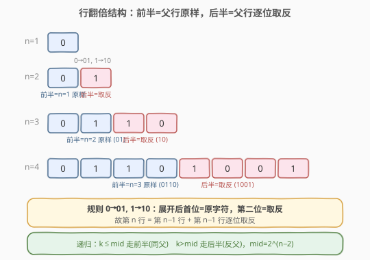
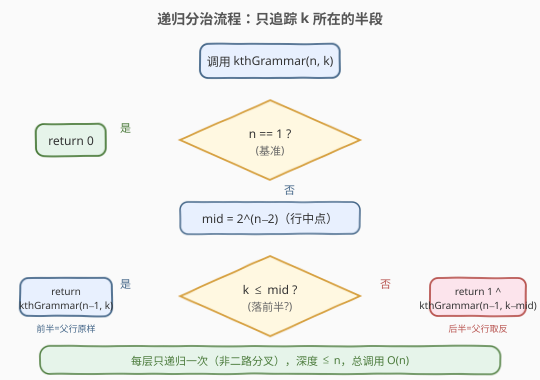
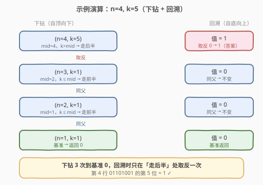
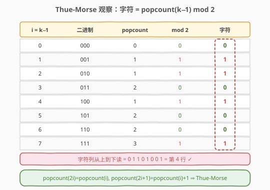

# 第K个语法符号

- **题目名称**：第K个语法符号
- **链接**：[779. 第K个语法符号](https://leetcode.cn/problems/k-th-symbol-in-grammar/)
- **难度**：中等
- **标签**：递归、位运算、分治、数学

## 1. 题目概述

我们构造一个 `n` 行的表（行号从 1 开始）。第 1 行写一个 `"0"`。对于之后的每一行，把上一行中的每一个字符按下表替换：

- `'0'` → `"01"`
- `'1'` → `"10"`

给定整数 `n` 和 `k`，返回第 `n` 行的第 `k` 个字符（`k` 从 1 开始编号）。

**示例 1**：

```text
输入：n = 1, k = 1
输出：0
解释：第 1 行只有 "0"，所以第 1 个字符是 0。
```

**示例 2**：

```text
输入：n = 2, k = 2
输出：1
解释：第 2 行是 "01"，第 2 个字符是 1。
```

**示例 3**：

```text
输入：n = 4, k = 5
输出：1
解释：第 4 行是 "01101001"，第 5 个字符是 1。
```

各行的具体形态：

```text
第 1 行：0
第 2 行：01
第 3 行：0110
第 4 行：01101001
第 5 行：0110100110010110
...
```

**约束条件**：

- $1 \le n \le 30$
- $1 \le k \le 2^{n-1}$

> 💡 **关键信号**：$n \le 30$ 意味着第 30 行长度可达 $2^{29} \approx 5.4 \times 10^8$，**无法显式构造整行**。但题目只问**第 `k` 个字符**，提示我们寻找逐层之间的结构规律，做**自顶向下的递归分治**或直接套用闭式公式。

---

## 2. 解题思路

### 2.1 暴力思路：逐行构造

按规则从第 1 行迭代构造到第 `n` 行，再取第 `k` 个字符。每行长度翻倍，第 `n` 行需 $O(2^{n-1})$ 时间与空间。当 $n = 30$ 时约 $5.4 \times 10^8$，内存与时间都吃不消。需要更聪明的做法。

### 2.2 核心观察一：递归分治（前半同父，后半反父）



把每一行按**中点**切成左右两半，会发现一个极其整齐的规律：

- 第 `n` 行长度为 $2^{n-1}$，记中点 `mid = 2^{n-2}`。
- **前半段**（位置 $1 \dots \text{mid}$）：恰好是**第 `n-1` 行的完整拷贝**。
- **后半段**（位置 $\text{mid}+1 \dots 2^{n-1}$）：恰好是**第 `n-1` 行逐位取反**。

> **为什么？** 替换规则 `0→01, 1→10` 有两条性质：
> - 每个字符 `c` 展开后，**第一位仍是 `c` 本身**（`0→0...`, `1→1...`），所以前半段就是父行原样；
> - 每个 `c` 展开后的**第二位是 `1-c`**（`0→.1`, `1→.0`），所以后半段是父行逐位取反。
>
> 也可以等价地看：第 `n` 行 = 第 `n-1` 行 + 第 `n-1` 行**按位取反**。例如 `0110` + `1001` = `01101001`，正是第 4 行。

于是只需**自顶向下递归**定位：

$$
\text{kthGrammar}(n, k) = \begin{cases} 0, & n = 1 \\ \text{kthGrammar}(n-1,\ k), & k \le \text{mid} \\ 1 - \text{kthGrammar}(n-1,\ k-\text{mid}), & k > \text{mid} \end{cases}
$$

每层把问题规模减半，递归深度 $\le n$。

### 2.3 算法流程图



流程的精髓是「**只关心目标位置所在的半段**」，把另一半整段丢弃，因此每层只产生一次递归调用（不像普通分治那样两路分叉），总调用数 $\le n$。

### 2.4 示例演算

以 `n = 4, k = 5` 为例，递归展开如下：



逐步追踪：

1. `n=4, k=5`：`mid=4`，`k>mid` → 走后半段，递归 `(3, k-4=1)` 并**取反**结果。
2. `n=3, k=1`：`mid=2`，`k<=mid` → 走前半段，递归 `(2, 1)`，不取反。
3. `n=2, k=1`：`mid=1`，`k<=mid` → 走前半段，递归 `(1, 1)`，不取反。
4. `n=1, k=1`：基准情形，返回 `0`。

回溯：`0`（不反）→ `0`（不反）→ `0`（不反）→ 第 4 层**取反** → `1`。最终答案 `1`，与第 4 行 `01101001` 的第 5 个字符一致 ✓。

---

## 3. 参考代码

### C++（递归分治）

```cpp
class Solution {
  public:
    int kthGrammar(int n, int k) {
        if (n == 1) return 0;
        int mid = 1 << (n - 2); // 第 n 行中点 = 2^(n-2)
        if (k <= mid) {
            return kthGrammar(n - 1, k);
        }
        return 1 ^ kthGrammar(n - 1, k - mid); // 异或 1 等价于 1 - x
    }
};
```

### Python

```python
class Solution:
    def kthGrammar(self, n: int, k: int) -> int:
        if n == 1:
            return 0
        mid = 1 << (n - 2)
        if k <= mid:
            return self.kthGrammar(n - 1, k)
        return 1 ^ self.kthGrammar(n - 1, k - mid)
```

> ⚠️ **注意**：`1 << (n - 2)` 当 `n = 1` 时会左移负数位，因此**必须先处理基准情形** `n == 1` 再计算 `mid`。题目保证 `k` 合法，无需额外边界检查。

---

## 4. 复杂度分析

| 维度 | 复杂度 | 说明 |
|------|--------|------|
| 时间复杂度 | $O(n)$ | 每层一次递归调用，深度 $\le n$；每层 $O(1)$ |
| 空间复杂度 | $O(n)$ | 递归调用栈深度 $\le n$ |

---

## 5. 扩展：Thue-Morse 序列与 popcount 闭式公式



把行号 0-indexed 的位置 `i = k - 1` 列出来，对比每个字符与 `i` 的二进制中 `1` 的个数（`popcount`），会发现惊人的吻合：

| `i = k-1` | 二进制 | popcount | popcount mod 2 | 字符 |
|-----------|--------|----------|----------------|------|
| 0 | `000` | 0 | 0 | 0 |
| 1 | `001` | 1 | 1 | 1 |
| 2 | `010` | 1 | 1 | 1 |
| 3 | `011` | 2 | 0 | 0 |
| 4 | `100` | 1 | 1 | 1 |
| 5 | `101` | 2 | 0 | 0 |
| 6 | `110` | 2 | 0 | 0 |
| 7 | `111` | 3 | 1 | 1 |

这正是 **Thue-Morse 序列**：$t(i) = \text{popcount}(i) \bmod 2$。

> **为什么成立？** Thue-Morse 序列的递推性质是 $t(2i) = t(i)$、$t(2i+1) = 1 - t(i)$，这与本题「前半同父、后半反父」完全同构：
> - $\text{popcount}(2i) = \text{popcount}(i)$（末位补 0 不增 1 的个数）→ $t(2i) = t(i)$；
> - $\text{popcount}(2i+1) = \text{popcount}(i) + 1$（末位补 1 多一个 1）→ $t(2i+1) = 1 - t(i)$。
>
> 归纳即得 $t(i) = \text{popcount}(i) \bmod 2$，也就是本题第 `k` 个字符（`i = k-1`）。

于是得到 $O(1)$ 空间、$O(\log k)$ 时间的闭式解：

```cpp
class Solution {
  public:
    int kthGrammar(int n, int k) {
        return __builtin_popcount(k - 1) & 1;
    }
};
```

```python
class Solution:
    def kthGrammar(self, n: int, k: int) -> int:
        return (k - 1).bit_count() & 1
```

> 💡 `__builtin_popcount` 在硬件上有单周期指令支持（如 x86 的 `POPCNT`、Arm 的 `CNT`），实际近乎常数时间。Python 3.8+ 提供 `int.bit_count()`。此法省去递归，但**面试中应先讲清递归分治的来龙去脉**，再把 Thue-Morse 公式作为「进一步优化 / 数学之美」展示。

---

## 6. 面试要点

1. **为什么不能直接逐行构造？**

   - 第 `n` 行长度 $2^{n-1}$，$n=30$ 时约 $5.4 \times 10^8$，远超内存与时间预算。题目只问单个字符，应利用结构规律**只追踪目标位置**而非整行。

2. **「前半同父、后半反父」的本质是什么？**

   - 来自替换规则的两个不变量：每个字符 `c` 展开后的**首位仍是 `c`**（决定前半段=父行原样），**第二位是 `1-c`**（决定后半段=父行取反）。

3. **递归写法的栈深度风险与替代？**

   - 深度 $\le n \le 30$，安全；若 $n$ 更大可改写为迭代：从 `n` 一路向下累计「取反次数」，最后按奇偶决定翻转。取反次数即 `k-1` 二进制中 1 的个数，自然引出 Thue-Morse 公式。

4. **Thue-Morse 公式如何想到？**

   - 观察到递归的「取反」恰好发生在 `k-1` 的二进制某位为 1 时（每次走后半段对应 `k-mid` 操作，等价于在二进制中抹掉最高位）。累计取反次数 = 1 的个数，于是答案 = `popcount(k-1) mod 2`。

5. **如果改成求第 `n` 行第 `k` 到第 `k+m` 个字符的区间怎么办？**

   - 逐位套公式仍 $O(m)$；若 $m$ 很大，可借助 Thue-Morse 的分块性质（连续 $2^t$ 长度的块内 0/1 各半）做更高层优化，超出本题范围。

---

## 7. 同类练习题

- [89. 格雷编码](https://leetcode.cn/problems/gray-code/)：相邻只差一位的构造题，同为「位运算 + 分治递推」家族，可对比 `G(i)=i⊕(i>>1)` 与本题 `popcount` 公式的优雅。
- [400. 第 N 位数字](https://leetcode.cn/problems/nth-digit/)：同样是「数据量极大，只问第 k 个」的定位题，按位数分层缩小规模，思路与本题逐层减半同构。
- [330. 按要求补齐数组](https://leetcode.cn/problems/patching-array/)：贪心 + 倍增思想，虽非递归定位，但「用 2 的幂覆盖区间」的倍增直觉与本题中点 `mid=2^(n-2)` 呼应。
- [231. 2 的幂](https://leetcode.cn/problems/power-of-two/)：`n & (n-1)` 判单 1 的位运算基本功，是理解 `popcount` 与本题闭式公式的基石。
