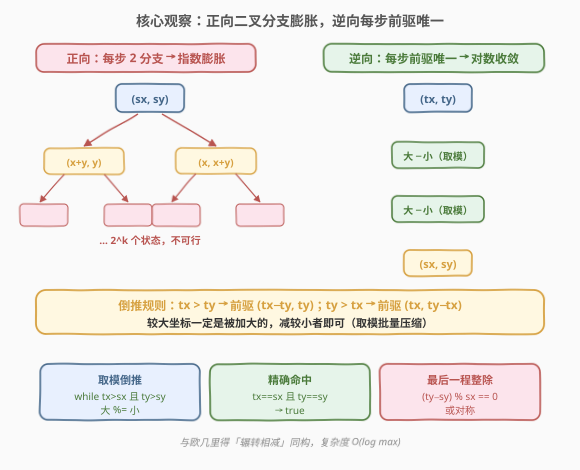
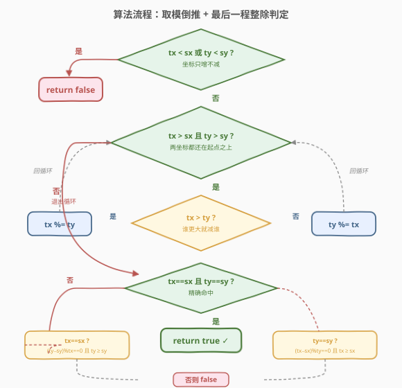
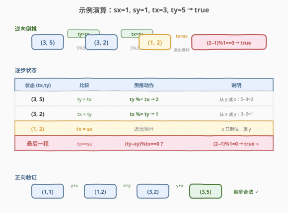

# LeetCode 到达终点 题解

## 1. 题目概述

- **标题 / 题号**：到达终点（#780，hard）
- **链接**：https://leetcode.cn/problems/reaching-points/
- **难度**：困难
- **标签**：数学、数论、逆向思维

**题意**：给定四个整数 `sx, sy, tx, ty`。从点 $(\text{sx}, \text{sy})$ 出发，每次移动可以从 $(x, y)$ 转移到下面两个点之一：

- $(x,\ x+y)$（把 $y$ 加到 $x$ 上）
- $(x+y,\ y)$（把 $x$ 加到 $y$ 上）

问能否经过若干次移动到达 $(\text{tx}, \text{ty})$。能则返回 `true`，否则返回 `false`。

**示例 1**：

```text
输入：sx = 1, sy = 1, tx = 3, ty = 5
输出：true
解释：
(1,1) → (1,1+1)=(1,2) → (1+2,2)=(3,2) → (3,2+3)=(3,5)
```

**示例 2**：

```text
输入：sx = 1, sy = 1, tx = 2, ty = 2
输出：false
解释：从 (1,1) 出发只能到 (1,2) 或 (2,1)，再到 (3,1)/(1,3) 或 (3,2)/(2,3)，
      永远无法同时让两坐标相等（除起点外），故到不了 (2,2)。
```

**示例 3**：

```text
输入：sx = 1, sy = 1, tx = 3, ty = 3
输出：false
```

**约束**：

- $1 \le \text{sx}, \text{sy}, \text{tx}, \text{ty} \le 10^9$

> ⚠️ 注意三点：① 坐标只能**增大**（每次把一个坐标加上另一个正数），所以若 $\text{tx} < \text{sx}$ 或 $\text{ty} < \text{sy}$，直接 `false`；② 每步只有「加到 $x$」或「加到 $y$」**两种分支**，正向走会指数膨胀；③ 任意一步转移后两坐标**必不相等**（$x+y > y$ 且 $x+y > x$），所以除起点 $(\text{sx}, \text{sy})$ 外，途中不会出现 $x = y$ 的状态——这正是示例 2/3 返回 `false` 的根因。

## 2. 解题思路

### 2.1 暴力思路：正向 BFS / DFS

最直白的做法：从 $(\text{sx}, \text{sy})$ 出发正向搜索，每步枚举「加到 $x$」或「加到 $y$」两种转移，直到到达 $(\text{tx}, \text{ty})$ 或超过它（坐标只增不减，超过即可剪枝）。

问题：坐标上限 $10^9$，而每步只能加当前另一坐标的值。若 $\text{sx}, \text{sy}$ 都很小（如 $1, 1$）、$\text{tx}, \text{ty}$ 很大，正向走的步数可能极多（例如 $(1,1) \to (1,2) \to (3,2) \to (3,5) \to \cdots$，类似斐波那契增长但也可能线性增长，如 $(1, 10^9) \to (1+10^9, 10^9) \to \cdots$ 退化场景）。最坏情况下正向分支树状膨胀，搜索完全不可行。

> 💡 正向搜索的失败提示我们：这题**不该正向走**。正向「二叉分支」对应着**逆向的唯一确定**——从终点 $(\text{tx}, \text{ty})$ 倒推，每一步的前驱状态是**唯一**的（较大的那个坐标必然是被加大的，减去较小的即可）。这一「正向发散、逆向收敛」的不对称是破题关键。

### 2.2 核心观察：逆向倒推，每步前驱唯一



观察一次正向转移 $(x, y) \to (x+y,\ y)$：结果中**第一个坐标更大**（$x+y > y$）。反之 $(x, y) \to (x,\ x+y)$ 结果中**第二个坐标更大**。所以给定终点 $(\text{tx}, \text{ty})$：

- 若 $\text{tx} > \text{ty}$：上一步必然是「把 $y$ 加到 $x$」，前驱为 $(\text{tx} - \text{ty},\ \text{ty})$；
- 若 $\text{ty} > \text{tx}$：上一步必然是「把 $x$ 加到 $y$」，前驱为 $(\text{tx},\ \text{ty} - \text{tx})$；
- 若 $\text{tx} = \text{ty}$：无法继续倒推（前驱会出现 $0$，非法）——除非这就是起点本身。

> 💡 **关键结论**：逆向每一步**没有分支**——较大的坐标一定是被加大的那个，减去较小者即得唯一前驱。于是从 $(\text{tx}, \text{ty})$ 倒推到 $(\text{sx}, \text{sy})$ 的路径**唯一确定**，只需不断「大减小」直到落到 $(\text{sx}, \text{sy})$（成功）或越过/无法匹配（失败）。这与 [欧几里得算法](https://leetcode.cn/problems/reaching-points/) 求 GCD 的「辗转相减」完全同构。

但「一次减一个」仍可能太慢：比如 $(1, 10^9) \to (1, 10^9 - 1) \to \cdots$ 要减 $10^9$ 次。注意到倒推时**较小坐标不变、较大坐标反复减同一个值**，这恰是「辗转相减」的批量版——用**取模**一次跨过多步：$\text{tx} \mathrel{\%}= \text{ty}$ 等价于连续减 $\lfloor \text{tx}/\text{ty} \rfloor$ 次。取模后较大坐标直接变为余数，复杂度降为 $O(\log \max(\text{tx}, \text{ty}))$，与欧几里得算法同阶。

> ⚠️ **为何取模不会跳过合法解？** 倒推路径唯一，意味着「该减就一定要减」。但我们要在较大坐标**减到等于起点对应坐标**时停下（进入「最后一程」判定），而非一路减到余数。取模可能一步从「大于起点」跳到「小于起点」——此时需分情况判定（见 2.3）。核心不变式是：**倒推过程中较小坐标保持不变**，所以当某一坐标已落到起点值时，另一坐标能否通过「反复减这个定值」凑齐，只需看差值能否被整除。

### 2.3 算法流程图



流程分两阶段——**取模批量倒推**与**最后一程整除判定**：

1. **批量倒推**：当 $\text{tx} > \text{sx}$ **且** $\text{ty} > \text{sy}$ 时，两坐标都还在起点之上，对较大者取模：
   - $\text{tx} > \text{ty}$：$\text{tx} \mathrel{\%}= \text{ty}$；
   - 否则：$\text{ty} \mathrel{\%}= \text{tx}$。
   - 循环至某一坐标 $\le$ 其起点值时退出。
2. **精确命中**：若 $\text{tx} = \text{sx}$ 且 $\text{ty} = \text{sy}$，返回 `true`。
3. **最后一程——$x$ 已到位，凑 $y$**：若 $\text{tx} = \text{sx}$（但 $\text{ty} \ne \text{sy}$），此时 $x$ 不再变（继续减会跌破 $\text{sx}$），只能反复从 $\text{ty}$ 减 $\text{tx} = \text{sx}$ 凑到 $\text{sy}$。可行当且仅当 $\text{ty} \ge \text{sy}$ **且** $(\text{ty} - \text{sy}) \bmod \text{tx} = 0$。
4. **最后一程——$y$ 已到位，凑 $x$**：若 $\text{ty} = \text{sy}$，对称地判定 $\text{tx} \ge \text{sx}$ 且 $(\text{tx} - \text{sx}) \bmod \text{ty} = 0$。
5. **其余**（某坐标已小于起点，或两坐标都不等于起点）：返回 `false`。

> 💡 **「最后一程」为何用整除判定？** 当 $\text{tx} = \text{sx}$ 时，倒推进入一段「$\text{ty}$ 反复减 $\text{sx}$」的纯线性阶段（较小坐标 $\text{sx}$ 不变，较大坐标 $\text{ty}$ 每步减 $\text{sx}$）。要从 $\text{ty}$ 减到 $\text{sy}$，需要 $\text{ty} - \text{sy}$ 恰是 $\text{sx}$ 的整数倍；且中途不能跌破（$\text{ty} \ge \text{sy}$ 保证非负）。这两个条件合起来即整除判定。这一步等价于把「辗转相减」末段的多次减法再压缩成一次除法余零检查。

> ⚠️ **循环条件为何是「且」不是「或」？** 用 `while (tx > sx && ty > sy)`：只要**任一**坐标已落到起点值，就退出循环交给「最后一程」整除判定。若用「或」（两坐标都大于起点才继续），会在某一坐标到位后仍继续取模，把已到位的坐标也减掉，破坏整除判定的前提。这是本题最常见的实现陷阱。

### 2.4 示例演算



以 `sx=1, sy=1, tx=3, ty=5` 为例：

| 状态 $(\text{tx}, \text{ty})$ | 比较 | 倒推动作 | 说明 |
|-------------------------------|------|----------|------|
| $(3, 5)$ | $\text{ty} > \text{tx}$ | $\text{ty} \mathrel{\%}= \text{tx}$ → $\text{ty}=5\bmod 3=2$ | 把 $x=3$ 从 $y=5$ 减掉，$5-3=2$ |
| $(3, 2)$ | $\text{tx} > \text{ty}$ | $\text{tx} \mathrel{\%}= \text{ty}$ → $\text{tx}=3\bmod 2=1$ | 把 $y=2$ 从 $x=3$ 减掉，$3-2=1$ |
| $(1, 2)$ | $\text{tx}=\text{sx}=1$，退出循环 | — | $x$ 已到位，进入「凑 $y$」判定 |
| 最后一程 | $\text{tx}=1=\text{sx}$ | $(\text{ty}-\text{sy})\bmod\text{tx}=(2-1)\bmod 1=0$ ✓ | $\text{ty}=2 \ge \text{sy}=1$，差 $1$ 被 $1$ 整除 → `true` ⭐ |

返回 `true` ✓。正向验证：$(1,1) \to (1,2) \to (3,2) \to (3,5)$，每步都是合法转移。

再验证两个 `false` 用例：

- `sx=1, sy=1, tx=2, ty=2`：进入循环，$\text{tx}=\text{ty}$ 走 else 分支 $\text{ty} \mathrel{\%}= \text{tx} \to 0$，状态 $(2, 0)$。退出后 $\text{tx}=2\ne1$、$\text{ty}=0\ne1$、且 $\text{ty}<\text{sy}$ → `false` ✓（两坐标相等本就不可达，除起点外）。
- `sx=1, sy=1, tx=3, ty=3`：同理 $\text{ty}\mathrel{\%}=\text{tx}\to0$，状态 $(3,0)$ → `false` ✓。

> 💡 **看「取模」如何起作用**：第一步 $\text{ty}=5\to2$ 一步跨过了「$5-3=2$」这一减法（此处恰好一步，但若 $\text{ty}=10^9$、$\text{tx}=3$ 则一步等价于约 $3.3\times10^8$ 次相减）。取模把「辗转相减」的线性段压缩为对数步，这是复杂度从 $O(\max)$ 降到 $O(\log)$ 的根源，与 [欧几里得 GCD 算法](https://leetcode.cn/problems/reaching-points/) 完全一致。

## 3. 参考代码

### C++

```cpp
class Solution {
  public:
    bool reachingPoints(int sx, int sy, int tx, int ty) {
        while (tx > sx && ty > sy) {
            if (tx > ty) {
                tx %= ty;
            } else {
                ty %= tx;
            }
        }
        if (tx == sx && ty == sy) {
            return true;
        }
        if (tx == sx) {
            return ty >= sy && (ty - sy) % tx == 0;
        }
        if (ty == sy) {
            return tx >= sx && (tx - sx) % ty == 0;
        }
        return false;
    }
};
```

### Python

```python
class Solution:
    def reachingPoints(self, sx: int, sy: int, tx: int, ty: int) -> bool:
        while tx > sx and ty > sy:
            if tx > ty:
                tx %= ty
            else:
                ty %= tx
        if tx == sx and ty == sy:
            return True
        if tx == sx:
            return ty >= sy and (ty - sy) % tx == 0
        if ty == sy:
            return tx >= sx and (tx - sx) % ty == 0
        return False
```

> 💡 两版逻辑完全一致，核心是 `while` 循环里的取模倒推 + 三个 `if` 分支的「最后一程」整除判定。注意 `else` 分支用 `ty %= tx` 覆盖了 $\text{tx} = \text{ty}$ 的情况（此时取模得 $0$，后续判定必 `false`，正确处理「除起点外两坐标不可相等」的性质）。坐标上限 $10^9$，取模过程中值单调递减且不会溢出 `int`（$10^9 < 2^{31}-1$）。

## 4. 复杂度分析

| 维度 | 复杂度 | 说明 |
|------|--------|------|
| **时间复杂度** | $O(\log \max(\text{tx}, \text{ty}))$ | 每次取模使较大坐标至少减半（与欧几里得算法同阶），迭代次数 $O(\log \max)$。$\max = 10^9$ 时约 $30$ 次 |
| **空间复杂度** | $O(1)$ | 仅修改 `tx, ty` 两个变量，无递归栈、无额外数据结构 |

> 💡 **为何是 $O(\log n)$？** 取模 `tx %= ty` 后 $\text{tx} < \text{ty}$，下一步必然 `ty %= tx`，且 $\text{ty}$ 至少减半——两步一组，较大坐标指数衰减，总步数 $O(\log \max)$。这与 [912. 排序数组](../0901-1000/912_排序数组.md) 中欧几里得 GCD 的复杂度论证同源。对比正向 BFS 的指数/线性膨胀，逆向 + 取模把问题从「不可解」直接压到「对数级」。

## 5. 扩展：正向递归写法与边界讨论

逆向迭代写法最简洁，但面试中可能被追问「能否递归实现」以及「取模跳过合法解的边界」。这里给出等价的**逆向递归**写法，并讨论一个易错边界。

### 5.1 逆向递归写法

```python
class Solution:
    def reachingPoints(self, sx: int, sy: int, tx: int, ty: int) -> bool:
        if tx < sx or ty < sy:
            return False
        if tx == sx:
            return (ty - sy) % sx == 0
        if ty == sy:
            return (tx - sx) % sy == 0
        if tx > ty:
            return self.reachingPoints(sx, sy, tx % ty, ty)
        elif ty > tx:
            return self.reachingPoints(sx, sy, tx, ty % tx)
        return False
```

> ⚠️ **递归深度**：迭代次数 $O(\log \max) \approx 30$，递归深度安全。但若不取模、改用「一次减一个」的递归 `reachingPoints(sx, sy, tx - ty, ty)`，深度可达 $10^9$，必爆栈/超时——取模是把线性递归压成对数递归的关键。

### 5.2 取模「跳过」合法解的边界讨论

设取模前 $\text{tx} > \text{sx}$、$\text{ty} = \text{sy}$（$y$ 已到位）。此时循环条件 `ty > sy` 已不满足，**不会**进入取模，直接走「最后一程」判定 $(\text{tx}-\text{sx}) \bmod \text{ty} = 0$。也就是说：**任一坐标落到起点值时循环立即退出**，取模只会在两坐标都严格大于起点时发生，故不会跳过「某坐标恰好等于起点」的合法停点。

唯一需要小心的是取模可能让较大坐标从「$>\text{sx}$」一步变到「$<\text{sx}$」（即越过 $\text{sx}$）。此时 $\text{tx} \ne \text{sx}$，且若 $\text{ty} \ne \text{sy}$ 也成立，则落到最后的 `return false`。这是**正确**的：倒推路径唯一，越过 $\text{sx}$ 意味着唯一的倒推序列从未精确经过 $(\text{sx}, \text{sy})$，故不可达。形式化地：倒推每步「大减小」序列唯一，$(\text{sx}, \text{sy})$ 可达当且仅当该序列精确经过 $(\text{sx}, \text{sy})$；取模只是把序列中连续相同「减数」的段批量压缩，不改变序列经过的坐标集合（除段末余数外，而段末余数正是下一段的起点），因此不丢解。

## 6. 面试要点

1. **为什么从终点倒推而不是从起点正向搜？**

   > 正向每步有「加到 $x$」或「加到 $y$」两种分支，搜索树指数膨胀；而逆向每步的前驱**唯一**——较大坐标必然是被加大的，减去较小者即可。正向发散、逆向收敛的不对称使得倒推复杂度从指数/线性降到对数。

2. **倒推时为什么「较大坐标必然是被加大的那个」？**

   > 一次正向转移 $(x, y) \to (x+y, y)$ 后，第一个坐标 $x+y > y$；反之 $(x, y) \to (x, x+y)$ 后第二个坐标更大。所以终点中**较大的那个坐标一定是上一步被加大的**，减去较小者即得唯一前驱。两坐标相等则无法倒推（前驱出现 $0$），故除起点外途中不会出现 $x=y$。

3. **为什么用取模而不是一次减一个？**

   > 倒推时较小坐标保持不变，较大坐标反复减同一个值，这是「辗转相减」的批量段。取模 `tx %= ty` 一次等价于连续减 $\lfloor \text{tx}/\text{ty} \rfloor$ 次，把线性段压缩为一步，复杂度从 $O(\max)$ 降到 $O(\log)$，与欧几里得算法同构。

4. **「最后一程」的整除判定是怎么来的？**

   > 当 $\text{tx} = \text{sx}$ 时，$x$ 不能再减（会跌破起点），倒推进入「$\text{ty}$ 反复减 $\text{sx}$」的线性段。要从 $\text{ty}$ 减到 $\text{sy}$，需 $\text{ty} - \text{sy}$ 恰是 $\text{sx}$ 的整数倍且不中途变负，即 $\text{ty} \ge \text{sy}$ 且 $(\text{ty} - \text{sy}) \bmod \text{sx} = 0$。$\text{ty} = \text{sy}$ 时对称。

5. **循环条件为什么是 `tx > sx && ty > sy`（且）而不是「或」？**

   > 用「且」：任一坐标落到起点值就退出，交给整除判定。若用「或」（两坐标都大于起点才退出取模），会在某坐标已到位后继续取模，把已到位的坐标也减掉，破坏整除判定的前提。这是最常见的实现陷阱。

> 💡 **一句话总结**：780 是「逆向思维 + 辗转相减」的招牌题——正向二叉分支指数膨胀，逆向每步前驱唯一（较大坐标是被加大的，减较小者）；用取模把「辗转相减」批量压缩为 $O(\log)$ 步，最后用整除判定处理「某一坐标已到位、另一坐标线性凑齐」的末段。核心洞察是「正向发散、逆向收敛」的不对称与欧几里得算法的同构。

## 同类练习题

| # | 题目 | 与本题的关联 |
|---|------|-------------|
| 754 | [到达终点数字](https://leetcode.cn/problems/reach-a-number/)（[题解](../0701-0800/754_到达终点数字.md)） | 同为「到达终点」类数学题，但 754 是数轴上累计和 + 奇偶性翻转，780 是二维坐标 + 辗转相减——两者都用「数学结构降维」代替搜索，一个降为 $O(\sqrt n)$、一个降为 $O(\log n)$ |
| 914 | [卡牌分组](https://leetcode.cn/problems/x-of-a-kind-in-a-deck-of-cards/) | 同为「辗转相减 / GCD」应用——统计每种数字频次后求所有频次的 GCD，GCD $\ge 2$ 即可均分，与本题用取模倒推同属欧几里得算法家族 |
| 1071 | [字符串的最大公因子](https://leetcode.cn/problems/greatest-common-divisor-of-strings/) | 同为「GCD 判定可达性」——若 $s_1 + s_2 = s_2 + s_1$ 则存在公因子串，答案即长度为 $\gcd(\|s_1\|,\|s_2\|)$ 的前缀，把「字符串重复结构」归约为整数 GCD，与本题「坐标转移结构」归约为辗转相减同构 |
| 365 | [水壶问题](https://leetcode.cn/problems/water-and-jug-problem/) | 同为「可达性 + 数学闭合判定」——两个水壶倒来倒去的可达性等价于 $\gcd(\text{jug}_1, \text{jug}_2)$ 能否整除目标量，用 Bézout 定理把 BFS 压成 $O(\log n)$，与本题「倒推 + 取模」把搜索压成对数同属「用数论代替搜索」一族 |
| 292 | [Nim 游戏](https://leetcode.cn/problems/nim-game/)（[题解](../0201-0300/292_Nim游戏.md)） | 同为「公式秒杀博弈/可达性」——不搜索所有分支，而用 $n \bmod 4 \neq 0$ 的闭合判定直接定胜负，与本题用整除判定代替正向搜索同属「公式代替搜索」一族 |
