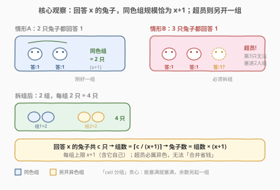
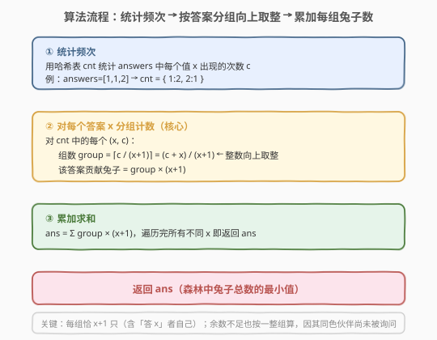
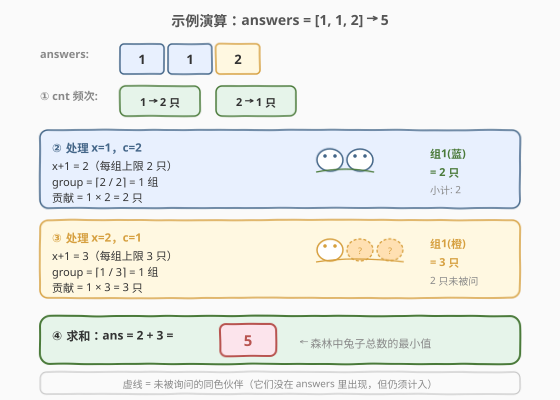

# LeetCode 森林中的兔子 题解

## 1. 题目概述

- **标题 / 题号**：森林中的兔子（#781，medium）
- **链接**：https://leetcode.cn/problems/rabbits-in-forest/
- **难度**：中等
- **标签**：贪心、哈希表、数学

**题意**：森林里有很多只兔子。其中**一些**兔子（可能是全部）会告诉你：**和它颜色相同的兔子共有多少只**（不含它自己）。把这些回答收集起来放在数组 `answers` 里，其中 `answers[i]` 是第 `i` 只被询问的兔子的回答。

请你计算森林中**兔子的最少数量**。

> ⚠️ 关键约束：兔子颜色相同的群体里，每只兔子看到的「同色伙伴数」必然相同（都等于组内总数 $-1$）。但**反过来不一定**——回答相同的兔子**未必同色**，可能恰好分属不同颜色、却组内总数相同。

**示例 1**：

```text
输入：answers = [1, 1, 2]
输出：5
解释：
  回答 1 的有 2 只 → 可同属一组（同色组共 1+1=2 只），贡献 2 只；
  回答 2 的有 1 只 → 同色组共 2+1=3 只（另 2 只未被询问），贡献 3 只。
  合计 2 + 3 = 5。
```

**示例 2**：

```text
输入：answers = [10, 10, 10]
输出：11
解释：
  回答 10 的有 3 只，但同色组最多 11 只（10+1）。
  3 只可同属一组，故只需 1 组，贡献 11 只（含 8 只未被询问的）。
```

**约束**：

- $1 \le \text{answers.length} \le 1000$
- $0 \le \text{answers}[i] < 1000$

> 💡 数据规模小（$n \le 1000$），但考点不在暴力，而在「**如何把回答相同的兔子尽量塞进尽量少的组**」这一贪心分组与向上取整的数学直觉。

## 2. 解题思路

### 2.1 暴力思路

穷举所有可能的颜色分组方案，验证每个回答是否与其所在组的规模一致，取兔子总数最小值。状态空间随 `answers` 长度指数膨胀，且「同色伙伴数」约束的回溯验证极繁琐，对 $n=1000$ 完全不可行。

> ⚠️ 暴力的根源：把「**最少兔子数**」当成组合优化问题硬搜，没有利用「同答案可共享组容量」这一结构性贪心。

### 2.2 核心观察：同色组容量 = x+1，按答案分组向上取整



一只回答 `x` 的兔子意味着它的**同色组共有 $x+1$ 只**（含它自己）。于是：

1. **回答相同的兔子可共享一个组**：若某只兔子回答 `x`，则它所在组的规模恰为 $x+1$；组内**每只**兔子看到的「同色伙伴数」都是 $x$。因此回答 `x` 的兔子天然可能同色。
2. **每组容量上限 $x+1$**：一个同色组最多容纳 $x+1$ 只回答 `x` 的兔子。当回答 `x` 的兔子数 $c > x+1$ 时，**多余的兔子必然属于另一个（异色）组**——它们无法再「挤」进已满 $x+1$ 只的组。
3. **超员必须另起一组**：每组贡献的兔子数**恒为 $x+1$**（即使该组实际被询问的不足 $x+1$ 只，未询问的同色伙伴也须计入）。因此对回答 `x` 的 $c$ 只兔子，最少需要的组数为 $\lceil c / (x+1) \rceil$，兔子数贡献为 $\lceil c / (x+1) \rceil \times (x+1)$。

> 💡 **为什么不能把余数「省掉」？** 假设 $c=3$、$x=1$（每组上限 2 只）。3 只兔子回答 1，但每组最多 2 只同色 → 必须拆成 2 组。第 2 组里只有 1 只被询问，但它声称「还有 1 只同色伙伴」，那第 2 组**必须有 2 只**（另 1 只只是没被问到）。所以贡献是 $2 \times 2 = 4$，而非 $3$。这正是「未被询问的兔子也须计入」的体现。

### 2.3 算法流程图



三步走：

1. **统计频次**：用哈希表 `cnt` 统计 `answers` 中每个值 `x` 出现的次数 `c`。
2. **按答案分组计数**：对每个 `(x, c)`，计算组数 $\text{group} = \lceil c / (x+1) \rceil$，整数实现为 `(c + x) / (x + 1)`（向上取整通用技巧 $\lceil a/b \rceil = (a + b - 1) / b$，此处 $a=c$、$b=x+1$，故 $(c + (x+1) - 1) / (x+1) = (c + x) / (x+1)$）。
3. **累加求和**：`ans += group * (x + 1)`，遍历完所有不同 `x` 即返回 `ans`。

> 💡 **向上取整技巧**：$\lceil a/b \rceil = (a + b - 1) / b$（整数除法向下取整时）。本题 $a = c$、$b = x+1$，故 $\lceil c/(x+1) \rceil = (c + x) / (x+1)$。这避免了浮点除法与 `ceil` 函数调用，是竞赛与面试中常用的整数化写法。

### 2.4 示例演算



以 `answers = [1, 1, 2]` 为例：

| 步骤 | 处理项 | $x+1$ | $c$ | $\lceil c/(x+1) \rceil$ | 贡献 | 累计 `ans` |
|------|--------|-------|-----|------------------------|------|-----------|
| ① 统计 | — | — | — | — | — | `cnt = {1:2, 2:1}` |
| ② 处理 x=1 | (1, 2) | 2 | 2 | $\lceil 2/2 \rceil = 1$ | $1 \times 2 = 2$ | 2 |
| ③ 处理 x=2 | (2, 1) | 3 | 1 | $\lceil 1/3 \rceil = 1$ | $1 \times 3 = 3$ | 5 |
| ④ 终判 | — | — | — | — | — | **返回 5** |

对照示例 2 `answers = [10, 10, 10]`：`cnt = {10:3}`，$x+1=11$，$\lceil 3/11 \rceil = 1$，贡献 $1 \times 11 = 11$ → **返回 11**。3 只被询问的兔子可同属一组，其余 8 只未被询问但必须计入。

## 3. 参考代码

### C++

```cpp
class Solution {
  public:
    int numRabbits(vector<int>& answers) {
        unordered_map<int, int> cnt;
        for (int x : answers) {
            ++cnt[x];
        }
        int ans = 0;
        for (auto& [x, c] : cnt) {
            int group = (c + x) / (x + 1);   // ⌈c/(x+1)⌉
            ans += group * (x + 1);
        }
        return ans;
    }
};
```

### Python

```python
class Solution:
    def numRabbits(self, answers: List[int]) -> int:
        cnt = Counter(answers)
        ans = 0
        for x, c in cnt.items():
            group = (c + x) // (x + 1)      # ⌈c/(x+1)⌉
            ans += group * (x + 1)
        return ans
```

> 💡 Python 用 `collections.Counter` 一行统计频次；`(c + x) // (x + 1)` 即向上取整。注意 `x+1` 恒 $\ge 1$（因 $x \ge 0$），无除零风险。

> ⚠️ **易错点**：常见错误是直接 `ans += c` 或 `ans += x + 1`（只算一组）。前者完全忽略了「未被询问的同色伙伴」；后者忽略了「回答相同的兔子数 $c$ 可能超过 $x+1$，需拆多组」。正确做法是先按容量 $x+1$ 分组（向上取整），再每组乘 $x+1$。

## 4. 复杂度分析

| 维度 | 复杂度 | 说明 |
|------|--------|------|
| 时间 | $O(n)$ | 统计频次扫一次 `answers`，分组计数遍历不同 `x`（至多 $n$ 种），每项 $O(1)$ |
| 空间 | $O(n)$ | 哈希表存频次，最坏 `answers` 元素全不同，表大小 $n$ |
| 提前退出 | 无 | 必须遍历完所有不同 `x` 才能累加完整 |

> ⚠️ 因 `answers[i] < 1000`，频次表的键值域有界，也可用定长数组 `cnt[1000]` 代替哈希表，空间严格 $O(1000)=O(1)$，常数更小。但 $n \le 1000$ 时哈希表已足够，写法更简洁。

## 5. 扩展：为何贪心最优？（交换论证）

为何「能塞满就塞满、余数另起一组」能得到兔子总数最小值？用**交换论证**说明：

- 设两组同答案 `x` 的兔子，规模分别为 $a$ 与 $b$（$1 \le a, b \le x+1$）。它们共贡献 $2(x+1)$ 只兔子，与 $a, b$ 的具体取值**无关**——只要分成 2 组，贡献就是 $2(x+1)$。
- 因此**最小化兔子数 ⇔ 最小化组数**。而组数下界为 $\lceil c/(x+1) \rceil$（每组至多 $x+1$ 只），贪心「尽量塞满」恰好达到该下界，故最优。
- 不同答案 $x$ 之间**互不影响**（不同 $x$ 必属不同颜色，组容量不同），可独立求和。

> 💡 这是典型的「**分组容量受限 + 求最少组数**」贪心范式，与 [502. IPO](../0501-0600/502_IPO.md) 的「按容量解锁」、[435. 无重叠区间](../0401-0500/435_无重叠区间.md) 的「按右端点调度」同属贪心家族，但本题的「组容量」是题目直接给定的 $x+1$，无需排序或优先队列，仅哈希计数即可。

## 6. 面试要点

1. **为什么回答相同的兔子可以同色？**

   一只回答 `x` 的兔子所在组规模恰为 $x+1$，组内每只兔子看到的同色伙伴数都是 $x$。因此「回答 `x`」与「属于规模 $x+1$ 的组」**一一对应**——回答相同的兔子天然可能同色。但「可能」不等于「必然」：当 $c > x+1$ 时，超员兔子无法塞进同一组，必属异色组（尽管它们也回答 `x`）。

2. **为什么余数不足也要按一整组 $x+1$ 算？**

   哪怕一组里只有 1 只被询问，它仍声称「还有 $x$ 只同色伙伴」。这 $x$ 只只是**没被问到**，并非不存在。森林中真实兔子数必须包含它们，故每组恒贡献 $x+1$ 只。这是「最少数量」而非「最少被询问数」的关键。

3. **向上取整 `(c + x) / (x + 1)` 的推导？**

   $\lceil c/(x+1) \rceil = \lfloor (c + (x+1) - 1) / (x+1) \rfloor = (c + x) / (x+1)$（整数除法向下取整）。通用公式 $\lceil a/b \rceil = (a+b-1)/b$，代入 $a=c$、$b=x+1$ 即得。避免浮点与 `ceil`，是整数化标准技巧。

4. **如果 `answers` 里某值 `x` 出现 $c = 0$ 次怎么办？**

   不会出现。哈希表只统计实际出现的 `x`，$c \ge 1$ 恒成立。即便 $c=0$，`(0 + x)/(x+1) = 0`，贡献 0，也不影响结果——但遍历时根本不会遇到它。

5. **能否不用哈希表？**

   可以。因 `answers[i]` 值域 $[0, 999)$，用定长数组 `cnt[1000]` 统计即可，空间 $O(1000)=O(1)$，常数优于哈希。但哈希表写法通用、不受值域限制，是更「安全」的默认选择；值域有界时数组是常数优化。

## 同类练习题

| # | 题目 | 与本题的关联 |
|---|------|-------------|
| 453 | [最小操作次数使数组元素相等](https://leetcode.cn/problems/minimum-moves-to-equal-array-elements/) | 数学贪心，将问题转化为「每个元素到最小值的差距之和」，与本题同属「洞察结构后用数学公式一步求解」的贪心范式 |
| 135 | [分发糖果](https://leetcode.cn/problems/candy/)（[题解](../0101-0200/135_分发糖果.md)） | 贪心 + 两次扫描满足双向约束，对比本题单向分组贪心——本题组容量由回答直接给定，无需双向修正 |
| 502 | [IPO](https://leetcode.cn/problems/ipo/)（[题解](../0501-0600/502_IPO.md)） | 贪心 + 大顶堆按容量解锁，同为贪心家族但需优先队列动态选最大；本题组容量固定，无需排序堆 |
| 435 | [无重叠区间](https://leetcode.cn/problems/non-overlapping-intervals/)（[题解](../0401-0500/435_无重叠区间.md)） | 贪心区间调度（按右端点），同为「按容量/边界分组」贪心，对比本题分组容量是数值 $x+1$ 而非区间端点 |
