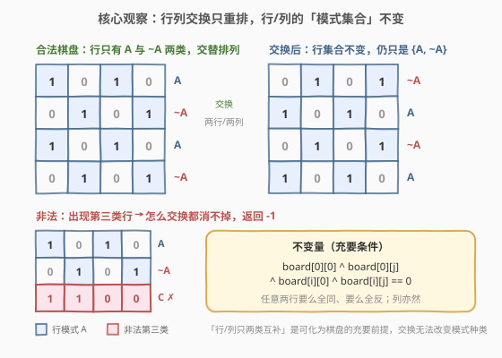
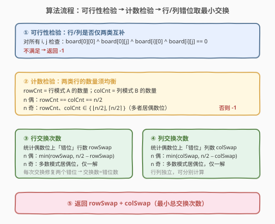
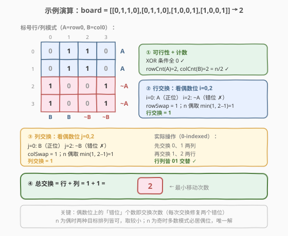

# 变为棋盘

- **题目名称**：变为棋盘
- **链接**：[782. 变为棋盘](https://leetcode.cn/problems/transform-to-chessboard/)
- **难度**：困难
- **标签**：数组、数学、位运算、贪心

## 1. 题目概述

一个 $n \times n$ 的二维网格 `board` 仅由 `0` 和 `1` 组成。每次移动，你能**交换任意两列**或**任意两行**的位置。返回将这个矩阵变为「棋盘」所需的**最小移动次数**；若不可行返回 `-1`。

「棋盘」是指任意一格的**上下左右四个方向**的值均与本身不同的矩阵——即国际象棋盘那种 `0/1` 交替的形态。

**示例 1**：

```text
输入：board = [[0,1,1,0],[0,1,1,0],[1,0,0,1],[1,0,0,1]]
输出：2
解释：先交换第 1、2 列，再交换第 2、3 行，即得到棋盘。
```

**示例 2**：

```text
输入：board = [[0,1],[1,0]]
输出：0
解释：本身已是合法棋盘（左上角为 0 也合法）。
```

**示例 3**：

```text
输入：board = [[1,0],[1,0]]
输出：-1
解释：两行完全相同，无论怎样交换都无法变为棋盘。
```

**约束条件**：

- $n = \text{board.length} = \text{board[i].length}$
- $2 \le n \le 30$
- `board[i][j]` ∈ $\{0, 1\}$

> 💡 $n \le 30$ 数据极小，但考点绝非暴力搜索——而在洞察「交换操作的不变量」，把指数级搜索压缩为 $O(n^2)$ 的充要条件判定 + $O(n)$ 的错位计数。

---

## 2. 解题思路

### 2.1 暴力思路

对行做全排列、对列做全排列，共 $(n!)^2$ 种组合，每种验证是否为棋盘。$n=30$ 时 $30! \approx 2.6 \times 10^{32}$，完全不可行；即便 BFS 也因状态空间爆炸无解。

> ⚠️ 暴力的根源：把「交换」当成显式重排去枚举，忽略了交换的**不变量**——交换只重排，不改变「行模式集合」与「列模式集合」。

### 2.2 核心观察：交换不变量 + 两类互补模式



棋盘的本质是：**只有两类行** $A=0101\cdots$ 与 $\sim\!A=1010\cdots$（互为按位取反），且交替排列；列同理。而**行交换/列交换只重排、不改变行集合与列集合**。于是：

1. **必要条件**：原始 `board` 的所有行必须**仅属于两类且互为补**（任意两行要么全同、要么全反）；列同理。若出现「第三类行」，怎么交换都消不掉 → 返回 `-1`（见插图右下非法情形）。
2. **不变量式判定**：上述条件等价于对所有 $i,j$ 成立
   $$\text{board}[0][0] \oplus \text{board}[0][j] \oplus \text{board}[i][0] \oplus \text{board}[i][j] = 0$$
   > 推导：行 $i$ 与行 $0$ 若全同，则 $\text{board}[i][j]=\text{board}[0][j]$ 且 $\text{board}[i][0]=\text{board}[0][0]$，异或为 $0$；若全反，则两位同时翻转，异或仍为 $0$。该式对**所有** $i,j$ 成立 ⟺ 任意两行全同或全反。又因此式对 $i,j$ 对称，它**同时**保证列也只有两类互补模式。
3. **计数条件**：两类行数量须均衡——$n$ 偶时各 $n/2$；$n$ 奇时为 $\lfloor n/2 \rfloor$ 与 $\lceil n/2 \rceil$（多者必居偶数位，见 2.3）。列同理。
4. **充分性**：条件 2+3 成立时，行 $0$ 的 $1$ 的个数自动落在 $\{\lfloor n/2\rfloor,\lceil n/2\rceil\}$（因列模式按计数均衡分布），故列交换必能把行 $0$ 整理成 $0101\cdots$ 形态，再行交换交替排列即成棋盘。故条件 2+3 **充要**。

> 💡 **行模式由首位决定**：在条件 2 下，行 $i$ 属 $A$ 还是 $\sim\!A$ 仅取决于 $\text{board}[i][0]$ 是否等于 $\text{board}[0][0]$。同理列 $j$ 的模式由 $\text{board}[0][j]$ 是否等于 $\text{board}[0][0]$ 决定。这让所有计数都退化为对首行/首列的 $O(n)$ 扫描。

### 2.3 算法流程图



三阶段：**可行性检验 → 计数检验 → 错位计数取最小交换**。

- **可行性**：双重循环验证 XOR 不变量，任一非 $0$ 即返回 `-1`。
- **计数**：扫一遍统计 `rowCnt`（行模式 $A$ 数量）、`colCnt`（列模式 $B$ 数量）。不满足均衡则 `-1`。
- **错位计数**：棋盘目标行序为 $A,\sim\!A,A,\sim\!A,\dots$（$A$ 居偶数位）或其反序（$\sim\!A$ 居偶数位）。**偶数位上「放错模式」的行数**即为所需交换数——因每次交换修复两个错位，交换数 $=$ 错位数。$n$ 偶时两种目标皆可，取较小；$n$ 奇时多数模式必居偶数位，**唯一解**。行列独立，各算一次相加。

### 2.4 示例演算



以示例 1 `board = [[0,1,1,0],[0,1,1,0],[1,0,0,1],[1,0,0,1]]` 为例，$n=4$：

| 步骤 | 处理 | 结果 |
|------|------|------|
| ① 可行性 | 全部 $i,j$ 验证 XOR $=0$ | ✓（行仅 $A=[0,1,1,0]$ 与 $\sim\!A=[1,0,0,1]$ 两类） |
| ② 计数 | `rowCnt(A)=2`，`colCnt(B)=2` | $=n/2=2$ ✓ |
| ③ 行交换 | 偶数位 $i=0,2$：$i=0$ 为 $A$（正位），$i=2$ 为 $\sim\!A$（错位）→ `rowSwap=1` | $\min(1,\,2-1)=1$ |
| ④ 列交换 | 偶数位 $j=0,2$：$j=0$ 为 $B$（正位），$j=2$ 为 $\sim\!B$（错位）→ `colSwap=1` | $\min(1,\,2-1)=1$ |
| ⑤ 求和 | $1+1$ | **返回 2** |

对照示例 3 `[[1,0],[1,0]]`：两行同为 $[1,0]$，`rowCnt(A)=2`，但 $n/2=1$，计数不均衡 → 返回 `-1`。

---

## 3. 参考代码

### C++

```cpp
class Solution {
  public:
    int movesToChessboard(vector<vector<int>>& b) {
        int n = b.size();
        for (int i = 0; i < n; ++i)
            for (int j = 0; j < n; ++j)
                if (b[0][0] ^ b[0][j] ^ b[i][0] ^ b[i][j]) return -1;
        int rowCnt = 0, colCnt = 0, rowSwap = 0, colSwap = 0;
        for (int i = 0; i < n; ++i) {
            if (b[i][0] == b[0][0]) ++rowCnt;        // 行模式 A 的数量
            if (b[0][i] == b[0][0]) ++colCnt;        // 列模式 B 的数量
            if (i % 2 == 0) {
                if (b[i][0] != b[0][0]) ++rowSwap;   // 偶位上错位的行（~A）
                if (b[0][i] != b[0][0]) ++colSwap;   // 偶位上错位的列（~B）
            }
        }
        if (n % 2 == 0) {
            if (rowCnt != n / 2 || colCnt != n / 2) return -1;
            rowSwap = min(rowSwap, n / 2 - rowSwap);
            colSwap = min(colSwap, n / 2 - colSwap);
        } else {
            if ((rowCnt != n / 2 && rowCnt != n / 2 + 1) ||
                (colCnt != n / 2 && colCnt != n / 2 + 1)) return -1;
            if (rowCnt == n / 2) rowSwap = (n / 2 + 1) - rowSwap;  // A 占少数，~A 居偶位
            if (colCnt == n / 2) colSwap = (n / 2 + 1) - colSwap;
        }
        return rowSwap + colSwap;
    }
};
```

### Python

```python
class Solution:
    def movesToChessboard(self, b: List[List[int]]) -> int:
        n = len(b)
        for i in range(n):
            for j in range(n):
                if b[0][0] ^ b[0][j] ^ b[i][0] ^ b[i][j]:
                    return -1
        rowCnt = colCnt = rowSwap = colSwap = 0
        for i in range(n):
            if b[i][0] == b[0][0]:
                rowCnt += 1
            if b[0][i] == b[0][0]:
                colCnt += 1
            if i % 2 == 0:
                if b[i][0] != b[0][0]:
                    rowSwap += 1
                if b[0][i] != b[0][0]:
                    colSwap += 1
        if n % 2 == 0:
            if rowCnt != n // 2 or colCnt != n // 2:
                return -1
            rowSwap = min(rowSwap, n // 2 - rowSwap)
            colSwap = min(colSwap, n // 2 - colSwap)
        else:
            if rowCnt not in (n // 2, n // 2 + 1) or colCnt not in (n // 2, n // 2 + 1):
                return -1
            if rowCnt == n // 2:
                rowSwap = (n // 2 + 1) - rowSwap
            if colCnt == n // 2:
                colSwap = (n // 2 + 1) - colSwap
        return rowSwap + colSwap
```

> 💡 **错位计数为何就是交换数？** 目标排列中，偶数位应放某模式、奇数位放其补。当前偶数位上「放错」的个数 $m$ 恰等于奇数位上「放错」的个数（因总数均衡），每次交换一对一修复两个错位，故最少交换 $=m$。$n$ 偶时两种目标对称，取 $\min(m,\,n/2-m)$；$n$ 奇时多数模式必须占据较多的偶数位，目标唯一，直接取对应错位数。

> ⚠️ **易错点**：常见错误是只检查行不检查列，或漏掉 $n$ 奇时「多数模式居偶位」的约束而误用 $\min$。注意 XOR 条件虽对 $i,j$ 对称（行条件隐含列条件），但**计数条件必须行、列分别校验**。

---

## 4. 复杂度分析

| 维度 | 复杂度 | 说明 |
|------|--------|------|
| 时间 | $O(n^2)$ | 可行性双循环 $O(n^2)$；计数与错位扫描 $O(n)$，总体由前者主导 |
| 空间 | $O(1)$ | 仅几个整型计数器，原地判定 |
| 提前退出 | 可行性/计数阶段 | XOR 任一非 $0$ 或计数不均衡立即返回 `-1` |

> ⚠️ $n \le 30$ 下 $O(n^2)$ 极快；瓶颈在常数级的双循环，无任何额外空间。切忌被小数据误导去写 BFS——不变量思维才是本题正解。

---

## 5. 扩展：充分性证明与「交换数 = 错位数」的不变量论证

**充分性（条件 2+3 ⟹ 可行）**：设 XOR 条件成立且计数均衡。列模式只有 $B$ 与 $\sim\!B$ 两类，数量均衡。行 $0$ 的第 $j$ 位 $=$ `board[0][j]`：当列 $j$ 属 $B$ 时该位 $=$ `board[0][0]`，属 $\sim\!B$ 时为其反。由计数均衡，行 $0$ 中 $1$ 的个数恰为 $\lfloor n/2\rfloor$ 或 $\lceil n/2\rceil$，故存在列重排把行 $0$ 整理成 $0101\cdots$（同时所有行被同序重排，仍只含 $A,\sim\!A$ 两类）。再行重排为 $A,\sim\!A,A,\sim\!A,\dots$ 即成棋盘。故条件充要。

**交换数下界**：每次行交换至多修复两个「错位」行，故交换数 $\ge$ 错位数 $/2$。又因偶位错位与奇位错位一一对应（数量相等 $=m$），可两两配对交换，$m$ 次即完成，达下界。$n$ 偶时两种目标排列的错位数 $m$ 与 $n/2-m$ 互补，取最小即整体最优。$n$ 奇时偶数位共 $\lceil n/2\rceil$ 个，多数模式（数量 $\lceil n/2\rceil$）必须占满偶位，目标唯一，无取最小余地。

> 💡 本题与 [765. 情侣牵手](https://leetcode.cn/problems/couples-holding-hands/)（[题解](../0701-0800/765_情侣牵手.md)）异曲同工：两者都是「**错位数 / 2**」型交换计数，背后同为「错位配对修复」的不变量论证；765 用并查集数环，本题用模式计数数错位，套路相通。

---

## 6. 面试要点

1. **为什么交换不改变行/列模式集合？**

   交换两行只是把已有行重排，不产生新模式、不消除旧模式。棋盘恰好只需要两类互补行，故原始 board 必须本就只含两类互补行——这是交换操作的**固有不变量**，决定了可行性的充要前提。

2. **XOR 条件为何同时覆盖行和列？**

   `board[0][0]^board[0][j]^board[i][0]^board[i][j]==0` 对所有 $i,j$ 成立 ⟺ 任意两行全同或全反。该式对 $i,j$ 对称，把 $i,j$ 互换即得「任意两列全同或全反」。故一遍双循环同时验行列。

3. **$n$ 为奇数时为何不能用 $\min$ 取较小目标？**

   奇数 $n$ 下偶数位有 $\lceil n/2\rceil$ 个、奇数位 $\lfloor n/2\rfloor$ 个。数量为 $\lceil n/2\rceil$ 的多数模式**必须**占据偶数位（否则偶位装不下），目标排列唯一，只有一种错位数可取；$\min$ 的两种选择中必有一种计数不匹配、根本不可行。

4. **为什么行交换数和列交换数可以独立相加？**

   列交换改变各行的内部位序但**不改变任一行属 $A$ 还是 $\sim\!A$**（因列交换保列模式集合，行 $0$ 重排后仍为某交替模式，其余行随之同构）。故可先用列交换把行整理成交替形态，再用行交换排成 $A,\sim\!A,\dots$，两阶段互不干扰，次数直接相加。

5. **`rowCnt`/`colCnt` 统计为什么只需看首位？**

   XOR 条件保证行 $i$ 非 $A$ 即 $\sim\!A$，而 $\sim\!A$ 的首位 $=$ `1-board[0][0]`。故 `board[i][0]==board[0][0]` 精确判定行 $i$ 属 $A$。这把「整行比较」降为「单格比较」，计数与错位都只需扫首行/首列。

---

## 7. 同类练习题

- [765. 情侣牵手](https://leetcode.cn/problems/couples-holding-hands/)（[题解](../0701-0800/765_情侣牵手.md)）：同为「交换使配对」的最小交换计数，用并查集数置换环，本题用模式计数数错位，底层都是「错位配对修复 = 错位数/2」的不变量论证
- [775. 全局倒置与局部倒置](https://leetcode.cn/problems/global-and-local-inversions/)（[题解](../0701-0800/775_全局倒置与局部倒置.md)）：利用不变量把「比较」转化为「相邻位置关系」判定，与本题「把交换转化为模式不变量」同属「不变量降维」思想
- [785. 判断二分图](https://leetcode.cn/problems/is-bipartite-graph/)（[题解](../0701-0800/785_判断二分图.md)）：二着色判定「能否化为两类交替」，与棋盘「两类行交替」结构同构，均为互补二分性检验
- [773. 滑动谜题](https://leetcode.cn/problems/sliding-puzzle/)（[题解](../0701-0800/773_滑动谜题.md)）：棋盘型状态空间搜索，对比本题用不变量把搜索压缩为公式判定——一搜一析，两种典型思路
