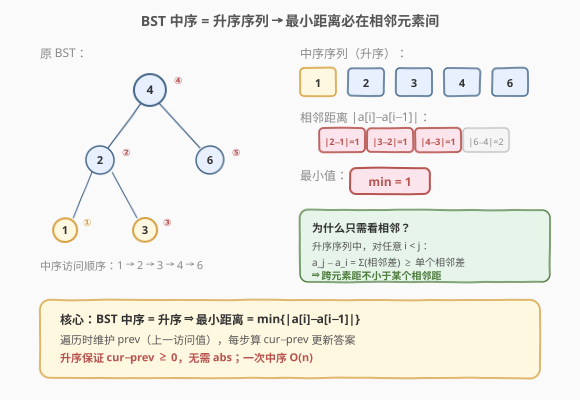
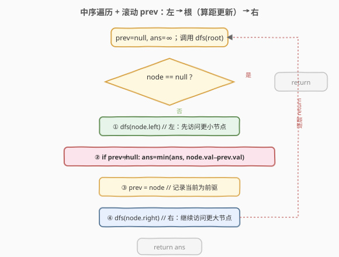
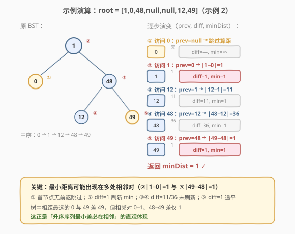

# LeetCode 二叉搜索树节点最小距离 题解

## 1. 题目概述

- **标题 / 题号**：二叉搜索树节点最小距离（#783，easy）
- **链接**：https://leetcode.cn/problems/minimum-distance-between-bst-nodes/
- **难度**：简单
- **标签**：树、BST、中序遍历、深度优先搜索

**题意**：给定一棵**二叉搜索树（BST）**的根节点 `root`，返回树中**任意两个不同节点值之间的最小差值**。差值是一个正数，等于两值之差的绝对值。

**示例 1**：

```text
输入：root = [4,2,6,1,3]
输出：1
解释：树形如下，所有节点值对中差值最小的是 |2−1|=1（或 |3−2|=1、|4−3|=1）。
        4
       / \
      2   6
     / \
    1   3
```

**示例 2**：

```text
输入：root = [1,0,48,null,null,12,49]
输出：1
解释：节点值集合为 {0,1,12,48,49}，最小差值为 |1−0|=1 或 |49−48|=1。
        1
       / \
      0   48
          / \
         12  49
```

**约束**：

- 树中节点数目范围是 $[2, 100]$
- $0 \leq \text{Node.val} \leq 10^5$
- 树中所有值**互不相同**

> 💡 本题与 [530. 二叉搜索树的最小绝对差](https://leetcode.cn/problems/minimum-absolute-difference-in-bst/) 完全同构，代码一字不改即可互用。两题唯一差异是数据规模：530 的节点数上界为 $10^4$，本题为 $100$，但 $O(n)$ 中序遍历对两者都绰绰有余。

## 2. 解题思路

### 2.1 暴力思路：收集全部值 + 排序扫描

最直觉的做法：无视 BST 的结构性质，任意遍历整棵树把所有节点值收集到一个数组，**排序**后扫描相邻元素差取最小。

- 时间 $O(n \log n)$（排序），空间 $O(n)$（数组）。

> ⚠️ 暴力法能用但**没有利用 BST 的任何性质**——把它换成普通二叉树一样成立。面试官追问「能否 $O(n)$」时，排序方案直接出局。

### 2.2 核心观察：中序遍历 = 升序序列 → 最小差必在相邻



BST 的核心性质：**中序遍历（左→根→右）得到严格递增序列**（因为所有值互不相同）。于是问题从「任意两值求最小差值」瞬间降维：

> **在升序序列中，最小差值必然出现在相邻元素之间。**

**证明**：对升序序列 $a_1 < a_2 < \cdots < a_n$，任意 $i < j$：

$$a_j - a_i = (a_j - a_{j-1}) + (a_{j-1} - a_{j-2}) + \cdots + (a_{i+1} - a_i) \geq a_{i+1} - a_i$$

即跨元素差不小于其中某个相邻差。因此只需检查相邻对，$O(n)$ 即可求解。

于是算法只需一次中序遍历，维护 `prev`（上一个访问到的节点值），每访问一个新节点就计算 `|node.val - prev|` 更新答案。

> 💡 一句话记忆：**中序让序列升序 ⇒ 最小差必在相邻 ⇒ 一个滚动 `prev` 就够了**。整个遍历只多用 $O(1)$ 个标量变量。

### 2.3 算法流程图



```text
1. 初始化 prev=null, minDist=∞
2. dfs(node):
   a. 若 node==null: return
   b. dfs(node.left)                         // 左
   c. 若 prev≠null:                          // 根：有前驱则算差
        minDist = min(minDist, node.val − prev)
   d. prev = node.val                         //    记录当前为前驱
   e. dfs(node.right)                        // 右
3. return minDist
```

> ⚠️ 由于 BST 中序严格递增，`node.val - prev` **恒为正**，无需调用 `abs()`。这是一个小但优雅的优化——升序保证了符号。

### 2.4 示例演算

以 `root = [1,0,48,null,null,12,49]`（示例 2）为例，中序访问顺序为 `0 → 1 → 12 → 48 → 49`：



| 步骤 | 访问值 | `prev`（前） | $|\text{val} - \text{prev}|$ | `minDist` |
|------|--------|--------------|------------------------------|-----------|
| ①    | 0      | null         | —                            | $\infty$  |
| ②    | 1      | 0            | 1                            | 1         |
| ③    | 12     | 1            | 11                           | 1         |
| ④    | 48     | 12           | 36                           | 1         |
| ⑤    | 49     | 48           | 1                            | 1         |

- 步骤 ①：首节点无前驱，跳过算差，仅记录 `prev=0`。
- 步骤 ②：`diff=1` 刷新 `minDist` 至 1。
- 步骤 ③④：`diff=11`、`diff=36` 均大于当前 `minDist=1`，不刷新。
- 步骤 ⑤：`diff=1` 追平 `minDist`，值不变。

最终 `minDist=1`，与官方输出一致。

> 💡 本例的特色：最小距离出现在**两处不相邻的相邻对**——② 的 $|1-0|=1$ 与 ⑤ 的 $|49-48|=1$。树中相距最远的 0 与 49 差 49，但中序相邻对只需检查 4 个即可锁定最小值 1，直观体现了「升序序列最小差必在相邻」的降维威力。

## 3. 参考代码

### C++（递归中序 + 滚动前驱值）

```cpp
class Solution {
    int prev = -1;
    int minDist = INT_MAX;
  public:
    int minDiffInBST(TreeNode* root) {
        dfs(root);
        return minDist;
    }
  private:
    void dfs(TreeNode* node) {
        if (!node) return;
        dfs(node->left);                     // 左
        if (prev != -1)                      // 根：有前驱则算差
            minDist = min(minDist, node->val - prev);
        prev = node->val;                    //    记录当前为前驱
        dfs(node->right);                    // 右
    }
};
```

### Python（递归中序 + 滚动前驱值）

```python
class Solution:
    def minDiffInBST(self, root: Optional[TreeNode]) -> int:
        self.prev = None
        self.min_dist = float('inf')

        def dfs(node: Optional[TreeNode]) -> None:
            if not node:
                return
            dfs(node.left)                       # 左
            if self.prev is not None:            # 根：有前驱则算差
                self.min_dist = min(self.min_dist, node.val - self.prev)
            self.prev = node.val                 #    记录当前为前驱
            dfs(node.right)                      # 右

        dfs(root)
        return self.min_dist
```

### C++（迭代中序，显式栈）

```cpp
class Solution {
  public:
    int minDiffInBST(TreeNode* root) {
        stack<TreeNode*> st;
        TreeNode* cur = root;
        int prev = -1;
        int minDist = INT_MAX;
        while (cur || !st.empty()) {
            while (cur) {                // 一路向左压栈
                st.push(cur);
                cur = cur->left;
            }
            cur = st.top(); st.pop();    // 访问根
            if (prev != -1)
                minDist = min(minDist, cur->val - prev);
            prev = cur->val;
            cur = cur->right;            // 转向右子树
        }
        return minDist;
    }
};
```

> 💡 迭代版把「左-根-右」用栈模拟：一路向左压栈，弹出即访问根，再转向右子树。与 [94. 中序遍历](https://leetcode.cn/problems/binary-tree-inorder-traversal/) 的迭代写法完全一致，只是在访问根时多了一步「算差」。

> ⚠️ 本题节点值域 $[0, 10^5]$，C++ 中用 `prev = -1` 作哨兵判定「有无前驱」是安全的（$-1$ 不在合法值域内）。若值域可能覆盖 $-1$，应改用 `TreeNode* prev = nullptr` 指针方案或额外布尔标记。

## 4. 复杂度分析

| 维度 | 复杂度 | 说明 |
|------|--------|------|
| 时间复杂度 | $O(n)$ | 每个节点恰好访问一次（递归/迭代各一次入栈出栈） |
| 空间复杂度（递归） | $O(H)$ | 递归栈深度等于树高；平衡时 $O(\log n)$，链状退化为 $O(n)$。**额外**变量仅 `prev/minDist` 两个，算 $O(1)$ |
| 空间复杂度（迭代） | $O(H)$ | 显式栈深度同上 |
| 空间复杂度（Morris） | $O(1)$ | 见第 5 节，利用线索指针免栈 |

> ⚠️ 本题 $n \leq 100$，即便链状树退化为 $O(n)$ 递归栈也毫无压力。但掌握 $O(1)$ 空间的 Morris 版本对面试追问「能否不用额外空间」是加分项。

## 5. 扩展：Morris 遍历实现 O(1) 空间

若要求**严格 $O(1)$ 额外空间**（不含递归栈），可用 **Morris 中序**：利用空闲的 `right` 指针建立临时线索，在 $O(n)$ 时间内、$O(1)$ 空间内完成。

```cpp
class Solution {
  public:
    int minDiffInBST(TreeNode* root) {
        TreeNode* cur = root;
        int prev = -1;
        int minDist = INT_MAX;
        while (cur) {
            if (cur->left == nullptr) {
                // 无左子：直接访问 cur，再转向右子
                if (prev != -1)
                    minDist = min(minDist, cur->val - prev);
                prev = cur->val;
                cur = cur->right;
            } else {
                // 找 cur 中序前驱（左子树最靠右的节点）
                TreeNode* pred = cur->left;
                while (pred->right && pred->right != cur)
                    pred = pred->right;
                if (pred->right == nullptr) {
                    pred->right = cur;      // 建立线索，稍后能回到 cur
                    cur = cur->left;
                } else {
                    pred->right = nullptr;  // 线索已用，拆除
                    if (prev != -1)         // 访问 cur
                        minDist = min(minDist, cur->val - prev);
                    prev = cur->val;
                    cur = cur->right;
                }
            }
        }
        return minDist;
    }
};
```

> 💡 Morris 的代价是**临时修改树结构**（挂线索再拆除），代码复杂度上升。面试中若没要求 $O(1)$ 空间，递归版是更稳的默认选择；能把 Morris 讲清楚则是加分项。

## 6. 面试要点

1. **为什么最小差值一定在相邻节点之间？**

   - BST 中序遍历得到**严格递增序列**。在升序序列中，任意两个非相邻元素的差等于中间各相邻差之和，必然不小于其中某个相邻差。因此全局最小差只需在相邻对中寻找，$O(n)$ 一次遍历即可。

2. **为什么不需要 `abs()`？**

   - BST 所有值互不相同，中序严格递增，因此 `node.val - prev` **恒为正**。省掉 `abs()` 不仅简洁，还避免了可能的整数溢出问题（`abs` 对 `INT_MIN` 的未定义行为）。

3. **`prev` 用指针还是用值？哨兵怎么选？**

   - 用**指针**（`TreeNode* prev = nullptr`）最通用——`null` 天然表示「尚无前驱」，无需设计哨兵，不受值域限制。若用值存储，需选一个不在合法值域内的哨兵：本题值域 $[0, 10^5]$，C++ 用 `-1` 安全；530 题值域相同也可用 `-1`。但若值域覆盖全 int 范围，指针方案更稳。

4. **递归和迭代版怎么选？Morris 什么时候上？**

   - 默认递归：代码最短、最不易写错。迭代版（显式栈）适合面试官追问「不用递归怎么做」或担心栈溢出（链状树高 $n$ 时递归栈 $O(n)$）。Morris 则仅在明确要求 $O(1)$ 空间时才上。本题 $n \leq 100$，三种写法性能差异可忽略。

5. **和 530（最小绝对差）、98（验证 BST）、501（众数）有什么共通点？**

   - 都建立在「BST 中序有序」这一性质上。98 用中序单调性验证，501 用中序把频率统计降维成段长计数，783/530 用中序把「任意两值最小差」降维成「相邻差最小值」。掌握「中序遍历 + 在访问根时维护一个滚动状态」这一个模板，能迁移到一整类 BST 题。

## 同类练习题

| # | 题目 | 与本题的关联 |
|---|------|-------------|
| 530 | [二叉搜索树的最小绝对差](https://leetcode.cn/problems/minimum-absolute-difference-in-bst/)（[题解](../0501-0600/530_二叉搜索树的最小绝对差.md)） | 与本题完全同构，代码可直接复用，仅数据规模不同 |
| 98 | [验证二叉搜索树](https://leetcode.cn/problems/validate-binary-search-tree/) | 用中序单调性验证 BST，与本题同根于「中序有序」性质 |
| 538 | [把二叉搜索树转换为累加树](https://leetcode.cn/problems/convert-bst-to-greater-tree/) | 反序中序 + 滚动累加和，与本题「正序中序 + 滚动前驱」同模板 |
| 501 | [二叉搜索树中的众数](https://leetcode.cn/problems/find-mode-in-binary-search-tree/) | 中序 + 滚动计数取代哈希表，与本题同属「中序 + $O(1)$ 滚动状态」家族 |
| 230 | [二叉搜索树中第 K 小的元素](https://leetcode.cn/problems/kth-smallest-element-in-a-bst/) | 中序升序找第 k 个，与本题互为中序应用的镜像 |
