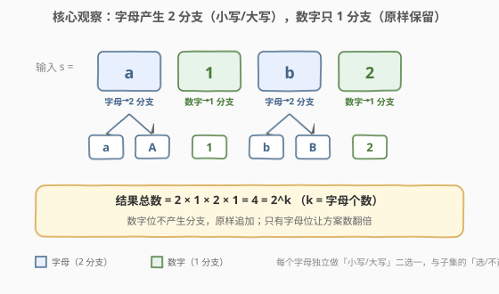
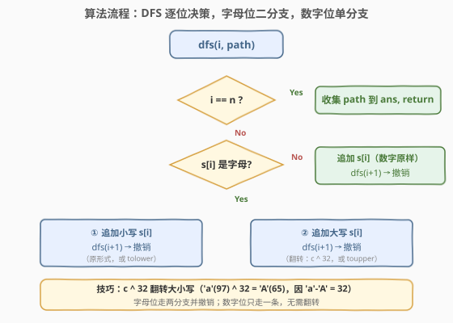
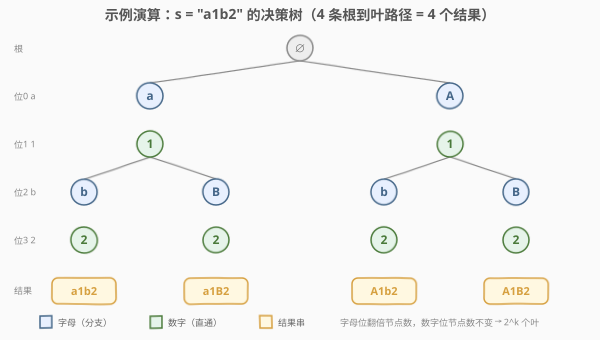

# 字母大小写全排列

- **题目名称**：字母大小写全排列
- **链接**：[784. 字母大小写全排列](https://leetcode.cn/problems/letter-case-permutation/)
- **难度**：中等
- **标签**：位运算、字符串、回溯

## 1. 题目概述

给定一个字符串 `s`，我们可以将 `s` 中的每个**字母**字符独立地变换为**小写**或**大写**，从而得到一个新的字符串。**数字**字符保持不变。返回所有可能得到的字符串集合。返回结果中**不能包含重复元素**，顺序不限。

> ⚠️ 关键点：只有字母才有「两种形态」，数字是「原样保留」的唯一形态。因此方案总数由**字母的个数**决定，而非字符串长度。

**示例 1**：

```text
输入：s = "a1b2"
输出：["a1b2","a1B2","A1b2","A1B2"]
解释：a、b 各有 2 种形态，1、2 不变 → 2 × 2 = 4 种结果
```

**示例 2**：

```text
输入：s = "3z4"
输出：["3z4","3Z4"]
解释：仅 z 为字母 → 2 种结果
```

**约束条件**：

- $1 \le \text{s.length} \le 12$
- `s` 由小写英文字母、大写英文字母和数字组成

> 💡 数据规模极小（$n \le 12$），最坏情况 12 个全字母 → $2^{12} = 4096$ 个结果，回溯完全可承受。考点不在性能优化，而在**识别「逐位二选一」的回溯结构与位运算技巧**。

---

## 2. 解题思路

### 2.1 暴力思路

最朴素的非递归做法是**迭代扩张法**：从只含空串的列表 `[""]` 出发，逐个字符扫描。遇到数字就把它拼到现有所有串末尾；遇到字母就把小写和大写各拼一份，使结果列表翻倍。

```text
初始     : [""]
扫到 'a' : ["a", "A"]                  // 字母 → 每串翻倍
扫到 '1' : ["a1", "A1"]                // 数字 → 直接追加
扫到 'b' : ["a1b", "a1B", "A1b", "A1B"]
扫到 '2' : ["a1b2", "a1B2", "A1b2", "A1B2"]
```

能过，但**没有显式化决策过程**。遇到需要剪枝的变体（如要求结果按字典序、或限制某种大小写组合）就力不从心。回溯法把「每个字母选小写还是大写」显式建模为一棵决策树，是这类题的通用武器。

> ⚠️ 迭代法的局限：它只产出结果，不展示「决策路径」。回溯法将「字母位二选一、数字位直通」显式化，与 [78. 子集](../0001-0100/78_子集.md) 的「选/不选」二叉决策树同构，模板可互通。

### 2.2 核心观察：字母位 2 分支，数字位 1 分支



关键直觉：**把「构造一个结果串」看作对每一位字符做一次决策**。

1. **字母位有 2 个分支**：保持小写 或 翻转为大写（反之亦然）。每个字母独立做二选一，与子集问题里「每个元素选/不选」完全同构。
2. **数字位只有 1 个分支**：原样追加，不产生任何分叉。
3. **方案总数 = $2^k$**：设字符串中有 $k$ 个字母，则结果数为 $2^k$（数字位贡献因子恒为 1，不影响总数）。

> 💡 **与子集的同构**：[78. 子集](../0001-0100/78_子集.md) 对每个元素做「选/不选」二选一 → $2^n$ 个子集；本题对每个字母做「小写/大写」二选一 → $2^k$ 个串。决策树形状完全一致，只是「分支语义」从「选/不选」换成了「小写/大写」。数字位相当于子集里「必须选」的元素（单分支）。

### 2.3 算法流程图



DFS 逐位决策，步骤如下：

1. **终止条件**：`i == n`（所有字符决策完毕），把当前 `path` 拷贝存入答案，`return`。
2. **数字位**：直接追加 `s[i]`，递归 `dfs(i+1)`，撤销。
3. **字母位**：走两个分支——
   - **分支①**：追加小写形式（或保持原形式），递归 `dfs(i+1)`，撤销。
   - **分支②**：追加大写形式（翻转大小写），递归 `dfs(i+1)`，撤销。

> ⚠️ **收集时机在叶子**：与子集「每个节点都收集」不同，本题**只在叶子（`i == n`）收集**——因为每个结果串长度都等于 $n$，中间的半成品 path 不是合法答案。这一点与 [46. 全排列](../0001-0100/46_全排列.md) 的「叶收集」一致，而与 [78. 子集](../0001-0100/78_子集.md) 的「节点收集」相反。

> 💡 **位运算翻转技巧**：`c ^ 32` 可在大小写间翻转。因为 `'a'(97)` 与 `'A'(65)` 的差恰为 32，而大小写字母的 ASCII 码只在第 6 位（值 32）不同。异或 32 即翻转该位：小写→大写、大写→小写。比 `tolower`/`toupper` 更紧凑，且天然可逆（再 `^ 32` 即恢复）。

### 2.4 示例演算

以 `s = "a1b2"` 为例，决策树如下（DFS 先走「原形式」分支、再走「翻转」分支）：



| 步骤 | 决策位 | 分支 | path | 说明 |
|------|--------|------|------|------|
| 1 | a | 小写 a | "a" | 走分支① |
| 2 | 1 | 直通 | "a1" | 数字，唯一分支 |
| 3 | b | 小写 b | "a1b" | 走分支① |
| 4 | 2 | 直通 | "a1b2" | 到叶，收集 ⭐ |
| 5 | b | 大写 B | "a1B" | 回溯，走分支② |
| 6 | 2 | 直通 | "a1B2" | 到叶，收集 ⭐ |
| 7 | a | 大写 A | "A" | 回溯到根，走分支② |
| 8 | 1 | 直通 | "A1" | — |
| 9 | b | 小写 b | "A1b" | — |
| 10 | 2 | 直通 | "A1b2" | 到叶，收集 ⭐ |
| 11 | b | 大写 B | "A1B" | — |
| 12 | 2 | 直通 | "A1B2" | 到叶，收集 ⭐ |

最终 4 个结果：`"a1b2", "a1B2", "A1b2", "A1B2"`，恰好 $2^2 = 4$（2 个字母位各翻倍一次）。

> 💡 对照示例 2 `s = "3z4"`：仅 `z` 为字母，其余直通 → 决策树只在 `z` 处分叉，共 $2^1 = 2$ 个叶：`"3z4", "3Z4"`。

---

## 3. 参考代码

### C++（原地修改 + XOR 翻转）

```cpp
// 784. 字母大小写全排列 —— 回溯：逐位决策，字母位二分支
// 编译: g++ -O2 -std=c++17 letter_case_permutation.cpp -o lcp
#include <string>
#include <vector>
#include <cctype>
using namespace std;

class Solution {
  public:
    vector<string> letterCasePermutation(string s) {
        vector<string> ans;
        dfs(s, 0, ans);
        return ans;
    }

  private:
    // i: 当前决策到 s[i]；原地修改 s，到叶时拷贝存答案
    void dfs(string& s, int i, vector<string>& ans) {
        if (i == (int)s.size()) {
            ans.push_back(s);           // 到叶，收集当前串
            return;
        }
        if (isdigit((unsigned char)s[i])) {
            dfs(s, i + 1, ans);         // 数字：单分支直通
        } else {
            dfs(s, i + 1, ans);         // 分支①：原形式（小写或大写）
            s[i] ^= 32;                 // 翻转大小写
            dfs(s, i + 1, ans);         // 分支②：翻转后形式
            s[i] ^= 32;                 // 撤销，恢复原形式
        }
    }
};
```

> 💡 **原地修改为何安全**：每次进入字母分支前都显式 `^= 32` 设置目标形态，递归返回后再 `^= 32` 恢复。XOR 可逆（`a ^ 32 ^ 32 == a`），故撤销等价于再翻转一次，无需记录原值。数字位不修改 `s[i]`，无需撤销。

**显式 path 版（与子集模板一致，更易迁移）**：

```cpp
class Solution {
  public:
    vector<string> letterCasePermutation(string s) {
        vector<string> ans;
        string path;
        dfs(s, 0, path, ans);
        return ans;
    }

  private:
    void dfs(const string& s, int i, string& path, vector<string>& ans) {
        if (i == (int)s.size()) {
            ans.push_back(path);
            return;
        }
        char c = s[i];
        if (isdigit((unsigned char)c)) {
            path.push_back(c);
            dfs(s, i + 1, path, ans);
            path.pop_back();
        } else {
            path.push_back((char)tolower((unsigned char)c));
            dfs(s, i + 1, path, ans);
            path.pop_back();
            path.push_back((char)toupper((unsigned char)c));
            dfs(s, i + 1, path, ans);
            path.pop_back();
        }
    }
};
```

### Python

```python
class Solution:
    def letterCasePermutation(self, s: str) -> list[str]:
        ans: list[str] = []
        a = list(s)                       # 字符串不可变，转 list 原地改

        def dfs(i: int) -> None:
            if i == len(a):
                ans.append(''.join(a))    # 到叶，拼接收集
                return
            if a[i].isdigit():
                dfs(i + 1)                # 数字：单分支直通
            else:
                dfs(i + 1)                # 分支①：原形式
                a[i] = a[i].swapcase()    # 翻转大小写
                dfs(i + 1)                # 分支②：翻转后形式
                a[i] = a[i].swapcase()    # 撤销

        dfs(0)
        return ans
```

> ⚠️ **Python 字符串不可变**：不能像 C++ 那样原地 `s[i] ^= 32`，需先 `list(s)` 转为字符列表。`str.swapcase()` 等价于 `^ 32`（翻转大小写），亦可写 `chr(ord(a[i]) ^ 32)` 显式用位运算。到叶时 `''.join(a)` 拼回字符串收集。

> ⚠️ **易错点**：常见错误是①对数字也做大小写翻转（数字 `^ 32` 会变成乱码字符）；②忘记撤销（`^ 32` 或 `pop`），导致后续分支基于脏状态递归，结果重复或错乱。务必用 `isdigit` 先判类型，且每个分支递归后立即撤销。

---

## 4. 复杂度分析

| 维度 | 复杂度 | 说明 |
|------|--------|------|
| 时间 | $O(n \cdot 2^k)$ | 共 $2^k$ 个结果（$k$ 为字母数），每个结果构造/拷贝需 $O(n)$ |
| 空间 | $O(n)$ | 递归栈深度最大 $n$ 层，path 同长 $O(n)$；结果数组 $O(n \cdot 2^k)$ 不计入 |
| 提前退出 | 无 | 必须遍历到所有叶子才能收集全部结果 |

> ⚠️ 时间 $O(n \cdot 2^k)$ 是**此类枚举问题的理论下界**——答案本身就有 $2^k$ 个、每个长度 $n$，无法更快。最坏 $k = n = 12$ 时 $2^{12} \times 12 \approx 4.9 \times 10^4$ 次操作，完全可承受。

> 💡 **$k$ 与 $n$ 的区别**：$n$ 是串长，$k$ 是其中字母个数。若串全为数字（$k=0$），结果仅 1 个（原串本身），时间退化到 $O(n)$；若全为字母（$k=n$），时间达 $O(n \cdot 2^n)$ 上界。

---

## 5. 扩展：迭代扩张法与位运算编码

### 5.1 迭代扩张法（BFS 视角）

回溯是 DFS 视角（沿一条路径走到叶再回溯）；迭代扩张是 BFS 视角（按层扩展所有部分解）。两者产出结果集相同，顺序可能不同。

```python
class Solution:
    def letterCasePermutation(self, s: str) -> list[str]:
        ans = ['']
        for c in s:
            if c.isdigit():
                ans = [x + c for x in ans]              # 数字：每串追加
            else:
                ans = [x + c.lower() for x in ans] + \
                     [x + c.upper() for x in ans]        # 字母：翻倍
        return ans
```

> 💡 这与 [78. 子集](../0001-0100/78_子集.md) 的「迭代扩张法」完全对应——子集是「把新元素拼到现有所有子集后」，本题是「把小写和大写各拼到现有所有串后」。本质都是**逐层倍增部分解集合**。

### 5.2 位运算编码：二叉决策的扁平化

设串中有 $k$ 个字母，把它们的「原形式/翻转形式」选择编码为一个 $k$ 位二进制数：第 $j$ 位为 `0` 表示第 $j$ 个字母取原形式，`1` 表示翻转。枚举 $0$ 到 $2^k - 1$ 即可生成全部结果。

```python
class Solution:
    def letterCasePermutation(self, s: str) -> list[str]:
        letter_idx = [i for i, c in enumerate(s) if c.isalpha()]
        k = len(letter_idx)
        ans = []
        for mask in range(1 << k):
            a = list(s)
            for j, pos in enumerate(letter_idx):
                if mask >> j & 1:
                    a[pos] = a[pos].swapcase()
            ans.append(''.join(a))
        return ans
```

> 💡 **位运算是二叉决策树的扁平化**：决策树每条根到叶路径 ↔ 一个 $k$ 位二进制数。`mask >> j & 1` 就是「第 $j$ 个字母走原形式还是翻转分支」。这与 [78. 子集](../0001-0100/78_子集.md) 的位运算法（`mask >> i & 1` 表示选/不选）一一对应——两题的决策结构完全同构，仅分支语义不同。

### 5.3 模板迁移：与子集/组合题族的对照

| 题号 | 题目 | 决策语义 | 分支数 | 收集时机 | 结果数 |
|------|------|----------|--------|----------|--------|
| 78 | 子集 | 选/不选 | 2 | 每个节点 | $2^n$ |
| 784 | 字母大小写全排列 | 小写/大写（字母） | 2 / 1 | 叶子 | $2^k$ |
| 46 | 全排列 | 该位置放哪个数 | 递减 | 叶子 | $n!$ |
| 22 | 括号生成 | 加左/加右括号 | 2（带剪枝） | 叶子 | 卡塔兰数 |

> 💡 **一句话总结**：本题是「**逐位二选一回溯**」的招牌题——字母位 2 分支、数字位 1 分支，叶收集，结构与子集的「选/不选」二叉决策树同构。掌握这个模板，子集(78)、组合(77)、括号生成(22) 都能套用。

---

## 6. 面试要点

1. **本题和子集的决策树有什么关系？**

   完全同构。子集对每个元素做「选/不选」二选一 → $2^n$ 个子集；本题对每个字母做「小写/大写」二选一 → $2^k$ 个串。决策树都是**二叉树**，分支语义不同但形状一致。数字位相当于子集里「必须选的元素」，只贡献单分支，不翻倍。

2. **为什么在叶子收集，而不是每个节点都收集？**

   本题每个结果串长度都等于 $n$，是「完整决策路径」，只有叶子（`i == n`）才是合法答案。中间节点的 path 是半成品（长度不足 $n$），不是合法结果。这与全排列（叶收集）一致，与子集（节点收集，因子集长度从 0 到 $n$ 都合法）相反。**判断收集时机的关键：答案长度是否固定**——固定则叶收集，不固定则节点收集。

3. **`c ^ 32` 翻转大小写的原理？**

   大小写字母的 ASCII 码仅在第 6 位（值 32）不同：`'a' = 97 = 0b1100001`，`'A' = 65 = 0b1000001`。异或 32 即翻转该位：小写→大写、大写→小写。且 XOR 可逆（`a ^ 32 ^ 32 == a`），故「翻转→递归→再翻转」天然完成撤销，无需额外记录原值。比 `tolower`/`toupper` 更紧凑，契合本题「位运算」标签。

4. **原地修改版为什么不需要显式 path？**

   直接在 `s` 上修改：字母分支前 `s[i] ^= 32`，递归后 `s[i] ^= 32` 恢复。因为每层只改自己那一位 `s[i]`，递归子层改的是更深的 `s[j]`（$j > i$），互不干扰；且 XOR 撤销精确恢复原值。到叶时 `s` 恰为一条完整路径的串，直接 `push_back` 拷贝即可。省去维护 `path` 的开销，代码更紧凑。

5. **如果输入含非字母非数字字符（如符号）怎么办？**

   本题约束保证输入仅含字母和数字，但若推广到通用字符：对非字母字符一律走「单分支直通」（与数字同处理），即 `if (!isalpha(c))` 时只递归一次。关键是用 `isalpha`（而非 `isdigit` 的反面）判定是否产生二分支——因为 `isdigit` 的反面包含字母和符号，会把符号也当字母翻转导致乱码。

> 💡 **一句话总结**：本题是「逐位二选一回溯」招牌——字母 2 分支、数字 1 分支、叶收集，与子集的「选/不选」二叉决策树同构。`c ^ 32` 是翻转大小写的位运算利器（XOR 可逆天然撤销）。判断「叶收集 vs 节点收集」看答案长度是否固定。

---

## 7. 同类练习题

- [78. 子集](https://leetcode.cn/problems/subsets/)（[题解](../0001-0100/78_子集.md)）：「选/不选」二叉决策树招牌题，与本题决策结构完全同构，仅分支语义不同（选/不选 vs 小写/大写）
- [46. 全排列](https://leetcode.cn/problems/permutations/)（[题解](../0001-0100/46_全排列.md)）：回溯多叉决策树，对照本题的二叉决策——排列每层枚举未选候选，本题每层只二选一
- [22. 括号生成](https://leetcode.cn/problems/generate-parentheses/)（[题解](../0001-0100/22_括号生成.md)）：回溯 + 剪枝的二叉决策（加左/加右），同为叶收集，对比本题无剪枝的纯枚举
- [1087. 字母切换](https://leetcode.cn/problems/brace-expansion/)：花括号展开式枚举所有组合，同类「逐位多分支枚举」回溯，分支数由花括号内选项数决定（本题字母恒为 2）
